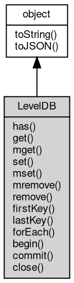

# Object LevelDB
An embedded key-value store backed by LevelDB and kept in a directory

LevelDB is the [object](object.md) returned by [db.openLevelDB](../../module/ifs/db.md#openLevelDB)(connString): an embedded, file-based
key-value store, not a database server. It is one keyspace of byte-string keys to
byte-string values kept in key order, with no SQL, no table and no column - every key is
addressed directly, and the whole store lives in one directory. The [object](object.md) is not a
[DbConnection](DbConnection.md).

The members cover the whole surface of a store:

- Single records: `has`, `get`, `set` and `remove` read and write one key.
- Batches: `mget` reads an array of keys, while `mset` and `mremove` apply many writes
  as one atomic batch.
- Key order: `firstKey` and `lastKey` return the smallest and largest key.
- Enumeration: the `forEach` overloads walk the store in key order with `from`/`to`
  bounds and `skip`/`limit`/`reverse` options.
- Write batches: `begin` returns a transaction [object](object.md), `commit` applies its buffered
  writes atomically and `close` finishes the store or discards a transaction.

Concepts:

- **Keys and values are byte strings**: a key or value may be a [Buffer](Buffer.md) or a String. A
  String is encoded as UTF-8 and a [Buffer](Buffer.md) is stored byte-for-byte, so binary keys and
  values round-trip through the single-record members. Keys are compared as unsigned
  bytes, so the order is byte order, not the locale or numeric order of the text.
- **One directory, one writer**: the store is a directory of LevelDB files, created when
  missing. Only one [process](../../module/ifs/process.md) may open a directory at a time - a second open fails with
  the LevelDB lock error (number 20024) - and close releases the lock. The store is
  durable across [process](../../module/ifs/process.md) restarts; a write is atomic, and the default write options
  leave it in the operating system buffer until the log is flushed, so only a system
  level crash can lose recent writes.
- **Write batches**: mset and mremove are atomic batches, and begin returns a transaction
  [object](object.md) that buffers set, remove, mset and mremove. The buffered writes are not visible
  to reads - not even from the transaction itself - until commit applies the whole batch;
  close discards it. The transaction becomes closed afterwards.
- **Iteration is a consistent view**: a forEach walk sees the store as of its start, so
  writes made by other fibers during the walk are not observed. The callback receives
  (value, key) as Buffers, and returning a truthy value stops the walk.
- **Closed state**: after close every member fails with error 20009 ("LevelDB: database
  is closed."), while close itself is idempotent. The declared async members are
  fiber-synchronous like every other fibjs database call - there is no callback form.

Obtained from:
- `db.openLevelDB(connString)` — the only factory; see the [db](../../module/ifs/db.md) [module](../../module/ifs/module.md) for the accepted
  forms (a directory [path](../../module/ifs/path.md) or `leveldb:` followed by it).

Example 1 — write, read and remove records:

```JavaScript
const db = require('db');
const fs = require('fs');
const os = require('os');
const path = require('path');

const dir = fs.mkdtempSync(path.join(os.tmpdir(), 'leveldb-'));
const store = db.openLevelDB(dir);

store.set('name', 'fibjs');
console.log(store.has('name')); // true
console.log(store.get('name').toString()); // fibjs
console.log(store.get('missing')); // null

store.remove('name');
console.log(store.has('name')); // false

store.close();
fs.rm(dir, {
    recursive: true
});
```

Example 2 — batch writes and a transaction:

```JavaScript
const db = require('db');
const fs = require('fs');
const os = require('os');
const path = require('path');

const dir = fs.mkdtempSync(path.join(os.tmpdir(), 'leveldb-'));
const store = db.openLevelDB(dir);

store.mset({
    a: '1',
    b: '2'
}); // one atomic batch
const values = store.mget(['a', 'b', 'missing']);
console.log(values[0].toString(), values[1].toString(), values[2]); // 1 2 null

const tr = store.begin();
tr.set('c', '3');
tr.remove('a');
console.log(store.has('c')); // false - the batch is not applied yet
tr.commit(); // the batch becomes visible atomically
console.log(store.has('c'), store.has('a')); // true false

store.close();
fs.rm(dir, {
    recursive: true
});
```

Example 3 — enumerate the store in key order:

```JavaScript
const db = require('db');
const fs = require('fs');
const os = require('os');
const path = require('path');

const dir = fs.mkdtempSync(path.join(os.tmpdir(), 'leveldb-'));
const store = db.openLevelDB(dir);

store.mset({
    a: '1',
    b: '2',
    c: '3',
    d: '4'
});

const keys = [];
store.forEach((value, key) => {
    keys.push(key.toString());
});
console.log(keys.join(',')); // a,b,c,d - byte order

const page = [];
store.forEach('b', 'd', (value, key) => {
    page.push(key.toString());
});
console.log(page.join(',')); // b,c - from is included, to is not

const last = [];
store.forEach({
    reverse: true,
    limit: 2
}, (value, key) => {
    last.push(key.toString());
});
console.log(last.join(',')); // d,c

store.close();
fs.rm(dir, {
    recursive: true
});
```

## Inheritance

```dot
digraph {
    node [fontname="Helvetica,sans-Serif", fontsize=10, shape="record", style="filled", fillcolor="white"];

    object [tooltip="object", URL="object.md", label="{object|toString()\ltoJSON()\l}"];
    LevelDB [tooltip="LevelDB", fillcolor="lightgray", id="me", label="{LevelDB|has()\lget()\lmget()\lset()\lmset()\lmremove()\lremove()\lfirstKey()\llastKey()\lforEach()\lbegin()\lcommit()\lclose()\l}"];

    object -> LevelDB [dir=back];
}
```

## Methods
        
### has
**Tests whether a key exists in the store**

```JavaScript
Boolean LevelDB.has(Buffer | String key) async;
```

Parameters:
* key: [Buffer](Buffer.md) | String, the key to [test](../../module/ifs/test.md)

Returns:
* Boolean, true when the key exists

The key is read like get and only its presence is reported. key is a [Buffer](Buffer.md)|String
union: a String is encoded as UTF-8 and a [Buffer](Buffer.md) is used byte-for-byte, so a binary
key can be tested. A missing key is not an error; after close the call fails with
error 20009.

--------------------------
### get
**Returns the value stored under key**

```JavaScript
Buffer LevelDB.get(Buffer | String key) async;
```

Parameters:
* key: [Buffer](Buffer.md) | String, the key to read

Returns:
* [Buffer](Buffer.md), the value as a [Buffer](Buffer.md), or null when the key is missing

The result is a [Buffer](Buffer.md) with the exact stored bytes, or null when the key is missing.
key is a [Buffer](Buffer.md)|String union: a String is encoded as UTF-8 and a [Buffer](Buffer.md) is used
byte-for-byte. Reads do not see the buffered writes of an open transaction (see
begin), and after close the call fails with error 20009.

--------------------------
### mget
**Returns the values of several keys, one element per key**

```JavaScript
NArray LevelDB.mget(Array keys);
```

Parameters:
* keys: Array, the array of keys to read

Returns:
* NArray, an array with one [Buffer](Buffer.md) or null per key

The result follows the given order: a [Buffer](Buffer.md) for a key that exists and null for one
that does not, so its length equals the key count. Unlike get, each element is
converted through its JavaScript string form - a [Buffer](Buffer.md) key is rendered as UTF-8
text - so a binary key finds nothing here; read those with get one by one. An empty
keys array returns null rather than an empty array, and the reads are individual
lookups, not one batch.

Example — a value or null per key:

```JavaScript
const db = require('db');
const fs = require('fs');
const os = require('os');
const path = require('path');

const dir = fs.mkdtempSync(path.join(os.tmpdir(), 'leveldb-'));
const store = db.openLevelDB(dir);

store.mset({
    a: '1',
    b: '2'
});
const values = store.mget(['a', 'b', 'missing']);
console.log(values.length); // 3
console.log(values[0].toString(), values[1].toString(), values[2]); // 1 2 null

store.close();
fs.rm(dir, {
    recursive: true
});
```

--------------------------
### set
**Stores value under key, replacing any previous value**

```JavaScript
LevelDB.set(Buffer | String key,
    Buffer | String value) async;
```

Parameters:
* key: [Buffer](Buffer.md) | String, the key to write
* value: [Buffer](Buffer.md) | String, the value to store

The write is atomic and immediately visible to later reads. key and value are each a
[Buffer](Buffer.md)|String union: a String is stored as its UTF-8 bytes and a [Buffer](Buffer.md)
byte-for-byte, so binary records round-trip through set and get. On a transaction
[object](object.md) the write is buffered until commit instead.

--------------------------
### mset
**Stores several key/value pairs as one atomic batch**

```JavaScript
LevelDB.mset(Object map);
```

Parameters:
* map: Object, the key/value pairs to store, as property names and values

The property names of map are the keys and the property values are the values; the
whole [object](object.md) is applied in one write batch, so either every pair is stored or none.
Unlike set, each value is converted through its JavaScript string form: a [Buffer](Buffer.md) is
rendered as UTF-8 text and a number is rejected with error 20005, so use set for
binary values. On a transaction [object](object.md) the batch is buffered until commit.

--------------------------
### mremove
**Removes several keys as one atomic batch**

```JavaScript
LevelDB.mremove(Array keys);
```

Parameters:
* keys: Array, the array of keys to remove

The keys are removed in one write batch, and missing keys are ignored. Each element
is converted through its JavaScript string form: a [Buffer](Buffer.md) is rendered as UTF-8 text,
so a binary key written with set is not found here; use remove for those. On a
transaction [object](object.md) the removal is buffered until commit.

--------------------------
### remove
**Removes key and its value**

```JavaScript
LevelDB.remove(Buffer | String key) async;
```

Parameters:
* key: [Buffer](Buffer.md) | String, the key to remove

The write is atomic and removing a missing key is not an error. key is a
[Buffer](Buffer.md)|String union and a [Buffer](Buffer.md) is used byte-for-byte. On a transaction [object](object.md) the
removal is buffered until commit; after close the call fails with error 20009.

--------------------------
### firstKey
**Returns the smallest key in the store**

```JavaScript
Buffer LevelDB.firstKey() async;
```

Returns:
* [Buffer](Buffer.md), the smallest key as a [Buffer](Buffer.md), or null when the store is empty

Keys are compared as unsigned bytes, so this is the first key in byte order, not in
text or numeric order. A [Buffer](Buffer.md) with the key bytes is returned, or null when the
store is empty. Buffered writes of an open transaction are not visible here.

--------------------------
### lastKey
**Returns the largest key in the store**

```JavaScript
Buffer LevelDB.lastKey() async;
```

Returns:
* [Buffer](Buffer.md), the largest key as a [Buffer](Buffer.md), or null when the store is empty

Keys are compared as unsigned bytes, so this is the last key in byte order, not in
text or numeric order. A [Buffer](Buffer.md) with the key bytes is returned, or null when the
store is empty. Buffered writes of an open transaction are not visible here.

--------------------------
### forEach
**Enumerates the key/value pairs in key order**

```JavaScript
LevelDB.forEach(Function(Buffer value, Buffer key) func);
```

Parameters:
* func: Function([Buffer](Buffer.md) value, [Buffer](Buffer.md) key), the callback invoked with (value, key) as Buffers

The callback receives (value, key), both Buffers, and returning a truthy value stops
the walk. The walk is a consistent view of the store as of its start. The overloads
differ in their bounds and options:

- `forEach(func)` walks every pair;
- `forEach(from, func)` starts at from, which is included;
- `forEach(from, to, func)` also stops before to, which is excluded;
- `forEach(opt, func)` takes the options below;
- `forEach(from, opt, func)` and `forEach(from, to, opt, func)` combine both.

opt supports the following options:

```JavaScript
// fragment: options
({
    skip: 0, // number of pairs to drop before the first callback
    limit: -1, // maximum number of pairs; 0 or a missing value means no limit
    reverse: false // walk in descending key order
})
```

A limit explicitly set to 0 is rejected with error 20024 ("limit must be greater
than 0"); a negative limit means no limit. from and to are [Buffer](Buffer.md)|String unions and
a [Buffer](Buffer.md) bound is used byte-for-byte. With reverse the walk starts at from
(included) and descends to the smallest key; to is compared only against the
starting key and does not act as a lower bound, so pass only from for a descending
walk. Buffered writes of an open transaction are not visible.

Example — a bounded page with a limit:

```JavaScript
const db = require('db');
const fs = require('fs');
const os = require('os');
const path = require('path');

const dir = fs.mkdtempSync(path.join(os.tmpdir(), 'leveldb-'));
const store = db.openLevelDB(dir);

store.mset({
    a: '1',
    b: '2',
    c: '3',
    d: '4'
});
const page = [];
store.forEach('b', 'd', {
    limit: 1
}, (value, key) => {
    page.push(key.toString());
});
console.log(page.join(',')); // b - from included, to excluded, limit stops the walk

store.close();
fs.rm(dir, {
    recursive: true
});
```

--------------------------
**Enumerates the key/value pairs from a starting key**

```JavaScript
LevelDB.forEach(Buffer | String from,
    Function(Buffer value, Buffer key) func);
```

Parameters:
* from: [Buffer](Buffer.md) | String, the first key to enumerate, included in the walk
* func: Function([Buffer](Buffer.md) value, [Buffer](Buffer.md) key), the callback invoked with (value, key) as Buffers

This is the (from, func) form of forEach; see the first overload for the callback,
the bounds and the options.

--------------------------
**Enumerates the key/value pairs with enumeration options**

```JavaScript
LevelDB.forEach(Object opt,
    Function(Buffer value, Buffer key) func);
```

Parameters:
* opt: Object, the enumeration options, supporting skip, limit and reverse
* func: Function([Buffer](Buffer.md) value, [Buffer](Buffer.md) key), the callback invoked with (value, key) as Buffers

This is the (opt, func) form of forEach; see the first overload for the callback and
the options.

--------------------------
**Enumerates the key/value pairs from a starting key with options**

```JavaScript
LevelDB.forEach(Buffer | String from,
    Object opt,
    Function(Buffer value, Buffer key) func);
```

Parameters:
* from: [Buffer](Buffer.md) | String, the first key to enumerate, included in the walk
* opt: Object, the enumeration options, supporting skip, limit and reverse
* func: Function([Buffer](Buffer.md) value, [Buffer](Buffer.md) key), the callback invoked with (value, key) as Buffers

This is the (from, opt, func) form of forEach; see the first overload for the
callback, the bounds and the options.

--------------------------
**Enumerates the key/value pairs between two keys**

```JavaScript
LevelDB.forEach(Buffer | String from,
    Buffer | String to,
    Function(Buffer value, Buffer key) func);
```

Parameters:
* from: [Buffer](Buffer.md) | String, the first key to enumerate, included in the walk
* to: [Buffer](Buffer.md) | String, the key to stop before, excluded from the walk
* func: Function([Buffer](Buffer.md) value, [Buffer](Buffer.md) key), the callback invoked with (value, key) as Buffers

This is the (from, to, func) form of forEach; see the first overload for the callback
and the bounds.

--------------------------
**Enumerates the key/value pairs between two keys with options**

```JavaScript
LevelDB.forEach(Buffer | String from,
    Buffer | String to,
    Object opt,
    Function(Buffer value, Buffer key) func);
```

Parameters:
* from: [Buffer](Buffer.md) | String, the first key to enumerate, included in the walk
* to: [Buffer](Buffer.md) | String, the key to stop before, excluded from the walk
* opt: Object, the enumeration options, supporting skip, limit and reverse
* func: Function([Buffer](Buffer.md) value, [Buffer](Buffer.md) key), the callback invoked with (value, key) as Buffers

This is the (from, to, opt, func) form of forEach; see the first overload for the
callback, the bounds and the options.

--------------------------
### begin
**Starts a write batch and returns the transaction [object](object.md)**

```JavaScript
LevelDB LevelDB.begin();
```

Returns:
* LevelDB, the transaction [object](object.md)

The result is another LevelDB [object](object.md) that shares this store and buffers its writes:
set, remove, mset and mremove record into the batch instead of the store, so reads -
even from the transaction itself - do not see them. commit applies the whole batch
atomically and close discards it; the transaction is closed afterwards. begin on a
closed store fails with error 20009.

Example — writes stay invisible until commit:

```JavaScript
const db = require('db');
const fs = require('fs');
const os = require('os');
const path = require('path');

const dir = fs.mkdtempSync(path.join(os.tmpdir(), 'leveldb-'));
const store = db.openLevelDB(dir);

store.set('k', 'before');
const tr = store.begin();
tr.set('k', 'after');
tr.mset({
    extra: '1'
});
console.log(store.get('k').toString()); // before - still the committed value
console.log(tr.get('k').toString()); // before - the batch is not readable
console.log(store.has('extra')); // false

tr.commit();
console.log(store.get('k').toString()); // after
console.log(store.has('extra')); // true

store.close();
fs.rm(dir, {
    recursive: true
});
```

--------------------------
### commit
**Applies the buffered writes of a transaction atomically**

```JavaScript
LevelDB.commit();
```

Every set, remove, mset and mremove buffered on the transaction is written in one
batch, and the transaction becomes closed: later calls on it fail with error 20009.
On the store [object](object.md) itself there is no batch, so commit fails with error 20009
("LevelDB: database is closed or no active transaction."). The writes become visible
to readers when the call returns.

--------------------------
### close
**Closes the store or discards a transaction**

```JavaScript
LevelDB.close() async;
```

On the store [object](object.md) close shuts the database down and releases the directory lock, so
another [process](../../module/ifs/process.md) may open it; the call is idempotent, and later member calls fail with
error 20009. On a transaction [object](object.md) close drops the buffered writes without applying
them and leaves the shared store open.

--------------------------
### toString
**Returns the string form of the [object](object.md)**

```JavaScript
String LevelDB.toString();
```

Returns:
* String, returns the string form of the [object](object.md)

The base implementation reports an error: a native [object](object.md) has no implicit
text form, and only the classes whose value can be written as a string
override the member. [Buffer](Buffer.md) returns its content decoded with the given
[encoding](../../module/ifs/encoding.md), [HttpCookie](HttpCookie.md) returns "name=value", and so on; an override commonly
accepts optional arguments ([Buffer.toString](Buffer.md#toString) takes [encoding](../../module/ifs/encoding.md), start and
end) that are not part of this declaration.

Calling the member on a class that does not override it throws
"<Class>: the [object](object.md) can not be converted to string.", which is the
behavior to rely on when probing whether a value has a string form. See
toJSON for the serialization hook.

--------------------------
### toJSON
**Returns the JSON representation of the [object](object.md)**

```JavaScript
Value LevelDB.toJSON(String key = "");
```

Parameters:
* key: String, the property name of the value being serialized

Returns:
* Value, returns the JSON-serializable value

JSON.stringify(value) calls value.toJSON(key) when the member exists and
serializes the returned value in its place; the key argument carries the
property name of the value inside its parent [object](object.md) (an empty string at
the top level) and may be used to build a keyed form. The base
implementation returns a plain [object](object.md) holding the readable properties of
the instance, so a native [object](object.md) serializes without per-class code; a
class with a portable shape such as [Buffer](Buffer.md) overrides it, and a JavaScript
class may override it in the same way.

The member is normally reached through JSON.stringify rather than called
directly; calling it returns the same value JSON.stringify would
serialize.

