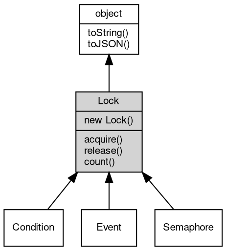

# 对象 Lock
Lock 是一个内建对象，它可以用来控制纤程并发访问, 可以通过一个纤程获取锁，来阻止其他纤程同时获取。Lock 可以通过 [coroutine.Lock](../../module/ifs/coroutine.md#Lock)() 函数创建

常见情况是，在一个多线程的场景中，当多个线程都想修改同一份数据时，就会出现数据不一致。比如，两个线程都想修改同一份数据中的同一个值，在控制不当的情况下，可能会产生结果的不一致。这时使用 Lock 对象，就可以实现对同一份数据的互斥访问。

下面是一个简单的例子，使用 Lock 实现两个纤程交替执行，并且共享变量 v 的值不为 300。

```JavaScript
var coroutine = require("coroutine")

var l = new coroutine.Lock()
var v = 100

function f() {
    l.acquire()
    v = 200
    coroutine.sleep(1)
    v = 300
    l.release()
}
coroutine.start(f)

coroutine.sleep(1)

l.acquire()
assert.notEqual(300, v)
assert.equal(200, v)
l.release()
```

首先创建了一个Lock对象，并进入纤程 f，获取锁后修改变量 v，然后释放锁。在主线程中，先等待纤程 f 完成……当纤程 f 释放了 Lock 后，主线程开始获取 Lock，确保变量 v 的值被改为 300。

## 继承关系


## 构造函数
        
### Lock
**构造函数**

```JavaScript
new Lock();
```

## 成员函数
        
### acquire
**获取锁的拥有权**

```JavaScript
Boolean Lock.acquire(Boolean blocking = true) async;
```

调用参数:
* blocking: Boolean, 指定是否等待，为 true 时等待，缺省为真

返回结果:
* Boolean, 返回是否成功获取锁，为 true 表示成功获取

acquire 方法用于获取锁的拥有权，当锁处于可获取状态时，此方法立即返回 true。

当锁不可获取，且 blocking 为 true，则当前纤程进入休眠，当其他纤程释放锁后，此方法返回 true。

当锁不可获取，且 blocking 为 false，则方法返回 false。

--------------------------
### release
**释放锁的拥有权**

```JavaScript
Lock.release();
```

此方法将释放对锁的拥有权，如果当前纤程未拥有锁，此方法将抛出错误。

--------------------------
### count
**查询当前等待任务数**

```JavaScript
Integer Lock.count();
```

返回结果:
* Integer, 返回任务数

--------------------------
### toString
**返回对象的字符串表示，一般返回 "[Native Object]"，对象可以根据自己的特性重新实现**

```JavaScript
String Lock.toString();
```

返回结果:
* String, 返回对象的字符串表示

--------------------------
### toJSON
**返回对象的 JSON 格式表示，一般返回对象定义的可读属性集合**

```JavaScript
Value Lock.toJSON(String key = "");
```

调用参数:
* key: String, 未使用

返回结果:
* Value, 返回包含可 JSON 序列化的值

