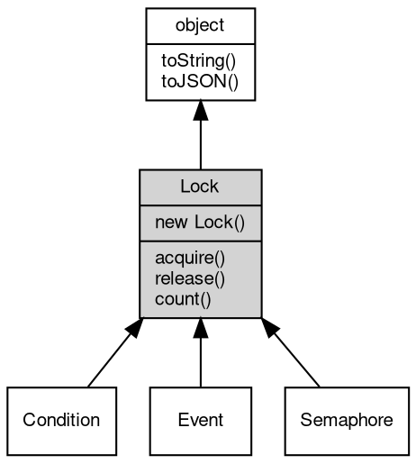

# Object Lock
A reentrant mutual-exclusion lock between fibers

A Lock is owned by one fiber at a time. `acquire` takes ownership and suspends the
other fibers that ask for it until the owner calls `release`; a fiber that already
owns the lock may acquire it again, and it must then release it as many times as it
acquired. Locks protect state that is shared between fibers, the role a mutex plays in
a threaded program.

Concepts:

- **What a lock protects**: JavaScript statements are never interleaved, but a fiber
can be suspended between two of them — at `sleep`, at I/O, at `join`, at `wait` and at
`acquire` itself. Any read-modify-write sequence that contains such a suspension point
can race with another fiber, so it must be wrapped in acquire/release.
- **Blocking**: `acquire()` suspends the calling fiber until the lock is free, and
`acquire(false)` returns false immediately when the lock is taken by another fiber
instead of waiting. The `blocking` argument defaults to true.
- **Reentrancy**: the same fiber may acquire the lock several times; only the matching
number of `release` calls frees it. From the owning fiber `acquire(false)` therefore
returns true even while other fibers are waiting.
- **Ownership**: `release` must be called by the owning fiber. Ownership is verified
only in debug builds, so in a release build releasing a lock you do not own silently
corrupts its state instead of throwing; keep acquire/release balanced, preferably with
`try`/`finally`.
- **Diagnostics**: `count()` reports how many fibers are blocked in acquire — not the
recursion depth — so it is safe for monitoring but must not be used for
synchronization.
- **Scope**: a lock orders the fibers of one isolate only; code running in another
[Worker](Worker.md) is not affected (use [worker_threads](../../module/ifs/worker_threads.md) messages or `Atomics` for that).
- **Related primitives**: use the [Semaphore](Semaphore.md) class when permits have to be counted, for
example to limit concurrency; use the [Condition](Condition.md) class to wait for a state change
instead of polling; the [Event](Event.md) class is a one-shot broadcast gate and provides no
mutual exclusion.
- **Node.js**: Node.js has no fiber-level lock. The closest concepts are `Atomics` in
workers and the browser Web Locks API, neither of which is available in fibjs on the
same objects.

Obtained from:
- `new [coroutine.Lock](../../module/ifs/coroutine.md#Lock)()` — creates a lock owned by no fiber.

Example 1 — a critical section makes the counter update atomic:

```JavaScript
const coroutine = require('coroutine');

const lock = new coroutine.Lock();
let value = 0;

function bump() {
    lock.acquire();
    const current = value;
    coroutine.sleep(1); // a suspension point inside the critical section
    value = current + 1;
    lock.release();
}

const fibers = [];
for (let i = 0; i < 4; i++)
    fibers.push(coroutine.start(bump));

fibers.forEach((f) => f.join());
console.log('value:', value);
```

will output:
```sh
value: 4
```

Example 2 — a blocked waiter and the waiter count:

```JavaScript
const coroutine = require('coroutine');

const lock = new coroutine.Lock();
lock.acquire();

const child = coroutine.start(function() {
    lock.acquire(); // blocks until the main fiber releases
    console.log('child acquired');
    lock.release();
});

coroutine.sleep(5);
console.log('waiters:', lock.count());

lock.release();
child.join();
console.log('child done');
```

will output:
```sh
waiters: 1
child acquired
child done
```

## Inheritance

```dot
digraph {
    node [fontname="Helvetica,sans-Serif", fontsize=10, shape="record", style="filled", fillcolor="white"];

    object [tooltip="object", URL="object.md", label="{object|toString()\ltoJSON()\l}"];
    Lock [tooltip="Lock", fillcolor="lightgray", id="me", label="{Lock|new Lock()\l|acquire()\lrelease()\lcount()\l}"];
    Condition [tooltip="Condition", URL="Condition.md", label="{Condition}"];
    Event [tooltip="Event", URL="Event.md", label="{Event}"];
    Semaphore [tooltip="Semaphore", URL="Semaphore.md", label="{Semaphore}"];

    object -> Lock [dir=back];
    Lock -> Condition [dir=back];
    Lock -> Event [dir=back];
    Lock -> Semaphore [dir=back];
}
```

## Constructors
        
### Lock
**Creates a lock owned by no fiber**

```JavaScript
new Lock();
```

The lock starts free, is reentrant for the fiber that acquires it and holds no name or options.

## Methods
        
### acquire
**Acquires the lock**

```JavaScript
Boolean Lock.acquire(Boolean blocking = true) async;
```

Parameters:
* blocking: Boolean, true to wait for the lock, false to return immediately

Returns:
* Boolean, true when the lock was acquired, false only with `blocking` false

When the lock is free the call returns true at once. When another fiber owns it and
`blocking` is true (the default), the calling fiber is suspended until that fiber
releases the lock, and the call then returns true; when `blocking` is false the call
returns false immediately without waiting. The owner may acquire the lock again, so
`acquire(false)` from the owning fiber returns true even if other fibers are waiting.
The argument is coerced to boolean, and `acquireAsync()` is the promise form that does
not block the calling fiber.

Example — the same fiber may re-enter the lock:

```JavaScript
const coroutine = require('coroutine');

const lock = new coroutine.Lock();

console.log('first acquire:', lock.acquire());
console.log('acquire again in the same fiber:', lock.acquire());
lock.release();
console.log('after one release, acquire(false):', lock.acquire(false));
lock.release();
lock.release();

console.log('fibers waiting:', lock.count());
```

will output:
```sh
first acquire: true
acquire again in the same fiber: true
after one release, acquire(false): true
fibers waiting: 0
```

--------------------------
### release
**Releases the lock**

```JavaScript
Lock.release();
```

Removes one level of ownership from the calling fiber; the lock becomes free for other
fibers when the last level is released, and one of the waiting fibers is resumed.
Releasing a lock that the calling fiber does not own is a programming error: debug
builds abort on the assertion, while release builds silently corrupt the lock state,
so keep the calls balanced with `try`/`finally`. The call returns undefined.

--------------------------
### count
**Number of fibers blocked in acquire**

```JavaScript
Integer Lock.count();
```

Returns:
* Integer, number of fibers waiting for the lock

The value covers the waits on this lock only: the owning fiber and fibers that used
`acquire(false)` are not counted, and the recursion depth of the owner is not
reported. Use it for diagnostics and monitoring, never as a synchronization condition.

--------------------------
### toString
**Returns the string form of the [object](object.md)**

```JavaScript
String Lock.toString();
```

Returns:
* String, returns the string form of the [object](object.md)

The base implementation reports an error: a native [object](object.md) has no implicit
text form, and only the classes whose value can be written as a string
override the member. [Buffer](Buffer.md) returns its content decoded with the given
[encoding](../../module/ifs/encoding.md), [HttpCookie](HttpCookie.md) returns "name=value", and so on; an override commonly
accepts optional arguments ([Buffer.toString](Buffer.md#toString) takes [encoding](../../module/ifs/encoding.md), start and
end) that are not part of this declaration.

Calling the member on a class that does not override it throws
"<Class>: the [object](object.md) can not be converted to string.", which is the
behavior to rely on when probing whether a value has a string form. See
toJSON for the serialization hook.

--------------------------
### toJSON
**Returns the JSON representation of the [object](object.md)**

```JavaScript
Value Lock.toJSON(String key = "");
```

Parameters:
* key: String, the property name of the value being serialized

Returns:
* Value, returns the JSON-serializable value

JSON.stringify(value) calls value.toJSON(key) when the member exists and
serializes the returned value in its place; the key argument carries the
property name of the value inside its parent [object](object.md) (an empty string at
the top level) and may be used to build a keyed form. The base
implementation returns a plain [object](object.md) holding the readable properties of
the instance, so a native [object](object.md) serializes without per-class code; a
class with a portable shape such as [Buffer](Buffer.md) overrides it, and a JavaScript
class may override it in the same way.

The member is normally reached through JSON.stringify rather than called
directly; calling it returns the same value JSON.stringify would
serialize.

