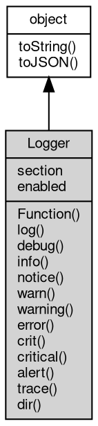

# 对象 Logger
日志对象，用于记录日志信息

`Logger` 对象用于记录各种等级的日志信息。它是一个强大的工具，可以帮助开发者在开发和调试过程中记录和追踪应用程序的行为。通过记录日志信息，开发者可以更容易地发现和解决问题，提高代码的可靠性和可维护性。

在软件开发过程中，日志记录是一个非常重要的环节。通过记录日志，开发者可以了解应用程序的运行状态、捕获异常和错误、分析性能瓶颈等。日志信息通常分为不同的等级，例如调试信息、普通信息、警告信息、错误信息和关键错误信息等。不同等级的日志信息可以帮助开发者更好地分类和管理日志数据。

`Logger` 对象提供了多种方法来记录不同等级的日志信息。可以通过 `util.debuglog` 模块创建

`Logger` 对象。例如：

```JavaScript
var logger = util.debuglog('example');
```

`Logger` 对象提供了以下主要功能：

- **记录普通日志信息**：用于输出非错误性提示信息。
- **记录调试日志信息**：用于输出调试信息，帮助开发者在开发过程中追踪代码执行情况。
- **记录警告日志信息**：用于输出提示性调试信息，通常表示可能需要注意的问题。
- **记录错误日志信息**：用于输出错误信息，表示程序运行过程中出现了问题。
- **记录关键错误日志信息**：用于输出关键错误信息，表示程序运行过程中出现了严重问题。
- **记录警报错误日志信息**：用于输出最高级别的错误信息，表示程序运行过程中出现了非常严重的问题。
- **输出当前调用堆栈**：通过日志输出当前调用堆栈，帮助开发者了解代码的执行路径。
- **用 JSON 格式输出对象**：以 JSON 格式输出对象，支持多种格式控制选项。

以下是一些使用 `Logger` 对象的示例：

```JavaScript
// 创建 Logger 对象
var logger = util.debuglog('example');

// 记录普通日志信息
logger('This is a log message');
logger.log('This is a log message with format: %s', 'example');

// 记录调试日志信息
logger.debug('This is a debug message');

// 记录警告日志信息
logger.warn('This is a warning message');
logger.warning('This is a warning message');

// 记录错误日志信息
logger.error('This is an error message');

// 记录关键错误日志信息
logger.crit('This is a critical message');
logger.critical('This is a critical message');

// 记录警报错误日志信息
logger.alert('This is an alert message');

// 输出当前调用堆栈
logger.trace('This is a trace message');

// 用 JSON 格式输出对象
logger.dir({
    key: 'value'
}, {
    colors: true,
    depth: 1
});
```

通过这些方法，您可以方便地记录和管理应用程序中的日志信息。日志记录不仅可以帮助开发者在开发和调试过程中发现和解决问题，还可以在应用程序的生产环境中提供重要的运行时信息，帮助运维人员监控和维护系统的稳定性和性能。

## 继承关系


## 成员属性
        
### section
**String, 查询当前日志对象的 section 名称**

```JavaScript
readonly String Logger.section;
```

--------------------------
### enabled
**Boolean, 查询当前日志对象是否启用**

```JavaScript
readonly Boolean Logger.enabled;
```

## 成员函数
        
### Function
**记录普通日志信息，与 info 等同**

```JavaScript
Logger.Function(String fmt,
    ...args);
```

调用参数:
* fmt: String, 格式化字符串
* args: ..., 可选参数列表

记录一般等级的日志信息。通常用于输出非错误性提示信息。

--------------------------
**记录普通日志信息，与 info 等同**

```JavaScript
Logger.Function(...args);
```

调用参数:
* args: ..., 可选参数列表

记录一般等级的日志信息。通常用于输出非错误性提示信息。

--------------------------
### log
**记录普通日志信息，与 info 等同**

```JavaScript
Logger.log(String fmt,
    ...args);
```

调用参数:
* fmt: String, 格式化字符串
* args: ..., 可选参数列表

记录一般等级的日志信息。通常用于输出非错误性提示信息。

--------------------------
**记录普通日志信息，与 info 等同**

```JavaScript
Logger.log(...args);
```

调用参数:
* args: ..., 可选参数列表

记录一般等级的日志信息。通常用于输出非错误性提示信息。

--------------------------
### debug
**记录调试日志信息**

```JavaScript
Logger.debug(String fmt,
    ...args);
```

调用参数:
* fmt: String, 格式化字符串
* args: ..., 可选参数列表

记录调试日志信息。通常用于输出调试信息。不重要。

--------------------------
**记录调试日志信息**

```JavaScript
Logger.debug(...args);
```

调用参数:
* args: ..., 可选参数列表

记录调试日志信息。通常用于输出调试信息。不重要。

--------------------------
### info
**记录普通日志信息，与 log 等同**

```JavaScript
Logger.info(String fmt,
    ...args);
```

调用参数:
* fmt: String, 格式化字符串
* args: ..., 可选参数列表

记录一般等级的日志信息。通常用于输出非错误性提示信息。

--------------------------
**记录普通日志信息，与 log 等同**

```JavaScript
Logger.info(...args);
```

调用参数:
* args: ..., 可选参数列表

记录一般等级的日志信息。通常用于输出非错误性提示信息。

--------------------------
### notice
**记录警告日志信息**

```JavaScript
Logger.notice(String fmt,
    ...args);
```

调用参数:
* fmt: String, 格式化字符串
* args: ..., 可选参数列表

记录警告日志信息。通常用于输出提示性调试信息。一般重要。

--------------------------
**记录警告日志信息**

```JavaScript
Logger.notice(...args);
```

调用参数:
* args: ..., 可选参数列表

记录警告日志信息。通常用于输出提示性调试信息。一般重要。

--------------------------
### warn
**记录警告日志信息，与 warning 等同**

```JavaScript
Logger.warn(String fmt,
    ...args);
```

调用参数:
* fmt: String, 格式化字符串
* args: ..., 可选参数列表

记录警告日志信息。通常用于输出警告性调试信息。重要。

--------------------------
**记录警告日志信息，与 warning 等同**

```JavaScript
Logger.warn(...args);
```

调用参数:
* args: ..., 可选参数列表

记录警告日志信息。通常用于输出警告性调试信息。重要。

--------------------------
### warning
**记录警告日志信息**

```JavaScript
Logger.warning(String fmt,
    ...args);
```

调用参数:
* fmt: String, 格式化字符串
* args: ..., 可选参数列表

记录警告日志信息。通常用于输出警告性调试信息。重要。

--------------------------
**记录警告日志信息**

```JavaScript
Logger.warning(...args);
```

调用参数:
* args: ..., 可选参数列表

记录警告日志信息。通常用于输出警告性调试信息。重要。

--------------------------
### error
**记录错误日志信息**

```JavaScript
Logger.error(String fmt,
    ...args);
```

调用参数:
* fmt: String, 格式化字符串
* args: ..., 可选参数列表

记录用于错误日志信息。通常用于输出错误信息。非常重要。系统的出错信息也会以此等级记录。

--------------------------
**记录错误日志信息**

```JavaScript
Logger.error(...args);
```

调用参数:
* args: ..., 可选参数列表

记录用于错误日志信息。通常用于输出错误信息。非常重要。系统的出错信息也会以此等级记录。

--------------------------
### crit
**记录关键错误日志信息，与 critical 等同**

```JavaScript
Logger.crit(String fmt,
    ...args);
```

调用参数:
* fmt: String, 格式化字符串
* args: ..., 可选参数列表

记录用于关键错误日志信息。通常用于输出关键错误信息。非常重要。

--------------------------
**记录关键错误日志信息，与 critical 等同**

```JavaScript
Logger.crit(...args);
```

调用参数:
* args: ..., 可选参数列表

记录用于关键错误日志信息。通常用于输出关键错误信息。非常重要。

--------------------------
### critical
**记录关键错误日志信息**

```JavaScript
Logger.critical(String fmt,
    ...args);
```

调用参数:
* fmt: String, 格式化字符串
* args: ..., 可选参数列表

记录用于关键错误日志信息。通常用于输出关键错误信息。非常重要。

--------------------------
**记录关键错误日志信息**

```JavaScript
Logger.critical(...args);
```

调用参数:
* args: ..., 可选参数列表

记录用于关键错误日志信息。通常用于输出关键错误信息。非常重要。

--------------------------
### alert
**记录警报错误日志信息**

```JavaScript
Logger.alert(String fmt,
    ...args);
```

调用参数:
* fmt: String, 格式化字符串
* args: ..., 可选参数列表

记录用于警报错误日志信息。通常用于输出警报错误信息。非常重要。为最高级别信息。

--------------------------
**记录警报错误日志信息**

```JavaScript
Logger.alert(...args);
```

调用参数:
* args: ..., 可选参数列表

记录用于警报错误日志信息。通常用于输出警报错误信息。非常重要。为最高级别信息。

--------------------------
### trace
**输出当前调用堆栈**

```JavaScript
Logger.trace(String fmt,
    ...args);
```

调用参数:
* fmt: String, 格式化字符串
* args: ..., 可选参数列表

通过日志输出当前调用堆栈。

--------------------------
**输出当前调用堆栈**

```JavaScript
Logger.trace(...args);
```

调用参数:
* args: ..., 可选参数列表

通过日志输出当前调用堆栈。

--------------------------
### dir
**用 JSON 格式输出对象**

```JavaScript
Logger.dir(Value obj,
    Object options = {});
```

调用参数:
* obj: Value, 指定需要处理的对象
* options: Object, 指定格式控制选项

支持以下参数:

```JavaScript
{
    "colors": false, // specify if output should be colorized, defaults to false
    "depth": 2, // specify the max depth of the output, defaults to 2
    "table": false, // specify if output should be a table, defaults to false
    "encode_string": true, // specify if string should be encoded, defaults to true
    "maxArrayLength": 100, // specify max number of array elements to show, set to 0 or negative to show no elements, defaults to 100
    "maxStringLength": 10000, // specify max string length to output, set to 0 or negative to show no strings, defaults to 10000
    "fields": [], // specify the fields to be displayed, defaults to all
}
```

--------------------------
### toString
**返回对象的字符串表示，一般返回 "[Native Object]"，对象可以根据自己的特性重新实现**

```JavaScript
String Logger.toString();
```

返回结果:
* String, 返回对象的字符串表示

--------------------------
### toJSON
**返回对象的 JSON 格式表示，一般返回对象定义的可读属性集合**

```JavaScript
Value Logger.toJSON(String key = "");
```

调用参数:
* key: String, 未使用

返回结果:
* Value, 返回包含可 JSON 序列化的值

