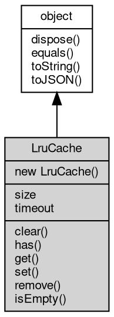

# 对象 LruCache
LRU(least recently used) 缓存对象

LruCache 用以维护一个 LRU 缓存，创建方法：

```JavaScript
var util = require("util");
var c = new util.LruCache(10, 100);
```

## 继承关系


## 构造函数
        
### LruCache
**LruCache 对象构造函数**

```JavaScript
new LruCache(Integer size,
    Integer timeout = 0);
```

调用参数:
* size: Integer, 缓存最大尺寸
* timeout: Integer, 元素失效时间，单位是 ms，小于等于 0 不失效，缺省为 0

## 成员属性
        
### size
**Integer, 查询容器内数值个数**

```JavaScript
readonly Integer LruCache.size;
```

--------------------------
### timeout
**Integer, 查询和设置容器内元素失效时间，单位是 ms，小于等于 0 不失效**

```JavaScript
Integer LruCache.timeout;
```

## 成员函数
        
### clear
**清除容器数据**

```JavaScript
LruCache.clear();
```

--------------------------
### has
**检查容器内是否存在指定键值的数据**

```JavaScript
Boolean LruCache.has(String name);
```

调用参数:
* name: String, 指定要检查的键值

返回结果:
* Boolean, 返回键值是否存在

--------------------------
### get
**查询指定键值的值**

```JavaScript
Value LruCache.get(String name);
```

调用参数:
* name: String, 指定要查询的键值

返回结果:
* Value, 返回键值所对应的值，若不存在，则返回 undefined

--------------------------
**查询指定键值的值，若不存在或过期，则调用回调函数更新数据**

```JavaScript
Value LruCache.get(String name,
    Function updater);
```

调用参数:
* name: String, 指定要查询的键值
* updater: Function, 指定更新函数

返回结果:
* Value, 返回键值所对应的值

--------------------------
### set
**设定一个键值数据，键值不存在则插入一条新数据**

```JavaScript
LruCache.set(String name,
    Value value);
```

调用参数:
* name: String, 指定要设定的键值
* value: Value, 指定要设定的数据

--------------------------
**设定一个键值数据，键值不存在则插入新数据**

```JavaScript
LruCache.set(Object map);
```

调用参数:
* map: Object, 指定要设定的键值数据字典

--------------------------
### remove
**删除指定键值的全部值**

```JavaScript
LruCache.remove(String name);
```

调用参数:
* name: String, 指定要删除的键值

--------------------------
### isEmpty
**检查容器是否为空**

```JavaScript
Boolean LruCache.isEmpty();
```

返回结果:
* Boolean, 容器内无数值则返回 true

--------------------------
### dispose
**强制回收对象，调用此方法后，对象资源将立即释放**

```JavaScript
LruCache.dispose();
```

--------------------------
### equals
**比较当前对象与给定的对象是否相等**

```JavaScript
Boolean LruCache.equals(object expected);
```

调用参数:
* expected: [object](object.md), 制定比较的目标对象

返回结果:
* Boolean, 返回对象比较的结果

--------------------------
### toString
**返回对象的字符串表示，一般返回 "[Native Object]"，对象可以根据自己的特性重新实现**

```JavaScript
String LruCache.toString();
```

返回结果:
* String, 返回对象的字符串表示

--------------------------
### toJSON
**返回对象的 JSON 格式表示，一般返回对象定义的可读属性集合**

```JavaScript
Value LruCache.toJSON(String key = "");
```

调用参数:
* key: String, 未使用

返回结果:
* Value, 返回包含可 JSON 序列化的值

