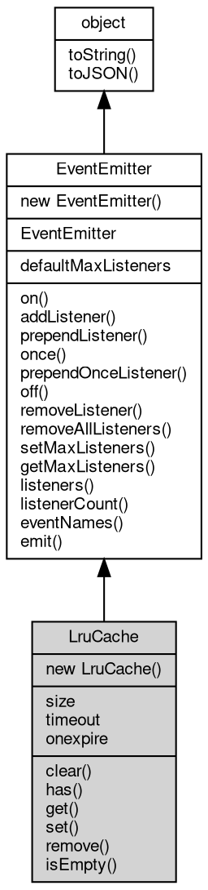

# 对象 LruCache
LruCache(Least Recently Used Cache) 是用来维护LRU缓存的类。它可以存储一定数量的值，并且保持了容器的尺寸。当新数据进来时，如果容器还没有到达尺寸限制，新数据可以直接加入到容器中。如果容器已满，则容器将淘汰最近最少使用的数据

我们可以通过如下方式来使用：

```JavaScript
const util = require('util')
const c = new util.LruCache(10, 100) // create a LruCache instance with size 10 and timeout 100ms
```

其中，set() 是设置键值对的接口：

```JavaScript
LruCache.set(String name, Value value);
```

name 参数指定要设定的键值，value 参数指定要设定的值。

`LruCache` 的 `get` 方法可以用回调函数的方式更新缓存数据：

```JavaScript
var c = new util.LruCache(10, 1000); // create a LruCache instance with size 10 and timeout 1000ms

function get_data(name) {
    // return data from backend
    // ...
    var data = {
        'name': name,
        'value': Math.random()
    };
    console.log('update data: ' + JSON.stringify(data)); // output infomation to console
    return data;
}

console.log(c.get('a', get_data));
console.log(c.get('a', get_data));
```

执行结果：
```sh
update data: {"name":"a","value":0.4019124971556616}
{"name":"a","value":0.4019124971556616} // updater will be called to update cache data when cache is empty
{"name":"a","value":0.4019124971556616} // updater will not be called when cache is not empty
```

具体使用 LruCache 时，建议开发人员遵循以下的最佳实践：

- 可以在后端数据处理过程中，以某个特定时间点为新鲜点，设定失效时间，来使用 LruCache 优化应用性能。
- 在对应的场景下分析业务决策。例如更频发的数据更新，需要配置更短的失效时间，而更新频率较低的缓存数据则不需要设定太短的失效时间。
- 在不同使用场景中，考虑不同数据访问模式，使用合适的 LruCache 类实例。

## 继承关系


## 构造函数
        
### LruCache
**LruCache 对象构造函数**

```JavaScript
new LruCache(Integer size,
    Integer timeout = 0);
```

调用参数:
* size: Integer, 缓存最大尺寸
* timeout: Integer, 元素失效时间，单位是 ms，小于等于 0 不失效，缺省为 0

## 静态属性
        
### defaultMaxListeners
**Integer, 默认全局最大监听器数**

```JavaScript
static Integer LruCache.defaultMaxListeners;
```

## 成员属性
        
### size
**Integer, 查询容器内数值个数**

```JavaScript
readonly Integer LruCache.size;
```

--------------------------
### timeout
**Integer, 查询和设置容器内元素失效时间，单位是 ms，小于等于 0 不失效**

```JavaScript
Integer LruCache.timeout;
```

--------------------------
### onexpire
**Function, 查询和绑定数据超时事件，相当于 on("expire", func);**

```JavaScript
Function LruCache.onexpire;
```

## 成员函数
        
### clear
**清除容器数据**

```JavaScript
LruCache.clear();
```

--------------------------
### has
**检查容器内是否存在指定键值的数据**

```JavaScript
Boolean LruCache.has(String name);
```

调用参数:
* name: String, 指定要检查的键值

返回结果:
* Boolean, 返回键值是否存在

--------------------------
### get
**查询指定键值的值**

```JavaScript
Value LruCache.get(String name);
```

调用参数:
* name: String, 指定要查询的键值

返回结果:
* Value, 返回键值所对应的值，若不存在，则返回 undefined

--------------------------
**查询指定键值的值，若不存在或过期，则调用回调函数更新数据**

```JavaScript
Value LruCache.get(String name,
    Function updater);
```

调用参数:
* name: String, 指定要查询的键值
* updater: Function, 指定更新函数

返回结果:
* Value, 返回键值所对应的值

--------------------------
### set
**设定一个键值数据，键值不存在则插入一条新数据**

```JavaScript
LruCache.set(String name,
    Value value);
```

调用参数:
* name: String, 指定要设定的键值
* value: Value, 指定要设定的数据

--------------------------
**设定一个键值数据，键值不存在则插入新数据**

```JavaScript
LruCache.set(Object map);
```

调用参数:
* map: Object, 指定要设定的键值数据字典

--------------------------
### remove
**删除指定键值的全部值**

```JavaScript
LruCache.remove(String name);
```

调用参数:
* name: String, 指定要删除的键值

--------------------------
### isEmpty
**检查容器是否为空**

```JavaScript
Boolean LruCache.isEmpty();
```

返回结果:
* Boolean, 容器内无数值则返回 true

--------------------------
### on
**绑定一个事件处理函数到对象**

```JavaScript
Object LruCache.on(String ev,
    Function func);
```

调用参数:
* ev: String, 指定事件的名称
* func: Function, 指定事件处理函数

返回结果:
* Object, 返回事件对象本身，便于链式调用

--------------------------
**绑定一个事件处理函数到对象**

```JavaScript
Object LruCache.on(Object map);
```

调用参数:
* map: Object, 指定事件映射关系，对象属性名称将作为事件名称，属性的值将作为事件处理函数

返回结果:
* Object, 返回事件对象本身，便于链式调用

--------------------------
### addListener
**绑定一个事件处理函数到对象**

```JavaScript
Object LruCache.addListener(String ev,
    Function func);
```

调用参数:
* ev: String, 指定事件的名称
* func: Function, 指定事件处理函数

返回结果:
* Object, 返回事件对象本身，便于链式调用

--------------------------
**绑定一个事件处理函数到对象**

```JavaScript
Object LruCache.addListener(Object map);
```

调用参数:
* map: Object, 指定事件映射关系，对象属性名称将作为事件名称，属性的值将作为事件处理函数

返回结果:
* Object, 返回事件对象本身，便于链式调用

--------------------------
### prependListener
**绑定一个事件处理函数到对象起始**

```JavaScript
Object LruCache.prependListener(String ev,
    Function func);
```

调用参数:
* ev: String, 指定事件的名称
* func: Function, 指定事件处理函数

返回结果:
* Object, 返回事件对象本身，便于链式调用

--------------------------
**绑定一个事件处理函数到对象起始**

```JavaScript
Object LruCache.prependListener(Object map);
```

调用参数:
* map: Object, 指定事件映射关系，对象属性名称将作为事件名称，属性的值将作为事件处理函数

返回结果:
* Object, 返回事件对象本身，便于链式调用

--------------------------
### once
**绑定一个一次性事件处理函数到对象，一次性处理函数只会触发一次**

```JavaScript
Object LruCache.once(String ev,
    Function func);
```

调用参数:
* ev: String, 指定事件的名称
* func: Function, 指定事件处理函数

返回结果:
* Object, 返回事件对象本身，便于链式调用

--------------------------
**绑定一个一次性事件处理函数到对象，一次性处理函数只会触发一次**

```JavaScript
Object LruCache.once(Object map);
```

调用参数:
* map: Object, 指定事件映射关系，对象属性名称将作为事件名称，属性的值将作为事件处理函数

返回结果:
* Object, 返回事件对象本身，便于链式调用

--------------------------
### prependOnceListener
**绑定一个事件处理函数到对象起始**

```JavaScript
Object LruCache.prependOnceListener(String ev,
    Function func);
```

调用参数:
* ev: String, 指定事件的名称
* func: Function, 指定事件处理函数

返回结果:
* Object, 返回事件对象本身，便于链式调用

--------------------------
**绑定一个事件处理函数到对象起始**

```JavaScript
Object LruCache.prependOnceListener(Object map);
```

调用参数:
* map: Object, 指定事件映射关系，对象属性名称将作为事件名称，属性的值将作为事件处理函数

返回结果:
* Object, 返回事件对象本身，便于链式调用

--------------------------
### off
**从对象处理队列中取消指定函数**

```JavaScript
Object LruCache.off(String ev,
    Function func);
```

调用参数:
* ev: String, 指定事件的名称
* func: Function, 指定事件处理函数

返回结果:
* Object, 返回事件对象本身，便于链式调用

--------------------------
**取消对象处理队列中的全部函数**

```JavaScript
Object LruCache.off(String ev);
```

调用参数:
* ev: String, 指定事件的名称

返回结果:
* Object, 返回事件对象本身，便于链式调用

--------------------------
**从对象处理队列中取消指定函数**

```JavaScript
Object LruCache.off(Object map);
```

调用参数:
* map: Object, 指定事件映射关系，对象属性名称作为事件名称，属性的值作为事件处理函数

返回结果:
* Object, 返回事件对象本身，便于链式调用

--------------------------
### removeListener
**从对象处理队列中取消指定函数**

```JavaScript
Object LruCache.removeListener(String ev,
    Function func);
```

调用参数:
* ev: String, 指定事件的名称
* func: Function, 指定事件处理函数

返回结果:
* Object, 返回事件对象本身，便于链式调用

--------------------------
**取消对象处理队列中的全部函数**

```JavaScript
Object LruCache.removeListener(String ev);
```

调用参数:
* ev: String, 指定事件的名称

返回结果:
* Object, 返回事件对象本身，便于链式调用

--------------------------
**从对象处理队列中取消指定函数**

```JavaScript
Object LruCache.removeListener(Object map);
```

调用参数:
* map: Object, 指定事件映射关系，对象属性名称作为事件名称，属性的值作为事件处理函数

返回结果:
* Object, 返回事件对象本身，便于链式调用

--------------------------
### removeAllListeners
**从对象处理队列中取消所有事件的所有监听器， 如果指定事件，则移除指定事件的所有监听器。**

```JavaScript
Object LruCache.removeAllListeners(String ev);
```

调用参数:
* ev: String, 指定事件的名称

返回结果:
* Object, 返回事件对象本身，便于链式调用

--------------------------
**从对象处理队列中取消所有事件的所有监听器， 如果指定事件，则移除指定事件的所有监听器。**

```JavaScript
Object LruCache.removeAllListeners(Array evs = []);
```

调用参数:
* evs: Array, 指定事件的名称

返回结果:
* Object, 返回事件对象本身，便于链式调用

--------------------------
### setMaxListeners
**监听器的默认限制的数量，仅用于兼容**

```JavaScript
LruCache.setMaxListeners(Integer n);
```

调用参数:
* n: Integer, 指定事件的数量

--------------------------
### getMaxListeners
**获取监听器的默认限制的数量，仅用于兼容**

```JavaScript
Integer LruCache.getMaxListeners();
```

返回结果:
* Integer, 返回默认限制数量

--------------------------
### listeners
**查询对象指定事件的监听器数组**

```JavaScript
Array LruCache.listeners(String ev);
```

调用参数:
* ev: String, 指定事件的名称

返回结果:
* Array, 返回指定事件的监听器数组

--------------------------
### listenerCount
**查询对象指定事件的监听器数量**

```JavaScript
Integer LruCache.listenerCount(String ev);
```

调用参数:
* ev: String, 指定事件的名称

返回结果:
* Integer, 返回指定事件的监听器数量

--------------------------
**查询对象指定事件的监听器数量**

```JavaScript
Integer LruCache.listenerCount(Value o,
    String ev);
```

调用参数:
* o: Value, 指定查询的对象
* ev: String, 指定事件的名称

返回结果:
* Integer, 返回指定事件的监听器数量

--------------------------
### eventNames
**查询监听器事件名称**

```JavaScript
Array LruCache.eventNames();
```

返回结果:
* Array, 返回事件名称数组

--------------------------
### emit
**主动触发一个事件**

```JavaScript
Boolean LruCache.emit(String ev,
    ...args);
```

调用参数:
* ev: String, 事件名称
* args: ..., 事件参数，将会传递给事件处理函数

返回结果:
* Boolean, 返回事件触发状态，有响应事件返回 true，否则返回 false

--------------------------
### toString
**返回对象的字符串表示，一般返回 "[Native Object]"，对象可以根据自己的特性重新实现**

```JavaScript
String LruCache.toString();
```

返回结果:
* String, 返回对象的字符串表示

--------------------------
### toJSON
**返回对象的 JSON 格式表示，一般返回对象定义的可读属性集合**

```JavaScript
Value LruCache.toJSON(String key = "");
```

调用参数:
* key: String, 未使用

返回结果:
* Value, 返回包含可 JSON 序列化的值

