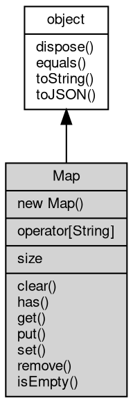

# 对象 Map
字典对象

用以创建和管理字典对象，创建方法：

```JavaScript
var collection = require("collection");
var m = new collection.Map();
```

## 继承关系


## 构造函数
        
### Map
**Map 构造函数**

```JavaScript
new Map();
```

--------------------------
**Map 构造函数**

```JavaScript
new Map(Object map);
```

调用参数:
* map: Object, 用于初始化的 js 字典对象

## 下标操作
        
**允许使用键值下标直接访问数值**

```JavaScript
Variant Map[String];
```

## 成员属性
        
### size
**Integer, 查询容器内数值个数**

```JavaScript
readonly Integer Map.size;
```

## 成员函数
        
### clear
**清除容器数据**

```JavaScript
Map.clear();
```

--------------------------
### has
**检查容器内是否存在指定键值的数据**

```JavaScript
Boolean Map.has(String name);
```

调用参数:
* name: String, 指定要检查的键值

返回结果:
* Boolean, 返回键值是否存在

--------------------------
### get
**查询指定键值的值**

```JavaScript
Variant Map.get(String name);
```

调用参数:
* name: String, 指定要查询的键值

返回结果:
* Variant, 返回键值所对应的值，若不存在，则返回 null

--------------------------
### put
**添加一组键值数据**

```JavaScript
Map.put(Object map);
```

调用参数:
* map: Object, 指定要设定的键值数据字典

--------------------------
**添加一个键值数据**

```JavaScript
Map.put(String name,
    Variant value);
```

调用参数:
* name: String, 指定要设定的键值
* value: Variant, 指定要设定的数据

--------------------------
### set
**设定一组键值数据，键值不存在则插入一条新数据**

```JavaScript
Map.set(Object map);
```

调用参数:
* map: Object, 指定要设定的键值数据字典

--------------------------
**设定一个键值数据，键值不存在则插入新数据**

```JavaScript
Map.set(String name,
    Variant value);
```

调用参数:
* name: String, 指定要设定的键值
* value: Variant, 指定要设定的数据

--------------------------
### remove
**删除指定键值的全部值**

```JavaScript
Map.remove(String name);
```

调用参数:
* name: String, 指定要删除的键值

--------------------------
### isEmpty
**检查容器是否为空**

```JavaScript
Boolean Map.isEmpty();
```

返回结果:
* Boolean, 容器内无数值则返回 true

--------------------------
### dispose
**强制回收对象，调用此方法后，对象资源将立即释放**

```JavaScript
Map.dispose();
```

--------------------------
### equals
**比较当前对象与给定的对象是否相等**

```JavaScript
Boolean Map.equals(object expected);
```

调用参数:
* expected: [object](object.md), 制定比较的目标对象

返回结果:
* Boolean, 返回对象比较的结果

--------------------------
### toString
**返回对象的字符串表示，一般返回 "[Native Object]"，对象可以根据自己的特性重新实现**

```JavaScript
String Map.toString();
```

返回结果:
* String, 返回对象的字符串表示

--------------------------
### toJSON
**返回对象的 JSON 格式表示，一般返回对象定义的可读属性集合**

```JavaScript
Value Map.toJSON(String key = "");
```

调用参数:
* key: String, 未使用

返回结果:
* Value, 返回包含可 JSON 序列化的值

