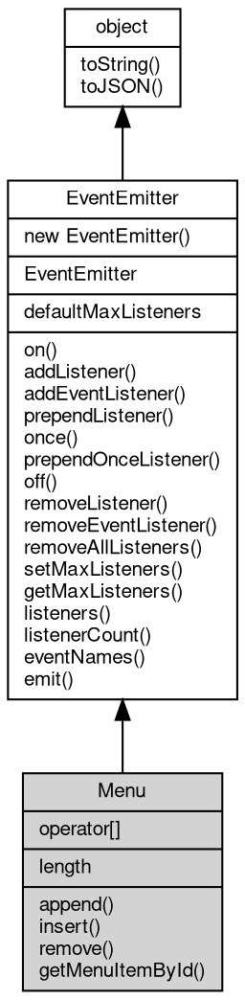

# 对象 Menu
菜单管理对象，用于窗口显示菜单

Menu 可以使用以下方式创建：

```JavaScript
var menu = gui.createMenu([{
        label: 'File',
        submenu: [{
                label: 'New',
                onclick: function() {
                    console.log('New clicked');
                }
            },
            {
                label: 'Open',
                onclick: function() {
                    console.log('Open clicked');
                }
            },
            {
                label: 'Save',
                onclick: function() {
                    console.log('Save clicked');
                }
            },
            {
                label: 'Save As',
                onclick: function() {
                    console.log('Save As clicked');
                }
            },
            {
                label: 'Close',
                onclick: function() {
                    console.log('Close clicked');
                }
            }
        ]
    },
    {
        label: 'Edit',
        submenu: [{
                label: 'Undo',
                onclick: function() {
                    console.log('Undo clicked');
                }
            },
            {
                label: 'Redo',
                onclick: function() {
                    console.log('Redo clicked');
                }
            },
            {
                type: 'separator'
            },
            {
                label: 'Cut',
                onclick: function() {
                    console.log('Cut clicked');
                }
            },
            {
                label: 'Copy',
                onclick: function() {
                    console.log('Copy clicked');
                }
            },
            {
                label: 'Paste',
                onclick: function() {
                    console.log('Paste clicked');
                }
            }
        ]
    },
    {
        label: 'Help',
        submenu: [{
            label: 'About',
            onclick: function() {
                console.log('About clicked');
            }
        }]
    }
]);
```

或者在创建窗口时内置创建：

```JavaScript
var win = gui.open({
    url: 'http://fibjs.org',
    menu: [{
            label: 'File',
            submenu: [{
                    label: 'New',
                    onclick: function() {
                        console.log('New clicked');
                    }
                },
                {
                    label: 'Open',
                    onclick: function() {
                        console.log('Open clicked');
                    }
                },
                {
                    label: 'Save',
                    onclick: function() {
                        console.log('Save clicked');
                    }
                },
                {
                    label: 'Save As',
                    onclick: function() {
                        console.log('Save As clicked');
                    }
                },
                {
                    label: 'Close',
                    onclick: function() {
                        console.log('Close clicked');
                    }
                }
            ]
        },
        {
            label: 'Edit',
            submenu: [{
                    label: 'Undo',
                    onclick: function() {
                        console.log('Undo clicked');
                    }
                },
                {
                    label: 'Redo',
                    onclick: function() {
                        console.log('Redo clicked');
                    }
                },
                {
                    type: 'separator'
                },
                {
                    label: 'Cut',
                    onclick: function() {
                        console.log('Cut clicked');
                    }
                },
                {
                    label: 'Copy',
                    onclick: function() {
                        console.log('Copy clicked');
                    }
                },
                {
                    label: 'Paste',
                    onclick: function() {
                        console.log('Paste clicked');
                    }
                }
            ]
        },
        {
            label: 'Help',
            submenu: [{
                label: 'About',
                onclick: function() {
                    console.log('About clicked');
                }
            }]
        }
    ]
});
```

## 继承关系


## 操作符
        
### operator[]
**获取菜单项，通过索引获取菜单中的菜单项。**

```JavaScript
readonly MenuItem Menu[];
```

返回结果:
* 菜单项对象

## 静态属性
        
### defaultMaxListeners
**Integer, 默认全局最大监听器数**

```JavaScript
static Integer Menu.defaultMaxListeners;
```

## 成员属性
        
### length
**Integer, 获取菜单项数量**

```JavaScript
readonly Integer Menu.length;
```

## 成员函数
        
### append
**添加菜单项，将一个菜单项添加到菜单中。**

```JavaScript
Menu.append(Object item);
```

调用参数:
* item: Object, 菜单项对象

--------------------------
### insert
**插入菜单项，在指定位置插入一个菜单项。**

```JavaScript
Menu.insert(Integer pos,
    Object item);
```

调用参数:
* pos: Integer, 插入位置的索引
* item: Object, 菜单项对象

--------------------------
### remove
**@rief 移除菜单项，从菜单中移除指定位置的菜单项。**

```JavaScript
Menu.remove(Integer pos);
```

调用参数:
* pos: Integer, 要移除的菜单项的索引

--------------------------
### getMenuItemById
**获取菜单项，通过 id 获取菜单中的菜单项。**

```JavaScript
MenuItem Menu.getMenuItemById(String id);
```

调用参数:
* id: String, 菜单项的 id

返回结果:
* [MenuItem](MenuItem.md), 菜单项对象，如果没有找到返回 null

--------------------------
### on
**绑定一个事件处理函数到对象**

```JavaScript
Object Menu.on(String ev,
    Function func);
```

调用参数:
* ev: String, 指定事件的名称
* func: Function, 指定事件处理函数

返回结果:
* Object, 返回事件对象本身，便于链式调用

--------------------------
**绑定一个事件处理函数到对象**

```JavaScript
Object Menu.on(Object map);
```

调用参数:
* map: Object, 指定事件映射关系，对象属性名称将作为事件名称，属性的值将作为事件处理函数

返回结果:
* Object, 返回事件对象本身，便于链式调用

--------------------------
### addListener
**绑定一个事件处理函数到对象**

```JavaScript
Object Menu.addListener(String ev,
    Function func);
```

调用参数:
* ev: String, 指定事件的名称
* func: Function, 指定事件处理函数

返回结果:
* Object, 返回事件对象本身，便于链式调用

--------------------------
**绑定一个事件处理函数到对象**

```JavaScript
Object Menu.addListener(Object map);
```

调用参数:
* map: Object, 指定事件映射关系，对象属性名称将作为事件名称，属性的值将作为事件处理函数

返回结果:
* Object, 返回事件对象本身，便于链式调用

--------------------------
### addEventListener
**绑定一个事件处理函数到对象**

```JavaScript
Object Menu.addEventListener(String ev,
    Function func,
    Object options = {});
```

调用参数:
* ev: String, 指定事件的名称
* func: Function, 指定事件处理函数
* options: Object, 指定事件处理函数的选项

返回结果:
* Object, 返回事件对象本身，便于链式调用

options 参数是一个对象，它可以包含以下属性：
- once: 如果为 true，则事件处理函数只会触发一次，触发后会被移除

--------------------------
### prependListener
**绑定一个事件处理函数到对象起始**

```JavaScript
Object Menu.prependListener(String ev,
    Function func);
```

调用参数:
* ev: String, 指定事件的名称
* func: Function, 指定事件处理函数

返回结果:
* Object, 返回事件对象本身，便于链式调用

--------------------------
**绑定一个事件处理函数到对象起始**

```JavaScript
Object Menu.prependListener(Object map);
```

调用参数:
* map: Object, 指定事件映射关系，对象属性名称将作为事件名称，属性的值将作为事件处理函数

返回结果:
* Object, 返回事件对象本身，便于链式调用

--------------------------
### once
**绑定一个一次性事件处理函数到对象，一次性处理函数只会触发一次**

```JavaScript
Object Menu.once(String ev,
    Function func);
```

调用参数:
* ev: String, 指定事件的名称
* func: Function, 指定事件处理函数

返回结果:
* Object, 返回事件对象本身，便于链式调用

--------------------------
**绑定一个一次性事件处理函数到对象，一次性处理函数只会触发一次**

```JavaScript
Object Menu.once(Object map);
```

调用参数:
* map: Object, 指定事件映射关系，对象属性名称将作为事件名称，属性的值将作为事件处理函数

返回结果:
* Object, 返回事件对象本身，便于链式调用

--------------------------
### prependOnceListener
**绑定一个事件处理函数到对象起始**

```JavaScript
Object Menu.prependOnceListener(String ev,
    Function func);
```

调用参数:
* ev: String, 指定事件的名称
* func: Function, 指定事件处理函数

返回结果:
* Object, 返回事件对象本身，便于链式调用

--------------------------
**绑定一个事件处理函数到对象起始**

```JavaScript
Object Menu.prependOnceListener(Object map);
```

调用参数:
* map: Object, 指定事件映射关系，对象属性名称将作为事件名称，属性的值将作为事件处理函数

返回结果:
* Object, 返回事件对象本身，便于链式调用

--------------------------
### off
**从对象处理队列中取消指定函数**

```JavaScript
Object Menu.off(String ev,
    Function func);
```

调用参数:
* ev: String, 指定事件的名称
* func: Function, 指定事件处理函数

返回结果:
* Object, 返回事件对象本身，便于链式调用

--------------------------
**取消对象处理队列中的全部函数**

```JavaScript
Object Menu.off(String ev);
```

调用参数:
* ev: String, 指定事件的名称

返回结果:
* Object, 返回事件对象本身，便于链式调用

--------------------------
**从对象处理队列中取消指定函数**

```JavaScript
Object Menu.off(Object map);
```

调用参数:
* map: Object, 指定事件映射关系，对象属性名称作为事件名称，属性的值作为事件处理函数

返回结果:
* Object, 返回事件对象本身，便于链式调用

--------------------------
### removeListener
**从对象处理队列中取消指定函数**

```JavaScript
Object Menu.removeListener(String ev,
    Function func);
```

调用参数:
* ev: String, 指定事件的名称
* func: Function, 指定事件处理函数

返回结果:
* Object, 返回事件对象本身，便于链式调用

--------------------------
**取消对象处理队列中的全部函数**

```JavaScript
Object Menu.removeListener(String ev);
```

调用参数:
* ev: String, 指定事件的名称

返回结果:
* Object, 返回事件对象本身，便于链式调用

--------------------------
**从对象处理队列中取消指定函数**

```JavaScript
Object Menu.removeListener(Object map);
```

调用参数:
* map: Object, 指定事件映射关系，对象属性名称作为事件名称，属性的值作为事件处理函数

返回结果:
* Object, 返回事件对象本身，便于链式调用

--------------------------
### removeEventListener
**从对象处理队列中取消指定函数**

```JavaScript
Object Menu.removeEventListener(String ev,
    Function func,
    Object options = {});
```

调用参数:
* ev: String, 指定事件的名称
* func: Function, 指定事件处理函数
* options: Object, 指定事件处理函数的选项

返回结果:
* Object, 返回事件对象本身，便于链式调用

--------------------------
### removeAllListeners
**从对象处理队列中取消所有事件的所有监听器， 如果指定事件，则移除指定事件的所有监听器。**

```JavaScript
Object Menu.removeAllListeners(String ev);
```

调用参数:
* ev: String, 指定事件的名称

返回结果:
* Object, 返回事件对象本身，便于链式调用

--------------------------
**从对象处理队列中取消所有事件的所有监听器， 如果指定事件，则移除指定事件的所有监听器。**

```JavaScript
Object Menu.removeAllListeners(Array evs = []);
```

调用参数:
* evs: Array, 指定事件的名称

返回结果:
* Object, 返回事件对象本身，便于链式调用

--------------------------
### setMaxListeners
**监听器的默认限制的数量，仅用于兼容**

```JavaScript
Menu.setMaxListeners(Integer n);
```

调用参数:
* n: Integer, 指定事件的数量

--------------------------
### getMaxListeners
**获取监听器的默认限制的数量，仅用于兼容**

```JavaScript
Integer Menu.getMaxListeners();
```

返回结果:
* Integer, 返回默认限制数量

--------------------------
### listeners
**查询对象指定事件的监听器数组**

```JavaScript
Array Menu.listeners(String ev);
```

调用参数:
* ev: String, 指定事件的名称

返回结果:
* Array, 返回指定事件的监听器数组

--------------------------
### listenerCount
**查询对象指定事件的监听器数量**

```JavaScript
Integer Menu.listenerCount(String ev);
```

调用参数:
* ev: String, 指定事件的名称

返回结果:
* Integer, 返回指定事件的监听器数量

--------------------------
**查询对象指定事件的监听器数量**

```JavaScript
Integer Menu.listenerCount(Value o,
    String ev);
```

调用参数:
* o: Value, 指定查询的对象
* ev: String, 指定事件的名称

返回结果:
* Integer, 返回指定事件的监听器数量

--------------------------
### eventNames
**查询监听器事件名称**

```JavaScript
Array Menu.eventNames();
```

返回结果:
* Array, 返回事件名称数组

--------------------------
### emit
**主动触发一个事件**

```JavaScript
Boolean Menu.emit(String ev,
    ...args);
```

调用参数:
* ev: String, 事件名称
* args: ..., 事件参数，将会传递给事件处理函数

返回结果:
* Boolean, 返回事件触发状态，有响应事件返回 true，否则返回 false

--------------------------
### toString
**返回对象的字符串表示，一般返回 "[Native Object]"，对象可以根据自己的特性重新实现**

```JavaScript
String Menu.toString();
```

返回结果:
* String, 返回对象的字符串表示

--------------------------
### toJSON
**返回对象的 JSON 格式表示，一般返回对象定义的可读属性集合**

```JavaScript
Value Menu.toJSON(String key = "");
```

调用参数:
* key: String, 未使用

返回结果:
* Value, 返回包含可 JSON 序列化的值

