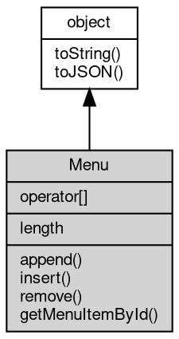

# 对象 Menu
菜单管理对象，用于窗口显示菜单

Menu 可以使用以下方式创建：

```JavaScript
var menu = gui.createMenu([{
        label: 'File',
        submenu: [{
                label: 'New',
                onclick: function() {
                    console.log('New clicked');
                }
            },
            {
                label: 'Open',
                onclick: function() {
                    console.log('Open clicked');
                }
            },
            {
                label: 'Save',
                onclick: function() {
                    console.log('Save clicked');
                }
            },
            {
                label: 'Save As',
                onclick: function() {
                    console.log('Save As clicked');
                }
            },
            {
                label: 'Close',
                onclick: function() {
                    console.log('Close clicked');
                }
            }
        ]
    },
    {
        label: 'Edit',
        submenu: [{
                label: 'Undo',
                onclick: function() {
                    console.log('Undo clicked');
                }
            },
            {
                label: 'Redo',
                onclick: function() {
                    console.log('Redo clicked');
                }
            },
            {
                type: 'separator'
            },
            {
                label: 'Cut',
                onclick: function() {
                    console.log('Cut clicked');
                }
            },
            {
                label: 'Copy',
                onclick: function() {
                    console.log('Copy clicked');
                }
            },
            {
                label: 'Paste',
                onclick: function() {
                    console.log('Paste clicked');
                }
            }
        ]
    },
    {
        label: 'Help',
        submenu: [{
            label: 'About',
            onclick: function() {
                console.log('About clicked');
            }
        }]
    }
]);
```

或者在创建窗口时内置创建：

```JavaScript
var win = gui.open({
    url: 'http://fibjs.org',
    menu: [{
            label: 'File',
            submenu: [{
                    label: 'New',
                    onclick: function() {
                        console.log('New clicked');
                    }
                },
                {
                    label: 'Open',
                    onclick: function() {
                        console.log('Open clicked');
                    }
                },
                {
                    label: 'Save',
                    onclick: function() {
                        console.log('Save clicked');
                    }
                },
                {
                    label: 'Save As',
                    onclick: function() {
                        console.log('Save As clicked');
                    }
                },
                {
                    label: 'Close',
                    onclick: function() {
                        console.log('Close clicked');
                    }
                }
            ]
        },
        {
            label: 'Edit',
            submenu: [{
                    label: 'Undo',
                    onclick: function() {
                        console.log('Undo clicked');
                    }
                },
                {
                    label: 'Redo',
                    onclick: function() {
                        console.log('Redo clicked');
                    }
                },
                {
                    type: 'separator'
                },
                {
                    label: 'Cut',
                    onclick: function() {
                        console.log('Cut clicked');
                    }
                },
                {
                    label: 'Copy',
                    onclick: function() {
                        console.log('Copy clicked');
                    }
                },
                {
                    label: 'Paste',
                    onclick: function() {
                        console.log('Paste clicked');
                    }
                }
            ]
        },
        {
            label: 'Help',
            submenu: [{
                label: 'About',
                onclick: function() {
                    console.log('About clicked');
                }
            }]
        }
    ]
});
```

## 继承关系


## 操作符
        
### operator[]
**获取菜单项，通过索引获取菜单中的菜单项。**

```JavaScript
readonly MenuItem Menu[];
```

返回结果:
* 菜单项对象

## 成员属性
        
### length
**Integer, 获取菜单项数量**

```JavaScript
readonly Integer Menu.length;
```

## 成员函数
        
### append
**添加菜单项，将一个菜单项添加到菜单中。**

```JavaScript
Menu.append(Object item);
```

调用参数:
* item: Object, 菜单项对象

--------------------------
### insert
**插入菜单项，在指定位置插入一个菜单项。**

```JavaScript
Menu.insert(Integer pos,
    Object item);
```

调用参数:
* pos: Integer, 插入位置的索引
* item: Object, 菜单项对象

--------------------------
### remove
**@rief 移除菜单项，从菜单中移除指定位置的菜单项。**

```JavaScript
Menu.remove(Integer pos);
```

调用参数:
* pos: Integer, 要移除的菜单项的索引

--------------------------
### getMenuItemById
**获取菜单项，通过 id 获取菜单中的菜单项。**

```JavaScript
MenuItem Menu.getMenuItemById(String id);
```

调用参数:
* id: String, 菜单项的 id

返回结果:
* [MenuItem](MenuItem.md), 菜单项对象，如果没有找到返回 null

--------------------------
### toString
**返回对象的字符串表示，一般返回 "[Native Object]"，对象可以根据自己的特性重新实现**

```JavaScript
String Menu.toString();
```

返回结果:
* String, 返回对象的字符串表示

--------------------------
### toJSON
**返回对象的 JSON 格式表示，一般返回对象定义的可读属性集合**

```JavaScript
Value Menu.toJSON(String key = "");
```

调用参数:
* key: String, 未使用

返回结果:
* Value, 返回包含可 JSON 序列化的值

