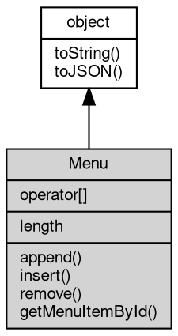

# Object Menu
Ordered list of [MenuItem](MenuItem.md) objects, shown as a window menu bar or a tray menu

A Menu is created from a template array with `gui.createMenu`, or implicitly by
passing a template array or Menu [object](object.md) in the `menu` option of `gui.open`,
`gui.openFile` or `gui.createTray`. The window or tray keeps the resulting
[object](object.md): `[WebView](WebView.md)#getMenu` and `[Tray](Tray.md)#getMenu` return the same instance that was
passed in.

Concepts:

- **Hierarchy**: a Menu is a flat list of [MenuItem](MenuItem.md) objects. A submenu item owns
  the nested Menu in its `submenu` property, so any depth is expressed with
  nested descriptors; `length` and `operator[]` address the top level only.
- **Templates**: every element of a template is a descriptor [object](object.md) or an
  existing [MenuItem](MenuItem.md); the accepted properties and validation rules are described
  in [MenuItem](MenuItem.md).
- **Attachment**: the native menu is built when the [object](object.md) is first attached to
  a window or tray, and `append`, `insert` and `remove` then throw
  "Menu: Menu is already attached to a window" (the check is on the native
  handle, so tray menus behave the same). Build the whole menu before attaching
  it.
- **Lookup**: `getMenuItemById` checks the top-level items in order and then
  recurses into every submenu, so an id anywhere in the tree can be reached from
  the root menu.

Example 1 — build and edit a menu:

```JavaScript
const gui = require('gui');

const menu = gui.createMenu([{
        id: 'file',
        label: 'File'
    },
    {
        id: 'edit',
        label: 'Edit'
    }
]);

menu.append({
    id: 'help',
    label: 'Help'
});
menu.insert(1, {
    id: 'view',
    label: 'View'
});
menu.remove(0);

console.log(menu.length); // 3
console.log(menu[0].label + ' ' + menu[1].label + ' ' + menu[2].label); // View Edit Help
console.log(menu.getMenuItemById('view').label); // View
```

Example 2 — attach a menu to a window and read it back (requires a desktop session):

```JavaScript
// requires: long-running
const gui = require('gui');

const menu = gui.createMenu([{
    label: 'File',
    submenu: [{
        label: 'Quit'
    }]
}]);
const win = gui.open({
    width: 320,
    height: 200,
    menu: menu
});

console.log(win.getMenu() === menu); // true
win.waitFor();
```

## Inheritance

```dot
digraph {
    node [fontname="Helvetica,sans-Serif", fontsize=10, shape="record", style="filled", fillcolor="white"];

    object [tooltip="object", URL="object.md", label="{object|toString()\ltoJSON()\l}"];
    Menu [tooltip="Menu", fillcolor="lightgray", id="me", label="{Menu|operator[]\l|length\l|append()\linsert()\lremove()\lgetMenuItemById()\l}"];

    object -> Menu [dir=back];
}
```

## Operators
        
### operator[]
**Returns the item at the given index**

```JavaScript
readonly MenuItem Menu[];
```

Returns:
* menu item at the given index

index must be less than length; an integer outside this range throws
RangeError 20006. Negative indexes and other properties are ordinary
JavaScript properties rather than menu items, so they read as undefined.

## Properties
        
### length
**Integer, Number of items at the top level of the menu**

```JavaScript
readonly Integer Menu.length;
```

The contents of submenus are not counted; use `menu[i].submenu.length` for a
nested menu.

## Methods
        
### append
**Appends an item at the end of the menu**

```JavaScript
Menu.append(Object item);
```

Parameters:
* item: Object, menu item [object](object.md)

item is a descriptor [object](object.md) or an existing [MenuItem](MenuItem.md). The length and all item
indexes are updated immediately. Throws when the menu is already attached to
a window or tray, and when the descriptor is invalid (see [MenuItem](MenuItem.md)).

Example — build a menu with append:

```JavaScript
const gui = require('gui');

const menu = gui.createMenu();

menu.append({
    label: 'First'
});
menu.append({
    label: 'Second'
});

console.log(menu.length); // 2
console.log(menu[1].label); // Second
```

--------------------------
### insert
**Inserts an item at the given position**

```JavaScript
Menu.insert(Integer pos,
    Object item);
```

Parameters:
* pos: Integer, the index of the insertion position
* item: Object, menu item [object](object.md)

pos must be between 0 and length (inclusive); values outside this range
throw RangeError 20006. Throws when the menu is already attached to a window
or tray, and when the descriptor is invalid (see [MenuItem](MenuItem.md)).

--------------------------
### remove
**Removes the item at the given position**

```JavaScript
Menu.remove(Integer pos);
```

Parameters:
* pos: Integer, the index of the menu item to remove

pos must be between 0 and length - 1; values outside this range throw
RangeError 20006. Throws when the menu is already attached to a window or
tray; disable the entry of an attached menu with `item.enabled` instead.

--------------------------
### getMenuItemById
**Returns the first item with the given id, or null when no item matches**

```JavaScript
MenuItem Menu.getMenuItemById(String id);
```

Parameters:
* id: String, the id of the menu item

Returns:
* [MenuItem](MenuItem.md), menu item [object](object.md), or null if not found

The search is depth-first: each top-level item is checked before its submenu
and before the next sibling. Ids default to an empty string and are not
required to be unique.

Example — find an item inside a submenu:

```JavaScript
const gui = require('gui');

const menu = gui.createMenu([{
        id: 'file',
        label: 'File'
    },
    {
        label: 'Edit',
        submenu: [{
            id: 'copy',
            label: 'Copy'
        }]
    }
]);

console.log(menu.getMenuItemById('copy').label); // Copy
console.log(menu.getMenuItemById('missing')); // null
```

--------------------------
### toString
**Returns the string form of the [object](object.md)**

```JavaScript
String Menu.toString();
```

Returns:
* String, returns the string form of the [object](object.md)

The base implementation reports an error: a native [object](object.md) has no implicit
text form, and only the classes whose value can be written as a string
override the member. [Buffer](Buffer.md) returns its content decoded with the given
[encoding](../../module/ifs/encoding.md), [HttpCookie](HttpCookie.md) returns "name=value", and so on; an override commonly
accepts optional arguments ([Buffer.toString](Buffer.md#toString) takes [encoding](../../module/ifs/encoding.md), start and
end) that are not part of this declaration.

Calling the member on a class that does not override it throws
"<Class>: the [object](object.md) can not be converted to string.", which is the
behavior to rely on when probing whether a value has a string form. See
toJSON for the serialization hook.

--------------------------
### toJSON
**Returns the JSON representation of the [object](object.md)**

```JavaScript
Value Menu.toJSON(String key = "");
```

Parameters:
* key: String, the property name of the value being serialized

Returns:
* Value, returns the JSON-serializable value

JSON.stringify(value) calls value.toJSON(key) when the member exists and
serializes the returned value in its place; the key argument carries the
property name of the value inside its parent [object](object.md) (an empty string at
the top level) and may be used to build a keyed form. The base
implementation returns a plain [object](object.md) holding the readable properties of
the instance, so a native [object](object.md) serializes without per-class code; a
class with a portable shape such as [Buffer](Buffer.md) overrides it, and a JavaScript
class may override it in the same way.

The member is normally reached through JSON.stringify rather than called
directly; calling it returns the same value JSON.stringify would
serialize.

