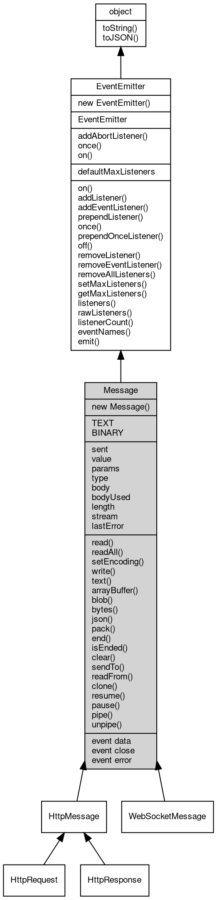

# Object Message
Basic message [object](object.md): the payload unit shared by the networking stacks

Message is the base class of every payload exchanged by the networking stacks: an [HttpRequest](HttpRequest.md) or
[HttpResponse](HttpResponse.md) (through [HttpMessage](HttpMessage.md)), a [WebSocket](WebSocket.md) frame payload ([WebSocketMessage](WebSocketMessage.md)) and the objects
processed by [mq](../../module/ifs/mq.md) handlers are all Messages. On its own it is a plain in-memory message: the body
is read and written with read/readAll/write/text/[json](../../module/ifs/json.md)/pack, routing metadata travels in
value/params, and the data/close/error events of the body stream are forwarded to the message.

Concepts:

- **Buffered and streaming bodies**: a locally built message (write/text/[json](../../module/ifs/json.md)/pack) buffers its
  body in a seekable [MemoryStream](MemoryStream.md), so it can be read from the beginning more than once; a
  message read from a socket may expose a streaming body that can be consumed only once (a
  second consume throws TypeError 20024 "body has already been consumed"). `bodyUsed` reports
  whether a consume method ran, `length` is the size of a buffered body (0 for a streaming
  one), and `body` is null when the message has no body or the buffered body is empty.
- **Writing**: `write` appends to the buffered body and encodes a string as utf8; `text`,
  `json` and `pack` replace the body with the utf8 text, the JSON [encoding](../../module/ifs/encoding.md) and the [msgpack](../../module/ifs/msgpack.md)
  [encoding](../../module/ifs/encoding.md) of their argument. `end` writes the given data (if any) and marks the message ended.
- **Reading**: `read` reads from the current position of the body and `readAll` rewinds a
  buffered body and returns everything; `text`/`json`/`pack`/`bytes`/`arrayBuffer`/`blob`
  consume the body and convert it at once. `json` and `pack` implement the JSON and [msgpack](../../module/ifs/msgpack.md)
  formats through the [json](../../module/ifs/json.md) and [msgpack](../../module/ifs/msgpack.md) modules; on an [HttpMessage](HttpMessage.md) they also set or check the
  Content-Type header.
- **Encoding**: `setEncoding` hands the [encoding](../../module/ifs/encoding.md) to the body stream, so the `data` event
  delivers strings instead of Buffers; for the built-in memory-backed bodies `read` keeps
  returning a [Buffer](Buffer.md). Node's IncomingMessage.setEncoding applies the [encoding](../../module/ifs/encoding.md) to the readable
  itself, so its read() returns strings.
- **Wire format**: `sendTo` and `readFrom` serialize and parse a complete message on a stream.
  The base Message does not implement them (they throw 20009); [HttpRequest](HttpRequest.md), [HttpResponse](HttpResponse.md) and
  [WebSocketMessage](WebSocketMessage.md) override both. `stream` is the buffered stream a message was read from.
- **[Routing](Routing.md) metadata**: `value` carries the [path](../../module/ifs/path.md) or route value a handler dispatches on and
  `params` the capture groups the router fills for a matched pattern (see [mq.Routing](../../module/ifs/mq.md#Routing)); both are
  plain data, and writing into `params` from JavaScript is not reflected back.

Obtained from:
- `new [mq.Message](../../module/ifs/mq.md#Message)()` — an empty in-memory message, the form used to build [mq](../../module/ifs/mq.md) payloads;
- `new [http.Request](../../module/ifs/http.md#Request)()` / `new [http.Response](../../module/ifs/http.md#Response)()` — HTTP messages ([HttpMessage](HttpMessage.md) subclasses);
- `new [WebSocket.Message](WebSocket.md#Message)(...)` or the `message` event of a [WebSocket](WebSocket.md) ([WebSocketMessage](WebSocketMessage.md));
- handler callbacks — [mq.invoke](../../module/ifs/mq.md#invoke), [mq.Routing](../../module/ifs/mq.md#Routing), [mq.Chain](../../module/ifs/mq.md#Chain) and [HttpServer](HttpServer.md) handlers receive or
  produce Message objects;
- `http.getSync(...)`, `http.postSync(...)` and the other client functions return an
  [HttpResponse](HttpResponse.md), which is also a Message.

Example 1 — write, inspect and read a message:

```JavaScript
const mq = require('mq');

const msg = new mq.Message();
msg.type = mq.Message.TEXT;
msg.value = '/greeting';
msg.write('hello');
msg.write(' world');

console.log(msg.length); // 11
console.log(msg.readAll().toString()); // hello world
```

Example 2 — JSON and [msgpack](../../module/ifs/msgpack.md) payloads:

```JavaScript
const mq = require('mq');

const jsonMsg = new mq.Message();
jsonMsg.json({
    user: 'fibjs',
    tags: ['fast', 'sync']
});
console.log(jsonMsg.json().tags.length); // 2

const packMsg = new mq.Message();
packMsg.pack({
    n: 42
});
console.log(packMsg.pack().n); // 42
```

Example 3 — a handler receives and fills a message:

```JavaScript
const mq = require('mq');

const handler = new mq.Handler((msg) => {
    console.log(msg.value); // /hello
    msg.type = mq.Message.TEXT;
    msg.write('handled');
});

const msg = new mq.Message();
msg.value = '/hello';
mq.invoke(handler, msg);
console.log(msg.readAll().toString()); // handled
```

Notes:

- The Message constructor is public and usable, but `clone`/`sendTo`/`readFrom`/`stream` are
  only implemented by the concrete subclasses and throw 20009 here; use [HttpRequest](HttpRequest.md),
  [HttpResponse](HttpResponse.md) or [WebSocketMessage](WebSocketMessage.md) when a serializable message is needed. The constructor is
  reachable as `mq.Message` (the class is not a [global](../../module/ifs/global.md)).
- Node.js has no single message base class: [http.IncomingMessage](../../module/ifs/http.md#IncomingMessage), [http.ServerResponse](../../module/ifs/http.md#ServerResponse) and
  stream.Readable play separate roles, and [mq](../../module/ifs/mq.md) has no counterpart at all.

## Inheritance


## Constructors
        
### Message
**Message [object](object.md) constructor**

```JavaScript
new Message();
```

Creates an empty in-memory message with type BINARY, an empty value and params, no body and
the end flag unset. The constructor is reachable as `mq.Message` (the class is not a
[global](../../module/ifs/global.md)); for a serializable message use the concrete subclasses instead.

## Static Methods
        
### addAbortListener
**Registers a one-shot abort handler on an [AbortSignal](AbortSignal.md)**

```JavaScript
static Object Message.addAbortListener(EventEmitter signal,
    Function(Object ev) func);
```

Parameters:
* signal: [EventEmitter](EventEmitter.md), the [AbortSignal](AbortSignal.md) [object](object.md) to listen to
* func: Function(Object ev), the handler for the abort event

Returns:
* Object, returns a Disposable [object](object.md) containing a `[Symbol.dispose]` method

The handler is called at most once when the signal is aborted, and it is removed from the
signal afterwards. If the signal is already aborted the handler is invoked synchronously.
The returned [object](object.md) has a `[Symbol.dispose]()` method that removes the handler, so it can be
released before the abort happens.

Example — abort handling with automatic cleanup:

```JavaScript
const events = require('events');

const controller = new AbortController();
const disposable = events.addAbortListener(controller.signal,
    () => console.log('aborted'));

controller.abort(); // aborted
disposable[Symbol.dispose](); // safe to call after the listener fired
console.log(controller.signal.listenerCount('abort')); // 0
```

--------------------------
### once
**Creates a Promise resolved by the next occurrence of an event**

```JavaScript
static Object Message.once(EventEmitter emitter,
    Value ev,
    Object options = {});
```

Parameters:
* emitter: [EventEmitter](EventEmitter.md), the event emitter [object](object.md) to listen to
* ev: Value, the event name to listen for
* options: Object, optional parameter [object](object.md)

Returns:
* Object, returns a Promise that resolves with the array of event parameters

The Promise resolves with the array of the emit arguments when the event fires; it rejects
when `error` is emitted while waiting, unless the waited event is `error` itself, or when
the signal option aborts. The temporary listeners are removed when the Promise settles.

options supports the following option:

```JavaScript
// fragment: options
({
    "signal": null // AbortSignal; aborting rejects the Promise with an AbortError
});
```

Example — awaiting the next occurrence of an event:

```JavaScript
const EventEmitter = require('events');

(async () => {
    const emitter = new EventEmitter();
    const waiting = EventEmitter.once(emitter, 'ready');

    emitter.emit('ready', 200, 'ok');
    console.log(JSON.stringify(await waiting)); // [200,"ok"]
})();
```

--------------------------
### on
**Creates an async iterator that yields event occurrences**

```JavaScript
static Object Message.on(EventEmitter emitter,
    Value ev,
    Object options = {});
```

Parameters:
* emitter: [EventEmitter](EventEmitter.md), the event emitter [object](object.md) to listen to
* ev: Value, the event name to listen for
* options: Object, optional parameter [object](object.md)

Returns:
* Object, returns an AsyncIterator [object](object.md)

Each next() resolves with `{ value: [args...], done: false }` when the event fires and with
`{ done: true }` after an event named in the `close` option fires or the signal aborts; an
`error` event rejects the pending call. The listeners are registered when the iterator is
created and removed when the iteration ends or the signal aborts.

options supports the following options:

```JavaScript
// fragment: options
({
    "signal": null, // AbortSignal; aborting rejects pending and future next() calls
    "close": [] // event names; the first one to fire ends the iteration
});
```

Example — iterating the occurrences of an event:

```JavaScript
const EventEmitter = require('events');

(async () => {
    const emitter = new EventEmitter();
    const iterator = EventEmitter.on(emitter, 'data', {
        close: ['end']
    });

    emitter.emit('data', 1);
    emitter.emit('data', 2);
    emitter.emit('end');

    for await (const args of iterator)
    console.log(JSON.stringify(args)); // [1] then [2]
})();
```

## Static Properties
        
### defaultMaxListeners
**Integer, The [process](../../module/ifs/process.md)-wide default listener limit reported by getMaxListeners()**

```JavaScript
static Integer Message.defaultMaxListeners;
```

Defaults to 10. Assigning a value changes getMaxListeners() for every emitter that never
called setMaxListeners(); an emitter with an explicit limit keeps it. The limit is
informational: fibjs never warns when the number of listeners exceeds it.

## Constants
        
### TEXT
**Message type 1, representing a text type**

```JavaScript
const Message.TEXT = 1;
```

Set `type` to this value on messages whose payload is text: [WebSocketMessage](WebSocketMessage.md) then delivers
`data` as a String, and application handlers can decode the body as text. The default type
of a new message is BINARY.

--------------------------
### BINARY
**Message type 2, representing a binary type**

```JavaScript
const Message.BINARY = 2;
```

The default type of a new message. The payload is treated as raw bytes; a [WebSocketMessage](WebSocketMessage.md)
with this type delivers `data` as a [Buffer](Buffer.md).

## Properties
        
### sent
**Boolean, Whether the current message has been sent**

```JavaScript
readonly Boolean Message.sent;
```

The base Message and [WebSocketMessage](WebSocketMessage.md) always report false; [HttpMessage](HttpMessage.md) reports the real
flag, which sendTo and send set when the message was written to a stream. Node.js has no
equivalent property on IncomingMessage.

--------------------------
### value
**String, The basic content of the message**

```JavaScript
String Message.value;
```

A free-form string that carries the value a handler dispatches on: [mq.Routing](../../module/ifs/mq.md#Routing) stores the
matched [path](../../module/ifs/path.md) or the captured value in it, and an [HttpRequest](HttpRequest.md) mirrors its [path](../../module/ifs/path.md). Default is
an empty string.

--------------------------
### params
**NArray, The basic parameters of the message**

```JavaScript
readonly NArray Message.params;
```

Holds the capture groups that [mq.Routing](../../module/ifs/mq.md#Routing) fills when a pattern with capture groups matches;
the handler receives them here and as extra function arguments. The array is a read view:
writing into it from JavaScript does not change the message.

--------------------------
### type
**Integer, Message type**

```JavaScript
Integer Message.type;
```

TEXT (1) or BINARY (2), BINARY by default; any integer is accepted. [WebSocketMessage](WebSocketMessage.md) uses
the value to decide whether `data` is a String or a [Buffer](Buffer.md), and [HttpResponse](HttpResponse.md) overrides the
property with the Fetch response type string ('basic', 'cors', 'error').

--------------------------
### body
**[Stream](Stream.md), The stream [object](object.md) containing the data part of the message**

```JavaScript
Stream Message.body;
```

A buffered body is seekable and can be read from the beginning more than once; assigning a
non-seekable stream makes the body streaming, so it can be consumed only once. The getter
returns null when the message has no body or when the buffered body is empty (size 0).

--------------------------
### bodyUsed
**Boolean, Queries whether the body of the message has been consumed**

```JavaScript
readonly Boolean Message.bodyUsed;
```

Set by the consuming readers (text, [json](../../module/ifs/json.md), pack, bytes, arrayBuffer, blob and, on an
[HttpMessage](HttpMessage.md), formData). A buffered body can still be read again after the flag is set; a
streaming body rejects a second consume with TypeError 20024 "body has already been
consumed". read and readAll do not set the flag.

--------------------------
### length
**Long, The length of the data part of the message**

```JavaScript
readonly Long Message.length;
```

The size in bytes of the buffered body, 0 when the message has no body. It is also 0 for a
streaming body (a response body received from a client), whose size is unknown until it is
read; Node.js exposes the size through the Content-Length header instead of a property.

--------------------------
### stream
**[Stream](Stream.md), Queries the stream [object](object.md) used when the message was read from**

```JavaScript
readonly Stream Message.stream;
```

The base Message throws 20009; on an [HttpMessage](HttpMessage.md) and a [WebSocketMessage](WebSocketMessage.md) it is the buffered
stream the message was parsed from, and null when the message was built in memory. It is
distinct from socket, the underlying device stream of an HTTP message.

--------------------------
### lastError
**String, Queries and sets the last error of message processing**

```JavaScript
String Message.lastError;
```

A free-form string, empty by default; the base message never writes it, handler layers
such as [Chain](Chain.md) record a failure here. clear() preserves it.

## Methods
        
### read
**Reads the specified amount of data from the stream; this method is an alias of the corresponding body method**

```JavaScript
Buffer Message.read(Integer bytes = -1) async;
```

Parameters:
* bytes: Integer, the amount of data to read; the default is to read a data block of random size, and the size of the data read depends on the device

Returns:
* [Buffer](Buffer.md), returns the data read from the stream, or null if no data is available or the connection is interrupted

Reads from the current position of the body: a freshly written message is positioned at the
end and returns null until the body is rewound, while a message parsed with readFrom is
rewound and can be read sequentially. Reading a streaming body consumes it. Use readAll to
rewind a buffered body and take everything.

--------------------------
### readAll
**Reads all remaining data from the stream; this method is an alias of the corresponding body method**

```JavaScript
Buffer Message.readAll() async;
```

Returns:
* [Buffer](Buffer.md), returns the data read from the stream, or null if no data is available or the connection is interrupted

A buffered body is rewound first, so the call returns the whole body even after it was
read; a streaming body is read to the end and returns null on a second call. Returns null
when the message has no body.

--------------------------
### setEncoding
**Sets the [encoding](../../module/ifs/encoding.md) of the message body; this method is an alias of the corresponding body method**

```JavaScript
Message Message.setEncoding(String encoding);
```

Parameters:
* encoding: String, the [encoding](../../module/ifs/encoding.md) to use, such as 'utf8', 'ascii', '[hex](../../module/ifs/hex.md)', etc.

Returns:
* Message, returns the current message [object](object.md)

The [encoding](../../module/ifs/encoding.md) is handed to the body stream, so the `data` event then delivers strings
instead of Buffers; for the built-in memory-backed bodies `read` still returns a [Buffer](Buffer.md),
unlike Node's IncomingMessage.setEncoding, which makes read() return strings. Passing null
or an unsupported [encoding](../../module/ifs/encoding.md) throws a TypeError.

Example — the data event decodes after setEncoding:

```JavaScript
const mq = require('mq');
const io = require('io');
const coroutine = require('coroutine');

const msg = new mq.Message();
const ms = new io.MemoryStream();
ms.write('hello');
ms.rewind();
msg.body = ms;

const chunks = [];
msg.setEncoding('utf8');
msg.on('data', (chunk) => chunks.push(chunk));
msg.resume();
coroutine.sleep(10);

console.log(chunks.length, typeof chunks[0], chunks[0]); // 1 string hello
```

--------------------------
### write
**Writes the given data; this method is an alias of the corresponding body method; a string data is encoded as utf8**

```JavaScript
Integer Message.write(Buffer | String data) async;
```

Parameters:
* data: [Buffer](Buffer.md) | String, the data to write

Returns:
* Integer, returns the number of bytes actually written

Appends to the buffered body, creating an empty one when needed; it does not replace the
existing content and does not mark the message ended. The count returned for a buffered
body is not filled reliably by the current implementation, so use length for the body
size; Node's writable.write returns a boolean backpressure flag instead.

Example — write appends and readAll rewinds:

```JavaScript
const mq = require('mq');

const msg = new mq.Message();
msg.write('hello');
msg.write(' world');
console.log(msg.length); // 11

msg.body.rewind();
console.log(msg.read(5).toString()); // hello
console.log(msg.readAll().toString()); // hello world (readAll rewinds again)
```

--------------------------
### text
**Writes the given text data**

```JavaScript
String Message.text(String data) async;
```

Parameters:
* data: String, the data to write

Returns:
* String, this method does not return data

Replaces the body with the utf8 bytes of the string (write appends instead). The method
returns no data; it is the writing counterpart of text() and follows the Fetch Body mixin
shape.

--------------------------
**Parses the data in the message as text [encoding](../../module/ifs/encoding.md)**

```JavaScript
String Message.text() async;
```

Returns:
* String, returns the parsing result

Decodes the body as utf8 and consumes it (a buffered body is rewound first); an empty or
missing body returns an empty string. A second call on a streaming body throws TypeError
20024.

--------------------------
### arrayBuffer
**Returns the data part of the message in binary form**

```JavaScript
ArrayBuffer Message.arrayBuffer() async;
```

Returns:
* ArrayBuffer, returns an ArrayBuffer [object](object.md) containing the data part of the message

Consumes the body and returns its bytes as an ArrayBuffer; a missing or empty body returns
a zero-length ArrayBuffer. A second call on a streaming body throws TypeError 20024.
Matches the Fetch Body mixin (MDN Body.arrayBuffer()).

--------------------------
### blob
**Returns the data part of the message as a [Blob](Blob.md)**

```JavaScript
Blob Message.blob(String type = "") async;
```

Parameters:
* type: String, the MIME type of the [Blob](Blob.md), default is an empty string

Returns:
* [Blob](Blob.md), returns a [Blob](Blob.md) [object](object.md) containing the data part of the message

Consumes the body; a missing or empty body returns an empty [Blob](Blob.md). The argument is the MIME
type of the result and is not taken from the Content-Type header (fibjs extension: MDN
Body.blob() falls back to the header when the type is omitted).

--------------------------
### bytes
**Returns the data part of the message as a [Buffer](Buffer.md)**

```JavaScript
Buffer Message.bytes() async;
```

Returns:
* [Buffer](Buffer.md), returns a [Buffer](Buffer.md) containing the data part of the message, or an empty [Buffer](Buffer.md) if there is no data

Consumes the body; a missing or empty body returns a zero-length [Buffer](Buffer.md). A second call on a
streaming body throws TypeError 20024, while a buffered body can be read again.

--------------------------
### json
**Writes the given data with JSON [encoding](../../module/ifs/encoding.md)**

```JavaScript
Variant Message.json(Value data) async;
```

Parameters:
* data: Value, the data to write

Returns:
* Variant, this method does not return data

Replaces the body with the JSON text produced by the [json](../../module/ifs/json.md) [module](../../module/ifs/module.md) (see [json.encode](../../module/ifs/json.md#encode)) and,
on an [HttpMessage](HttpMessage.md), sets the Content-Type header to application/[json](../../module/ifs/json.md). Throws when the value
cannot be encoded (for example a circular [object](object.md)). Returns no data.

--------------------------
**Parses the data in the message as JSON**

```JavaScript
Variant Message.json() async;
```

Returns:
* Variant, returns the parsing result

Consumes the body and parses it with the [json](../../module/ifs/json.md) [module](../../module/ifs/module.md); a missing body returns null and
invalid JSON throws a SyntaxError. On an [HttpMessage](HttpMessage.md) the Content-Type header must contain
"[json](../../module/ifs/json.md)", otherwise error 20024 is raised ("Content-Type is missing." or "Invalid content
type.").

--------------------------
### pack
**Writes the given data with [msgpack](../../module/ifs/msgpack.md) [encoding](../../module/ifs/encoding.md)**

```JavaScript
Variant Message.pack(Value data) async;
```

Parameters:
* data: Value, the data to write

Returns:
* Variant, this method does not return data

Replaces the body with the [msgpack](../../module/ifs/msgpack.md) [encoding](../../module/ifs/encoding.md) produced by the [msgpack](../../module/ifs/msgpack.md) [module](../../module/ifs/module.md) and, on an
[HttpMessage](HttpMessage.md), sets the Content-Type header to application/[msgpack](../../module/ifs/msgpack.md). Throws when the value
cannot be encoded. Returns no data.

--------------------------
**Parses the data in the message as [msgpack](../../module/ifs/msgpack.md)**

```JavaScript
Variant Message.pack() async;
```

Returns:
* Variant, returns the parsing result

Consumes the body and decodes it with the [msgpack](../../module/ifs/msgpack.md) [module](../../module/ifs/module.md); a missing body returns null and
invalid data throws. On an [HttpMessage](HttpMessage.md) the Content-Type header must be
application/[msgpack](../../module/ifs/msgpack.md) (parameters such as charset are ignored), otherwise error 20024 is
raised.

--------------------------
### end
**Marks the message as ended**

```JavaScript
Integer Message.end() async;
```

Returns:
* Integer, returns 0 on success

Sets the end flag and returns 0; it writes nothing and does not stop handler chains, the
flag is a state marker for application code, readable with isEnded. An [HttpRequest](HttpRequest.md) reports
the state of its response when one is attached.

--------------------------
**Writes the given data and sets the end of current message processing**

```JavaScript
Integer Message.end(Buffer data) async;
```

Parameters:
* data: [Buffer](Buffer.md), the data to write

Returns:
* Integer, returns 0 on success

Appends the buffer to the buffered body (like write) and marks the message as ended; no
data is sent.

--------------------------
**Writes the given data and sets the end of current message processing**

```JavaScript
Integer Message.end(Buffer data,
    String encoding) async;
```

Parameters:
* data: [Buffer](Buffer.md), the data to write
* encoding: String, the [encoding](../../module/ifs/encoding.md) to use; since data is a [Buffer](Buffer.md), this parameter is ignored

Returns:
* Integer, returns 0 on success

Same as end(data) for a [Buffer](Buffer.md); the [encoding](../../module/ifs/encoding.md) parameter is ignored because the data is
already binary and is kept for overload compatibility.

--------------------------
**Writes the given string data and sets the end of current message processing**

```JavaScript
Integer Message.end(String data,
    String encoding = "utf8") async;
```

Parameters:
* data: String, the string data to write
* encoding: String, the [encoding](../../module/ifs/encoding.md) of the string, default is "utf8"

Returns:
* Integer, returns 0 on success

Encodes the string with the given [encoding](../../module/ifs/encoding.md) (utf8 by default), appends it to the buffered
body and marks the message as ended; end('616263', '[hex](../../module/ifs/hex.md)') appends the bytes of 'abc'.

--------------------------
### isEnded
**Queries whether the current message has ended**

```JavaScript
Boolean Message.isEnded();
```

Returns:
* Boolean, returns true if ended

True after any end() overload. It is not used by [Chain](Chain.md) or [Routing](Routing.md) to decide whether to
continue; [HttpRequest.isEnded](HttpRequest.md#isEnded) reports the state of its response when one is attached,
otherwise the request message state.

--------------------------
### clear
**Clears the content of the message**

```JavaScript
Message.clear();
```

Resets the value, params, body and the end flag; type and lastError are preserved. An
[HttpMessage](HttpMessage.md) additionally resets protocol (back to HTTP/1.1), keepAlive, headers, trailers,
stream and socket state.

--------------------------
### sendTo
**Sends a formatted message to the given stream [object](object.md)**

```JavaScript
Message.sendTo(Stream stm,
    Object options = {}) async;
```

Parameters:
* stm: [Stream](Stream.md), the stream [object](object.md) that receives the formatted message
* options: Object, the sending options

The base Message does not implement the wire format and throws 20009; [HttpRequest](HttpRequest.md),
[HttpResponse](HttpResponse.md) and [WebSocketMessage](WebSocketMessage.md) override it. For an [HttpResponse](HttpResponse.md) the options may contain
header_only (write the start line and the headers only, default false) and content_length
(add the Content-Length header when header_only is true, default true; it is an error
otherwise). [HttpRequest](HttpRequest.md) ignores the options and always writes the complete request.

Example — serialize a request and parse it back (on [http.Request](../../module/ifs/http.md#Request), which implements the
member; the same round trip works on [http.Response](../../module/ifs/http.md#Response)):

```JavaScript
const http = require('http');
const io = require('io');

const req = new http.Request();
req.address = '/ping';
req.appendHeader('X-Trace', 'demo');

const wire = new io.MemoryStream();
req.sendTo(wire);
console.log(req.headersSent); // true

wire.rewind();
const bs = new io.BufferedStream(wire);
bs.EOL = '\r\n';
const parsed = new http.Request();
parsed.readFrom(bs);
console.log(parsed.address, parsed.firstHeader('X-Trace')); // /ping demo
```

--------------------------
### readFrom
**Reads a formatted message from the given cached stream [object](object.md) and parses and fills the [object](object.md)**

```JavaScript
Message.readFrom(Stream stm,
    Object options = {}) async;
```

Parameters:
* stm: [Stream](Stream.md), the stream [object](object.md) from which the formatted message is read
* options: Object, the reading options

The base Message does not implement the wire format and throws 20009; [HttpRequest](HttpRequest.md),
[HttpResponse](HttpResponse.md) and [WebSocketMessage](WebSocketMessage.md) override it. The HTTP implementations require a
[BufferedStream](BufferedStream.md) (error 20024 otherwise); the [HttpResponse](HttpResponse.md) options may contain header_only
(parse the status line and the headers without the body, default false).

--------------------------
### clone
**Copies the current message [object](object.md)**

```JavaScript
Message Message.clone();
```

Returns:
* Message, returns the copied message [object](object.md)

The base Message and [HttpMessage](HttpMessage.md) are not cloneable directly and throw 20009; [HttpRequest](HttpRequest.md),
[HttpResponse](HttpResponse.md) and [WebSocketMessage](WebSocketMessage.md) return a deep copy with its own body, headers and
metadata, so the copy can be read and modified independently.

Example — clone a response and read both copies:

```JavaScript
const http = require('http');

const res = new http.Response();
res.statusCode = 201;
res.appendHeader('X-Id', '7');
res.write('created');

const copy = res.clone();
console.log(copy.statusCode, copy.firstHeader('X-Id'), copy.text()); // 201 7 created
console.log(res.text()); // created (the original is unchanged)
```

--------------------------
### resume
**Switches the message body stream to flowing read mode**

```JavaScript
Message Message.resume();
```

Returns:
* Message, returns the message [object](object.md)

The body starts emitting `data` events and pipe destinations receive data; a buffered body
is read from its current position. Returns the message itself, so the call can be chained.

--------------------------
### pause
**Pauses the automatic reading mode of the message body stream**

```JavaScript
Message Message.pause();
```

Returns:
* Message, returns the message [object](object.md)

Kept for Node.js compatibility; like [Stream.pause](Stream.md#pause) it currently has no effect. The method
still returns the message so chainable code keeps working.

--------------------------
### pipe
**Pipes the message body stream data to a destination stream**

```JavaScript
Value Message.pipe(Value destination,
    Object options = {});
```

Parameters:
* destination: Value, the destination stream [object](object.md)
* options: Object, pipe options, optional

Returns:
* Value, returns the destination stream [object](object.md)

Data is forwarded through the `data` events of the body, so a streaming body flows
automatically while a buffered body is copied from its current position (rewind it first
when it was just written). The options are handed to the underlying pipe helper; end:
false leaves the destination open when the body ends. Returns the destination, like Node's
readable.pipe.

Example — copy a buffered body into another stream:

```JavaScript
const mq = require('mq');
const io = require('io');
const coroutine = require('coroutine');

const ms = new io.MemoryStream();
ms.write('piped data');
ms.rewind();

const msg = new mq.Message();
msg.body = ms;

const dst = new io.MemoryStream();
console.log(msg.pipe(dst) === dst); // true
coroutine.sleep(20);

dst.rewind();
console.log(dst.readAll().toString()); // piped data
```

--------------------------
### unpipe
**Removes all pipe destinations of the message body stream**

```JavaScript
Message.unpipe(Stream destination = NULL);
```

Parameters:
* destination: [Stream](Stream.md), a specific writable destination to unpipe

Kept for Node.js compatibility; like [Stream.unpipe](Stream.md#unpipe) it currently has no effect on the pipes
already established.

--------------------------
### on
**Appends an event handler to the emitter**

```JavaScript
Object Message.on(Value ev,
    Function(...args) func);
```

Parameters:
* ev: Value, the event name to bind
* func: Function(...args), the event handler function, called with the emit arguments

Returns:
* Object, returns the event [object](object.md) itself for chaining

The listener is called with the arguments of emit() and `this` set to the emitter; the
emitter itself is returned so registrations can be chained. The same function may be
registered several times for one event and each copy is called. See the class documentation
for the dispatch order.

--------------------------
**Appends several event handlers to the emitter**

```JavaScript
Object Message.on(Object map);
```

Parameters:
* map: Object, the event mapping; [object](object.md) property names are used as event names

Returns:
* Object, returns the event [object](object.md) itself for chaining

Every enumerable property of the map whose value is a function is registered under its
property name. Properties are processed in order; a value that is not a function makes the
call fail with an invalid-type error while entries processed before it stay registered.

Example — registering several handlers at once:

```JavaScript
const EventEmitter = require('events');

const emitter = new EventEmitter();
emitter.on({
    connect: () => console.log('connect'),
    close: () => console.log('close')
});

emitter.emit('connect'); // connect
emitter.emit('close'); // close
```

--------------------------
### addListener
**Appends an event handler to the emitter**

```JavaScript
Object Message.addListener(Value ev,
    Function(...args) func);
```

Parameters:
* ev: Value, the event name to bind
* func: Function(...args), the event handler function

Returns:
* Object, returns the event [object](object.md) itself for chaining

Alias of on(ev, func), provided for Node.js compatibility.

--------------------------
**Appends several event handlers to the emitter**

```JavaScript
Object Message.addListener(Object map);
```

Parameters:
* map: Object, the event mapping; [object](object.md) property names are used as event names

Returns:
* Object, returns the event [object](object.md) itself for chaining

Alias of on(map), provided for Node.js compatibility.

--------------------------
### addEventListener
**Appends an event handler to the emitter with an options [object](object.md)**

```JavaScript
Object Message.addEventListener(Value ev,
    Function(...args) func,
    Object options = {});
```

Parameters:
* ev: Value, the event name to bind
* func: Function(...args), the event handler function, called with the emit arguments
* options: Object, the options of the event handler

Returns:
* Object, returns the event [object](object.md) itself for chaining

Web-style alias of on(); the only supported option is `once`, which registers a one-shot
handler exactly like once(). The listener receives the plain emit arguments and not an [Event](Event.md)
[object](object.md); see the [DOMEvent](DOMEvent.md) class for the DOM-style event [object](object.md) used by [AbortSignal](AbortSignal.md) and
fetch-style APIs.

options supports the following option:

```JavaScript
// fragment: options
({
    "once": false // when true, the handler is removed before its single invocation
});
```

Example — a one-shot DOM-style registration:

```JavaScript
const EventEmitter = require('events');

const emitter = new EventEmitter();
emitter.addEventListener('ping', () => console.log('ping'), {
    once: true
});

emitter.emit('ping'); // ping
console.log(emitter.emit('ping')); // false
console.log(emitter.listenerCount('ping')); // 0
```

--------------------------
### prependListener
**Inserts an event handler at the front of the queue**

```JavaScript
Object Message.prependListener(Value ev,
    Function(...args) func);
```

Parameters:
* ev: Value, the event name to bind
* func: Function(...args), the event handler function

Returns:
* Object, returns the event [object](object.md) itself for chaining

The listener is called before the listeners registered with on()/addListener() the next time
the event is emitted. When several prependListener() calls are made, the last one registered
is called first, because every call inserts at the same position.

Example — insertion at the front of the queue:

```JavaScript
const EventEmitter = require('events');

const emitter = new EventEmitter();
emitter.on('order', () => console.log('on'));
emitter.prependListener('order', () => console.log('prepend'));

emitter.emit('order'); // prepend, then on
```

--------------------------
**Inserts several event handlers at the front of the queue**

```JavaScript
Object Message.prependListener(Object map);
```

Parameters:
* map: Object, the event mapping; [object](object.md) property names are used as event names

Returns:
* Object, returns the event [object](object.md) itself for chaining

Map form of prependListener(); every function property is inserted at the front, so the
properties of the map are called in reverse order.

--------------------------
### once
**Appends a one-shot event handler to the emitter**

```JavaScript
Object Message.once(Value ev,
    Function(...args) func);
```

Parameters:
* ev: Value, the event name to bind
* func: Function(...args), the event handler function

Returns:
* Object, returns the event [object](object.md) itself for chaining

The handler is wrapped and removes itself from the queue before it is called, so it runs at
most once. off() removes it when passed the original function, listeners() returns the
original function, and rawListeners() returns the internal wrapper whose `_func` property
holds the original. See Example 2 in the class documentation.

--------------------------
**Appends several one-shot event handlers to the emitter**

```JavaScript
Object Message.once(Object map);
```

Parameters:
* map: Object, the event mapping; [object](object.md) property names are used as event names

Returns:
* Object, returns the event [object](object.md) itself for chaining

Map form of once(); every function property is registered as a one-shot listener under its
property name.

--------------------------
### prependOnceListener
**Inserts a one-shot event handler at the front of the queue**

```JavaScript
Object Message.prependOnceListener(Value ev,
    Function(...args) func);
```

Parameters:
* ev: Value, the event name to bind
* func: Function(...args), the event handler function

Returns:
* Object, returns the event [object](object.md) itself for chaining

Combines prependListener() and once(): the handler is called first and only once, and it is
removed before its invocation.

--------------------------
**Inserts several one-shot event handlers at the front of the queue**

```JavaScript
Object Message.prependOnceListener(Object map);
```

Parameters:
* map: Object, the event mapping; [object](object.md) property names are used as event names

Returns:
* Object, returns the event [object](object.md) itself for chaining

Map form of prependOnceListener(); every function property is inserted as a one-shot
listener, and the properties of the map are called in reverse order.

--------------------------
### off
**Removes an event handler from the emitter**

```JavaScript
Object Message.off(Value ev,
    Function(...args) func);
```

Parameters:
* ev: Value, the event name to unbind
* func: Function(...args), the event handler function

Returns:
* Object, returns the event [object](object.md) itself for chaining

The first matching listener is removed; when the same function was registered several times
only one copy is removed per call, so repeat the call to remove the others. A once() wrapper
is matched by its original function as well. Removing a listener emits the `removeListener`
meta event after the removal.

--------------------------
**Removes all event handlers of one event**

```JavaScript
Object Message.off(Value ev);
```

Parameters:
* ev: Value, the event name to unbind

Returns:
* Object, returns the event [object](object.md) itself for chaining

Every listener of the event is removed and `removeListener` is emitted once per removed
listener. The call succeeds when the event has no listener.

Example — removing every listener of one event:

```JavaScript
const EventEmitter = require('events');

const emitter = new EventEmitter();
emitter.on('data', () => console.log('first'));
emitter.on('data', () => console.log('second'));

emitter.off('data');
console.log(emitter.emit('data')); // false
```

--------------------------
**Removes several event handlers from the emitter**

```JavaScript
Object Message.off(Object map);
```

Parameters:
* map: Object, the event mapping; [object](object.md) property names are used as event names

Returns:
* Object, returns the event [object](object.md) itself for chaining

Every enumerable property of the map whose value is a function names an event from which
that function is removed (one copy per event). A value that is not a function makes the call
fail with an invalid-type error.

--------------------------
### removeListener
**Removes an event handler from the emitter**

```JavaScript
Object Message.removeListener(Value ev,
    Function(...args) func);
```

Parameters:
* ev: Value, the event name to unbind
* func: Function(...args), the event handler function

Returns:
* Object, returns the event [object](object.md) itself for chaining

Alias of off(ev, func), provided for Node.js compatibility.

--------------------------
**Removes all event handlers of one event**

```JavaScript
Object Message.removeListener(Value ev);
```

Parameters:
* ev: Value, the event name to unbind

Returns:
* Object, returns the event [object](object.md) itself for chaining

Alias of off(ev), provided for Node.js compatibility.

--------------------------
**Removes several event handlers from the emitter**

```JavaScript
Object Message.removeListener(Object map);
```

Parameters:
* map: Object, the event mapping; [object](object.md) property names are used as event names

Returns:
* Object, returns the event [object](object.md) itself for chaining

Alias of off(map), provided for Node.js compatibility.

--------------------------
### removeEventListener
**Removes an event handler with an options [object](object.md)**

```JavaScript
Object Message.removeEventListener(Value ev,
    Function(...args) func,
    Object options = {});
```

Parameters:
* ev: Value, the event name to unbind
* func: Function(...args), the event handler function
* options: Object, the options of the event handler, ignored

Returns:
* Object, returns the event [object](object.md) itself for chaining

Web-style alias of off(ev, func); the options [object](object.md) is accepted and ignored, and a once()
wrapper is matched by its original function like off().

--------------------------
### removeAllListeners
**Removes all listeners of one event**

```JavaScript
Object Message.removeAllListeners(Value ev);
```

Parameters:
* ev: Value, the event name to remove

Returns:
* Object, returns the event [object](object.md) itself for chaining

Equivalent to off(ev): every listener of the event is removed, including once() wrappers
matched by their original function, and `removeListener` is emitted once per removal.

--------------------------
**Removes all listeners of the given events, or of the whole emitter**

```JavaScript
Object Message.removeAllListeners(Array evs = []);
```

Parameters:
* evs: Array, the event names to remove

Returns:
* Object, returns the event [object](object.md) itself for chaining

An empty array — including the no-argument call, because the parameter defaults to [] —
clears every string-keyed event; symbol-keyed listeners are left in place, unlike Node.js
which removes them too. A non-empty array clears each named event as
removeAllListeners(ev) does.

Example — clearing selected events and the whole emitter:

```JavaScript
const EventEmitter = require('events');

const emitter = new EventEmitter();
emitter.on('a', () => {});
emitter.on('b', () => {});
emitter.on('c', () => {});

emitter.removeAllListeners(['a', 'b']);
console.log(emitter.listenerCount('a'), emitter.listenerCount('c')); // 0 1

emitter.removeAllListeners();
console.log(emitter.eventNames().length); // 0
```

--------------------------
### setMaxListeners
**Stores a per-emitter listener limit**

```JavaScript
Message.setMaxListeners(Integer n);
```

Parameters:
* n: Integer, the number of events

The value is reported by getMaxListeners() and is otherwise informational: fibjs never warns
when the number of listeners exceeds it. This member exists for Node.js compatibility. A
negative value throws; 0 is accepted and stored as-is, while Node.js treats 0 as unlimited.

--------------------------
### getMaxListeners
**Returns the listener limit of the emitter**

```JavaScript
Integer Message.getMaxListeners();
```

Returns:
* Integer, returns the default limit

Returns the value set by setMaxListeners(), or the [process](../../module/ifs/process.md)-wide defaultMaxListeners (10)
when no explicit value was set.

--------------------------
### listeners
**Returns a copy of the listener array of an event**

```JavaScript
Array Message.listeners(Value ev);
```

Parameters:
* ev: Value, the event name to query

Returns:
* Array, returns the listener array of the specified event

One-shot wrappers are unwrapped, so the result contains the functions passed to
on()/once() and can be passed to off(); an unknown event produces an empty array.

Example — once() listeners are returned unwrapped:

```JavaScript
const EventEmitter = require('events');

const emitter = new EventEmitter();

function onTick() {
    console.log('tick');
}

emitter.once('tick', onTick);
console.log(emitter.listeners('tick')[0] === onTick); // true
console.log(emitter.rawListeners('tick')[0] === onTick); // false
```

--------------------------
### rawListeners
**Returns the internal listener array of an event**

```JavaScript
Array Message.rawListeners(Value ev);
```

Parameters:
* ev: Value, the event name to query

Returns:
* Array, returns the listener array of the specified event

The array is not unwrapped: a listener registered with once() appears as the internal
wrapper function whose `_func` property holds the original function. An unknown event
produces an empty array.

--------------------------
### listenerCount
**Returns the number of listeners of an event**

```JavaScript
Integer Message.listenerCount(Value ev);
```

Parameters:
* ev: Value, the event name to query

Returns:
* Integer, returns the number of listeners of the specified event

One-shot listeners count as one and an unknown event returns 0.

--------------------------
**Returns the number of listeners of an event on another [object](object.md)**

```JavaScript
Integer Message.listenerCount(Value o,
    Value ev);
```

Parameters:
* o: Value, the [object](object.md) to query
* ev: Value, the event name to query

Returns:
* Integer, returns the number of listeners of the specified event

Counts without requiring the target to be an [EventEmitter](EventEmitter.md): any [object](object.md) with registered
events can be queried. The call is normally written as
`EventEmitter.listenerCount(target, 'data')`.

Example — counting the listeners of another [object](object.md):

```JavaScript
const EventEmitter = require('events');

const emitter = new EventEmitter();
emitter.on('data', () => {});
emitter.on('data', () => {});

console.log(EventEmitter.listenerCount(emitter, 'data')); // 2
```

--------------------------
### eventNames
**Returns the names of the events with at least one listener**

```JavaScript
Array Message.eventNames();
```

Returns:
* Array, returns the array of event names

Only string-keyed events are reported; symbol-keyed events are omitted and numeric event
names are returned as numbers (Node.js also reports symbol events).

--------------------------
### emit
**Emits an event and returns whether a listener was called**

```JavaScript
Boolean Message.emit(Value ev,
    ...args);
```

Parameters:
* ev: Value, event name
* args: ..., event parameters, which are passed to the event handler

Returns:
* Boolean, returns whether the event had a listener to respond to it

Listeners are called as described by the dispatch model in the class documentation: the
first one runs synchronously on the current fiber, the remaining ones run in parallel
fibers, and the call returns after all of them finish; an exception raised by a listener is
thrown back to the caller. Emitting `error` with no listener throws instead of returning
false: an Error argument is thrown as-is and any other value is wrapped in
`Error("Unhandled error. (...)")`. [Event](Event.md) names are strings or symbols; `emit()` does not
match a listener registered with a numeric name.

--------------------------
### toString
**Returns the string form of the [object](object.md)**

```JavaScript
String Message.toString();
```

Returns:
* String, returns the string form of the [object](object.md)

The base implementation reports an error: a native [object](object.md) has no implicit
text form, and only the classes whose value can be written as a string
override the member. [Buffer](Buffer.md) returns its content decoded with the given
[encoding](../../module/ifs/encoding.md), [HttpCookie](HttpCookie.md) returns "name=value", and so on; an override commonly
accepts optional arguments ([Buffer.toString](Buffer.md#toString) takes [encoding](../../module/ifs/encoding.md), start and
end) that are not part of this declaration.

Calling the member on a class that does not override it throws
"<Class>: the [object](object.md) can not be converted to string.", which is the
behavior to rely on when probing whether a value has a string form. See
toJSON for the serialization hook.

--------------------------
### toJSON
**Returns the JSON representation of the [object](object.md)**

```JavaScript
Value Message.toJSON(String key = "");
```

Parameters:
* key: String, the property name of the value being serialized

Returns:
* Value, returns the JSON-serializable value

JSON.stringify(value) calls value.toJSON(key) when the member exists and
serializes the returned value in its place; the key argument carries the
property name of the value inside its parent [object](object.md) (an empty string at
the top level) and may be used to build a keyed form. The base
implementation returns a plain [object](object.md) holding the readable properties of
the instance, so a native [object](object.md) serializes without per-class code; a
class with a portable shape such as [Buffer](Buffer.md) overrides it, and a JavaScript
class may override it in the same way.

The member is normally reached through JSON.stringify rather than called
directly; calling it returns the same value JSON.stringify would
serialize.

## Events
        
### data
**Queries and binds the stream data event, equivalent to on("data", func);**

```JavaScript
event Message.data(Buffer data);
```

Parameters:
* data: [Buffer](Buffer.md), the data read

Forwarded from the message body stream; it fires while the body is flowing (`resume`,
`pipe`, or a listener attached before the data is produced). The argument is a [Buffer](Buffer.md), or a
String once setEncoding was called.

--------------------------
### close
**Queries and binds the stream close event, equivalent to on("close", func);**

```JavaScript
event Message.close();
```

Forwarded from the body stream when it is closed; a message built in memory does not emit
it by itself.

--------------------------
### error
**Queries and binds the stream error event, equivalent to on("error", func);**

```JavaScript
event Message.error(Integer code);
```

Parameters:
* code: Integer, error code

Forwarded from the body stream; the listener receives the error payload of the stream,
whose code is the error number.

