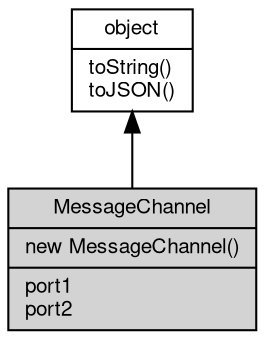

# 对象 MessageChannel
MessageChannel provides a pair of connected [MessagePort](MessagePort.md) objects

The MessageChannel constructor creates a new channel with two ports (port1 and port2).
Messages sent on one port are delivered to the other port, enabling bidirectional
communication.

```JavaScript
const mc = new MessageChannel();
mc.port1.postMessage('hello');
mc.port2.onmessage = (ev) => {
    console.log(ev.data); // 'hello'
};
```

## 继承关系


## 构造函数
        
### MessageChannel
**MessageChannel constructor. Creates a new channel with two connected ports.**

```JavaScript
new MessageChannel();
```

## 成员属性
        
### port1
**[MessagePort](MessagePort.md), The first port of the channel**

```JavaScript
readonly MessagePort MessageChannel.port1;
```

--------------------------
### port2
**[MessagePort](MessagePort.md), The second port of the channel**

```JavaScript
readonly MessagePort MessageChannel.port2;
```

## 成员函数
        
### toString
**返回对象的字符串表示，一般返回 "[Native Object]"，对象可以根据自己的特性重新实现**

```JavaScript
String MessageChannel.toString();
```

返回结果:
* String, 返回对象的字符串表示

--------------------------
### toJSON
**返回对象的 JSON 格式表示，一般返回对象定义的可读属性集合**

```JavaScript
Value MessageChannel.toJSON(String key = "");
```

调用参数:
* key: String, 未使用

返回结果:
* Value, 返回包含可 JSON 序列化的值

