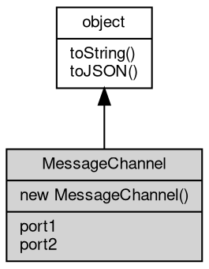

# Object MessageChannel
MessageChannel creates a connected pair of [MessagePort](MessagePort.md) objects

`new MessageChannel()` (the [global](../../module/ifs/global.md) class or `require('[worker_threads](../../module/ifs/worker_threads.md)').MessageChannel`) returns a
channel whose two ports are already linked: a value posted to `port1` is delivered to `port2` and
vice versa. Use it to decouple two parts of one program, or to build a message [path](../../module/ifs/path.md) step by step.

Concepts:

- **Pair semantics**: the constructor creates both endpoints at once; the ports are independent
  objects, and closing one severs the link without closing the other.
- **[Message](Message.md) passing**: the sender structured-clones the value and the receiver gets a [MessageEvent](MessageEvent.md)
  carrying it as `data`; delivery is asynchronous and ordered. An optional transfer list moves
  ArrayBuffers instead of copying them.
- **Lifetime**: a started port keeps the [process](../../module/ifs/process.md) alive while it can receive; close both ports (or
  `unref()` them) so the program can exit.

Example 1 — a round trip between the two ports:

```JavaScript
const {
    MessageChannel
} = require('worker_threads');

const channel = new MessageChannel();
channel.port2.onmessage = (ev) => {
    console.log(ev.data); // ping
    channel.port1.close();
    channel.port2.close();
};
channel.port1.postMessage('ping');
```

Example 2 — bidirectional exchange:

```JavaScript
const {
    MessageChannel
} = require('worker_threads');

const channel = new MessageChannel();
let count = 0;
const closeWhenDone = () => {
    if (++count < 2) return;
    channel.port1.close();
    channel.port2.close();
};
channel.port1.on('message', (ev) => {
    console.log('port1 got', ev.data); // port1 got from2
    closeWhenDone();
});
channel.port2.on('message', (ev) => {
    console.log('port2 got', ev.data); // port2 got from1
    closeWhenDone();
});
channel.port1.postMessage('from1');
channel.port2.postMessage('from2');
```

Example 3 — messages arrive in the order they were posted:

```JavaScript
const {
    MessageChannel
} = require('worker_threads');

const channel = new MessageChannel();
const received = [];
channel.port2.onmessage = (ev) => {
    received.push(ev.data);
    if (received.length < 3) return;
    console.log(JSON.stringify(received)); // [1,2,3]
    channel.port1.close();
    channel.port2.close();
};
channel.port1.postMessage(1);
channel.port1.postMessage(2);
channel.port1.postMessage(3);
```

## Inheritance

```dot
digraph {
    node [fontname="Helvetica,sans-Serif", fontsize=10, shape="record", style="filled", fillcolor="white"];

    object [tooltip="object", URL="object.md", label="{object|toString()\ltoJSON()\l}"];
    MessageChannel [tooltip="MessageChannel", fillcolor="lightgray", id="me", label="{MessageChannel|new MessageChannel()\l|port1\lport2\l}"];

    object -> MessageChannel [dir=back];
}
```

## Constructors
        
### MessageChannel
**MessageChannel constructor. Creates a new channel with two connected ports.**

```JavaScript
new MessageChannel();
```

The constructor takes no arguments and links the two ports immediately; there is no way to
create an unconnected [MessagePort](MessagePort.md). MDN and Node.js expose the same constructor.

## Properties
        
### port1
**[MessagePort](MessagePort.md), The first port of the channel**

```JavaScript
readonly MessagePort MessageChannel.port1;
```

The two ports are interchangeable except for the property name: a value posted to `port1` is
received by `port2` and vice versa. The property is read-only, but the port [object](object.md) itself
supports postMessage/start/close/ref/unref like any [MessagePort](MessagePort.md).

--------------------------
### port2
**[MessagePort](MessagePort.md), The second port of the channel**

```JavaScript
readonly MessagePort MessageChannel.port2;
```

The peer of `port1`; either port can send first, and both must be closed when the channel is
no longer needed so the [process](../../module/ifs/process.md) can exit.

## Methods
        
### toString
**Returns the string form of the [object](object.md)**

```JavaScript
String MessageChannel.toString();
```

Returns:
* String, returns the string form of the [object](object.md)

The base implementation reports an error: a native [object](object.md) has no implicit
text form, and only the classes whose value can be written as a string
override the member. [Buffer](Buffer.md) returns its content decoded with the given
[encoding](../../module/ifs/encoding.md), [HttpCookie](HttpCookie.md) returns "name=value", and so on; an override commonly
accepts optional arguments ([Buffer.toString](Buffer.md#toString) takes [encoding](../../module/ifs/encoding.md), start and
end) that are not part of this declaration.

Calling the member on a class that does not override it throws
"<Class>: the [object](object.md) can not be converted to string.", which is the
behavior to rely on when probing whether a value has a string form. See
toJSON for the serialization hook.

--------------------------
### toJSON
**Returns the JSON representation of the [object](object.md)**

```JavaScript
Value MessageChannel.toJSON(String key = "");
```

Parameters:
* key: String, the property name of the value being serialized

Returns:
* Value, returns the JSON-serializable value

JSON.stringify(value) calls value.toJSON(key) when the member exists and
serializes the returned value in its place; the key argument carries the
property name of the value inside its parent [object](object.md) (an empty string at
the top level) and may be used to build a keyed form. The base
implementation returns a plain [object](object.md) holding the readable properties of
the instance, so a native [object](object.md) serializes without per-class code; a
class with a portable shape such as [Buffer](Buffer.md) overrides it, and a JavaScript
class may override it in the same way.

The member is normally reached through JSON.stringify rather than called
directly; calling it returns the same value JSON.stringify would
serialize.

