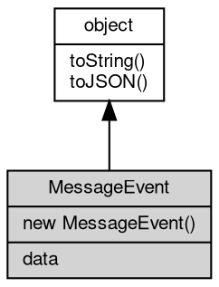

# 对象 MessageEvent
MessageEvent represents a message received by a target [object](object.md)

MessageEvent is used to represent messages received through [MessagePort](MessagePort.md)'s postMessage API.
It contains a `data` property with the message payload.

```JavaScript
const {
    port1,
    port2
} = new MessageChannel();
port2.onmessage = (ev) => {
    console.log(ev.data); // message payload
};
port1.postMessage('hello');
```

## 继承关系


## 构造函数
        
### MessageEvent
**MessageEvent constructor**

```JavaScript
new MessageEvent(String type,
    Object eventInitDict = {});
```

调用参数:
* type: String, The type of the event
* eventInitDict: Object, Optional event initialization dictionary containing data property

## 成员属性
        
### data
**Value, The data sent by the message emitter**

```JavaScript
readonly Value MessageEvent.data;
```

## 成员函数
        
### toString
**返回对象的字符串表示，一般返回 "[Native Object]"，对象可以根据自己的特性重新实现**

```JavaScript
String MessageEvent.toString();
```

返回结果:
* String, 返回对象的字符串表示

--------------------------
### toJSON
**返回对象的 JSON 格式表示，一般返回对象定义的可读属性集合**

```JavaScript
Value MessageEvent.toJSON(String key = "");
```

调用参数:
* key: String, 未使用

返回结果:
* Value, 返回包含可 JSON 序列化的值

