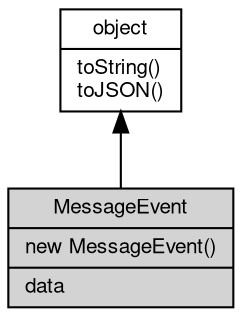

# Object MessageEvent
MessageEvent is the [object](object.md) a [MessagePort](MessagePort.md) delivers for a received message; the payload is available in its `data` property

Instances are produced by `MessageChannel` ports when they receive a message, and the constructor
`new MessageEvent('message', { data })` creates one directly for tests or synthetic events. fibjs
implements the subset of the MDN MessageEvent that [MessagePort](MessagePort.md) uses: `data` is exposed, while
`type`, `origin`, `lastEventId`, `source` and `ports` are not.

Concepts:

- **Payload only**: `data` holds the value produced by the sender's structured clone when the
  event comes from a port, or the value passed to the constructor as-is (no clone).
- **Not a DOM event**: fibjs has no DOM event dispatch; the [object](object.md) is a plain wrapper emitted by
  [MessagePort](MessagePort.md) listeners, and `instanceof MessageEvent` is the way to recognize it.
- **[Worker](Worker.md) parent ports do not use it**: they deliver the raw payload instead (see [MessagePort](MessagePort.md)).

Example 1 — create an event and read its payload:

```JavaScript
const event = new MessageEvent('message', {
    data: {
        id: 1
    }
});
console.log(event.data.id); // 1
```

Example 2 — receive a MessageEvent from a channel:

```JavaScript
const {
    MessageChannel
} = require('worker_threads');

const {
    port1,
    port2
} = new MessageChannel();
port2.onmessage = (ev) => {
    console.log(ev instanceof MessageEvent, ev.data); // true received
    port1.close();
    port2.close();
};
port1.postMessage('received');
```

Example 3 — listen with addEventListener and start:

```JavaScript
const {
    MessageChannel
} = require('worker_threads');

const {
    port1,
    port2
} = new MessageChannel();
port2.addEventListener('message', (ev) => {
    console.log(ev.data); // 99
    port1.close();
    port2.close();
});
port2.start();
port1.postMessage(99);
```

Notes:

- The constructor `type` argument is required; `new MessageEvent()` throws
  `TypeError [20002] Parameter not optional.` The type itself is not stored.
- Node.js and MDN additionally expose `ports` for transferred MessagePorts, which fibjs does not
  support, so a received message never has attached ports.

## Inheritance

```dot
digraph {
    node [fontname="Helvetica,sans-Serif", fontsize=10, shape="record", style="filled", fillcolor="white"];

    object [tooltip="object", URL="object.md", label="{object|toString()\ltoJSON()\l}"];
    MessageEvent [tooltip="MessageEvent", fillcolor="lightgray", id="me", label="{MessageEvent|new MessageEvent()\l|data\l}"];

    object -> MessageEvent [dir=back];
}
```

## Constructors
        
### MessageEvent
**MessageEvent constructor**

```JavaScript
new MessageEvent(String type,
    Object eventInitDict = {});
```

Parameters:
* type: String, The type of the event
* eventInitDict: Object, Optional event initialization dictionary containing data property

`type` is mandatory, but fibjs stores only `eventInitDict.data` (default `undefined`) and
exposes no `type` property, matching the [global](../../module/ifs/global.md) MessageEvent. The payload is kept by
reference, not cloned; structured cloning only happens when a value travels through a
[MessagePort](MessagePort.md). Node.js and MDN expose the full event properties and a `ports` list of
transferred MessagePorts, which fibjs does not support.

## Properties
        
### data
**Value, The data sent by the message emitter**

```JavaScript
readonly Value MessageEvent.data;
```

The value is whatever the sender posted (a structured clone) or whatever was passed as
`eventInitDict.data` when the event was constructed; it is `undefined` when no data was
provided. The property is read-only.

Example — construct an event and read the payload:

```JavaScript
const event = new MessageEvent('message', {
    data: {
        id: 1
    }
});
console.log(event.data.id); // 1
```

## Methods
        
### toString
**Returns the string form of the [object](object.md)**

```JavaScript
String MessageEvent.toString();
```

Returns:
* String, returns the string form of the [object](object.md)

The base implementation reports an error: a native [object](object.md) has no implicit
text form, and only the classes whose value can be written as a string
override the member. [Buffer](Buffer.md) returns its content decoded with the given
[encoding](../../module/ifs/encoding.md), [HttpCookie](HttpCookie.md) returns "name=value", and so on; an override commonly
accepts optional arguments ([Buffer.toString](Buffer.md#toString) takes [encoding](../../module/ifs/encoding.md), start and
end) that are not part of this declaration.

Calling the member on a class that does not override it throws
"<Class>: the [object](object.md) can not be converted to string.", which is the
behavior to rely on when probing whether a value has a string form. See
toJSON for the serialization hook.

--------------------------
### toJSON
**Returns the JSON representation of the [object](object.md)**

```JavaScript
Value MessageEvent.toJSON(String key = "");
```

Parameters:
* key: String, the property name of the value being serialized

Returns:
* Value, returns the JSON-serializable value

JSON.stringify(value) calls value.toJSON(key) when the member exists and
serializes the returned value in its place; the key argument carries the
property name of the value inside its parent [object](object.md) (an empty string at
the top level) and may be used to build a keyed form. The base
implementation returns a plain [object](object.md) holding the readable properties of
the instance, so a native [object](object.md) serializes without per-class code; a
class with a portable shape such as [Buffer](Buffer.md) overrides it, and a JavaScript
class may override it in the same way.

The member is normally reached through JSON.stringify rather than called
directly; calling it returns the same value JSON.stringify would
serialize.

