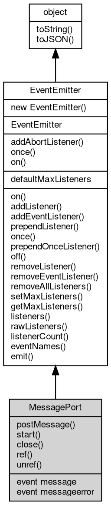

# Object MessagePort
MessagePort is one end of a message channel; a value posted to it is structured-cloned and delivered to the paired port

Ports come in connected pairs. Obtain one from `new [MessageChannel](MessageChannel.md)()` (the [global](../../module/ifs/global.md) class or
`require('[worker_threads](../../module/ifs/worker_threads.md)').[MessageChannel](MessageChannel.md)`), or inside a worker from
`require('[worker_threads](../../module/ifs/worker_threads.md)').parentPort`. A MessagePort cannot be constructed directly
(`new MessagePort()` throws `TypeError`), and fibjs does not support port transfer: a port cannot
be sent through workerData or carried in another port's transfer list.

Concepts:

- **Paired endpoints**: each port has at most one peer. `close()` severs the pair, and posting on
  a closed port, or to a peer that has closed, is a silent no-op; closing one port does not close
  the other.
- **[Message](Message.md) delivery**: delivery is asynchronous and ordered, and each listener runs in its own
  fiber. The sender structured-clones the value, so the two sides never share the [object](object.md).
- **Two delivery modes**: a port created by `new [MessageChannel](MessageChannel.md)()` delivers a [MessageEvent](MessageEvent.md) whose
  `data` holds the payload (`ev.data`); the `parentPort` of a [Worker](Worker.md) delivers the raw deserialized
  value because it is bound to the [Worker](Worker.md)'s `message` event.
- **Start and stop**: the port starts receiving when its first `message` listener is attached by
  any means (`on('message')`, `addEventListener('message')` or `onmessage`), and messages that
  arrived earlier are retained and delivered at that point. `start()` is therefore optional and
  idempotent in fibjs, where MDN requires an explicit start() after addEventListener.
- **[Event](Event.md)-loop keep-alive**: a started port that can still receive keeps the [process](../../module/ifs/process.md) alive until
  it is closed or `unref()` is called; an unstarted port never holds the [process](../../module/ifs/process.md).

Example 1 — receive through the onmessage property:

```JavaScript
const {
    MessageChannel
} = require('worker_threads');

const {
    port1,
    port2
} = new MessageChannel();
port2.onmessage = (ev) => {
    console.log(ev.data); // hello
    port1.close();
    port2.close();
};
port1.postMessage('hello');
```

Example 2 — listen with addEventListener and observe close:

```JavaScript
const {
    MessageChannel
} = require('worker_threads');

const {
    port1,
    port2
} = new MessageChannel();
port1.addEventListener('close', () => console.log('port1 closed'));
port2.addEventListener('message', (ev) => {
    console.log(ev.data); // 42
    port1.close();
    port2.close();
});
port2.start();
port1.postMessage(42);
```

Example 3 — a bidirectional exchange with a transferred ArrayBuffer:

```JavaScript
const {
    MessageChannel
} = require('worker_threads');

const {
    port1,
    port2
} = new MessageChannel();
port1.on('message', (ev) => {
    console.log('port1 got', ev.data); // port1 got ack
    port1.close();
    port2.close();
});
port2.onmessage = (ev) => {
    console.log('port2 got', ev.data.byteLength); // port2 got 8
    port2.postMessage('ack');
};
const buffer = new ArrayBuffer(8);
port1.postMessage(buffer, [buffer]);
console.log('sender buffer', buffer.byteLength); // sender buffer 0
```

Notes:

- Node.js and MDN allow a MessagePort to be transferred (as workerData or in the transfer list);
  fibjs ignores a port in a transfer list and throws `could not be cloned` for workerData, so ports
  cannot be exchanged. A [Worker](Worker.md) and its parent can only use the implicit `parentPort` channel.
- `messageerror` exists for API compatibility but is never emitted, because a value produced by
  the V8 serializer can always be deserialized again.

## Inheritance


## Static Methods
        
### addAbortListener
**Registers a one-shot abort handler on an [AbortSignal](AbortSignal.md)**

```JavaScript
static Object MessagePort.addAbortListener(EventEmitter signal,
    Function(Object ev) func);
```

Parameters:
* signal: [EventEmitter](EventEmitter.md), the [AbortSignal](AbortSignal.md) [object](object.md) to listen to
* func: Function(Object ev), the handler for the abort event

Returns:
* Object, returns a Disposable [object](object.md) containing a `[Symbol.dispose]` method

The handler is called at most once when the signal is aborted, and it is removed from the
signal afterwards. If the signal is already aborted the handler is invoked synchronously.
The returned [object](object.md) has a `[Symbol.dispose]()` method that removes the handler, so it can be
released before the abort happens.

Example — abort handling with automatic cleanup:

```JavaScript
const events = require('events');

const controller = new AbortController();
const disposable = events.addAbortListener(controller.signal,
    () => console.log('aborted'));

controller.abort(); // aborted
disposable[Symbol.dispose](); // safe to call after the listener fired
console.log(controller.signal.listenerCount('abort')); // 0
```

--------------------------
### once
**Creates a Promise resolved by the next occurrence of an event**

```JavaScript
static Object MessagePort.once(EventEmitter emitter,
    Value ev,
    Object options = {});
```

Parameters:
* emitter: [EventEmitter](EventEmitter.md), the event emitter [object](object.md) to listen to
* ev: Value, the event name to listen for
* options: Object, optional parameter [object](object.md)

Returns:
* Object, returns a Promise that resolves with the array of event parameters

The Promise resolves with the array of the emit arguments when the event fires; it rejects
when `error` is emitted while waiting, unless the waited event is `error` itself, or when
the signal option aborts. The temporary listeners are removed when the Promise settles.

options supports the following option:

```JavaScript
// fragment: options
({
    "signal": null // AbortSignal; aborting rejects the Promise with an AbortError
});
```

Example — awaiting the next occurrence of an event:

```JavaScript
const EventEmitter = require('events');

(async () => {
    const emitter = new EventEmitter();
    const waiting = EventEmitter.once(emitter, 'ready');

    emitter.emit('ready', 200, 'ok');
    console.log(JSON.stringify(await waiting)); // [200,"ok"]
})();
```

--------------------------
### on
**Creates an async iterator that yields event occurrences**

```JavaScript
static Object MessagePort.on(EventEmitter emitter,
    Value ev,
    Object options = {});
```

Parameters:
* emitter: [EventEmitter](EventEmitter.md), the event emitter [object](object.md) to listen to
* ev: Value, the event name to listen for
* options: Object, optional parameter [object](object.md)

Returns:
* Object, returns an AsyncIterator [object](object.md)

Each next() resolves with `{ value: [args...], done: false }` when the event fires and with
`{ done: true }` after an event named in the `close` option fires or the signal aborts; an
`error` event rejects the pending call. The listeners are registered when the iterator is
created and removed when the iteration ends or the signal aborts.

options supports the following options:

```JavaScript
// fragment: options
({
    "signal": null, // AbortSignal; aborting rejects pending and future next() calls
    "close": [] // event names; the first one to fire ends the iteration
});
```

Example — iterating the occurrences of an event:

```JavaScript
const EventEmitter = require('events');

(async () => {
    const emitter = new EventEmitter();
    const iterator = EventEmitter.on(emitter, 'data', {
        close: ['end']
    });

    emitter.emit('data', 1);
    emitter.emit('data', 2);
    emitter.emit('end');

    for await (const args of iterator)
    console.log(JSON.stringify(args)); // [1] then [2]
})();
```

## Static Properties
        
### defaultMaxListeners
**Integer, The [process](../../module/ifs/process.md)-wide default listener limit reported by getMaxListeners()**

```JavaScript
static Integer MessagePort.defaultMaxListeners;
```

Defaults to 10. Assigning a value changes getMaxListeners() for every emitter that never
called setMaxListeners(); an emitter with an explicit limit keeps it. The limit is
informational: fibjs never warns when the number of listeners exceeds it.

## Methods
        
### postMessage
**Sends a message to the paired port**

```JavaScript
MessagePort.postMessage(Value data);
```

Parameters:
* data: Value, The data to send. The data is cloned using structured clone algorithm.

The value is cloned with the structured clone algorithm, so the receiver gets an independent
copy; objects, arrays, Date, RegExp, Map, Set, Error, typed arrays and ArrayBuffer are
supported, while functions, native handles and SharedArrayBuffer are not and make the call
throw `Error: <value> could not be cloned.`. In the normal [MessageChannel](MessageChannel.md) mode the receiver is
called with a [MessageEvent](MessageEvent.md) carrying the value as `data`. Messages are delivered in order;
posting when this port or its peer is closed is a no-op.

--------------------------
**Sends a message and transfers the listed ArrayBuffers instead of copying them**

```JavaScript
MessagePort.postMessage(Value data,
    Array transfer);
```

Parameters:
* data: Value, The data to send
* transfer: Array, Array of transferable objects (e.g. ArrayBuffer) to transfer ownership

Each `ArrayBuffer` in `transfer` is detached on the sender before the message is queued (its
`byteLength` becomes 0) and the receiver gets the same memory. fibjs ignores non-ArrayBuffer
entries, including MessagePort, which Node.js and MDN allow to be transferred; passing a port
does not error and does not move it.

Example — detach an ArrayBuffer on send:

```JavaScript
const {
    MessageChannel
} = require('worker_threads');

const {
    port1,
    port2
} = new MessageChannel();
port2.onmessage = (ev) => {
    console.log(ev.data.byteLength); // 8
    port1.close();
    port2.close();
};
const buffer = new ArrayBuffer(8);
port1.postMessage(buffer, [buffer]);
console.log(buffer.byteLength); // 0
```

--------------------------
### start
**Starts dispatching messages to the listeners of this port**

```JavaScript
MessagePort.start();
```

Messages received before the call are retained and delivered after it; the call is idempotent
and a no-op on a closed port. In fibjs the first `message` listener (including one added with
`addEventListener`) starts the port automatically, so `start()` is optional; it exists for
code written against MDN, where addEventListener requires an explicit start() to [process](../../module/ifs/process.md) the
queued messages.

Example — start explicitly after addEventListener:

```JavaScript
const {
    MessageChannel
} = require('worker_threads');

const {
    port1,
    port2
} = new MessageChannel();
port2.addEventListener('message', (ev) => {
    console.log(ev.data); // hello
    port1.close();
    port2.close();
});
port2.start();
port1.postMessage('hello');
```

--------------------------
### close
**Closes the port and fires the 'close' event**

```JavaScript
MessagePort.close();
```

Closing severs the link with the peer: subsequent `postMessage` calls on either side are
silently ignored, while the peer itself stays open. Messages that were already queued and have
a delivery [path](../../module/ifs/path.md) are flushed before the port becomes unusable to new senders; otherwise the
queue is discarded. The call is idempotent and the `close` event is emitted once per port.

Example — closing stops delivery and fires `close` once:

```JavaScript
const {
    MessageChannel
} = require('worker_threads');

const {
    port1,
    port2
} = new MessageChannel();
port2.onmessage = (ev) => console.log('received', ev.data);
port1.on('close', () => console.log('port1 closed'));
port1.close();
port1.postMessage('dropped'); // ignored: the port is closed
port2.close();
console.log('done');
```

--------------------------
### ref
**Mark the port as active to keep the event loop alive**

```JavaScript
MessagePort.ref();
```

A started port that can still receive messages holds a keep-alive reference; `ref()` restores
that reference after an `unref()`. The call is idempotent and returns undefined. Ports that
were never started do not hold the [process](../../module/ifs/process.md) (matching Node.js), and the main-thread side of a
[Worker](Worker.md)'s parent port leaves the keep-alive to the [Worker](Worker.md) [object](object.md).

--------------------------
### unref
**Mark the port as inactive so it doesn't keep the event loop alive**

```JavaScript
MessagePort.unref();
```

After the call the port no longer keeps the fibjs [process](../../module/ifs/process.md) alive: a pending `beforeExit` can
run and the [process](../../module/ifs/process.md) may exit with queued messages undelivered. Receiving still works while the
[process](../../module/ifs/process.md) stays alive for other reasons. Idempotent, returns undefined; `ref()` restores the
reference.

--------------------------
### on
**Appends an event handler to the emitter**

```JavaScript
Object MessagePort.on(Value ev,
    Function(...args) func);
```

Parameters:
* ev: Value, the event name to bind
* func: Function(...args), the event handler function, called with the emit arguments

Returns:
* Object, returns the event [object](object.md) itself for chaining

The listener is called with the arguments of emit() and `this` set to the emitter; the
emitter itself is returned so registrations can be chained. The same function may be
registered several times for one event and each copy is called. See the class documentation
for the dispatch order.

--------------------------
**Appends several event handlers to the emitter**

```JavaScript
Object MessagePort.on(Object map);
```

Parameters:
* map: Object, the event mapping; [object](object.md) property names are used as event names

Returns:
* Object, returns the event [object](object.md) itself for chaining

Every enumerable property of the map whose value is a function is registered under its
property name. Properties are processed in order; a value that is not a function makes the
call fail with an invalid-type error while entries processed before it stay registered.

Example — registering several handlers at once:

```JavaScript
const EventEmitter = require('events');

const emitter = new EventEmitter();
emitter.on({
    connect: () => console.log('connect'),
    close: () => console.log('close')
});

emitter.emit('connect'); // connect
emitter.emit('close'); // close
```

--------------------------
### addListener
**Appends an event handler to the emitter**

```JavaScript
Object MessagePort.addListener(Value ev,
    Function(...args) func);
```

Parameters:
* ev: Value, the event name to bind
* func: Function(...args), the event handler function

Returns:
* Object, returns the event [object](object.md) itself for chaining

Alias of on(ev, func), provided for Node.js compatibility.

--------------------------
**Appends several event handlers to the emitter**

```JavaScript
Object MessagePort.addListener(Object map);
```

Parameters:
* map: Object, the event mapping; [object](object.md) property names are used as event names

Returns:
* Object, returns the event [object](object.md) itself for chaining

Alias of on(map), provided for Node.js compatibility.

--------------------------
### addEventListener
**Appends an event handler to the emitter with an options [object](object.md)**

```JavaScript
Object MessagePort.addEventListener(Value ev,
    Function(...args) func,
    Object options = {});
```

Parameters:
* ev: Value, the event name to bind
* func: Function(...args), the event handler function, called with the emit arguments
* options: Object, the options of the event handler

Returns:
* Object, returns the event [object](object.md) itself for chaining

Web-style alias of on(); the only supported option is `once`, which registers a one-shot
handler exactly like once(). The listener receives the plain emit arguments and not an [Event](Event.md)
[object](object.md); see the [DOMEvent](DOMEvent.md) class for the DOM-style event [object](object.md) used by [AbortSignal](AbortSignal.md) and
fetch-style APIs.

options supports the following option:

```JavaScript
// fragment: options
({
    "once": false // when true, the handler is removed before its single invocation
});
```

Example — a one-shot DOM-style registration:

```JavaScript
const EventEmitter = require('events');

const emitter = new EventEmitter();
emitter.addEventListener('ping', () => console.log('ping'), {
    once: true
});

emitter.emit('ping'); // ping
console.log(emitter.emit('ping')); // false
console.log(emitter.listenerCount('ping')); // 0
```

--------------------------
### prependListener
**Inserts an event handler at the front of the queue**

```JavaScript
Object MessagePort.prependListener(Value ev,
    Function(...args) func);
```

Parameters:
* ev: Value, the event name to bind
* func: Function(...args), the event handler function

Returns:
* Object, returns the event [object](object.md) itself for chaining

The listener is called before the listeners registered with on()/addListener() the next time
the event is emitted. When several prependListener() calls are made, the last one registered
is called first, because every call inserts at the same position.

Example — insertion at the front of the queue:

```JavaScript
const EventEmitter = require('events');

const emitter = new EventEmitter();
emitter.on('order', () => console.log('on'));
emitter.prependListener('order', () => console.log('prepend'));

emitter.emit('order'); // prepend, then on
```

--------------------------
**Inserts several event handlers at the front of the queue**

```JavaScript
Object MessagePort.prependListener(Object map);
```

Parameters:
* map: Object, the event mapping; [object](object.md) property names are used as event names

Returns:
* Object, returns the event [object](object.md) itself for chaining

Map form of prependListener(); every function property is inserted at the front, so the
properties of the map are called in reverse order.

--------------------------
### once
**Appends a one-shot event handler to the emitter**

```JavaScript
Object MessagePort.once(Value ev,
    Function(...args) func);
```

Parameters:
* ev: Value, the event name to bind
* func: Function(...args), the event handler function

Returns:
* Object, returns the event [object](object.md) itself for chaining

The handler is wrapped and removes itself from the queue before it is called, so it runs at
most once. off() removes it when passed the original function, listeners() returns the
original function, and rawListeners() returns the internal wrapper whose `_func` property
holds the original. See Example 2 in the class documentation.

--------------------------
**Appends several one-shot event handlers to the emitter**

```JavaScript
Object MessagePort.once(Object map);
```

Parameters:
* map: Object, the event mapping; [object](object.md) property names are used as event names

Returns:
* Object, returns the event [object](object.md) itself for chaining

Map form of once(); every function property is registered as a one-shot listener under its
property name.

--------------------------
### prependOnceListener
**Inserts a one-shot event handler at the front of the queue**

```JavaScript
Object MessagePort.prependOnceListener(Value ev,
    Function(...args) func);
```

Parameters:
* ev: Value, the event name to bind
* func: Function(...args), the event handler function

Returns:
* Object, returns the event [object](object.md) itself for chaining

Combines prependListener() and once(): the handler is called first and only once, and it is
removed before its invocation.

--------------------------
**Inserts several one-shot event handlers at the front of the queue**

```JavaScript
Object MessagePort.prependOnceListener(Object map);
```

Parameters:
* map: Object, the event mapping; [object](object.md) property names are used as event names

Returns:
* Object, returns the event [object](object.md) itself for chaining

Map form of prependOnceListener(); every function property is inserted as a one-shot
listener, and the properties of the map are called in reverse order.

--------------------------
### off
**Removes an event handler from the emitter**

```JavaScript
Object MessagePort.off(Value ev,
    Function(...args) func);
```

Parameters:
* ev: Value, the event name to unbind
* func: Function(...args), the event handler function

Returns:
* Object, returns the event [object](object.md) itself for chaining

The first matching listener is removed; when the same function was registered several times
only one copy is removed per call, so repeat the call to remove the others. A once() wrapper
is matched by its original function as well. Removing a listener emits the `removeListener`
meta event after the removal.

--------------------------
**Removes all event handlers of one event**

```JavaScript
Object MessagePort.off(Value ev);
```

Parameters:
* ev: Value, the event name to unbind

Returns:
* Object, returns the event [object](object.md) itself for chaining

Every listener of the event is removed and `removeListener` is emitted once per removed
listener. The call succeeds when the event has no listener.

Example — removing every listener of one event:

```JavaScript
const EventEmitter = require('events');

const emitter = new EventEmitter();
emitter.on('data', () => console.log('first'));
emitter.on('data', () => console.log('second'));

emitter.off('data');
console.log(emitter.emit('data')); // false
```

--------------------------
**Removes several event handlers from the emitter**

```JavaScript
Object MessagePort.off(Object map);
```

Parameters:
* map: Object, the event mapping; [object](object.md) property names are used as event names

Returns:
* Object, returns the event [object](object.md) itself for chaining

Every enumerable property of the map whose value is a function names an event from which
that function is removed (one copy per event). A value that is not a function makes the call
fail with an invalid-type error.

--------------------------
### removeListener
**Removes an event handler from the emitter**

```JavaScript
Object MessagePort.removeListener(Value ev,
    Function(...args) func);
```

Parameters:
* ev: Value, the event name to unbind
* func: Function(...args), the event handler function

Returns:
* Object, returns the event [object](object.md) itself for chaining

Alias of off(ev, func), provided for Node.js compatibility.

--------------------------
**Removes all event handlers of one event**

```JavaScript
Object MessagePort.removeListener(Value ev);
```

Parameters:
* ev: Value, the event name to unbind

Returns:
* Object, returns the event [object](object.md) itself for chaining

Alias of off(ev), provided for Node.js compatibility.

--------------------------
**Removes several event handlers from the emitter**

```JavaScript
Object MessagePort.removeListener(Object map);
```

Parameters:
* map: Object, the event mapping; [object](object.md) property names are used as event names

Returns:
* Object, returns the event [object](object.md) itself for chaining

Alias of off(map), provided for Node.js compatibility.

--------------------------
### removeEventListener
**Removes an event handler with an options [object](object.md)**

```JavaScript
Object MessagePort.removeEventListener(Value ev,
    Function(...args) func,
    Object options = {});
```

Parameters:
* ev: Value, the event name to unbind
* func: Function(...args), the event handler function
* options: Object, the options of the event handler, ignored

Returns:
* Object, returns the event [object](object.md) itself for chaining

Web-style alias of off(ev, func); the options [object](object.md) is accepted and ignored, and a once()
wrapper is matched by its original function like off().

--------------------------
### removeAllListeners
**Removes all listeners of one event**

```JavaScript
Object MessagePort.removeAllListeners(Value ev);
```

Parameters:
* ev: Value, the event name to remove

Returns:
* Object, returns the event [object](object.md) itself for chaining

Equivalent to off(ev): every listener of the event is removed, including once() wrappers
matched by their original function, and `removeListener` is emitted once per removal.

--------------------------
**Removes all listeners of the given events, or of the whole emitter**

```JavaScript
Object MessagePort.removeAllListeners(Array evs = []);
```

Parameters:
* evs: Array, the event names to remove

Returns:
* Object, returns the event [object](object.md) itself for chaining

An empty array — including the no-argument call, because the parameter defaults to [] —
clears every string-keyed event; symbol-keyed listeners are left in place, unlike Node.js
which removes them too. A non-empty array clears each named event as
removeAllListeners(ev) does.

Example — clearing selected events and the whole emitter:

```JavaScript
const EventEmitter = require('events');

const emitter = new EventEmitter();
emitter.on('a', () => {});
emitter.on('b', () => {});
emitter.on('c', () => {});

emitter.removeAllListeners(['a', 'b']);
console.log(emitter.listenerCount('a'), emitter.listenerCount('c')); // 0 1

emitter.removeAllListeners();
console.log(emitter.eventNames().length); // 0
```

--------------------------
### setMaxListeners
**Stores a per-emitter listener limit**

```JavaScript
MessagePort.setMaxListeners(Integer n);
```

Parameters:
* n: Integer, the number of events

The value is reported by getMaxListeners() and is otherwise informational: fibjs never warns
when the number of listeners exceeds it. This member exists for Node.js compatibility. A
negative value throws; 0 is accepted and stored as-is, while Node.js treats 0 as unlimited.

--------------------------
### getMaxListeners
**Returns the listener limit of the emitter**

```JavaScript
Integer MessagePort.getMaxListeners();
```

Returns:
* Integer, returns the default limit

Returns the value set by setMaxListeners(), or the [process](../../module/ifs/process.md)-wide defaultMaxListeners (10)
when no explicit value was set.

--------------------------
### listeners
**Returns a copy of the listener array of an event**

```JavaScript
Array MessagePort.listeners(Value ev);
```

Parameters:
* ev: Value, the event name to query

Returns:
* Array, returns the listener array of the specified event

One-shot wrappers are unwrapped, so the result contains the functions passed to
on()/once() and can be passed to off(); an unknown event produces an empty array.

Example — once() listeners are returned unwrapped:

```JavaScript
const EventEmitter = require('events');

const emitter = new EventEmitter();

function onTick() {
    console.log('tick');
}

emitter.once('tick', onTick);
console.log(emitter.listeners('tick')[0] === onTick); // true
console.log(emitter.rawListeners('tick')[0] === onTick); // false
```

--------------------------
### rawListeners
**Returns the internal listener array of an event**

```JavaScript
Array MessagePort.rawListeners(Value ev);
```

Parameters:
* ev: Value, the event name to query

Returns:
* Array, returns the listener array of the specified event

The array is not unwrapped: a listener registered with once() appears as the internal
wrapper function whose `_func` property holds the original function. An unknown event
produces an empty array.

--------------------------
### listenerCount
**Returns the number of listeners of an event**

```JavaScript
Integer MessagePort.listenerCount(Value ev);
```

Parameters:
* ev: Value, the event name to query

Returns:
* Integer, returns the number of listeners of the specified event

One-shot listeners count as one and an unknown event returns 0.

--------------------------
**Returns the number of listeners of an event on another [object](object.md)**

```JavaScript
Integer MessagePort.listenerCount(Value o,
    Value ev);
```

Parameters:
* o: Value, the [object](object.md) to query
* ev: Value, the event name to query

Returns:
* Integer, returns the number of listeners of the specified event

Counts without requiring the target to be an [EventEmitter](EventEmitter.md): any [object](object.md) with registered
events can be queried. The call is normally written as
`EventEmitter.listenerCount(target, 'data')`.

Example — counting the listeners of another [object](object.md):

```JavaScript
const EventEmitter = require('events');

const emitter = new EventEmitter();
emitter.on('data', () => {});
emitter.on('data', () => {});

console.log(EventEmitter.listenerCount(emitter, 'data')); // 2
```

--------------------------
### eventNames
**Returns the names of the events with at least one listener**

```JavaScript
Array MessagePort.eventNames();
```

Returns:
* Array, returns the array of event names

Only string-keyed events are reported; symbol-keyed events are omitted and numeric event
names are returned as numbers (Node.js also reports symbol events).

--------------------------
### emit
**Emits an event and returns whether a listener was called**

```JavaScript
Boolean MessagePort.emit(Value ev,
    ...args);
```

Parameters:
* ev: Value, event name
* args: ..., event parameters, which are passed to the event handler

Returns:
* Boolean, returns whether the event had a listener to respond to it

Listeners are called as described by the dispatch model in the class documentation: the
first one runs synchronously on the current fiber, the remaining ones run in parallel
fibers, and the call returns after all of them finish; an exception raised by a listener is
thrown back to the caller. Emitting `error` with no listener throws instead of returning
false: an Error argument is thrown as-is and any other value is wrapped in
`Error("Unhandled error. (...)")`. [Event](Event.md) names are strings or symbols; `emit()` does not
match a listener registered with a numeric name.

--------------------------
### toString
**Returns the string form of the [object](object.md)**

```JavaScript
String MessagePort.toString();
```

Returns:
* String, returns the string form of the [object](object.md)

The base implementation reports an error: a native [object](object.md) has no implicit
text form, and only the classes whose value can be written as a string
override the member. [Buffer](Buffer.md) returns its content decoded with the given
[encoding](../../module/ifs/encoding.md), [HttpCookie](HttpCookie.md) returns "name=value", and so on; an override commonly
accepts optional arguments ([Buffer.toString](Buffer.md#toString) takes [encoding](../../module/ifs/encoding.md), start and
end) that are not part of this declaration.

Calling the member on a class that does not override it throws
"<Class>: the [object](object.md) can not be converted to string.", which is the
behavior to rely on when probing whether a value has a string form. See
toJSON for the serialization hook.

--------------------------
### toJSON
**Returns the JSON representation of the [object](object.md)**

```JavaScript
Value MessagePort.toJSON(String key = "");
```

Parameters:
* key: String, the property name of the value being serialized

Returns:
* Value, returns the JSON-serializable value

JSON.stringify(value) calls value.toJSON(key) when the member exists and
serializes the returned value in its place; the key argument carries the
property name of the value inside its parent [object](object.md) (an empty string at
the top level) and may be used to build a keyed form. The base
implementation returns a plain [object](object.md) holding the readable properties of
the instance, so a native [object](object.md) serializes without per-class code; a
class with a portable shape such as [Buffer](Buffer.md) overrides it, and a JavaScript
class may override it in the same way.

The member is normally reached through JSON.stringify rather than called
directly; calling it returns the same value JSON.stringify would
serialize.

## Events
        
### message
**Queries and binds the message reception event, equivalent to on("message", func); start() is called automatically once it is set.**

```JavaScript
event MessagePort.message(Value data);
```

Parameters:
* data: Value, the received message: the deserialized value in raw message mode, a [MessageEvent](MessageEvent.md) otherwise

The payload depends on the mode of the port: a [MessageChannel](MessageChannel.md) port emits a [MessageEvent](MessageEvent.md) whose
`data` is the deserialized value, while a [Worker](Worker.md)'s parent port emits the raw value. Attaching
the first `message` listener by any means starts the port and flushes the messages that were
queued before it.

--------------------------
### messageerror
**Queries and binds the message deserialization error event, equivalent to on("messageerror", func);**

```JavaScript
event MessagePort.messageerror();
```

Declared for API compatibility and never emitted in normal use: fibjs serializes with V8's
serializer, whose output can always be deserialized again. Listening for it is harmless.

