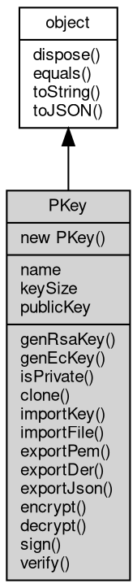

# 对象 PKey
不对称加密算法对象

PKey 对象属于 [crypto](../../module/ifs/crypto.md) 模块，创建：

```JavaScript
var k = new crypto.PKey();
```

## 继承关系


## 构造函数
        
### PKey
**PKey 构造函数**

```JavaScript
new PKey();
```

## 成员属性
        
### name
**String, 返回当前算法名称**

```JavaScript
readonly String PKey.name;
```

--------------------------
### keySize
**Integer, 返回当前算法密码长度，以位为单位**

```JavaScript
readonly Integer PKey.keySize;
```

--------------------------
### publicKey
**PKey, 返回当前密钥的公钥**

```JavaScript
readonly PKey PKey.publicKey;
```

返回结果:
* 当前密钥的公钥

## 成员函数
        
### genRsaKey
**生成一个 RSA 私钥**

```JavaScript
PKey.genRsaKey(Integer size) async;
```

调用参数:
* size: Integer, 指定 RSA 密钥长度，bit 为单位

--------------------------
### genEcKey
**生成一个 EC 私钥**

```JavaScript
PKey.genEcKey(String curve = "secp521r1") async;
```

调用参数:
* curve: String, 指定预置椭圆曲线，可选值为："secp521r1", "brainpoolP512r1", "secp384r1", "brainpoolP384r1", "secp256r1", "secp256k1", "brainpoolP256r1", "secp224r1", "secp224k1", "secp192r1", "secp192k1"

--------------------------
### isPrivate
**查询当前密钥是否为私钥**

```JavaScript
Boolean PKey.isPrivate();
```

返回结果:
* Boolean, 为 True 表示为私钥

--------------------------
### clone
**复制当前密钥**

```JavaScript
PKey PKey.clone();
```

返回结果:
* PKey, 当前密钥的复制对象

--------------------------
### importKey
**加载一个 DER 格式的密钥**

```JavaScript
PKey.importKey(Buffer DerKey,
    String password = "");
```

调用参数:
* DerKey: [Buffer](Buffer.md), DER 格式的密钥
* password: String, 解密密码

--------------------------
**加载一个 PEM 格式的密钥**

```JavaScript
PKey.importKey(String pemKey,
    String password = "");
```

调用参数:
* pemKey: String, PEM 格式的密钥
* password: String, 解密密码

--------------------------
**加载一个 JSON 格式的密钥**

```JavaScript
PKey.importKey(Object jsonKey);
```

调用参数:
* jsonKey: Object, JSON 格式的密钥

jsonKey 的格式支持以下四种，RSA 私钥：

```JavaScript
{
    "kty": "RSA",
    "n": "0m5lvKpWqy9JS7tV2HIPqHCYHLquSuxIC3F8strIQLJKO3rZmTT96KTnhsOfBO7Y1bI7mnT0PB3_vcHd9ekWMEoZJQw7MuB8KeM_Wn54-elJr5DNLk5bMppSGxX7ZnumiXGG51_X3Yp-_EbGtDG80GxXXix7Mucyo7K25uE0uW8=",
    "e": "AQAB",
    "d": "agN2O9NxMHL1MTMi75WfL9Pxvl-KWXKqZSF6mjzAsF9iKI8euyHIXYFepzU8kual1RsjDhCnzvWqFvZplW8lXqrHf_P-rS_9Y4gBUw6pjnI_DnFIRwWHRvrUHHSCfWOdTCIKdOTkgLZuGFuhEY3RMIW0WSYejjLtftwy0RVxAzk=",
    "p": "6a4G1qmfwWmn1biigN7IVFlkbLf9oVe6g7rOmHxI-hn1GRxKDSVuAUrmR1IhuAnca9M0y7SD-7TUs6wjOxWxaw==",
    "q": "5ofkxFKdPBD0CQHMb9q13AMHUVe0rJ-hSjqqIBrmqApUOneyAcMV76M0QyIQnI2p3POa4Qu_7XChDwRVl7LlDQ==",
    "dp": "2mXGiGwCHl8j-FBWuID-1C6z-BRB3MBEVoeKPOOzxOPruatB3mWEGXsqG7A8SWgV9URxTI2K6P3J6Z7RUpBkvw==",
    "dq": "oagn5vfb5NQqnOpS9xkSsD67cfIj821ZSFlNFYhnuOzNVda7z_qCtnHm4zDPH0lEFXoKYMfBhfqWJpaugttjPQ==",
    "qi": "dqEQgxNmOVFrF4s776hTqeC6oEDila8EvpVb2F2ZvwAOLjCQ66OiAZK1BiYGHqUy0NeqNmtlsLSuBEZQZvqZwg=="
}
```

RSA 公钥：

```JavaScript
{
    "kty": "RSA",
    "n": "0m5lvKpWqy9JS7tV2HIPqHCYHLquSuxIC3F8strIQLJKO3rZmTT96KTnhsOfBO7Y1bI7mnT0PB3_vcHd9ekWMEoZJQw7MuB8KeM_Wn54-elJr5DNLk5bMppSGxX7ZnumiXGG51_X3Yp-_EbGtDG80GxXXix7Mucyo7K25uE0uW8=",
    "e": "AQAB"
}
```

EC 私钥：

```JavaScript
{
    "kty": "EC",
    "crv": "P-521",
    "x": "ATfNNFuuvlGxrTGoXgyfSAGgRNNDnO3rN3k74urKJdVS14RYhdnSwm91Bm-F1l-T1XKlAY2yRnzG9w1Ukvo8c0wL",
    "y": "ASBHqrruB6kdkEUB3vlW3-UIkk4HtKdUeTwN-7m3j2rgZvYR1ffRAapDvWqKGiBjomqWafxokBkbDI0c95f6f4XU",
    "d": "AfkIbUHXfW41njdpoKuqqKludcoLJS8D_oMEwkj-GVaXFNKccIoF5iKGu2c69kNDjo83R_7wyGlfRczsklkik1ST"
}
```

EC 公钥：

```JavaScript
{
    "kty": "EC",
    "crv": "P-521",
    "x": "ATfNNFuuvlGxrTGoXgyfSAGgRNNDnO3rN3k74urKJdVS14RYhdnSwm91Bm-F1l-T1XKlAY2yRnzG9w1Ukvo8c0wL",
    "y": "ASBHqrruB6kdkEUB3vlW3-UIkk4HtKdUeTwN-7m3j2rgZvYR1ffRAapDvWqKGiBjomqWafxokBkbDI0c95f6f4XU"
}
```

--------------------------
### importFile
**加载一个 PEM/DER 格式的密钥文件**

```JavaScript
PKey.importFile(String filename,
    String password = "");
```

调用参数:
* filename: String, 密钥文件名
* password: String, 解密密码

--------------------------
### exportPem
**返回当前 key 的 PEM 格式编码**

```JavaScript
String PKey.exportPem();
```

返回结果:
* String, 当前 key 的 PEM 格式编码

--------------------------
### exportDer
**返回当前 key 的 DER 格式编码**

```JavaScript
Buffer PKey.exportDer();
```

返回结果:
* [Buffer](Buffer.md), 当前 key 的 DER 格式编码

--------------------------
### exportJson
**返回当前 key 的 DER 格式编码**

```JavaScript
Object PKey.exportJson();
```

返回结果:
* Object, 当前 key 的 DER 格式编码

--------------------------
### encrypt
**使用当前算法密码公钥加密数据**

```JavaScript
Buffer PKey.encrypt(Buffer data) async;
```

调用参数:
* data: [Buffer](Buffer.md), 指定要加密的数据

返回结果:
* [Buffer](Buffer.md), 返回加密后的数据

--------------------------
### decrypt
**使用当前算法密码私钥解密数据**

```JavaScript
Buffer PKey.decrypt(Buffer data) async;
```

调用参数:
* data: [Buffer](Buffer.md), 指定要解密的数据

返回结果:
* [Buffer](Buffer.md), 返回解密后的数据

--------------------------
### sign
**使用当前算法密码私钥签名数据**

```JavaScript
Buffer PKey.sign(Buffer data,
    Integer alg = 0) async;
```

调用参数:
* data: [Buffer](Buffer.md), 指定要签名的数据
* alg: Integer, 指定要签名的算法, 默认0. 支持算法: 0=NONE,1=MD2,2=MD4,3=MD5,4=SHA1,5=SHA224,6=SHA256,7=SHA384,8=SHA512,9=RIPEMD160

返回结果:
* [Buffer](Buffer.md), 返回签名后的数据

--------------------------
### verify
**使用当前算法密码公钥验证数据**

```JavaScript
Boolean PKey.verify(Buffer data,
    Buffer sign,
    Integer alg = 0) async;
```

调用参数:
* data: [Buffer](Buffer.md), 指定要验证的数据
* sign: [Buffer](Buffer.md), 指定要验证的签名
* alg: Integer, 指定要签名的算法, 默认0. 支持算法: 0=NONE,1=MD2,2=MD4,3=MD5,4=SHA1,5=SHA224,6=SHA256,7=SHA384,8=SHA512,9=RIPEMD160

返回结果:
* Boolean, 返回验证后的结果

--------------------------
### dispose
**强制回收对象，调用此方法后，对象资源将立即释放**

```JavaScript
PKey.dispose();
```

--------------------------
### equals
**比较当前对象与给定的对象是否相等**

```JavaScript
Boolean PKey.equals(object expected);
```

调用参数:
* expected: [object](object.md), 制定比较的目标对象

返回结果:
* Boolean, 返回对象比较的结果

--------------------------
### toString
**返回对象的字符串表示，一般返回 "[Native Object]"，对象可以根据自己的特性重新实现**

```JavaScript
String PKey.toString();
```

返回结果:
* String, 返回对象的字符串表示

--------------------------
### toJSON
**返回对象的 JSON 格式表示，一般返回对象定义的可读属性集合**

```JavaScript
Value PKey.toJSON(String key = "");
```

调用参数:
* key: String, 未使用

返回结果:
* Value, 返回包含可 JSON 序列化的值

