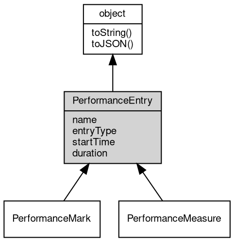

# 对象 PerformanceEntry
PerformanceEntry 接口提供了 [performance](../../module/ifs/performance.md) 记录的通用属性

## 继承关系


## 成员属性
        
### name
**String, [performance](../../module/ifs/performance.md) 记录的名称.**

```JavaScript
readonly String PerformanceEntry.name;
```

--------------------------
### entryType
**String, [performance](../../module/ifs/performance.md) 记录的类型.**

```JavaScript
readonly String PerformanceEntry.entryType;
```

--------------------------
### startTime
**Number, [performance](../../module/ifs/performance.md) 记录的开始时间.**

```JavaScript
readonly Number PerformanceEntry.startTime;
```

--------------------------
### duration
**Number, [performance](../../module/ifs/performance.md) 记录的持续时间.**

```JavaScript
readonly Number PerformanceEntry.duration;
```

## 成员函数
        
### toString
**返回对象的字符串表示，一般返回 "[Native Object]"，对象可以根据自己的特性重新实现**

```JavaScript
String PerformanceEntry.toString();
```

返回结果:
* String, 返回对象的字符串表示

--------------------------
### toJSON
**返回对象的 JSON 格式表示，一般返回对象定义的可读属性集合**

```JavaScript
Value PerformanceEntry.toJSON(String key = "");
```

调用参数:
* key: String, 未使用

返回结果:
* Value, 返回包含可 JSON 序列化的值

