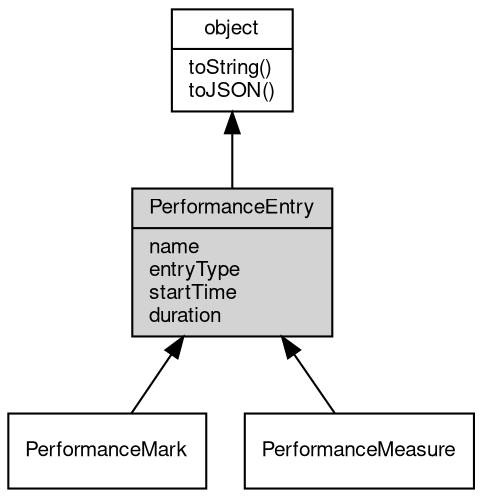

# Object PerformanceEntry
The base class of a timeline record, describing one mark or measure

PerformanceEntry is the common shape of every timeline record and corresponds to the MDN
PerformanceEntry interface. It is never constructed directly; the concrete instances are
[PerformanceMark](PerformanceMark.md) (`entryType` `mark`) and [PerformanceMeasure](PerformanceMeasure.md) (`entryType` `measure`), and both
add a `detail` property.

Concepts:

- **Timeline model**: an entry pairs a `name` with a `startTime` on the same monotonic clock as
  [performance.now](../../module/ifs/performance.md#now)(), plus a `duration`. Marks always have duration 0; measures have
  endTime - startTime, which may be negative.
- **entryType**: the kind of record; only `mark` and `measure` exist in fibjs.
- **detail**: the payload attached when the mark or measure was created; the base
  PerformanceEntry does not declare it, see [PerformanceMark](PerformanceMark.md) and [PerformanceMeasure](PerformanceMeasure.md).
- **Lifetime**: mark entries are retained by name in the timeline and can be queried repeatedly;
  measure entries are transient and reachable only from a [PerformanceObserver](PerformanceObserver.md) delivery. All
  properties are read-only.

Obtained from:
- `performance.getEntries()`, `performance.getEntriesByType('mark')` and
  `performance.getEntriesByName(name)` — the retained marks;
- `observer.takeRecords()` — the records queued for an observer (marks and measures);
- the [PerformanceObserverEntryList](PerformanceObserverEntryList.md) passed to an observer callback, whose `getEntries`,
  `getEntriesByName` and `getEntriesByType` return PerformanceEntry arrays.

Example 1 — read the fields of a mark:

```JavaScript
const {
    performance
} = require('perf_hooks');

performance.clearMarks();
performance.mark('db-query', {
    startTime: 12
});

const entry = performance.getEntriesByName('db-query')[0];
console.log(entry.name, entry.entryType, entry.startTime, entry.duration); // db-query mark 12 0
```

Example 2 — marks and measures share the same shape:

```JavaScript
const {
    performance,
    PerformanceObserver
} = require('perf_hooks');

performance.clearMarks();
performance.mark('p1');
performance.mark('p2');
const observer = new PerformanceObserver(() => {});
observer.observe({
    entryTypes: ['measure']
});
performance.measure('p1-p2', 'p1', 'p2');

const record = observer.takeRecords()[0];
console.log(record.name, record.entryType, record.startTime >= 0, record.duration >= 0);
// p1-p2 measure true true
observer.disconnect();
```

## Inheritance

```dot
digraph {
    node [fontname="Helvetica,sans-Serif", fontsize=10, shape="record", style="filled", fillcolor="white"];

    object [tooltip="object", URL="object.md", label="{object|toString()\ltoJSON()\l}"];
    PerformanceEntry [tooltip="PerformanceEntry", fillcolor="lightgray", id="me", label="{PerformanceEntry|name\lentryType\lstartTime\lduration\l}"];
    PerformanceMark [tooltip="PerformanceMark", URL="PerformanceMark.md", label="{PerformanceMark}"];
    PerformanceMeasure [tooltip="PerformanceMeasure", URL="PerformanceMeasure.md", label="{PerformanceMeasure}"];

    object -> PerformanceEntry [dir=back];
    PerformanceEntry -> PerformanceMark [dir=back];
    PerformanceEntry -> PerformanceMeasure [dir=back];
}
```

## Properties
        
### name
**String, The name of the entry**

```JavaScript
readonly String PerformanceEntry.name;
```

The mark or measure name passed to [performance.mark](../../module/ifs/performance.md#mark)/[performance.measure](../../module/ifs/performance.md#measure). Mark names are
unique in the timeline (a repeated name replaces the previous mark), while measure names can
be reused; the name is never empty and is not prefixed by the entry type.

--------------------------
### entryType
**String, The type of the entry**

```JavaScript
readonly String PerformanceEntry.entryType;
```

The kind of timeline record: `mark` for a [PerformanceMark](PerformanceMark.md) and `measure` for a
[PerformanceMeasure](PerformanceMeasure.md). Node.js offers further [types](../../module/ifs/types.md) such as `resource`, `function` and `gc`;
fibjs produces only these two.

--------------------------
### startTime
**Number, The start time of the entry, in milliseconds on the monotonic [performance.now](../../module/ifs/performance.md#now)() clock**

```JavaScript
readonly Number PerformanceEntry.startTime;
```

For a mark it is the time recorded by [performance.mark](../../module/ifs/performance.md#mark) (the `startTime` option when given,
otherwise the current clock reading); for a measure it is the resolved start of the interval,
which is 0 when no start was supplied. The value is not related to wall-clock time.

--------------------------
### duration
**Number, The duration of the entry, in milliseconds**

```JavaScript
readonly Number PerformanceEntry.duration;
```

Always 0 for a mark. For a measure it is end - start, computed from marks, explicit numbers or
the `duration` option, and it can be negative when the end lies before the start; fibjs does
not reject such a measure.

## Methods
        
### toString
**Returns the string form of the [object](object.md)**

```JavaScript
String PerformanceEntry.toString();
```

Returns:
* String, returns the string form of the [object](object.md)

The base implementation reports an error: a native [object](object.md) has no implicit
text form, and only the classes whose value can be written as a string
override the member. [Buffer](Buffer.md) returns its content decoded with the given
[encoding](../../module/ifs/encoding.md), [HttpCookie](HttpCookie.md) returns "name=value", and so on; an override commonly
accepts optional arguments ([Buffer.toString](Buffer.md#toString) takes [encoding](../../module/ifs/encoding.md), start and
end) that are not part of this declaration.

Calling the member on a class that does not override it throws
"<Class>: the [object](object.md) can not be converted to string.", which is the
behavior to rely on when probing whether a value has a string form. See
toJSON for the serialization hook.

--------------------------
### toJSON
**Returns the JSON representation of the [object](object.md)**

```JavaScript
Value PerformanceEntry.toJSON(String key = "");
```

Parameters:
* key: String, the property name of the value being serialized

Returns:
* Value, returns the JSON-serializable value

JSON.stringify(value) calls value.toJSON(key) when the member exists and
serializes the returned value in its place; the key argument carries the
property name of the value inside its parent [object](object.md) (an empty string at
the top level) and may be used to build a keyed form. The base
implementation returns a plain [object](object.md) holding the readable properties of
the instance, so a native [object](object.md) serializes without per-class code; a
class with a portable shape such as [Buffer](Buffer.md) overrides it, and a JavaScript
class may override it in the same way.

The member is normally reached through JSON.stringify rather than called
directly; calling it returns the same value JSON.stringify would
serialize.

