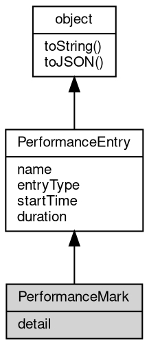

# Object PerformanceMark
A mark recorded in the [performance](../../module/ifs/performance.md) timeline: a named timestamp with an optional detail

PerformanceMark is the concrete [PerformanceEntry](PerformanceEntry.md) subtype with `entryType` `mark` and corresponds
to the MDN PerformanceMark interface. Marks are created with [performance.mark](../../module/ifs/performance.md#mark), always have
duration 0 and are retained in the timeline, one entry per name: marking a name again replaces the
previous mark. They are the only entries returned by the [performance](../../module/ifs/performance.md) getEntries family.

Concepts:

- **startTime**: the recorded timestamp in milliseconds on the monotonic clock returned by
  [performance.now](../../module/ifs/performance.md#now)(); it can be overridden with the `startTime` option of [performance.mark](../../module/ifs/performance.md#mark).
- **detail**: an arbitrary value attached at creation; it is `undefined` when the mark was created
  without one (Node.js uses `null`).

Obtained from:
- `performance.getEntries()`, `performance.getEntriesByType('mark')` and
  `performance.getEntriesByName(name)` — the retained marks;
- `observer.takeRecords()` and the [PerformanceObserverEntryList](PerformanceObserverEntryList.md) of a `mark` observer — the same
  objects;
- PerformanceMark is not constructible from JavaScript and has no exported class [object](object.md).

Example 1 — mark with a detail and a custom offset:

```JavaScript
const {
    performance
} = require('perf_hooks');

performance.clearMarks();
performance.mark('cache', {
    startTime: 7.5,
    detail: 'warm'
});

const mark = performance.getEntriesByName('cache')[0];
console.log(mark.entryType, mark.startTime, mark.duration, mark.detail); // mark 7.5 0 warm
```

Example 2 — a mark delivered to an observer:

```JavaScript
const {
    performance,
    PerformanceObserver
} = require('perf_hooks');

performance.clearMarks();
const observer = new PerformanceObserver(() => {});
observer.observe({
    type: 'mark'
});
performance.mark('observed', {
    detail: {
        id: 1
    }
});

const mark = observer.takeRecords()[0];
console.log(mark.name, mark.detail.id); // observed 1
observer.disconnect();
```

## Inheritance

```dot
digraph {
    node [fontname="Helvetica,sans-Serif", fontsize=10, shape="record", style="filled", fillcolor="white"];

    object [tooltip="object", URL="object.md", label="{object|toString()\ltoJSON()\l}"];
    PerformanceEntry [tooltip="PerformanceEntry", URL="PerformanceEntry.md", label="{PerformanceEntry|name\lentryType\lstartTime\lduration\l}"];
    PerformanceMark [tooltip="PerformanceMark", fillcolor="lightgray", id="me", label="{PerformanceMark|detail\l}"];

    object -> PerformanceEntry [dir=back];
    PerformanceEntry -> PerformanceMark [dir=back];
}
```

## Properties
        
### detail
**Value, The detail value attached when the mark was created**

```JavaScript
readonly Value PerformanceMark.detail;
```

Holds whatever was passed as `detail` to [performance.mark](../../module/ifs/performance.md#mark): any type can be used, including
objects and functions, and the value is returned by reference rather than copied. When the
option was omitted the property is `undefined` (Node.js uses `null`).

--------------------------
### name
**String, The name of the entry**

```JavaScript
readonly String PerformanceMark.name;
```

The mark or measure name passed to [performance.mark](../../module/ifs/performance.md#mark)/[performance.measure](../../module/ifs/performance.md#measure). Mark names are
unique in the timeline (a repeated name replaces the previous mark), while measure names can
be reused; the name is never empty and is not prefixed by the entry type.

--------------------------
### entryType
**String, The type of the entry**

```JavaScript
readonly String PerformanceMark.entryType;
```

The kind of timeline record: `mark` for a PerformanceMark and `measure` for a
[PerformanceMeasure](PerformanceMeasure.md). Node.js offers further [types](../../module/ifs/types.md) such as `resource`, `function` and `gc`;
fibjs produces only these two.

--------------------------
### startTime
**Number, The start time of the entry, in milliseconds on the monotonic [performance.now](../../module/ifs/performance.md#now)() clock**

```JavaScript
readonly Number PerformanceMark.startTime;
```

For a mark it is the time recorded by [performance.mark](../../module/ifs/performance.md#mark) (the `startTime` option when given,
otherwise the current clock reading); for a measure it is the resolved start of the interval,
which is 0 when no start was supplied. The value is not related to wall-clock time.

--------------------------
### duration
**Number, The duration of the entry, in milliseconds**

```JavaScript
readonly Number PerformanceMark.duration;
```

Always 0 for a mark. For a measure it is end - start, computed from marks, explicit numbers or
the `duration` option, and it can be negative when the end lies before the start; fibjs does
not reject such a measure.

## Methods
        
### toString
**Returns the string form of the [object](object.md)**

```JavaScript
String PerformanceMark.toString();
```

Returns:
* String, returns the string form of the [object](object.md)

The base implementation reports an error: a native [object](object.md) has no implicit
text form, and only the classes whose value can be written as a string
override the member. [Buffer](Buffer.md) returns its content decoded with the given
[encoding](../../module/ifs/encoding.md), [HttpCookie](HttpCookie.md) returns "name=value", and so on; an override commonly
accepts optional arguments ([Buffer.toString](Buffer.md#toString) takes [encoding](../../module/ifs/encoding.md), start and
end) that are not part of this declaration.

Calling the member on a class that does not override it throws
"<Class>: the [object](object.md) can not be converted to string.", which is the
behavior to rely on when probing whether a value has a string form. See
toJSON for the serialization hook.

--------------------------
### toJSON
**Returns the JSON representation of the [object](object.md)**

```JavaScript
Value PerformanceMark.toJSON(String key = "");
```

Parameters:
* key: String, the property name of the value being serialized

Returns:
* Value, returns the JSON-serializable value

JSON.stringify(value) calls value.toJSON(key) when the member exists and
serializes the returned value in its place; the key argument carries the
property name of the value inside its parent [object](object.md) (an empty string at
the top level) and may be used to build a keyed form. The base
implementation returns a plain [object](object.md) holding the readable properties of
the instance, so a native [object](object.md) serializes without per-class code; a
class with a portable shape such as [Buffer](Buffer.md) overrides it, and a JavaScript
class may override it in the same way.

The member is normally reached through JSON.stringify rather than called
directly; calling it returns the same value JSON.stringify would
serialize.

