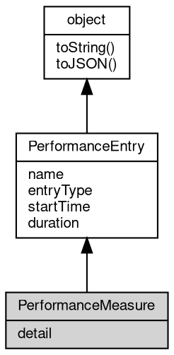

# Object PerformanceMeasure
A measure computed from a start and an end: a duration entry with an optional detail

PerformanceMeasure is the concrete [PerformanceEntry](PerformanceEntry.md) subtype with `entryType` `measure` and
corresponds to the MDN PerformanceMeasure interface. Measures are created with
[performance.measure](../../module/ifs/performance.md#measure) and have `duration` equal to endTime - startTime, which may be negative.

Concepts:

- **Not retained**: fibjs does not store measures in the timeline, so they never appear in
  [performance.getEntries](../../module/ifs/performance.md#getEntries)/getEntriesByType/getEntriesByName and cannot be re-read after the
  callback; capture them from a [PerformanceObserver](PerformanceObserver.md) instead (Node.js retains them).
- **startTime and duration**: startTime comes from the start mark, from an explicit number, or is
  0 when absent; duration comes from end - start or from the `duration` option.
- **detail**: an arbitrary value attached at creation; it is `undefined` when the options [object](object.md)
  had no `detail` (Node.js uses `null`).

Obtained from:
- the [PerformanceObserverEntryList](PerformanceObserverEntryList.md) of an observer registered for `measure`;
- `observer.takeRecords()`, which returns queued measures together with any queued marks;
- there is no constructor and no [global](../../module/ifs/global.md) class [object](object.md) for PerformanceMeasure.

Example 1 — measure between two marks and drain it from an observer:

```JavaScript
const {
    performance,
    PerformanceObserver
} = require('perf_hooks');

performance.clearMarks();
const observer = new PerformanceObserver(() => {});
observer.observe({
    type: 'measure'
});

performance.mark('start', {
    startTime: 100
});
performance.mark('end', {
    startTime: 175
});
performance.measure('load', 'start', 'end');

const measure = observer.takeRecords()[0];
console.log(measure.name, measure.entryType); // load measure
console.log(measure.startTime, measure.duration); // 100 75
observer.disconnect();
```

Example 2 — measure with an explicit duration and detail:

```JavaScript
const {
    performance,
    PerformanceObserver
} = require('perf_hooks');

performance.clearMarks();
const observer = new PerformanceObserver(() => {});
observer.observe({
    entryTypes: ['measure']
});
performance.measure('retry-window', {
    start: 10,
    duration: 40,
    detail: {
        attempts: 3
    }
});

const measure = observer.takeRecords()[0];
console.log(measure.startTime, measure.duration, measure.detail.attempts); // 10 40 3
observer.disconnect();
```

## Inheritance


## Properties
        
### detail
**Value, The detail value attached when the measure was created**

```JavaScript
readonly Value PerformanceMeasure.detail;
```

Holds whatever was passed as `detail` in the options form of [performance.measure](../../module/ifs/performance.md#measure); the value is
returned by reference rather than copied. The measure(name, startMark, endMark) form cannot
attach one, so there the property is `undefined` (Node.js uses `null`).

--------------------------
### name
**String, The name of the entry**

```JavaScript
readonly String PerformanceMeasure.name;
```

The mark or measure name passed to [performance.mark](../../module/ifs/performance.md#mark)/[performance.measure](../../module/ifs/performance.md#measure). Mark names are
unique in the timeline (a repeated name replaces the previous mark), while measure names can
be reused; the name is never empty and is not prefixed by the entry type.

--------------------------
### entryType
**String, The type of the entry**

```JavaScript
readonly String PerformanceMeasure.entryType;
```

The kind of timeline record: `mark` for a [PerformanceMark](PerformanceMark.md) and `measure` for a
PerformanceMeasure. Node.js offers further [types](../../module/ifs/types.md) such as `resource`, `function` and `gc`;
fibjs produces only these two.

--------------------------
### startTime
**Number, The start time of the entry, in milliseconds on the monotonic [performance.now](../../module/ifs/performance.md#now)() clock**

```JavaScript
readonly Number PerformanceMeasure.startTime;
```

For a mark it is the time recorded by [performance.mark](../../module/ifs/performance.md#mark) (the `startTime` option when given,
otherwise the current clock reading); for a measure it is the resolved start of the interval,
which is 0 when no start was supplied. The value is not related to wall-clock time.

--------------------------
### duration
**Number, The duration of the entry, in milliseconds**

```JavaScript
readonly Number PerformanceMeasure.duration;
```

Always 0 for a mark. For a measure it is end - start, computed from marks, explicit numbers or
the `duration` option, and it can be negative when the end lies before the start; fibjs does
not reject such a measure.

## Methods
        
### toString
**Returns the string form of the [object](object.md)**

```JavaScript
String PerformanceMeasure.toString();
```

Returns:
* String, returns the string form of the [object](object.md)

The base implementation reports an error: a native [object](object.md) has no implicit
text form, and only the classes whose value can be written as a string
override the member. [Buffer](Buffer.md) returns its content decoded with the given
[encoding](../../module/ifs/encoding.md), [HttpCookie](HttpCookie.md) returns "name=value", and so on; an override commonly
accepts optional arguments ([Buffer.toString](Buffer.md#toString) takes [encoding](../../module/ifs/encoding.md), start and
end) that are not part of this declaration.

Calling the member on a class that does not override it throws
"<Class>: the [object](object.md) can not be converted to string.", which is the
behavior to rely on when probing whether a value has a string form. See
toJSON for the serialization hook.

--------------------------
### toJSON
**Returns the JSON representation of the [object](object.md)**

```JavaScript
Value PerformanceMeasure.toJSON(String key = "");
```

Parameters:
* key: String, the property name of the value being serialized

Returns:
* Value, returns the JSON-serializable value

JSON.stringify(value) calls value.toJSON(key) when the member exists and
serializes the returned value in its place; the key argument carries the
property name of the value inside its parent [object](object.md) (an empty string at
the top level) and may be used to build a keyed form. The base
implementation returns a plain [object](object.md) holding the readable properties of
the instance, so a native [object](object.md) serializes without per-class code; a
class with a portable shape such as [Buffer](Buffer.md) overrides it, and a JavaScript
class may override it in the same way.

The member is normally reached through JSON.stringify rather than called
directly; calling it returns the same value JSON.stringify would
serialize.

