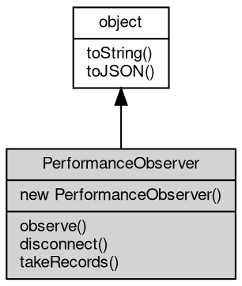

# 对象 PerformanceObserver
PerformanceObserver 接口用于观察性能记录的接口

PerformanceObserver 接口用于观察性能记录的接口。它允许你注册一个回调函数，当一个新的性能记录被添加到浏览器的性能缓冲区时，这个回调函数会被调用。你可以使用 PerformanceObserver 接口来观察特定类型的性能记录，比如资源加载时间、用户输入延迟等。

## 继承关系


## 构造函数
        
### PerformanceObserver
**构造函数**

```JavaScript
new PerformanceObserver(Function callback);
```

调用参数:
* callback: Function, 当一个新的性能记录被添加到浏览器的性能缓冲区时，这个回调函数会被调用

## 成员函数
        
### observe
**注册观察的资源类型**

```JavaScript
PerformanceObserver.observe(Object options);
```

调用参数:
* options: Object, 观察的资源类型

options 为一个对象，包含以下属性：
  - type: 观察的资源类型
  - entryTypes: 观察的资源类型列表

--------------------------
### disconnect
**取消观察的资源类型**

```JavaScript
PerformanceObserver.disconnect();
```

--------------------------
### takeRecords
**获取观察的资源类型的记录**

```JavaScript
NArray PerformanceObserver.takeRecords();
```

返回结果:
* NArray, 返回观察的资源类型的记录

--------------------------
### toString
**返回对象的字符串表示，一般返回 "[Native Object]"，对象可以根据自己的特性重新实现**

```JavaScript
String PerformanceObserver.toString();
```

返回结果:
* String, 返回对象的字符串表示

--------------------------
### toJSON
**返回对象的 JSON 格式表示，一般返回对象定义的可读属性集合**

```JavaScript
Value PerformanceObserver.toJSON(String key = "");
```

调用参数:
* key: String, 未使用

返回结果:
* Value, 返回包含可 JSON 序列化的值

