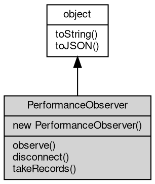

# Object PerformanceObserver
Observes [performance](../../module/ifs/performance.md) entries and delivers them to a callback

PerformanceObserver corresponds to the MDN and Node.js PerformanceObserver interface. Create one
with `new PerformanceObserver(callback)`, register the interesting entry [types](../../module/ifs/types.md) with `observe`,
and the callback receives a [PerformanceObserverEntryList](PerformanceObserverEntryList.md) each time records are delivered. fibjs
produces only `mark` and `measure` entries.

Concepts:

- **Delivery model**: mark and measure queue records on the observer synchronously; the callback
  runs asynchronously when the current fiber yields. `takeRecords()` drains the queue immediately,
  and records drained that way are not passed to the callback. The callback and takeRecords see
  the same [PerformanceEntry](PerformanceEntry.md) objects.
- **Batching**: every record queued before the fiber yields is delivered in a single callback
  invocation, in recording order, mixing marks and measures.
- **Registration**: `observe({ entryTypes: ['mark', 'measure'] })` registers a list and
  `observe({ type: 'mark' })` registers a single type. `entryTypes` wins when both are supplied,
  and calling observe again adds [types](../../module/ifs/types.md) without duplicating deliveries. Unknown [types](../../module/ifs/types.md) are accepted
  silently and simply never fire; only `mark` and `measure` can fire in fibjs.
- **Callback errors**: an exception thrown by the callback is reported as an uncaught error and
  does not propagate to the mark or measure call that queued the record.
- **Lifetime**: disconnect stops new deliveries, while records queued before the call are still
  delivered.

Obtained from:
- `new PerformanceObserver(callback)` — the class is available as a [global](../../module/ifs/global.md) and as
  `require('[perf_hooks](../../module/ifs/perf_hooks.md)').PerformanceObserver`, both naming the same class.

Example 1 — drain records synchronously with takeRecords:

```JavaScript
const {
    performance,
    PerformanceObserver
} = require('perf_hooks');

performance.clearMarks();
const observer = new PerformanceObserver(() => {});
observer.observe({
    entryTypes: ['mark', 'measure']
});

performance.mark('start');
performance.measure('elapsed', 'start');

const records = observer.takeRecords();
console.log(records[0].name, records[0].entryType); // start mark
console.log(records[1].name, records[1].entryType); // elapsed measure
observer.disconnect();
```

Example 2 — receive one batched callback per event-loop turn:

```JavaScript
const {
    performance,
    PerformanceObserver
} = require('perf_hooks');

(async () => {
    performance.clearMarks();
    let batch = [];
    const observer = new PerformanceObserver((list) => {
        batch = list.getEntries().map((entry) => entry.name);
    });
    observer.observe({
        entryTypes: ['mark', 'measure']
    });

    performance.mark('open');
    performance.measure('open-now', 'open');

    await new Promise((resolve) => setTimeout(resolve, 0));
    console.log(batch.join(', ')); // open, open-now
    observer.disconnect();
})();
```

Example 3 — one entry type, and disconnect stops new deliveries:

```JavaScript
const {
    performance,
    PerformanceObserver
} = require('perf_hooks');

performance.clearMarks();
let marks = 0;
const observer = new PerformanceObserver(() => marks++);
observer.observe({
    type: 'mark'
});
performance.mark('seen');
observer.disconnect();
performance.mark('not-seen');

// the queued record is still delivered after disconnect, but nothing new is queued
setTimeout(() => {
    console.log(marks); // 1
}, 0);
```

## Inheritance

```dot
digraph {
    node [fontname="Helvetica,sans-Serif", fontsize=10, shape="record", style="filled", fillcolor="white"];

    object [tooltip="object", URL="object.md", label="{object|toString()\ltoJSON()\l}"];
    PerformanceObserver [tooltip="PerformanceObserver", fillcolor="lightgray", id="me", label="{PerformanceObserver|new PerformanceObserver()\l|observe()\ldisconnect()\ltakeRecords()\l}"];

    object -> PerformanceObserver [dir=back];
}
```

## Constructors
        
### PerformanceObserver
**Creates an observer bound to a callback function**

```JavaScript
new PerformanceObserver(Function(PerformanceObserverEntryList list) callback);
```

Parameters:
* callback: Function([PerformanceObserverEntryList](PerformanceObserverEntryList.md) list), the callback function called with a [PerformanceObserverEntryList](PerformanceObserverEntryList.md)

The callback is required and must be a function; anything else fails with TypeError [20005].
It is invoked once per batch of delivered records with a single argument, a
[PerformanceObserverEntryList](PerformanceObserverEntryList.md). The callback does not run synchronously inside mark/measure: it
is queued and runs when the current fiber yields.

Example — construct an observer before registering it:

```JavaScript
const {
    PerformanceObserver
} = require('perf_hooks');

const observer = new PerformanceObserver((list) => {
    console.log(list.getEntries().length);
});
observer.disconnect(); // nothing was observed yet
console.log(typeof observer.observe); // function
```

## Methods
        
### observe
**Registers the entry [types](../../module/ifs/types.md) to observe**

```JavaScript
PerformanceObserver.observe(Object options);
```

Parameters:
* options: Object, the entry [types](../../module/ifs/types.md) to observe

options supports the following options:

```JavaScript
// fragment: options
({
    "entryTypes": ["mark", "measure"], // the entry types to observe
    "type": "mark" // a single entry type, used when entryTypes is absent
});
```

At least one of `entryTypes` and `type` is required: with neither, the call fails with
TypeError [20002] ("property type is not optional"). `entryTypes` must be an array of strings
and takes precedence over `type` when both are present. Unknown [types](../../module/ifs/types.md) are accepted silently
and never fire. Observing a type twice on the same observer does not duplicate deliveries, and
calling observe again later adds more [types](../../module/ifs/types.md).

Example — register by list and by single type:

```JavaScript
const {
    performance,
    PerformanceObserver
} = require('perf_hooks');

performance.clearMarks();
const observer = new PerformanceObserver(() => {});
observer.observe({
    type: 'mark'
});
observer.observe({
    entryTypes: ['measure']
});

performance.mark('m');
performance.measure('q', 'm');

const records = observer.takeRecords();
console.log(records[0].entryType, records[1].entryType); // mark measure
observer.disconnect();
```

--------------------------
### disconnect
**Stops delivering records and unregisters the observer**

```JavaScript
PerformanceObserver.disconnect();
```

Removes the observer from every type it registered, so subsequent marks and measures are not
queued for it. Records that were queued before the call are still delivered to the callback
when the fiber yields. The member can be called more than once and returns undefined.

--------------------------
### takeRecords
**Drains and returns the records queued for this observer**

```JavaScript
PerformanceEntry PerformanceObserver.takeRecords();
```

Returns:
* [PerformanceEntry](PerformanceEntry.md), returns the entries that were queued for the observer

Returns an array of [PerformanceEntry](PerformanceEntry.md) objects in recording order and clears the queue, so the
callback does not receive those records; an empty array is returned when the queue is empty.
The call is synchronous and is the deterministic way to read records without waiting for the
fiber to yield.

Example — take two marks before the callback can run:

```JavaScript
const {
    performance,
    PerformanceObserver
} = require('perf_hooks');

performance.clearMarks();
const observer = new PerformanceObserver(() => {});
observer.observe({
    type: 'mark'
});
performance.mark('drained');
performance.mark('drained-too');

const records = observer.takeRecords();
console.log(records.length, observer.takeRecords().length); // 2 0
observer.disconnect();
```

--------------------------
### toString
**Returns the string form of the [object](object.md)**

```JavaScript
String PerformanceObserver.toString();
```

Returns:
* String, returns the string form of the [object](object.md)

The base implementation reports an error: a native [object](object.md) has no implicit
text form, and only the classes whose value can be written as a string
override the member. [Buffer](Buffer.md) returns its content decoded with the given
[encoding](../../module/ifs/encoding.md), [HttpCookie](HttpCookie.md) returns "name=value", and so on; an override commonly
accepts optional arguments ([Buffer.toString](Buffer.md#toString) takes [encoding](../../module/ifs/encoding.md), start and
end) that are not part of this declaration.

Calling the member on a class that does not override it throws
"<Class>: the [object](object.md) can not be converted to string.", which is the
behavior to rely on when probing whether a value has a string form. See
toJSON for the serialization hook.

--------------------------
### toJSON
**Returns the JSON representation of the [object](object.md)**

```JavaScript
Value PerformanceObserver.toJSON(String key = "");
```

Parameters:
* key: String, the property name of the value being serialized

Returns:
* Value, returns the JSON-serializable value

JSON.stringify(value) calls value.toJSON(key) when the member exists and
serializes the returned value in its place; the key argument carries the
property name of the value inside its parent [object](object.md) (an empty string at
the top level) and may be used to build a keyed form. The base
implementation returns a plain [object](object.md) holding the readable properties of
the instance, so a native [object](object.md) serializes without per-class code; a
class with a portable shape such as [Buffer](Buffer.md) overrides it, and a JavaScript
class may override it in the same way.

The member is normally reached through JSON.stringify rather than called
directly; calling it returns the same value JSON.stringify would
serialize.

