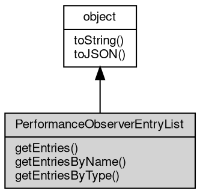

# 对象 PerformanceObserverEntryList
PerformanceObserverEntryList 对象包含了 [PerformanceObserver](PerformanceObserver.md) 观察到的 [performance](../../module/ifs/performance.md) 记录的详细信息

## 继承关系


## 成员函数
        
### getEntries
**查询全部 [performance](../../module/ifs/performance.md) 记录的详细信息。**

```JavaScript
NArray PerformanceObserverEntryList.getEntries();
```

返回结果:
* NArray, [PerformanceEntry](PerformanceEntry.md) 对象数组

--------------------------
### getEntriesByName
**根据名称查询 [performance](../../module/ifs/performance.md) 记录的详细信息**

```JavaScript
NArray PerformanceObserverEntryList.getEntriesByName(String name,
    String entryType = "");
```

调用参数:
* name: String, 一个字符串，表示 [performance](../../module/ifs/performance.md) 记录的名称。
* entryType: String, 一个字符串，表示 [performance](../../module/ifs/performance.md) 记录的类型。

返回结果:
* NArray, [PerformanceEntry](PerformanceEntry.md) 对象数组

--------------------------
### getEntriesByType
**根据类型查询 [performance](../../module/ifs/performance.md) 记录的详细信息**

```JavaScript
NArray PerformanceObserverEntryList.getEntriesByType(String entryType);
```

调用参数:
* entryType: String, 一个字符串，表示 [performance](../../module/ifs/performance.md) 记录的类型。

返回结果:
* NArray, [PerformanceEntry](PerformanceEntry.md) 对象数组

--------------------------
### toString
**返回对象的字符串表示，一般返回 "[Native Object]"，对象可以根据自己的特性重新实现**

```JavaScript
String PerformanceObserverEntryList.toString();
```

返回结果:
* String, 返回对象的字符串表示

--------------------------
### toJSON
**返回对象的 JSON 格式表示，一般返回对象定义的可读属性集合**

```JavaScript
Value PerformanceObserverEntryList.toJSON(String key = "");
```

调用参数:
* key: String, 未使用

返回结果:
* Value, 返回包含可 JSON 序列化的值

