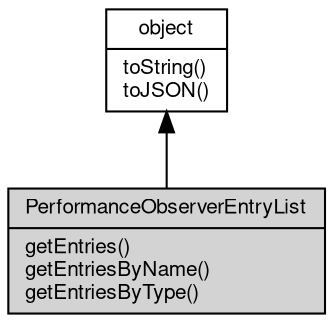

# Object PerformanceObserverEntryList
The batch of [performance](../../module/ifs/performance.md) entries passed to a [PerformanceObserver](PerformanceObserver.md) callback

PerformanceObserverEntryList is the single argument of the observer callback and holds the records
delivered in that invocation, in recording order, mixing marks and measures. It cannot be
constructed directly; the filters return the same [PerformanceEntry](PerformanceEntry.md) objects that mark retention and
`observer.takeRecords()` expose for the same records.

Concepts:

- **Batch snapshot**: the list contains only the records of the callback invocation; it is not a
  live view of the timeline, so records added later do not appear in it.
- **Filtering**: `getEntries` returns the whole batch, `getEntriesByType(type)` selects `mark` or
  `measure`, and `getEntriesByName(name, type)` selects by name with an optional type filter. An
  empty type string matches every type; a name matches marks and measures by their own name.

Obtained from:
- the first argument of the [PerformanceObserver](PerformanceObserver.md) callback (there is no constructor and no [global](../../module/ifs/global.md)
  class [object](object.md) for this interface).

Example 1 — read the whole batch:

```JavaScript
const {
    performance,
    PerformanceObserver
} = require('perf_hooks');

(async () => {
    performance.clearMarks();
    let names = [];
    const observer = new PerformanceObserver((list) => {
        names = list.getEntries().map((entry) => entry.name);
    });
    observer.observe({
        entryTypes: ['mark', 'measure']
    });
    performance.mark('a');
    performance.measure('b', 'a');

    await new Promise((resolve) => setTimeout(resolve, 0));
    console.log(names.join(', ')); // a, b
    observer.disconnect();
})();
```

Example 2 — filter the batch inside the callback:

```JavaScript
const {
    performance,
    PerformanceObserver
} = require('perf_hooks');

(async () => {
    performance.clearMarks();
    let markCount = 0;
    let named = 0;
    const observer = new PerformanceObserver((list) => {
        markCount = list.getEntriesByType('mark').length;
        named = list.getEntriesByName('hit').length;
    });
    observer.observe({
        entryTypes: ['mark'],
        type: 'measure'
    });
    performance.mark('hit');
    performance.mark('miss');
    performance.measure('hit');

    await new Promise((resolve) => setTimeout(resolve, 0));
    console.log(markCount, named); // 2 1
    observer.disconnect();
})();
```

## Inheritance

```dot
digraph {
    node [fontname="Helvetica,sans-Serif", fontsize=10, shape="record", style="filled", fillcolor="white"];

    object [tooltip="object", URL="object.md", label="{object|toString()\ltoJSON()\l}"];
    PerformanceObserverEntryList [tooltip="PerformanceObserverEntryList", fillcolor="lightgray", id="me", label="{PerformanceObserverEntryList|getEntries()\lgetEntriesByName()\lgetEntriesByType()\l}"];

    object -> PerformanceObserverEntryList [dir=back];
}
```

## Methods
        
### getEntries
**Returns every entry of the batch**

```JavaScript
PerformanceEntry PerformanceObserverEntryList.getEntries();
```

Returns:
* [PerformanceEntry](PerformanceEntry.md), an array of [PerformanceEntry](PerformanceEntry.md) objects

The result is a new array holding the records delivered by the callback invocation, in
recording order; it contains both marks and measures and is never empty, because a callback is
only invoked when there is at least one record.

--------------------------
### getEntriesByName
**Returns the entries of the batch matching a name and an optional entry type**

```JavaScript
PerformanceEntry PerformanceObserverEntryList.getEntriesByName(String name,
    String entryType = "");
```

Parameters:
* name: String, a string, representing the name of the [performance](../../module/ifs/performance.md) entry.
* entryType: String, a string, representing the type of the [performance](../../module/ifs/performance.md) entry.

Returns:
* [PerformanceEntry](PerformanceEntry.md), an array of [PerformanceEntry](PerformanceEntry.md) objects

When entryType is empty every type matches; otherwise it must be exactly `mark` or `measure`.
The name is compared with the entry name, so it selects marks and measures alike.

Example — select one entry by name from the batch delivered to a measure observer:

```JavaScript
const {
    performance,
    PerformanceObserver
} = require('perf_hooks');

(async () => {
    performance.clearMarks();
    let selected = 0;
    const observer = new PerformanceObserver((list) => {
        selected = list.getEntriesByName('load', 'measure').length;
    });
    observer.observe({
        type: 'measure'
    });
    performance.measure('load');
    performance.measure('render');

    await new Promise((resolve) => setTimeout(resolve, 0));
    console.log(selected); // 1
    observer.disconnect();
})();
```

--------------------------
### getEntriesByType
**Returns the entries of the batch matching an entry type**

```JavaScript
PerformanceEntry PerformanceObserverEntryList.getEntriesByType(String entryType);
```

Parameters:
* entryType: String, a string, representing the type of the [performance](../../module/ifs/performance.md) entry.

Returns:
* [PerformanceEntry](PerformanceEntry.md), an array of [PerformanceEntry](PerformanceEntry.md) objects

Selects the records whose entryType equals the argument; in fibjs only `mark` and `measure`
can match, and an unknown type yields an empty array without raising an error.

--------------------------
### toString
**Returns the string form of the [object](object.md)**

```JavaScript
String PerformanceObserverEntryList.toString();
```

Returns:
* String, returns the string form of the [object](object.md)

The base implementation reports an error: a native [object](object.md) has no implicit
text form, and only the classes whose value can be written as a string
override the member. [Buffer](Buffer.md) returns its content decoded with the given
[encoding](../../module/ifs/encoding.md), [HttpCookie](HttpCookie.md) returns "name=value", and so on; an override commonly
accepts optional arguments ([Buffer.toString](Buffer.md#toString) takes [encoding](../../module/ifs/encoding.md), start and
end) that are not part of this declaration.

Calling the member on a class that does not override it throws
"<Class>: the [object](object.md) can not be converted to string.", which is the
behavior to rely on when probing whether a value has a string form. See
toJSON for the serialization hook.

--------------------------
### toJSON
**Returns the JSON representation of the [object](object.md)**

```JavaScript
Value PerformanceObserverEntryList.toJSON(String key = "");
```

Parameters:
* key: String, the property name of the value being serialized

Returns:
* Value, returns the JSON-serializable value

JSON.stringify(value) calls value.toJSON(key) when the member exists and
serializes the returned value in its place; the key argument carries the
property name of the value inside its parent [object](object.md) (an empty string at
the top level) and may be used to build a keyed form. The base
implementation returns a plain [object](object.md) holding the readable properties of
the instance, so a native [object](object.md) serializes without per-class code; a
class with a portable shape such as [Buffer](Buffer.md) overrides it, and a JavaScript
class may override it in the same way.

The member is normally reached through JSON.stringify rather than called
directly; calling it returns the same value JSON.stringify would
serialize.

