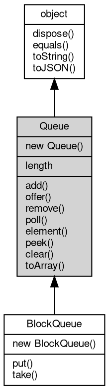

# 对象 Queue
FIFO（先进先出）队列对象

用以创建和管理先进先出数据队列，创建方法：

```JavaScript
var collection = require("collection");
var q = new collection.Queue(100);
```

## 继承关系


## 构造函数
        
### Queue
**队列对象构造函数**

```JavaScript
new Queue(Integer size);
```

调用参数:
* size: Integer, 指定队列尺寸

## 成员属性
        
### length
**Integer, 返回当前队列尺寸**

```JavaScript
readonly Integer Queue.length;
```

## 成员函数
        
### add
**插入一个新的元素到队列，成功返回 True，队列满则抛出错误**

```JavaScript
Boolean Queue.add(Value e);
```

调用参数:
* e: Value, 要插入的元素

返回结果:
* Boolean, 成功返回 True

--------------------------
### offer
**插入一个新的元素到队列，成功返回 True，队列满则返回 False**

```JavaScript
Boolean Queue.offer(Value e);
```

调用参数:
* e: Value, 要插入的元素

返回结果:
* Boolean, 成功返回 True

--------------------------
### remove
**从队列中移除一个元素并返回，如果队列为空则抛出错误**

```JavaScript
Value Queue.remove();
```

返回结果:
* Value, 返回取出的元素

--------------------------
### poll
**从队列中移除一个元素并返回**

```JavaScript
Value Queue.poll();
```

返回结果:
* Value, 返回取出的元素，队列为空则返回 Null

--------------------------
### element
**从队列中返回一个元素，但不移除，队列为空则抛出错误**

```JavaScript
Value Queue.element();
```

返回结果:
* Value, 返回取出的元素

--------------------------
### peek
**从队列中返回一个元素，但不移除**

```JavaScript
Value Queue.peek();
```

返回结果:
* Value, 返回取出的元素，队列为空则返回 Null

--------------------------
### clear
**清除当前队列**

```JavaScript
Queue.clear();
```

--------------------------
### toArray
**返回队列的 js 数组**

```JavaScript
Array Queue.toArray();
```

返回结果:
* Array, 包含数据的 js 数组

--------------------------
### dispose
**强制回收对象，调用此方法后，对象资源将立即释放**

```JavaScript
Queue.dispose();
```

--------------------------
### equals
**比较当前对象与给定的对象是否相等**

```JavaScript
Boolean Queue.equals(object expected);
```

调用参数:
* expected: [object](object.md), 制定比较的目标对象

返回结果:
* Boolean, 返回对象比较的结果

--------------------------
### toString
**返回对象的字符串表示，一般返回 "[Native Object]"，对象可以根据自己的特性重新实现**

```JavaScript
String Queue.toString();
```

返回结果:
* String, 返回对象的字符串表示

--------------------------
### toJSON
**返回对象的 JSON 格式表示，一般返回对象定义的可读属性集合**

```JavaScript
Value Queue.toJSON(String key = "");
```

调用参数:
* key: String, 未使用

返回结果:
* Value, 返回包含可 JSON 序列化的值

