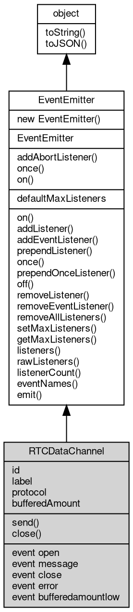

# Object RTCDataChannel
RTCDataChannel is one bidirectional data channel of an [RTCPeerConnection](RTCPeerConnection.md)

A channel carries text and binary messages between the two peers of a session. The application
obtains it by creating it locally with `RTCPeerConnection.createDataChannel` or from the
`datachannel` event when the peer creates one; it cannot be constructed directly
(`new RTCDataChannel()` throws a TypeError). A channel has no `readyState` member: the `open`,
`message` and `close` events are the observable states of its life cycle.

Concepts:

- **Transport and ordering**: a channel is an SCTP stream over the DTLS transport of its
  connection. The default channel is ordered and reliable; the creation options trade ordering
  (`ordered: false`) or retransmission (`maxPacketLifeTime`, `maxRetransmits`) for latency, as
  in the WebRTC standard, and `negotiated`/`id` create the same channel on both sides without an
  in-band announcement.
- **[Message](Message.md) forms**: `send` takes a `String`, which travels as utf8 text, or a `Buffer`, which
  travels as binary; the receiver gets a string or a [Buffer](Buffer.md) in `ev.data` respectively, so binary
  payloads stay binary and are not re-encoded.
- **Buffering**: `send` queues the message and returns immediately; `bufferedAmount` reports the
  bytes still queued. The `bufferedamountlow` event exists but fibjs has no threshold setter, so
  the application cannot request it at a chosen queue level.
- **Life cycle**: a channel exists before the transport is ready, opens only after ICE and DTLS
  complete, and closes by `close()`, by the peer, or by closing the connection. Sending outside
  the open state throws 20024, and the `close` event reports either side closing.

Obtained from:
- `[RTCPeerConnection](RTCPeerConnection.md)#createDataChannel` — the local side creates the channel;
- the `channel` property of the `datachannel` event of [RTCPeerConnection](RTCPeerConnection.md) — the peer created it.

Example 1 — echo a text message between two peers:

```JavaScript
const rtc = require('rtc');
const coroutine = require('coroutine');

const pc1 = new rtc.RTCPeerConnection({
    iceServers: []
});
const pc2 = new rtc.RTCPeerConnection({
    iceServers: []
});
const toPc1 = [];
const toPc2 = [];
pc1.onicecandidate = (ev) => {
    if (ev.candidate) toPc2.push(ev.candidate);
};
pc2.onicecandidate = (ev) => {
    if (ev.candidate) toPc1.push(ev.candidate);
};

const dc1 = pc1.createDataChannel('chat');
pc2.ondatachannel = (ev) => {
    const dc2 = ev.channel;
    console.log('peer channel:', dc2.label, dc2.id); // peer channel: chat 1
    dc2.onmessage = (mev) => dc2.send('echo: ' + mev.data);
};

let reply = null;
dc1.onopen = () => dc1.send('hello');
dc1.onmessage = (ev) => {
    reply = ev.data;
};

pc1.createOffer()
    .then((offer) => pc1.setLocalDescription(offer).then(() => pc2.setRemoteDescription(offer)))
    .then(() => pc2.createAnswer())
    .then((answer) => pc2.setLocalDescription(answer)
        .then(() => pc1.setRemoteDescription(answer)))
    .then(() => {
        const deadline = Date.now() + 8000;
        while (reply === null && Date.now() < deadline) {
            while (toPc1.length) pc1.addIceCandidate(toPc1.shift());
            while (toPc2.length) pc2.addIceCandidate(toPc2.shift());
            coroutine.sleep(10);
        }
        pc1.close();
        pc2.close();
        if (reply !== 'echo: hello') {
            console.error('the peers did not exchange a message');
            process.exit(1);
        }
        console.log(reply); // echo: hello
    })
    .catch((err) => {
        console.error(err.message);
        process.exit(1);
    });
```

Example 2 — binary messages and the close handshake:

```JavaScript
const rtc = require('rtc');
const coroutine = require('coroutine');

const pc1 = new rtc.RTCPeerConnection({
    iceServers: []
});
const pc2 = new rtc.RTCPeerConnection({
    iceServers: []
});
const toPc1 = [];
const toPc2 = [];
pc1.onicecandidate = (ev) => {
    if (ev.candidate) toPc2.push(ev.candidate);
};
pc2.onicecandidate = (ev) => {
    if (ev.candidate) toPc1.push(ev.candidate);
};

const dc1 = pc1.createDataChannel('blob');
let closed = false;
dc1.onclose = () => {
    closed = true;
};
pc2.ondatachannel = (ev) => {
    const dc2 = ev.channel;
    dc2.onmessage = (mev) => {
        console.log('receiver got a Buffer:', Buffer.isBuffer(mev.data));
        dc2.send(Buffer.from('ack'));
        dc2.close();
    };
};

let ack = false;
dc1.onopen = () => dc1.send(Buffer.from([0, 1, 2]));
dc1.onmessage = () => {
    ack = true;
};

pc1.createOffer()
    .then((offer) => pc1.setLocalDescription(offer).then(() => pc2.setRemoteDescription(offer)))
    .then(() => pc2.createAnswer())
    .then((answer) => pc2.setLocalDescription(answer)
        .then(() => pc1.setRemoteDescription(answer)))
    .then(() => {
        const deadline = Date.now() + 8000;
        while (!closed && Date.now() < deadline) {
            while (toPc1.length) pc1.addIceCandidate(toPc1.shift());
            while (toPc2.length) pc2.addIceCandidate(toPc2.shift());
            coroutine.sleep(10);
        }
        pc1.close();
        pc2.close();
        if (!ack || !closed) {
            console.error('the channel did not carry the binary message');
            process.exit(1);
        }
        console.log('the peer closed the channel'); // the peer closed the channel
    })
    .catch((err) => {
        console.error(err.message);
        process.exit(1);
    });
```

Notes:

- The channel does not expose the creation options back: there is no `readyState`, `binaryType`,
  `ordered`, `maxPacketLifeTime`, `maxRetransmits` or `negotiated` member.

## Inheritance

```dot
digraph {
    node [fontname="Helvetica,sans-Serif", fontsize=10, shape="record", style="filled", fillcolor="white"];

    object [tooltip="object", URL="object.md", label="{object|toString()\ltoJSON()\l}"];
    EventEmitter [tooltip="EventEmitter", URL="EventEmitter.md", label="{EventEmitter|new EventEmitter()\l|EventEmitter\l|addAbortListener()\lonce()\lon()\l|defaultMaxListeners\l|on()\laddListener()\laddEventListener()\lprependListener()\lonce()\lprependOnceListener()\loff()\lremoveListener()\lremoveEventListener()\lremoveAllListeners()\lsetMaxListeners()\lgetMaxListeners()\llisteners()\lrawListeners()\llistenerCount()\leventNames()\lemit()\l}"];
    RTCDataChannel [tooltip="RTCDataChannel", fillcolor="lightgray", id="me", label="{RTCDataChannel|id\llabel\lprotocol\lbufferedAmount\l|send()\lclose()\l|event open\levent message\levent close\levent error\levent bufferedamountlow\l}"];

    object -> EventEmitter [dir=back];
    EventEmitter -> RTCDataChannel [dir=back];
}
```

## Static Methods
        
### addAbortListener
**Registers a one-shot abort handler on an [AbortSignal](AbortSignal.md)**

```JavaScript
static Object RTCDataChannel.addAbortListener(EventEmitter signal,
    Function(Object ev) func);
```

Parameters:
* signal: [EventEmitter](EventEmitter.md), the [AbortSignal](AbortSignal.md) [object](object.md) to listen to
* func: Function(Object ev), the handler for the abort event

Returns:
* Object, returns a Disposable [object](object.md) containing a `[Symbol.dispose]` method

The handler is called at most once when the signal is aborted, and it is removed from the
signal afterwards. If the signal is already aborted the handler is invoked synchronously.
The returned [object](object.md) has a `[Symbol.dispose]()` method that removes the handler, so it can be
released before the abort happens.

Example — abort handling with automatic cleanup:

```JavaScript
const events = require('events');

const controller = new AbortController();
const disposable = events.addAbortListener(controller.signal,
    () => console.log('aborted'));

controller.abort(); // aborted
disposable[Symbol.dispose](); // safe to call after the listener fired
console.log(controller.signal.listenerCount('abort')); // 0
```

--------------------------
### once
**Creates a Promise resolved by the next occurrence of an event**

```JavaScript
static Object RTCDataChannel.once(EventEmitter emitter,
    Value ev,
    Object options = {});
```

Parameters:
* emitter: [EventEmitter](EventEmitter.md), the event emitter [object](object.md) to listen to
* ev: Value, the event name to listen for
* options: Object, optional parameter [object](object.md)

Returns:
* Object, returns a Promise that resolves with the array of event parameters

The Promise resolves with the array of the emit arguments when the event fires; it rejects
when `error` is emitted while waiting, unless the waited event is `error` itself, or when
the signal option aborts. The temporary listeners are removed when the Promise settles.

options supports the following option:

```JavaScript
// fragment: options
({
    "signal": null // AbortSignal; aborting rejects the Promise with an AbortError
});
```

Example — awaiting the next occurrence of an event:

```JavaScript
const EventEmitter = require('events');

(async () => {
    const emitter = new EventEmitter();
    const waiting = EventEmitter.once(emitter, 'ready');

    emitter.emit('ready', 200, 'ok');
    console.log(JSON.stringify(await waiting)); // [200,"ok"]
})();
```

--------------------------
### on
**Creates an async iterator that yields event occurrences**

```JavaScript
static Object RTCDataChannel.on(EventEmitter emitter,
    Value ev,
    Object options = {});
```

Parameters:
* emitter: [EventEmitter](EventEmitter.md), the event emitter [object](object.md) to listen to
* ev: Value, the event name to listen for
* options: Object, optional parameter [object](object.md)

Returns:
* Object, returns an AsyncIterator [object](object.md)

Each next() resolves with `{ value: [args...], done: false }` when the event fires and with
`{ done: true }` after an event named in the `close` option fires or the signal aborts; an
`error` event rejects the pending call. The listeners are registered when the iterator is
created and removed when the iteration ends or the signal aborts.

options supports the following options:

```JavaScript
// fragment: options
({
    "signal": null, // AbortSignal; aborting rejects pending and future next() calls
    "close": [] // event names; the first one to fire ends the iteration
});
```

Example — iterating the occurrences of an event:

```JavaScript
const EventEmitter = require('events');

(async () => {
    const emitter = new EventEmitter();
    const iterator = EventEmitter.on(emitter, 'data', {
        close: ['end']
    });

    emitter.emit('data', 1);
    emitter.emit('data', 2);
    emitter.emit('end');

    for await (const args of iterator)
    console.log(JSON.stringify(args)); // [1] then [2]
})();
```

## Static Properties
        
### defaultMaxListeners
**Integer, The [process](../../module/ifs/process.md)-wide default listener limit reported by getMaxListeners()**

```JavaScript
static Integer RTCDataChannel.defaultMaxListeners;
```

Defaults to 10. Assigning a value changes getMaxListeners() for every emitter that never
called setMaxListeners(); an emitter with an explicit limit keeps it. The limit is
informational: fibjs never warns when the number of listeners exceeds it.

## Properties
        
### id
**Integer, gets the id that uniquely identifies the data channel**

```JavaScript
readonly Integer RTCDataChannel.id;
```

Returns the SCTP stream id between 0 and 65534, or 65535 while no id has been assigned, that
is before the channel is negotiated; a channel created with an explicit `id` option reports
it immediately. See the `id` option of `RTCPeerConnection.createDataChannel`.

--------------------------
### label
**String, gets the name of the data channel**

```JavaScript
readonly String RTCDataChannel.label;
```

Returns the label passed to `RTCPeerConnection.createDataChannel`; it is informational and
identical on both sides, the peer sees it on the channel delivered by the `datachannel`
event.

--------------------------
### protocol
**String, gets the name of the sub-protocol in use**

```JavaScript
readonly String RTCDataChannel.protocol;
```

Returns the `protocol` string given at creation, empty by default. The value is not
negotiated on the wire: both sides must agree on it out of band.

--------------------------
### bufferedAmount
**Number, gets the number of bytes of data currently queued to be sent**

```JavaScript
readonly Number RTCDataChannel.bufferedAmount;
```

Reports the size in bytes of the send queue of the channel: it grows while messages wait for
the transport and returns to 0 when everything has been handed over. fibjs exposes no
`bufferedAmountLowThreshold`, so the `bufferedamountlow` event fires only at the internal
threshold of the library.

## Methods
        
### send
**sends data to the remote end**

```JavaScript
RTCDataChannel.send(Buffer | String data);
```

Parameters:
* data: [Buffer](Buffer.md) | String, the data to send

A `Buffer` is sent as binary data and a `String` is encoded as utf8 and sent as text data;
the peer receives the same kind in the `data` property of the `message` event. The message is
queued on the channel and the call returns immediately; `bufferedAmount` reports how much is
still queued. Sending before the channel is open throws 20024 (`DataChannel not open`),
sending after it is closed throws 20024 (`DataChannel is closed`), and an argument of any
other type throws 20005.

Example — walk the states of a fresh channel:

```JavaScript
const rtc = require('rtc');

const pc = new rtc.RTCPeerConnection({
    iceServers: []
});
const dc = pc.createDataChannel('chat');
console.log(dc.id); // 65535: not negotiated yet
try {
    dc.send('too early');
} catch (err) {
    console.log('rejected:', err.message); // rejected: DataChannel not open
}
dc.close();
try {
    dc.send('too late');
} catch (err) {
    console.log('rejected:', err.message); // rejected: DataChannel is closed
}
pc.close();
```

--------------------------
### close
**closes the channel**

```JavaScript
RTCDataChannel.close();
```

Closes the channel in both directions: data already queued may still be delivered, the peer
sees its `close` event and afterwards `send` throws 20024. Closing an already closed channel
is a no-op, and closing a channel does not close its connection or the other channels.

--------------------------
### on
**Appends an event handler to the emitter**

```JavaScript
Object RTCDataChannel.on(Value ev,
    Function(...args) func);
```

Parameters:
* ev: Value, the event name to bind
* func: Function(...args), the event handler function, called with the emit arguments

Returns:
* Object, returns the event [object](object.md) itself for chaining

The listener is called with the arguments of emit() and `this` set to the emitter; the
emitter itself is returned so registrations can be chained. The same function may be
registered several times for one event and each copy is called. See the class documentation
for the dispatch order.

--------------------------
**Appends several event handlers to the emitter**

```JavaScript
Object RTCDataChannel.on(Object map);
```

Parameters:
* map: Object, the event mapping; [object](object.md) property names are used as event names

Returns:
* Object, returns the event [object](object.md) itself for chaining

Every enumerable property of the map whose value is a function is registered under its
property name. Properties are processed in order; a value that is not a function makes the
call fail with an invalid-type error while entries processed before it stay registered.

Example — registering several handlers at once:

```JavaScript
const EventEmitter = require('events');

const emitter = new EventEmitter();
emitter.on({
    connect: () => console.log('connect'),
    close: () => console.log('close')
});

emitter.emit('connect'); // connect
emitter.emit('close'); // close
```

--------------------------
### addListener
**Appends an event handler to the emitter**

```JavaScript
Object RTCDataChannel.addListener(Value ev,
    Function(...args) func);
```

Parameters:
* ev: Value, the event name to bind
* func: Function(...args), the event handler function

Returns:
* Object, returns the event [object](object.md) itself for chaining

Alias of on(ev, func), provided for Node.js compatibility.

--------------------------
**Appends several event handlers to the emitter**

```JavaScript
Object RTCDataChannel.addListener(Object map);
```

Parameters:
* map: Object, the event mapping; [object](object.md) property names are used as event names

Returns:
* Object, returns the event [object](object.md) itself for chaining

Alias of on(map), provided for Node.js compatibility.

--------------------------
### addEventListener
**Appends an event handler to the emitter with an options [object](object.md)**

```JavaScript
Object RTCDataChannel.addEventListener(Value ev,
    Function(...args) func,
    Object options = {});
```

Parameters:
* ev: Value, the event name to bind
* func: Function(...args), the event handler function, called with the emit arguments
* options: Object, the options of the event handler

Returns:
* Object, returns the event [object](object.md) itself for chaining

Web-style alias of on(); the only supported option is `once`, which registers a one-shot
handler exactly like once(). The listener receives the plain emit arguments and not an [Event](Event.md)
[object](object.md); see the [DOMEvent](DOMEvent.md) class for the DOM-style event [object](object.md) used by [AbortSignal](AbortSignal.md) and
fetch-style APIs.

options supports the following option:

```JavaScript
// fragment: options
({
    "once": false // when true, the handler is removed before its single invocation
});
```

Example — a one-shot DOM-style registration:

```JavaScript
const EventEmitter = require('events');

const emitter = new EventEmitter();
emitter.addEventListener('ping', () => console.log('ping'), {
    once: true
});

emitter.emit('ping'); // ping
console.log(emitter.emit('ping')); // false
console.log(emitter.listenerCount('ping')); // 0
```

--------------------------
### prependListener
**Inserts an event handler at the front of the queue**

```JavaScript
Object RTCDataChannel.prependListener(Value ev,
    Function(...args) func);
```

Parameters:
* ev: Value, the event name to bind
* func: Function(...args), the event handler function

Returns:
* Object, returns the event [object](object.md) itself for chaining

The listener is called before the listeners registered with on()/addListener() the next time
the event is emitted. When several prependListener() calls are made, the last one registered
is called first, because every call inserts at the same position.

Example — insertion at the front of the queue:

```JavaScript
const EventEmitter = require('events');

const emitter = new EventEmitter();
emitter.on('order', () => console.log('on'));
emitter.prependListener('order', () => console.log('prepend'));

emitter.emit('order'); // prepend, then on
```

--------------------------
**Inserts several event handlers at the front of the queue**

```JavaScript
Object RTCDataChannel.prependListener(Object map);
```

Parameters:
* map: Object, the event mapping; [object](object.md) property names are used as event names

Returns:
* Object, returns the event [object](object.md) itself for chaining

Map form of prependListener(); every function property is inserted at the front, so the
properties of the map are called in reverse order.

--------------------------
### once
**Appends a one-shot event handler to the emitter**

```JavaScript
Object RTCDataChannel.once(Value ev,
    Function(...args) func);
```

Parameters:
* ev: Value, the event name to bind
* func: Function(...args), the event handler function

Returns:
* Object, returns the event [object](object.md) itself for chaining

The handler is wrapped and removes itself from the queue before it is called, so it runs at
most once. off() removes it when passed the original function, listeners() returns the
original function, and rawListeners() returns the internal wrapper whose `_func` property
holds the original. See Example 2 in the class documentation.

--------------------------
**Appends several one-shot event handlers to the emitter**

```JavaScript
Object RTCDataChannel.once(Object map);
```

Parameters:
* map: Object, the event mapping; [object](object.md) property names are used as event names

Returns:
* Object, returns the event [object](object.md) itself for chaining

Map form of once(); every function property is registered as a one-shot listener under its
property name.

--------------------------
### prependOnceListener
**Inserts a one-shot event handler at the front of the queue**

```JavaScript
Object RTCDataChannel.prependOnceListener(Value ev,
    Function(...args) func);
```

Parameters:
* ev: Value, the event name to bind
* func: Function(...args), the event handler function

Returns:
* Object, returns the event [object](object.md) itself for chaining

Combines prependListener() and once(): the handler is called first and only once, and it is
removed before its invocation.

--------------------------
**Inserts several one-shot event handlers at the front of the queue**

```JavaScript
Object RTCDataChannel.prependOnceListener(Object map);
```

Parameters:
* map: Object, the event mapping; [object](object.md) property names are used as event names

Returns:
* Object, returns the event [object](object.md) itself for chaining

Map form of prependOnceListener(); every function property is inserted as a one-shot
listener, and the properties of the map are called in reverse order.

--------------------------
### off
**Removes an event handler from the emitter**

```JavaScript
Object RTCDataChannel.off(Value ev,
    Function(...args) func);
```

Parameters:
* ev: Value, the event name to unbind
* func: Function(...args), the event handler function

Returns:
* Object, returns the event [object](object.md) itself for chaining

The first matching listener is removed; when the same function was registered several times
only one copy is removed per call, so repeat the call to remove the others. A once() wrapper
is matched by its original function as well. Removing a listener emits the `removeListener`
meta event after the removal.

--------------------------
**Removes all event handlers of one event**

```JavaScript
Object RTCDataChannel.off(Value ev);
```

Parameters:
* ev: Value, the event name to unbind

Returns:
* Object, returns the event [object](object.md) itself for chaining

Every listener of the event is removed and `removeListener` is emitted once per removed
listener. The call succeeds when the event has no listener.

Example — removing every listener of one event:

```JavaScript
const EventEmitter = require('events');

const emitter = new EventEmitter();
emitter.on('data', () => console.log('first'));
emitter.on('data', () => console.log('second'));

emitter.off('data');
console.log(emitter.emit('data')); // false
```

--------------------------
**Removes several event handlers from the emitter**

```JavaScript
Object RTCDataChannel.off(Object map);
```

Parameters:
* map: Object, the event mapping; [object](object.md) property names are used as event names

Returns:
* Object, returns the event [object](object.md) itself for chaining

Every enumerable property of the map whose value is a function names an event from which
that function is removed (one copy per event). A value that is not a function makes the call
fail with an invalid-type error.

--------------------------
### removeListener
**Removes an event handler from the emitter**

```JavaScript
Object RTCDataChannel.removeListener(Value ev,
    Function(...args) func);
```

Parameters:
* ev: Value, the event name to unbind
* func: Function(...args), the event handler function

Returns:
* Object, returns the event [object](object.md) itself for chaining

Alias of off(ev, func), provided for Node.js compatibility.

--------------------------
**Removes all event handlers of one event**

```JavaScript
Object RTCDataChannel.removeListener(Value ev);
```

Parameters:
* ev: Value, the event name to unbind

Returns:
* Object, returns the event [object](object.md) itself for chaining

Alias of off(ev), provided for Node.js compatibility.

--------------------------
**Removes several event handlers from the emitter**

```JavaScript
Object RTCDataChannel.removeListener(Object map);
```

Parameters:
* map: Object, the event mapping; [object](object.md) property names are used as event names

Returns:
* Object, returns the event [object](object.md) itself for chaining

Alias of off(map), provided for Node.js compatibility.

--------------------------
### removeEventListener
**Removes an event handler with an options [object](object.md)**

```JavaScript
Object RTCDataChannel.removeEventListener(Value ev,
    Function(...args) func,
    Object options = {});
```

Parameters:
* ev: Value, the event name to unbind
* func: Function(...args), the event handler function
* options: Object, the options of the event handler, ignored

Returns:
* Object, returns the event [object](object.md) itself for chaining

Web-style alias of off(ev, func); the options [object](object.md) is accepted and ignored, and a once()
wrapper is matched by its original function like off().

--------------------------
### removeAllListeners
**Removes all listeners of one event**

```JavaScript
Object RTCDataChannel.removeAllListeners(Value ev);
```

Parameters:
* ev: Value, the event name to remove

Returns:
* Object, returns the event [object](object.md) itself for chaining

Equivalent to off(ev): every listener of the event is removed, including once() wrappers
matched by their original function, and `removeListener` is emitted once per removal.

--------------------------
**Removes all listeners of the given events, or of the whole emitter**

```JavaScript
Object RTCDataChannel.removeAllListeners(Array evs = []);
```

Parameters:
* evs: Array, the event names to remove

Returns:
* Object, returns the event [object](object.md) itself for chaining

An empty array — including the no-argument call, because the parameter defaults to [] —
clears every string-keyed event; symbol-keyed listeners are left in place, unlike Node.js
which removes them too. A non-empty array clears each named event as
removeAllListeners(ev) does.

Example — clearing selected events and the whole emitter:

```JavaScript
const EventEmitter = require('events');

const emitter = new EventEmitter();
emitter.on('a', () => {});
emitter.on('b', () => {});
emitter.on('c', () => {});

emitter.removeAllListeners(['a', 'b']);
console.log(emitter.listenerCount('a'), emitter.listenerCount('c')); // 0 1

emitter.removeAllListeners();
console.log(emitter.eventNames().length); // 0
```

--------------------------
### setMaxListeners
**Stores a per-emitter listener limit**

```JavaScript
RTCDataChannel.setMaxListeners(Integer n);
```

Parameters:
* n: Integer, the number of events

The value is reported by getMaxListeners() and is otherwise informational: fibjs never warns
when the number of listeners exceeds it. This member exists for Node.js compatibility. A
negative value throws; 0 is accepted and stored as-is, while Node.js treats 0 as unlimited.

--------------------------
### getMaxListeners
**Returns the listener limit of the emitter**

```JavaScript
Integer RTCDataChannel.getMaxListeners();
```

Returns:
* Integer, returns the default limit

Returns the value set by setMaxListeners(), or the [process](../../module/ifs/process.md)-wide defaultMaxListeners (10)
when no explicit value was set.

--------------------------
### listeners
**Returns a copy of the listener array of an event**

```JavaScript
Array RTCDataChannel.listeners(Value ev);
```

Parameters:
* ev: Value, the event name to query

Returns:
* Array, returns the listener array of the specified event

One-shot wrappers are unwrapped, so the result contains the functions passed to
on()/once() and can be passed to off(); an unknown event produces an empty array.

Example — once() listeners are returned unwrapped:

```JavaScript
const EventEmitter = require('events');

const emitter = new EventEmitter();

function onTick() {
    console.log('tick');
}

emitter.once('tick', onTick);
console.log(emitter.listeners('tick')[0] === onTick); // true
console.log(emitter.rawListeners('tick')[0] === onTick); // false
```

--------------------------
### rawListeners
**Returns the internal listener array of an event**

```JavaScript
Array RTCDataChannel.rawListeners(Value ev);
```

Parameters:
* ev: Value, the event name to query

Returns:
* Array, returns the listener array of the specified event

The array is not unwrapped: a listener registered with once() appears as the internal
wrapper function whose `_func` property holds the original function. An unknown event
produces an empty array.

--------------------------
### listenerCount
**Returns the number of listeners of an event**

```JavaScript
Integer RTCDataChannel.listenerCount(Value ev);
```

Parameters:
* ev: Value, the event name to query

Returns:
* Integer, returns the number of listeners of the specified event

One-shot listeners count as one and an unknown event returns 0.

--------------------------
**Returns the number of listeners of an event on another [object](object.md)**

```JavaScript
Integer RTCDataChannel.listenerCount(Value o,
    Value ev);
```

Parameters:
* o: Value, the [object](object.md) to query
* ev: Value, the event name to query

Returns:
* Integer, returns the number of listeners of the specified event

Counts without requiring the target to be an [EventEmitter](EventEmitter.md): any [object](object.md) with registered
events can be queried. The call is normally written as
`EventEmitter.listenerCount(target, 'data')`.

Example — counting the listeners of another [object](object.md):

```JavaScript
const EventEmitter = require('events');

const emitter = new EventEmitter();
emitter.on('data', () => {});
emitter.on('data', () => {});

console.log(EventEmitter.listenerCount(emitter, 'data')); // 2
```

--------------------------
### eventNames
**Returns the names of the events with at least one listener**

```JavaScript
Array RTCDataChannel.eventNames();
```

Returns:
* Array, returns the array of event names

Only string-keyed events are reported; symbol-keyed events are omitted and numeric event
names are returned as numbers (Node.js also reports symbol events).

--------------------------
### emit
**Emits an event and returns whether a listener was called**

```JavaScript
Boolean RTCDataChannel.emit(Value ev,
    ...args);
```

Parameters:
* ev: Value, event name
* args: ..., event parameters, which are passed to the event handler

Returns:
* Boolean, returns whether the event had a listener to respond to it

Listeners are called as described by the dispatch model in the class documentation: the
first one runs synchronously on the current fiber, the remaining ones run in parallel
fibers, and the call returns after all of them finish; an exception raised by a listener is
thrown back to the caller. Emitting `error` with no listener throws instead of returning
false: an Error argument is thrown as-is and any other value is wrapped in
`Error("Unhandled error. (...)")`. [Event](Event.md) names are strings or symbols; `emit()` does not
match a listener registered with a numeric name.

--------------------------
### toString
**Returns the string form of the [object](object.md)**

```JavaScript
String RTCDataChannel.toString();
```

Returns:
* String, returns the string form of the [object](object.md)

The base implementation reports an error: a native [object](object.md) has no implicit
text form, and only the classes whose value can be written as a string
override the member. [Buffer](Buffer.md) returns its content decoded with the given
[encoding](../../module/ifs/encoding.md), [HttpCookie](HttpCookie.md) returns "name=value", and so on; an override commonly
accepts optional arguments ([Buffer.toString](Buffer.md#toString) takes [encoding](../../module/ifs/encoding.md), start and
end) that are not part of this declaration.

Calling the member on a class that does not override it throws
"<Class>: the [object](object.md) can not be converted to string.", which is the
behavior to rely on when probing whether a value has a string form. See
toJSON for the serialization hook.

--------------------------
### toJSON
**Returns the JSON representation of the [object](object.md)**

```JavaScript
Value RTCDataChannel.toJSON(String key = "");
```

Parameters:
* key: String, the property name of the value being serialized

Returns:
* Value, returns the JSON-serializable value

JSON.stringify(value) calls value.toJSON(key) when the member exists and
serializes the returned value in its place; the key argument carries the
property name of the value inside its parent [object](object.md) (an empty string at
the top level) and may be used to build a keyed form. The base
implementation returns a plain [object](object.md) holding the readable properties of
the instance, so a native [object](object.md) serializes without per-class code; a
class with a portable shape such as [Buffer](Buffer.md) overrides it, and a JavaScript
class may override it in the same way.

The member is normally reached through JSON.stringify rather than called
directly; calling it returns the same value JSON.stringify would
serialize.

## Events
        
### open
**channel open event, emitted when the channel is opened**

```JavaScript
event RTCDataChannel.open();
```

Fired when the channel becomes usable: the SCTP association is established and, for a
channel created locally, the peer has acknowledged it. `send` is only valid from this point
on. The event carries no payload.

--------------------------
### message
**channel message event, emitted when a message is received**

```JavaScript
event RTCDataChannel.message(Object ev);
```

Parameters:
* ev: Object, the event [object](object.md), carrying the received data in its data property

Fired for every message received from the peer. The event [object](object.md) carries the payload in its
`data` property: a string for a text message and a [Buffer](Buffer.md) for a binary one. Delivery is
ordered for a channel created with `ordered: true`, which is the default.

--------------------------
### close
**channel close event, emitted when the channel is closed**

```JavaScript
event RTCDataChannel.close();
```

Fired when the channel is closed, whether by the local `close()` call or by the peer. The
event carries no payload; after it, `send` throws 20024.

--------------------------
### error
**channel error event, emitted when an error occurs on the channel**

```JavaScript
event RTCDataChannel.error(Object ev);
```

Parameters:
* ev: Object, the event [object](object.md), carrying the error message in its error property

Fired when the underlying SCTP stack reports an error on the channel. The event [object](object.md)
carries the message in its `error` property as a string; it is not an RTCErrorEvent or a
DOMException as in the standard.

--------------------------
### bufferedamountlow
**channel buffered amount low event, emitted when the queue falls below the threshold**

```JavaScript
event RTCDataChannel.bufferedamountlow();
```

Fired when the send queue of the channel falls below the internal threshold of the library.
fibjs has no `bufferedAmountLowThreshold` setter, so the event cannot be requested at a
chosen queue level and is rarely observed in practice; it carries no payload.

