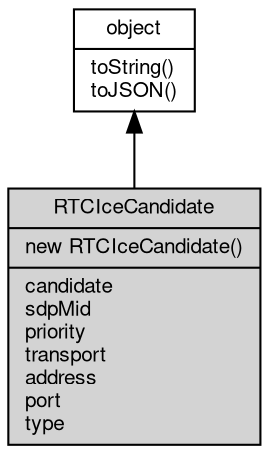

# 对象 RTCIceCandidate
WebRTC ICE 候选参数对象

## 继承关系


## 构造函数
        
### RTCIceCandidate
**构造函数**

```JavaScript
new RTCIceCandidate(Object description = {});
```

调用参数:
* description: Object, 初始化参数

description 初始化参数，支持以下字段：
   - candidate: 候选项字符串
   - sdpMid: 媒体流标识

## 成员属性
        
### candidate
**String, 返回候选项字符串**

```JavaScript
readonly String RTCIceCandidate.candidate;
```

--------------------------
### sdpMid
**String, 返回媒体流标识**

```JavaScript
readonly String RTCIceCandidate.sdpMid;
```

--------------------------
### priority
**Integer, 返回优先级**

```JavaScript
readonly Integer RTCIceCandidate.priority;
```

--------------------------
### transport
**String, 返回传输协议**

```JavaScript
readonly String RTCIceCandidate.transport;
```

--------------------------
### address
**String, 返回地址**

```JavaScript
readonly String RTCIceCandidate.address;
```

--------------------------
### port
**Integer, 返回端口**

```JavaScript
readonly Integer RTCIceCandidate.port;
```

--------------------------
### type
**String, 返回类型**

```JavaScript
readonly String RTCIceCandidate.type;
```

## 成员函数
        
### toString
**返回对象的字符串表示，一般返回 "[Native Object]"，对象可以根据自己的特性重新实现**

```JavaScript
String RTCIceCandidate.toString();
```

返回结果:
* String, 返回对象的字符串表示

--------------------------
### toJSON
**返回对象的 JSON 格式表示，一般返回对象定义的可读属性集合**

```JavaScript
Value RTCIceCandidate.toJSON(String key = "");
```

调用参数:
* key: String, 未使用

返回结果:
* Value, 返回包含可 JSON 序列化的值

