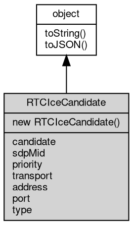

# Object RTCIceCandidate
RTCIceCandidate holds one ICE candidate of a WebRTC session: a transport address at which a peer can be reached during the connectivity checks

Candidates are one half of WebRTC signaling: each side gathers them and passes them to the peer,
which feeds them to its own connection with `RTCPeerConnection.addIceCandidate`. The class wraps
one candidate string; the plain objects delivered by the `icecandidate` event carry the same
fields and are accepted wherever an instance is.

Concepts:

- **Candidate string**: the text `candidate:<foundation> <component> <transport> <priority>
  <address> <port> typ <type> ...` describes one address of one transport component. The `type`
  is `host` (an interface of this host), `srflx` (the reflexive address reported by a STUN
  server), `prflx` (a reflexive address learned from a connectivity check) or `relay` (a TURN
  relay address). Sessions between reachable peers only need host candidates.
- **Parsed and resolved fields**: `candidate`, `sdpMid`, `priority` and `type` are taken straight
  from the text, while `transport`, `address` and `port` exist only on candidates resolved by the
  ICE agent, so they are always `undefined` on an instance built from a string. The plain objects
  of the `icecandidate` event carry all of them.
- **sdpMid and sdpMLineIndex**: the standard pairs a candidate with its media line through
  `sdpMid` or `sdpMLineIndex`; fibjs implements `sdpMid` only and ignores `sdpMLineIndex`.
- **fibjs extension**: `priority`, `transport` and `type` are fibjs additions; MDN's
  RTCIceCandidate exposes `protocol`, `foundation`, `component`, `relatedAddress`/`relatedPort`
  and other fields instead, which fibjs does not implement.

Obtained from:
- `new [rtc.RTCIceCandidate](../../module/ifs/rtc.md#RTCIceCandidate)({ candidate, sdpMid })` — wraps one candidate string, both fields are
  required;
- the `candidate` property of the `icecandidate` event — a plain [object](object.md) with the same fields plus
  `transport`, `address` and `port` for resolved candidates.

Example 1 — compare an event [object](object.md) with the instance wrapping it:

```JavaScript
const rtc = require('rtc');
const coroutine = require('coroutine');

const pc = new rtc.RTCPeerConnection({
    iceServers: []
});
pc.createDataChannel('candidates');
let reported = false;
pc.onicecandidate = (ev) => {
    if (!ev.candidate || reported) return;
    reported = true;
    const wrapped = new rtc.RTCIceCandidate(ev.candidate);
    console.log('event object address:', ev.candidate.address); // an IP address of this host
    console.log('wrapped instance address:', wrapped.address); // undefined
};

pc.createOffer()
    .then((offer) => pc.setLocalDescription(offer))
    .then(() => {
        const deadline = Date.now() + 5000;
        while (!reported && Date.now() < deadline) coroutine.sleep(10);
        pc.close();
        if (!reported) {
            console.error('no candidate was gathered');
            process.exit(1);
        }
    })
    .catch((err) => {
        console.error(err.message);
        process.exit(1);
    });
```

Example 2 — forward the peer's candidates as RTCIceCandidate instances:

```JavaScript
const rtc = require('rtc');
const coroutine = require('coroutine');

const pc1 = new rtc.RTCPeerConnection({
    iceServers: []
});
const pc2 = new rtc.RTCPeerConnection({
    iceServers: []
});
const toPc1 = [];
const toPc2 = [];
pc1.onicecandidate = (ev) => {
    if (ev.candidate) toPc2.push(ev.candidate);
};
pc2.onicecandidate = (ev) => {
    if (ev.candidate) toPc1.push(ev.candidate);
};

const dc1 = pc1.createDataChannel('candidates');
let opened = false;
dc1.onopen = () => {
    opened = true;
};
pc2.ondatachannel = () => {};

pc1.createOffer()
    .then((offer) => pc1.setLocalDescription(offer).then(() => pc2.setRemoteDescription(offer)))
    .then(() => pc2.createAnswer())
    .then((answer) => pc2.setLocalDescription(answer)
        .then(() => pc1.setRemoteDescription(answer)))
    .then(() => {
        const deadline = Date.now() + 8000;
        let wrapped = 0;
        while (!opened && Date.now() < deadline) {
            while (toPc1.length) {
                pc1.addIceCandidate(new rtc.RTCIceCandidate(toPc1.shift()));
                wrapped++;
            }
            while (toPc2.length) pc2.addIceCandidate(toPc2.shift());
            coroutine.sleep(10);
        }
        pc1.close();
        pc2.close();
        if (!opened) {
            console.error('the peers did not connect');
            process.exit(1);
        }
        console.log('wrapped candidates accepted:', wrapped > 0);
        // wrapped candidates accepted: true
    })
    .catch((err) => {
        console.error(err.message);
        process.exit(1);
    });
```

Notes:

- An instance is immutable: `candidate` is regenerated by the library from its parsed fields.
- The constructor rejects text that is not a candidate with 20024 (`Invalid candidate format`)
  and a missing `candidate` or `sdpMid` with a TypeError 20002.

## Inheritance

```dot
digraph {
    node [fontname="Helvetica,sans-Serif", fontsize=10, shape="record", style="filled", fillcolor="white"];

    object [tooltip="object", URL="object.md", label="{object|toString()\ltoJSON()\l}"];
    RTCIceCandidate [tooltip="RTCIceCandidate", fillcolor="lightgray", id="me", label="{RTCIceCandidate|new RTCIceCandidate()\l|candidate\lsdpMid\lpriority\ltransport\laddress\lport\ltype\l}"];

    object -> RTCIceCandidate [dir=back];
}
```

## Constructors
        
### RTCIceCandidate
**constructs a candidate [object](object.md) from a description [object](object.md)**

```JavaScript
new RTCIceCandidate(Object description = {});
```

Parameters:
* description: Object, initialization parameter

The description [object](object.md) must contain both `candidate` (the candidate string) and `sdpMid` (the
media line identification). A missing field throws TypeError 20002 and a string that cannot
be parsed throws 20024 (`Invalid candidate format`). The other fields of the standard
dictionary, such as `sdpMLineIndex` and `usernameFragment`, are accepted and ignored.

Example — build a candidate and read the parsed fields:

```JavaScript
const rtc = require('rtc');

const candidate = new rtc.RTCIceCandidate({
    candidate: 'candidate:1467250027 1 UDP 1467250027 192.168.1.2 3478 typ srflx',
    sdpMid: '0'
});
console.log(candidate.type); // srflx
console.log(candidate.priority); // 1467250027
console.log(candidate.transport); // undefined: not resolved by the ICE agent
```

## Properties
        
### candidate
**String, gets the candidate string**

```JavaScript
readonly String RTCIceCandidate.candidate;
```

Returns the textual candidate as regenerated by the library from its parsed fields, for
example `candidate:1467250027 1 UDP 1467250027 192.168.1.2 3478 typ srflx`. This is the
string that must be carried by the signaling channel to the peer; see the class Concepts
for its format.

--------------------------
### sdpMid
**String, gets the media line identification**

```JavaScript
readonly String RTCIceCandidate.sdpMid;
```

Returns the `sdpMid` given at construction, which pairs the candidate with the media line
(`m=` section) of the session description. The standard alternative `sdpMLineIndex` is not
supported.

--------------------------
### priority
**Integer, gets the priority of the candidate**

```JavaScript
readonly Integer RTCIceCandidate.priority;
```

Returns the integer priority parsed from the candidate string (RFC 5245): a larger value
means a more preferred candidate. It is available on every instance, including one built
from a string, unlike `address` and `port`.

--------------------------
### transport
**String, gets the transport protocol of the candidate**

```JavaScript
readonly String RTCIceCandidate.transport;
```

Returns `udp`, `tcp-active`, `tcp-passive`, `tcp-so` or `tcp-unknown` for a candidate that
the ICE agent resolved, and `undefined` for a candidate built from a string. MDN exposes the
same information as `protocol`.

--------------------------
### address
**String, gets the address of the candidate**

```JavaScript
readonly String RTCIceCandidate.address;
```

Returns the address (IPv4, IPv6 or host name) of a candidate that the ICE agent resolved,
and `undefined` for a candidate built from a string - use the plain objects of the
`icecandidate` event when the address of a local candidate is needed.

--------------------------
### port
**Integer, gets the port of the candidate**

```JavaScript
readonly Integer RTCIceCandidate.port;
```

Returns the transport port of a candidate that the ICE agent resolved, and `undefined` for a
candidate built from a string. Together with `address` and `transport` it is only filled in
by the connectivity checks, not by parsing the candidate text.

--------------------------
### type
**String, gets the type of the candidate**

```JavaScript
readonly String RTCIceCandidate.type;
```

Returns `host`, `srflx`, `prflx`, `relay` or `unknown`; see the class Concepts for the
meaning of the [types](../../module/ifs/types.md). It is parsed from the candidate string and available on every
instance.

## Methods
        
### toString
**Returns the string form of the [object](object.md)**

```JavaScript
String RTCIceCandidate.toString();
```

Returns:
* String, returns the string form of the [object](object.md)

The base implementation reports an error: a native [object](object.md) has no implicit
text form, and only the classes whose value can be written as a string
override the member. [Buffer](Buffer.md) returns its content decoded with the given
[encoding](../../module/ifs/encoding.md), [HttpCookie](HttpCookie.md) returns "name=value", and so on; an override commonly
accepts optional arguments ([Buffer.toString](Buffer.md#toString) takes [encoding](../../module/ifs/encoding.md), start and
end) that are not part of this declaration.

Calling the member on a class that does not override it throws
"<Class>: the [object](object.md) can not be converted to string.", which is the
behavior to rely on when probing whether a value has a string form. See
toJSON for the serialization hook.

--------------------------
### toJSON
**Returns the JSON representation of the [object](object.md)**

```JavaScript
Value RTCIceCandidate.toJSON(String key = "");
```

Parameters:
* key: String, the property name of the value being serialized

Returns:
* Value, returns the JSON-serializable value

JSON.stringify(value) calls value.toJSON(key) when the member exists and
serializes the returned value in its place; the key argument carries the
property name of the value inside its parent [object](object.md) (an empty string at
the top level) and may be used to build a keyed form. The base
implementation returns a plain [object](object.md) holding the readable properties of
the instance, so a native [object](object.md) serializes without per-class code; a
class with a portable shape such as [Buffer](Buffer.md) overrides it, and a JavaScript
class may override it in the same way.

The member is normally reached through JSON.stringify rather than called
directly; calling it returns the same value JSON.stringify would
serialize.

