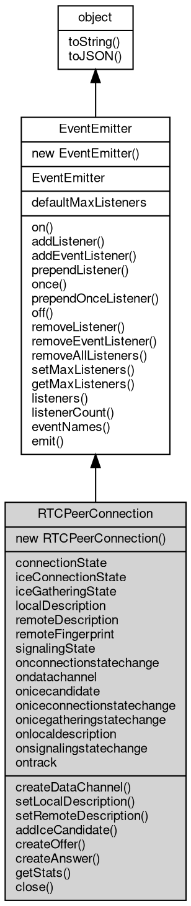

# 对象 RTCPeerConnection
RTCPeerConnection 定义 WebRTC 连接的方法和属性

RTCPeerConnection 是 WebRTC 连接的核心对象，用于创建 WebRTC 连接，管理连接状态，发送和接收媒体数据等。

RTCPeerConnection 对象的创建方式如下：

```JavaScript
const rtc = require('rtc');
var pc = new rtc.RTCPeerConnection();
```

## 继承关系


## 构造函数
        
### RTCPeerConnection
**构造一个新的 WebRTC 连接对象，并初始化基础参数**

```JavaScript
new RTCPeerConnection(Object options = {});
```

调用参数:
* options: Object, 初始化参数

options 参数是一个对象，包含以下属性：
   - certificateType: 证书类型，可选值为 'rsa'、'ecdsa'，默认为 'ecdsa'
   - iceTransportPolicy: ICE 传输策略，可选值为 'all'、'relay'，默认为 'all'
   - iceServers: ICE 服务器列表，用于 NAT 穿透，格式为 [{urls: 'stun:stun.l.google.com:19302'}]
   - maxMessageSize: 最大消息大小，用于指定数据通道的最大消息大小
   - enableIceUdpMux: 是否启用 ICE UDP 多路复用
   - disableFingerprintVerification: 是否禁用指纹验证
   - bindAddress: 绑定地址，用于指定本地 IP 地址
   - port: 本地端口号，用于指定本地端口
   - iceUfrag: ICE 用户名
   - icePwd: ICE 密码
   - certPem: 证书 PEM 格式
   - keyPem: 私钥 PEM 格式
   - keyPass: 私钥密码

## 静态属性
        
### defaultMaxListeners
**Integer, 默认全局最大监听器数**

```JavaScript
static Integer RTCPeerConnection.defaultMaxListeners;
```

## 成员属性
        
### connectionState
**String, 获取连接状态，返回连接状态字符串，可能的值有：'new'、'connecting'、'connected'、'disconnected'、'failed'、'closed'**

```JavaScript
readonly String RTCPeerConnection.connectionState;
```

--------------------------
### iceConnectionState
**String, 获取 ICE 连接状态，返回 ICE 连接状态字符串，可能的值有：'new'、'checking'、'connected'、'completed'、'failed'、'disconnected'、'closed'**

```JavaScript
readonly String RTCPeerConnection.iceConnectionState;
```

--------------------------
### iceGatheringState
**String, 获取 ICE 收集状态，返回 ICE 收集状态字符串，可能的值有：'new'、'gathering'、'complete'**

```JavaScript
readonly String RTCPeerConnection.iceGatheringState;
```

--------------------------
### localDescription
**Object, 获取本地描述，返回本地描述对象**

```JavaScript
readonly Object RTCPeerConnection.localDescription;
```

--------------------------
### remoteDescription
**Object, 获取远程描述，返回远程描述对象**

```JavaScript
readonly Object RTCPeerConnection.remoteDescription;
```

--------------------------
### remoteFingerprint
**Object, 获取远程指纹，返回远程指纹对象**

```JavaScript
readonly Object RTCPeerConnection.remoteFingerprint;
```

--------------------------
### signalingState
**String, 获取信令状态，返回信令状态字符串，可能的值有：'stable'、'have-local-offer'、'have-remote-offer'、'have-local-pranswer'、'have-remote-pranswer'、'closed'**

```JavaScript
readonly String RTCPeerConnection.signalingState;
```

--------------------------
### onconnectionstatechange
**Function, 连接状态变更事件**

```JavaScript
Function RTCPeerConnection.onconnectionstatechange;
```

--------------------------
### ondatachannel
**Function, 数据通道事件**

```JavaScript
Function RTCPeerConnection.ondatachannel;
```

--------------------------
### onicecandidate
**Function, ICE 候选项事件**

```JavaScript
Function RTCPeerConnection.onicecandidate;
```

--------------------------
### oniceconnectionstatechange
**Function, ICE 连接状态变更事件**

```JavaScript
Function RTCPeerConnection.oniceconnectionstatechange;
```

--------------------------
### onicegatheringstatechange
**Function, ICE 收集状态变更事件**

```JavaScript
Function RTCPeerConnection.onicegatheringstatechange;
```

--------------------------
### onlocaldescription
**Function, 本地描述变更事件**

```JavaScript
Function RTCPeerConnection.onlocaldescription;
```

--------------------------
### onsignalingstatechange
**Function, 信令状态变更事件**

```JavaScript
Function RTCPeerConnection.onsignalingstatechange;
```

--------------------------
### ontrack
**Function, 媒体轨道事件**

```JavaScript
Function RTCPeerConnection.ontrack;
```

## 成员函数
        
### createDataChannel
**创建一个与远程对等点链接的新通道**

```JavaScript
RTCDataChannel RTCPeerConnection.createDataChannel(String label,
    Object options = {});
```

调用参数:
* label: String, 通道名称
* options: Object, 通道参数

返回结果:
* [RTCDataChannel](RTCDataChannel.md), 返回创建的通道对象

创建一个与远程对等点链接的新通道，可以通过该通道传输任何类型的数据。这对于反向通道内容非常有用，例如图像、文件传输、文本聊天、游戏更新数据包等。

options 参数是一个对象，包含以下属性：
   - ordered: 是否保证数据包的顺序，默认为 true
   - maxPacketLifeTime: 数据包的最大生命周期，默认为 0
   - maxRetransmits: 数据包的最大重传次数，默认为 0
   - protocol: 通道协议，默认为 ''
   - negotiated: 是否为协商通道，默认为 false
   - id: 通道 ID，默认为 0

--------------------------
### setLocalDescription
**更改与连接关联的本地描述**

```JavaScript
RTCPeerConnection.setLocalDescription() promise;
```

此方法指定连接本地端的属性，包括媒体格式。该方法采用单个参数（会话描述），并返回一个 Promise ，一旦描述发生异步更改，该值就会得到满足。

--------------------------
**更改与连接关联的本地描述**

```JavaScript
RTCPeerConnection.setLocalDescription(RTCSessionDescription description) promise;
```

调用参数:
* description: [RTCSessionDescription](RTCSessionDescription.md), 会话描述

此方法指定连接本地端的属性，包括媒体格式。该方法采用单个参数（会话描述），并返回一个 Promise ，一旦描述发生异步更改，该值就会得到满足。

--------------------------
### setRemoteDescription
**更改与连接关联的远程描述**

```JavaScript
RTCPeerConnection.setRemoteDescription(RTCSessionDescription description) promise;
```

调用参数:
* description: [RTCSessionDescription](RTCSessionDescription.md), 会话描述

此方法指定连接远程端的属性，包括媒体格式。该方法采用单个参数（会话描述），并返回一个 Promise ，一旦描述发生异步更改，该值就会得到满足。

--------------------------
### addIceCandidate
**添加 ICE 候选项**

```JavaScript
RTCPeerConnection.addIceCandidate(RTCIceCandidate candidate) promise;
```

调用参数:
* candidate: [RTCIceCandidate](RTCIceCandidate.md), ICE 候选项

此方法将 ICE 候选项添加到连接的远程端。该方法采用单个参数（ICE 候选项），并返回一个 Promise ，一旦候选项发生异步更改，该值就会得到满足。

--------------------------
### createOffer
**创建一个 Offer 描述**

```JavaScript
Variant RTCPeerConnection.createOffer(Object options = {}) promise;
```

调用参数:
* options: Object, 选项对象，目前暂未支持，仅用于兼容

返回结果:
* Variant, 返回描述对象

此方法创建一个 Offer 描述，用于发起连接。该方法采用一个可选参数（选项对象），并返回一个 Promise ，一旦描述发生异步更改，该值就会得到满足。

--------------------------
### createAnswer
**创建一个 Answer 描述**

```JavaScript
Variant RTCPeerConnection.createAnswer(Object options = {}) promise;
```

调用参数:
* options: Object, 选项对象，目前暂未支持，仅用于兼容

返回结果:
* Variant, 返回描述对象

此方法创建一个 Answer 描述，用于应答连接。该方法采用一个可选参数（选项对象），并返回一个 Promise ，一旦描述发生异步更改，该值就会得到满足。

--------------------------
### getStats
**获取连接的统计信息**

```JavaScript
NMap RTCPeerConnection.getStats() promise;
```

返回结果:
* NMap, 返回统计信息

此方法获取连接的统计信息，返回一个 Promise ，一旦统计信息准备好，该值就会得到满足。

--------------------------
### close
**关闭连接，此方法关闭连接，释放所有资源**

```JavaScript
RTCPeerConnection.close();
```

--------------------------
### on
**绑定一个事件处理函数到对象**

```JavaScript
Object RTCPeerConnection.on(String ev,
    Function func);
```

调用参数:
* ev: String, 指定事件的名称
* func: Function, 指定事件处理函数

返回结果:
* Object, 返回事件对象本身，便于链式调用

--------------------------
**绑定一个事件处理函数到对象**

```JavaScript
Object RTCPeerConnection.on(Object map);
```

调用参数:
* map: Object, 指定事件映射关系，对象属性名称将作为事件名称，属性的值将作为事件处理函数

返回结果:
* Object, 返回事件对象本身，便于链式调用

--------------------------
### addListener
**绑定一个事件处理函数到对象**

```JavaScript
Object RTCPeerConnection.addListener(String ev,
    Function func);
```

调用参数:
* ev: String, 指定事件的名称
* func: Function, 指定事件处理函数

返回结果:
* Object, 返回事件对象本身，便于链式调用

--------------------------
**绑定一个事件处理函数到对象**

```JavaScript
Object RTCPeerConnection.addListener(Object map);
```

调用参数:
* map: Object, 指定事件映射关系，对象属性名称将作为事件名称，属性的值将作为事件处理函数

返回结果:
* Object, 返回事件对象本身，便于链式调用

--------------------------
### addEventListener
**绑定一个事件处理函数到对象**

```JavaScript
Object RTCPeerConnection.addEventListener(String ev,
    Function func,
    Object options = {});
```

调用参数:
* ev: String, 指定事件的名称
* func: Function, 指定事件处理函数
* options: Object, 指定事件处理函数的选项

返回结果:
* Object, 返回事件对象本身，便于链式调用

options 参数是一个对象，它可以包含以下属性：
- once: 如果为 true，则事件处理函数只会触发一次，触发后会被移除

--------------------------
### prependListener
**绑定一个事件处理函数到对象起始**

```JavaScript
Object RTCPeerConnection.prependListener(String ev,
    Function func);
```

调用参数:
* ev: String, 指定事件的名称
* func: Function, 指定事件处理函数

返回结果:
* Object, 返回事件对象本身，便于链式调用

--------------------------
**绑定一个事件处理函数到对象起始**

```JavaScript
Object RTCPeerConnection.prependListener(Object map);
```

调用参数:
* map: Object, 指定事件映射关系，对象属性名称将作为事件名称，属性的值将作为事件处理函数

返回结果:
* Object, 返回事件对象本身，便于链式调用

--------------------------
### once
**绑定一个一次性事件处理函数到对象，一次性处理函数只会触发一次**

```JavaScript
Object RTCPeerConnection.once(String ev,
    Function func);
```

调用参数:
* ev: String, 指定事件的名称
* func: Function, 指定事件处理函数

返回结果:
* Object, 返回事件对象本身，便于链式调用

--------------------------
**绑定一个一次性事件处理函数到对象，一次性处理函数只会触发一次**

```JavaScript
Object RTCPeerConnection.once(Object map);
```

调用参数:
* map: Object, 指定事件映射关系，对象属性名称将作为事件名称，属性的值将作为事件处理函数

返回结果:
* Object, 返回事件对象本身，便于链式调用

--------------------------
### prependOnceListener
**绑定一个事件处理函数到对象起始**

```JavaScript
Object RTCPeerConnection.prependOnceListener(String ev,
    Function func);
```

调用参数:
* ev: String, 指定事件的名称
* func: Function, 指定事件处理函数

返回结果:
* Object, 返回事件对象本身，便于链式调用

--------------------------
**绑定一个事件处理函数到对象起始**

```JavaScript
Object RTCPeerConnection.prependOnceListener(Object map);
```

调用参数:
* map: Object, 指定事件映射关系，对象属性名称将作为事件名称，属性的值将作为事件处理函数

返回结果:
* Object, 返回事件对象本身，便于链式调用

--------------------------
### off
**从对象处理队列中取消指定函数**

```JavaScript
Object RTCPeerConnection.off(String ev,
    Function func);
```

调用参数:
* ev: String, 指定事件的名称
* func: Function, 指定事件处理函数

返回结果:
* Object, 返回事件对象本身，便于链式调用

--------------------------
**取消对象处理队列中的全部函数**

```JavaScript
Object RTCPeerConnection.off(String ev);
```

调用参数:
* ev: String, 指定事件的名称

返回结果:
* Object, 返回事件对象本身，便于链式调用

--------------------------
**从对象处理队列中取消指定函数**

```JavaScript
Object RTCPeerConnection.off(Object map);
```

调用参数:
* map: Object, 指定事件映射关系，对象属性名称作为事件名称，属性的值作为事件处理函数

返回结果:
* Object, 返回事件对象本身，便于链式调用

--------------------------
### removeListener
**从对象处理队列中取消指定函数**

```JavaScript
Object RTCPeerConnection.removeListener(String ev,
    Function func);
```

调用参数:
* ev: String, 指定事件的名称
* func: Function, 指定事件处理函数

返回结果:
* Object, 返回事件对象本身，便于链式调用

--------------------------
**取消对象处理队列中的全部函数**

```JavaScript
Object RTCPeerConnection.removeListener(String ev);
```

调用参数:
* ev: String, 指定事件的名称

返回结果:
* Object, 返回事件对象本身，便于链式调用

--------------------------
**从对象处理队列中取消指定函数**

```JavaScript
Object RTCPeerConnection.removeListener(Object map);
```

调用参数:
* map: Object, 指定事件映射关系，对象属性名称作为事件名称，属性的值作为事件处理函数

返回结果:
* Object, 返回事件对象本身，便于链式调用

--------------------------
### removeEventListener
**从对象处理队列中取消指定函数**

```JavaScript
Object RTCPeerConnection.removeEventListener(String ev,
    Function func,
    Object options = {});
```

调用参数:
* ev: String, 指定事件的名称
* func: Function, 指定事件处理函数
* options: Object, 指定事件处理函数的选项

返回结果:
* Object, 返回事件对象本身，便于链式调用

--------------------------
### removeAllListeners
**从对象处理队列中取消所有事件的所有监听器， 如果指定事件，则移除指定事件的所有监听器。**

```JavaScript
Object RTCPeerConnection.removeAllListeners(String ev);
```

调用参数:
* ev: String, 指定事件的名称

返回结果:
* Object, 返回事件对象本身，便于链式调用

--------------------------
**从对象处理队列中取消所有事件的所有监听器， 如果指定事件，则移除指定事件的所有监听器。**

```JavaScript
Object RTCPeerConnection.removeAllListeners(Array evs = []);
```

调用参数:
* evs: Array, 指定事件的名称

返回结果:
* Object, 返回事件对象本身，便于链式调用

--------------------------
### setMaxListeners
**监听器的默认限制的数量，仅用于兼容**

```JavaScript
RTCPeerConnection.setMaxListeners(Integer n);
```

调用参数:
* n: Integer, 指定事件的数量

--------------------------
### getMaxListeners
**获取监听器的默认限制的数量，仅用于兼容**

```JavaScript
Integer RTCPeerConnection.getMaxListeners();
```

返回结果:
* Integer, 返回默认限制数量

--------------------------
### listeners
**查询对象指定事件的监听器数组**

```JavaScript
Array RTCPeerConnection.listeners(String ev);
```

调用参数:
* ev: String, 指定事件的名称

返回结果:
* Array, 返回指定事件的监听器数组

--------------------------
### listenerCount
**查询对象指定事件的监听器数量**

```JavaScript
Integer RTCPeerConnection.listenerCount(String ev);
```

调用参数:
* ev: String, 指定事件的名称

返回结果:
* Integer, 返回指定事件的监听器数量

--------------------------
**查询对象指定事件的监听器数量**

```JavaScript
Integer RTCPeerConnection.listenerCount(Value o,
    String ev);
```

调用参数:
* o: Value, 指定查询的对象
* ev: String, 指定事件的名称

返回结果:
* Integer, 返回指定事件的监听器数量

--------------------------
### eventNames
**查询监听器事件名称**

```JavaScript
Array RTCPeerConnection.eventNames();
```

返回结果:
* Array, 返回事件名称数组

--------------------------
### emit
**主动触发一个事件**

```JavaScript
Boolean RTCPeerConnection.emit(String ev,
    ...args);
```

调用参数:
* ev: String, 事件名称
* args: ..., 事件参数，将会传递给事件处理函数

返回结果:
* Boolean, 返回事件触发状态，有响应事件返回 true，否则返回 false

--------------------------
### toString
**返回对象的字符串表示，一般返回 "[Native Object]"，对象可以根据自己的特性重新实现**

```JavaScript
String RTCPeerConnection.toString();
```

返回结果:
* String, 返回对象的字符串表示

--------------------------
### toJSON
**返回对象的 JSON 格式表示，一般返回对象定义的可读属性集合**

```JavaScript
Value RTCPeerConnection.toJSON(String key = "");
```

调用参数:
* key: String, 未使用

返回结果:
* Value, 返回包含可 JSON 序列化的值

