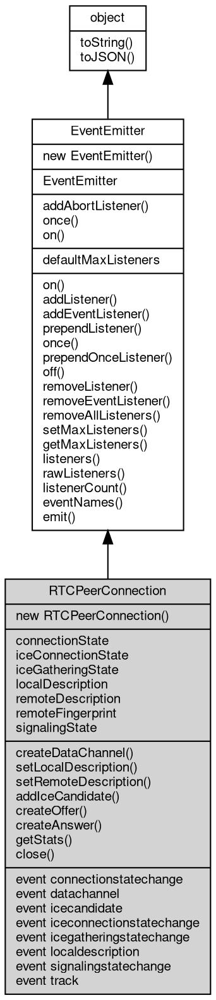

# Object RTCPeerConnection
RTCPeerConnection manages one WebRTC session: it negotiates the session through descriptions, gathers ICE candidates and hosts the data channels that carry the application data

The class is the entry point of the [rtc](../../module/ifs/rtc.md) [module](../../module/ifs/module.md) and the only [object](object.md) that talks to the network;
every data channel, session description and ICE candidate belongs to it. Use it whenever two
endpoints must talk directly - browser to browser, browser to fibjs, fibjs to fibjs - and a
central relay is not required.

Concepts:

- **Session description (SDP)**: a text document that describes the session, made of origin and
  timing lines, the DTLS fingerprint, the ICE credentials, one `m=` line per data channel or
  media stream and a candidate list. `createOffer`/`createAnswer` produce it and
  `setLocalDescription`/`setRemoteDescription` apply it; it travels as a plain [object](object.md) with the
  fields `type`, `sdp` and `usernameFragment` (see [RTCSessionDescription](RTCSessionDescription.md) for the wrapper class).
- **ICE**: after a description is applied, candidates are gathered from the local interfaces,
  exchanged through the application and checked pair by pair; the first pair that succeeds
  carries the DTLS handshake and then the SCTP association that data channels use. Two peers that
  can reach each other need host candidates only; STUN and TURN servers extend the reach to NATed
  peers.
- **Negotiation direction**: the offerer creates a data channel and calls `createOffer`, the
  answerer applies the offer and calls `createAnswer`, and both sides then trickle their
  candidates to each other. None of this is transported in band: descriptions and candidates must
  be carried by the application through its own signaling channel.
- **Lifecycle**: `connectionState` reaches `connected` after ICE and DTLS complete, then the
  channels emit `open` and carry messages. `close()` releases the session, the [process](../../module/ifs/process.md) hold
  installed by a remote description and every channel of the connection.

Obtained from:
- `new [rtc.RTCPeerConnection](../../module/ifs/rtc.md#RTCPeerConnection)(options)` — creates a session, optionally with ICE servers,
  certificates, a fixed local port and forced ICE credentials.

Example 1 — connect two peers in one [process](../../module/ifs/process.md) and echo a text message:

```JavaScript
const rtc = require('rtc');
const coroutine = require('coroutine');

const pc1 = new rtc.RTCPeerConnection({
    iceServers: []
});
const pc2 = new rtc.RTCPeerConnection({
    iceServers: []
});
const toPc1 = [];
const toPc2 = [];
pc1.onicecandidate = (ev) => {
    if (ev.candidate) toPc2.push(ev.candidate);
};
pc2.onicecandidate = (ev) => {
    if (ev.candidate) toPc1.push(ev.candidate);
};
pc1.onconnectionstatechange = (ev) => console.log('pc1 is', ev.state);

const dc1 = pc1.createDataChannel('chat');
pc2.ondatachannel = (ev) => {
    const dc2 = ev.channel;
    dc2.onmessage = (mev) => dc2.send('echo: ' + mev.data);
};

let reply = null;
dc1.onopen = () => dc1.send('hello');
dc1.onmessage = (ev) => {
    reply = ev.data;
};

pc1.createOffer()
    .then((offer) => pc1.setLocalDescription(offer).then(() => pc2.setRemoteDescription(offer)))
    .then(() => pc2.createAnswer())
    .then((answer) => pc2.setLocalDescription(answer).then(() => pc1.setRemoteDescription(answer)))
    .then(() => {
        const deadline = Date.now() + 8000;
        while (reply === null && Date.now() < deadline) {
            while (toPc1.length) pc1.addIceCandidate(toPc1.shift());
            while (toPc2.length) pc2.addIceCandidate(toPc2.shift());
            coroutine.sleep(10);
        }
        pc1.close();
        pc2.close();
        if (reply !== 'echo: hello') {
            console.error('the peers did not exchange a message');
            process.exit(1);
        }
        console.log(reply); // echo: hello
    })
    .catch((err) => {
        console.error(err.message);
        process.exit(1);
    });
```

Example 2 — carry binary data and observe the channel close:

```JavaScript
const rtc = require('rtc');
const coroutine = require('coroutine');

const pc1 = new rtc.RTCPeerConnection({
    iceServers: []
});
const pc2 = new rtc.RTCPeerConnection({
    iceServers: []
});
const toPc1 = [];
const toPc2 = [];
pc1.onicecandidate = (ev) => {
    if (ev.candidate) toPc2.push(ev.candidate);
};
pc2.onicecandidate = (ev) => {
    if (ev.candidate) toPc1.push(ev.candidate);
};

const dc1 = pc1.createDataChannel('binary');
let dc2 = null;
let closed = false;
dc1.onclose = () => {
    closed = true;
};
pc2.ondatachannel = (ev) => {
    dc2 = ev.channel;
    dc2.onmessage = (mev) => {
        console.log('peer received a Buffer:', Buffer.isBuffer(mev.data));
        dc2.close();
    };
};

let reply = null;
dc1.onopen = () => dc1.send(Buffer.from([1, 2, 3]));
dc1.onmessage = (ev) => {
    reply = ev.data;
};

pc1.createOffer()
    .then((offer) => pc1.setLocalDescription(offer).then(() => pc2.setRemoteDescription(offer)))
    .then(() => pc2.createAnswer())
    .then((answer) => pc2.setLocalDescription(answer).then(() => pc1.setRemoteDescription(answer)))
    .then(() => {
        const deadline = Date.now() + 8000;
        while (!closed && Date.now() < deadline) {
            while (toPc1.length) pc1.addIceCandidate(toPc1.shift());
            while (toPc2.length) pc2.addIceCandidate(toPc2.shift());
            coroutine.sleep(10);
        }
        console.log('pc1 states:', pc1.connectionState,
            pc1.iceConnectionState, pc1.signalingState);
        // pc1 states: connected connected stable
        pc1.close();
        pc2.close();
        if (!closed) {
            console.error('the peer did not close the channel');
            process.exit(1);
        }
    })
    .catch((err) => {
        console.error(err.message);
        process.exit(1);
    });
```

Example 3 — inspect a locally generated offer and its candidates, without a peer:

```JavaScript
const rtc = require('rtc');
const coroutine = require('coroutine');

const pc = new rtc.RTCPeerConnection({
    iceServers: []
});
pc.onicecandidate = (ev) => {
    if (ev.candidate) console.log('candidate', ev.candidate.type, ev.candidate.transport);
};
const dc = pc.createDataChannel('chat');
console.log('id before open:', dc.id); // id before open: 65535

pc.createOffer().then((offer) => {
    console.log('offer type:', offer.type); // offer type: offer
    console.log('plain object:', !(offer instanceof rtc.RTCSessionDescription));
    // plain object: true
    console.log('first line:', offer.sdp.split('\r\n')[0]); // first line: v=0
    return pc.setLocalDescription(offer);
}).then(() => {
    const deadline = Date.now() + 5000;
    while (pc.iceGatheringState !== 'complete' && Date.now() < deadline)
        coroutine.sleep(10);
    console.log('gathering:', pc.iceGatheringState); // gathering: complete
    console.log('signaling:', pc.signalingState); // signaling: have-local-offer
    pc.close();
}).catch((err) => {
    console.error(err.message);
    process.exit(1);
});
```

Notes:

- fibjs exposes data channels only: there is no `addTrack`, `addTransceiver` or media API, so
  the `track` event never fires.
- The state properties and descriptions are plain values rather than the MDN [object](object.md) graph: see
  each property for the exact shape.
- A connection with a remote description holds the [process](../../module/ifs/process.md) alive until `close()`; `close()` on a
  dead connection is safe and idempotent.

## Inheritance

```dot
digraph {
    node [fontname="Helvetica,sans-Serif", fontsize=10, shape="record", style="filled", fillcolor="white"];

    object [tooltip="object", URL="object.md", label="{object|toString()\ltoJSON()\l}"];
    EventEmitter [tooltip="EventEmitter", URL="EventEmitter.md", label="{EventEmitter|new EventEmitter()\l|EventEmitter\l|addAbortListener()\lonce()\lon()\l|defaultMaxListeners\l|on()\laddListener()\laddEventListener()\lprependListener()\lonce()\lprependOnceListener()\loff()\lremoveListener()\lremoveEventListener()\lremoveAllListeners()\lsetMaxListeners()\lgetMaxListeners()\llisteners()\lrawListeners()\llistenerCount()\leventNames()\lemit()\l}"];
    RTCPeerConnection [tooltip="RTCPeerConnection", fillcolor="lightgray", id="me", label="{RTCPeerConnection|new RTCPeerConnection()\l|connectionState\liceConnectionState\liceGatheringState\llocalDescription\lremoteDescription\lremoteFingerprint\lsignalingState\l|createDataChannel()\lsetLocalDescription()\lsetRemoteDescription()\laddIceCandidate()\lcreateOffer()\lcreateAnswer()\lgetStats()\lclose()\l|event connectionstatechange\levent datachannel\levent icecandidate\levent iceconnectionstatechange\levent icegatheringstatechange\levent localdescription\levent signalingstatechange\levent track\l}"];

    object -> EventEmitter [dir=back];
    EventEmitter -> RTCPeerConnection [dir=back];
}
```

## Constructors
        
### RTCPeerConnection
**constructs a new WebRTC connection [object](object.md) and initializes the basic parameters**

```JavaScript
new RTCPeerConnection(Object options = {});
```

Parameters:
* options: Object, initialization parameters

Creates the underlying peer connection immediately: the DTLS certificate and the ICE agent
are prepared at construction, before any description exists. The options [object](object.md) accepts the
following fields; fields that are not given keep the library default:

options supports the following options:

```JavaScript
// fragment: options
({
    "certificateType": "ecdsa", // 'default' | 'ecdsa' (default) | 'rsa'; unknown -> 20024
    "iceTransportPolicy": "all", // 'all' (default) | 'relay'; unknown -> 20024
    "iceServers": [], // [{ urls: 'stun:host:port', username: '', credential: '' }]
    "maxMessageSize": 262144, // largest SCTP message accepted from the peer
    "enableIceUdpMux": false, // multiplex ICE and DTLS on one UDP port (rtc.listen)
    "disableFingerprintVerification": false, // skip DTLS verification (insecure, tests only)
    "bindAddress": "", // local address to bind, empty binds every interface
    "port": 0, // fixed local UDP port, 0 uses the ephemeral range
    "iceUfrag": "", // forced local ICE username sent in the description
    "icePwd": "", // forced local ICE password, used with iceUfrag
    "certPem": "", // certificate as PEM text or as a path to a PEM file
    "keyPem": "", // private key as PEM text or as a path to a PEM file
    "keyPass": "" // passphrase of an encrypted private key file
})
```

When `iceServers` is omitted the constructor registers the public server
`stun:stun.l.google.com:19302`, so a session may try to reach that host; pass `iceServers: []`
for a fully local connection. In an entry `urls` is a string or an array of strings and
`username`/`credential` are sent when the URL is a TURN address. `port` fixes the local UDP
port (otherwise the library picks one between 1024 and 65535) and `bindAddress` restricts the
interfaces used for candidate gathering.

`certPem` and `keyPem` accept either the PEM text or a [path](../../module/ifs/path.md) to a PEM file and must be given
together: giving only one of them, or material that cannot be read, aborts the [process](../../module/ifs/process.md) in the
underlying library instead of raising a JavaScript error. `iceUfrag`/`icePwd` override the
generated ICE credentials and are needed when answering a peer whose description is built by
the application itself (see [rtc.listen](../../module/ifs/rtc.md#listen)).

## Static Methods
        
### addAbortListener
**Registers a one-shot abort handler on an [AbortSignal](AbortSignal.md)**

```JavaScript
static Object RTCPeerConnection.addAbortListener(EventEmitter signal,
    Function(Object ev) func);
```

Parameters:
* signal: [EventEmitter](EventEmitter.md), the [AbortSignal](AbortSignal.md) [object](object.md) to listen to
* func: Function(Object ev), the handler for the abort event

Returns:
* Object, returns a Disposable [object](object.md) containing a `[Symbol.dispose]` method

The handler is called at most once when the signal is aborted, and it is removed from the
signal afterwards. If the signal is already aborted the handler is invoked synchronously.
The returned [object](object.md) has a `[Symbol.dispose]()` method that removes the handler, so it can be
released before the abort happens.

Example — abort handling with automatic cleanup:

```JavaScript
const events = require('events');

const controller = new AbortController();
const disposable = events.addAbortListener(controller.signal,
    () => console.log('aborted'));

controller.abort(); // aborted
disposable[Symbol.dispose](); // safe to call after the listener fired
console.log(controller.signal.listenerCount('abort')); // 0
```

--------------------------
### once
**Creates a Promise resolved by the next occurrence of an event**

```JavaScript
static Object RTCPeerConnection.once(EventEmitter emitter,
    Value ev,
    Object options = {});
```

Parameters:
* emitter: [EventEmitter](EventEmitter.md), the event emitter [object](object.md) to listen to
* ev: Value, the event name to listen for
* options: Object, optional parameter [object](object.md)

Returns:
* Object, returns a Promise that resolves with the array of event parameters

The Promise resolves with the array of the emit arguments when the event fires; it rejects
when `error` is emitted while waiting, unless the waited event is `error` itself, or when
the signal option aborts. The temporary listeners are removed when the Promise settles.

options supports the following option:

```JavaScript
// fragment: options
({
    "signal": null // AbortSignal; aborting rejects the Promise with an AbortError
});
```

Example — awaiting the next occurrence of an event:

```JavaScript
const EventEmitter = require('events');

(async () => {
    const emitter = new EventEmitter();
    const waiting = EventEmitter.once(emitter, 'ready');

    emitter.emit('ready', 200, 'ok');
    console.log(JSON.stringify(await waiting)); // [200,"ok"]
})();
```

--------------------------
### on
**Creates an async iterator that yields event occurrences**

```JavaScript
static Object RTCPeerConnection.on(EventEmitter emitter,
    Value ev,
    Object options = {});
```

Parameters:
* emitter: [EventEmitter](EventEmitter.md), the event emitter [object](object.md) to listen to
* ev: Value, the event name to listen for
* options: Object, optional parameter [object](object.md)

Returns:
* Object, returns an AsyncIterator [object](object.md)

Each next() resolves with `{ value: [args...], done: false }` when the event fires and with
`{ done: true }` after an event named in the `close` option fires or the signal aborts; an
`error` event rejects the pending call. The listeners are registered when the iterator is
created and removed when the iteration ends or the signal aborts.

options supports the following options:

```JavaScript
// fragment: options
({
    "signal": null, // AbortSignal; aborting rejects pending and future next() calls
    "close": [] // event names; the first one to fire ends the iteration
});
```

Example — iterating the occurrences of an event:

```JavaScript
const EventEmitter = require('events');

(async () => {
    const emitter = new EventEmitter();
    const iterator = EventEmitter.on(emitter, 'data', {
        close: ['end']
    });

    emitter.emit('data', 1);
    emitter.emit('data', 2);
    emitter.emit('end');

    for await (const args of iterator)
    console.log(JSON.stringify(args)); // [1] then [2]
})();
```

## Static Properties
        
### defaultMaxListeners
**Integer, The [process](../../module/ifs/process.md)-wide default listener limit reported by getMaxListeners()**

```JavaScript
static Integer RTCPeerConnection.defaultMaxListeners;
```

Defaults to 10. Assigning a value changes getMaxListeners() for every emitter that never
called setMaxListeners(); an emitter with an explicit limit keeps it. The limit is
informational: fibjs never warns when the number of listeners exceeds it.

## Properties
        
### connectionState
**String, gets the connection state of the peer connection**

```JavaScript
readonly String RTCPeerConnection.connectionState;
```

Possible values are `new`, `connecting`, `connected`, `disconnected`, `failed` and `closed`.
The value read right after `close()` may still be `connected` until the transition event is
processed; watch `connectionstatechange` for the effective changes.

--------------------------
### iceConnectionState
**String, gets the ICE connection state**

```JavaScript
readonly String RTCPeerConnection.iceConnectionState;
```

Possible values are `new`, `checking`, `connected`, `completed`, `failed`, `disconnected`
and `closed`. It follows the connectivity checks of the candidate pairs and is announced by
`iceconnectionstatechange`.

--------------------------
### iceGatheringState
**String, gets the ICE gathering state**

```JavaScript
readonly String RTCPeerConnection.iceGatheringState;
```

Possible values are `new`, `in-progress` and `complete`. Gathering normally completes within
a fraction of a second when only host candidates are needed; the transport already tries the
gathered candidates while more arrive (trickle ICE). The change is announced by
`icegatheringstatechange`.

--------------------------
### localDescription
**Object, gets the local description of the session**

```JavaScript
readonly Object RTCPeerConnection.localDescription;
```

Returns a plain [object](object.md) with the fields `type`, `sdp` and, when the description has one,
`usernameFragment`; it is `undefined` before a local description is applied. The value is not
an [RTCSessionDescription](RTCSessionDescription.md) instance, wrap it with `new [rtc.RTCSessionDescription](../../module/ifs/rtc.md#RTCSessionDescription)(...)` when a
class instance is required. The `sdp` is regenerated by the library, so it is the effective
description rather than the exact text that was passed in.

--------------------------
### remoteDescription
**Object, gets the remote description of the session**

```JavaScript
readonly Object RTCPeerConnection.remoteDescription;
```

Returns a plain [object](object.md) with the fields `type`, `sdp` and, when the description has one,
`usernameFragment`; it is `undefined` until `setRemoteDescription` succeeds. Like
`localDescription` it is a plain value, not an [RTCSessionDescription](RTCSessionDescription.md) instance.

--------------------------
### remoteFingerprint
**Object, gets the DTLS certificate fingerprint of the remote peer**

```JavaScript
readonly Object RTCPeerConnection.remoteFingerprint;
```

Returns a plain [object](object.md) `{ algorithm, fingerprint }`, for example
`{ algorithm: 'SHA-256', fingerprint: '4A:...' }`. Before a remote description is applied the
[object](object.md) still exists but holds the library default (`algorithm: 'SHA-1'` and an empty
fingerprint), and it only becomes meaningful once the DTLS transport is connected. The
member is a fibjs extension: MDN exposes the remote certificates through
`RTCPeerConnection.getRemoteCertificates()`, which fibjs does not implement.

--------------------------
### signalingState
**String, gets the signaling state of the connection**

```JavaScript
readonly String RTCPeerConnection.signalingState;
```

Possible values are `stable`, `have-local-offer`, `have-remote-offer`, `have-local-pranswer`
and `have-remote-pranswer`. Any other value of the underlying library is reported as
`unknown`; in particular fibjs never reports `closed`, because closing the connection does
not reset the signaling state.

## Methods
        
### createDataChannel
**creates a new channel linked to a remote peer**

```JavaScript
RTCDataChannel RTCPeerConnection.createDataChannel(String label,
    Object options = {});
```

Parameters:
* label: String, channel name
* options: Object, channel parameters

Returns:
* [RTCDataChannel](RTCDataChannel.md), returns the created channel [object](object.md)

Creates a data channel on this connection and, unless it is negotiated, announces it to the
peer, where it appears as a `datachannel` event. A channel can carry arbitrary data: file
transfers, text chat, game update packets and so on.

options supports the following options:

```JavaScript
// fragment: options
({
    "ordered": true, // false allows unordered delivery and lowers latency
    "maxPacketLifeTime": 0, // milliseconds a message may be retransmitted, 0 disables it
    "maxRetransmits": 0, // retransmissions allowed per message, 0 disables them
    "protocol": "", // subprotocol name exposed to the peer
    "negotiated": false, // true creates the channel without in-band negotiation
    "id": 0 // channel id, applied by fibjs even when negotiated is false
})
```

The standard treats `maxPacketLifeTime` and `maxRetransmits` as mutually exclusive; fibjs
forwards both when both are given and the library applies its own precedence. An explicit
`id` is returned by `RTCDataChannel.id` immediately, while a channel without one reports
65535 until the id is negotiated. Wrong option [types](../../module/ifs/types.md) throw 20005.

Example — create a channel and inspect it before the connection starts:

```JavaScript
const rtc = require('rtc');

const pc = new rtc.RTCPeerConnection({
    iceServers: []
});
const dc = pc.createDataChannel('chat', {
    ordered: false,
    protocol: 'json'
});
console.log(dc.label); // chat
console.log(dc.protocol); // json
console.log(dc.id); // 65535: no id has been negotiated yet
pc.close();
```

--------------------------
### setLocalDescription
**changes the local description associated with the connection**

```JavaScript
RTCPeerConnection.setLocalDescription() promise;
```

The no-argument overload resolves immediately and changes nothing; it exists for API
compatibility with the standard, where it would apply an implicitly created offer or answer.
fibjs requires the description produced by `createOffer` to be passed explicitly, see the
other overload.

--------------------------
**changes the local description associated with the connection**

```JavaScript
RTCPeerConnection.setLocalDescription(RTCSessionDescription | Object description) promise;
```

Parameters:
* description: [RTCSessionDescription](RTCSessionDescription.md) | Object, the session description

Applies the local description of the session. Only an `offer` has an effect: the library
takes the offer created by `createOffer`, announces it to the peer and starts gathering
candidates, and the `sdp` field of the argument is not re-parsed. An `answer` or `pranswer`
resolves without changing anything, because the library creates and applies the answer when
the remote offer is set. Applying an offer to a connection with nothing to negotiate (no
data channel or track) rejects with 20024.

The description may be an [RTCSessionDescription](RTCSessionDescription.md) [object](object.md), or a plain [object](object.md) with the same
`type` and `sdp` fields, which is converted through the [RTCSessionDescription](RTCSessionDescription.md) constructor
(both fields are then required).

--------------------------
### setRemoteDescription
**changes the remote description associated with the connection**

```JavaScript
RTCPeerConnection.setRemoteDescription(RTCSessionDescription | Object description) promise;
```

Parameters:
* description: [RTCSessionDescription](RTCSessionDescription.md) | Object, the session description

Applies the description received from the peer: the SDP is parsed and its ICE credentials,
DTLS fingerprint and media lines are taken over by the connection. A remote description also
installs a hold on the [process](../../module/ifs/process.md), so the connection keeps running until `close()` is called.
A description without an ICE user fragment, or text that is not a valid SDP, rejects with
20024.

The description may be an [RTCSessionDescription](RTCSessionDescription.md) [object](object.md), or a plain [object](object.md) with the same
`type` and `sdp` fields, which is converted through the [RTCSessionDescription](RTCSessionDescription.md) constructor
(both fields are then required).

--------------------------
### addIceCandidate
**adds an ICE candidate received from the remote peer**

```JavaScript
RTCPeerConnection.addIceCandidate(RTCIceCandidate | Object candidate) promise;
```

Parameters:
* candidate: [RTCIceCandidate](RTCIceCandidate.md) | Object, the ICE candidate

Passes one candidate of the peer to the ICE agent. The candidate string is validated and a
remote description must already be set, otherwise the call rejects with 20024 - candidates
that arrive early must be queued by the application until the description is applied. The
value is copied out of the argument, so both the [RTCIceCandidate](RTCIceCandidate.md) class and the plain objects
delivered by the `icecandidate` event are accepted; the latter already carry `transport`,
`address` and `port`.

The candidate may be an [RTCIceCandidate](RTCIceCandidate.md) [object](object.md), or a plain [object](object.md) with the same `candidate`
and `sdpMid` fields, which is converted through the [RTCIceCandidate](RTCIceCandidate.md) constructor (both fields
are then required, and the MDN `sdpMLineIndex` field is ignored).

--------------------------
### createOffer
**creates an Offer description used to initiate a connection**

```JavaScript
Variant RTCPeerConnection.createOffer(Object options = {}) promise;
```

Parameters:
* options: Object, options [object](object.md), not yet supported, only for compatibility

Returns:
* Variant, returns the description [object](object.md)

Resolves with the local offer once the library has generated it. The offer is a plain [object](object.md)
of the shape `{ type: 'offer', sdp, usernameFragment }`, not an [RTCSessionDescription](RTCSessionDescription.md)
instance; wrap it with `new [rtc.RTCSessionDescription](../../module/ifs/rtc.md#RTCSessionDescription)(offer)` when the signaling channel
needs a class instance. The connection must have something to negotiate - at least one data
channel - otherwise the returned promise never settles and keeps the [process](../../module/ifs/process.md) alive. The
offer is generated once: later calls resolve with the same description. The options [object](object.md) is
accepted for compatibility with the standard but is ignored.

--------------------------
### createAnswer
**creates an Answer description used to answer a connection**

```JavaScript
Variant RTCPeerConnection.createAnswer(Object options = {}) promise;
```

Parameters:
* options: Object, options [object](object.md), not yet supported, only for compatibility

Returns:
* Variant, returns the description [object](object.md)

Resolves with the local answer, a plain [object](object.md) of the same shape as the offer
(`{ type: 'answer', sdp, usernameFragment }`). The answer exists only after the peer's offer
has been applied with `setRemoteDescription`: the library generates it at that moment, so a
call made before it only registers a waiter and the promise never settles on a connection
that has not seen an offer. Repeated calls resolve with the same answer. The options [object](object.md)
is accepted for compatibility with the standard but is ignored.

--------------------------
### getStats
**gets the statistics of the connection**

```JavaScript
NMap RTCPeerConnection.getStats() promise;
```

Returns:
* NMap, returns the statistics

Resolves with an NMap - a Map subclass, so use `size`, `get(id)` and `entries()` rather than
property access - that holds four plain objects:
   - `RTCIceCandidate_<local id>` - the selected local candidate, `type: 'localcandidate'`,
     with `candidateType`, `ip` and `port`;
   - `RTCIceCandidate_<remote id>` - the selected remote candidate, `type: 'remotecandidate'`;
   - `RTCIceCandidatePair_<local id>_<remote id>` - the selected pair, with
     `state: 'succeeded'`, `nominated`, `writable`, `bytesSent`, `bytesReceived`,
     `totalRoundTripTime` and `currentRoundTripTime`;
   - `RTCTransport_0_1` - the transport, with `dtlsState: 'connected'`,
     `selectedCandidatePairId` and `selectedCandidatePairChanges`.

Every entry also carries `id`, `type` and a `timestamp` in milliseconds. The counters start
at 0 and grow with the traffic; the round-trip times are 0 until the first connectivity check
completes.

A candidate pair must have been selected before the call: invoking this method before
`connectionState` becomes `connected` aborts the [process](../../module/ifs/process.md) inside the underlying library (an
uncaught C++ `std::bad_optional_access` that JavaScript cannot catch), so call it only after
the connection is up.

Example — inspect the statistics of a connected pair:

```JavaScript
const rtc = require('rtc');
const coroutine = require('coroutine');

const pc1 = new rtc.RTCPeerConnection({
    iceServers: []
});
const pc2 = new rtc.RTCPeerConnection({
    iceServers: []
});
const toPc1 = [];
const toPc2 = [];
pc1.onicecandidate = (ev) => {
    if (ev.candidate) toPc2.push(ev.candidate);
};
pc2.onicecandidate = (ev) => {
    if (ev.candidate) toPc1.push(ev.candidate);
};
let connected = false;
pc1.onconnectionstatechange = (ev) => {
    connected = ev.state === 'connected';
};

pc1.createDataChannel('stats');
pc1.createOffer()
    .then((offer) => pc1.setLocalDescription(offer)
        .then(() => pc2.setRemoteDescription(offer)))
    .then(() => pc2.createAnswer())
    .then((answer) => pc2.setLocalDescription(answer)
        .then(() => pc1.setRemoteDescription(answer)))
    .then(() => {
        const deadline = Date.now() + 8000;
        while (!connected && Date.now() < deadline) {
            while (toPc1.length) pc1.addIceCandidate(toPc1.shift());
            while (toPc2.length) pc2.addIceCandidate(toPc2.shift());
            coroutine.sleep(10);
        }
        if (!connected) throw new Error('the peers did not connect');
        return pc1.getStats();
    })
    .then((stats) => {
        const types = [];
        for (const stat of stats.values()) types.push(stat.type);
        console.log('entries:', stats.size, types.sort().join(', '));
        // entries: 4 candidate-pair, localcandidate, remotecandidate, transport
        const pairId = Array.from(stats.keys())
            .find((id) => id.startsWith('RTCIceCandidatePair_'));
        console.log('pair state:', stats.get(pairId).state); // pair state: succeeded
        pc1.close();
        pc2.close();
    })
    .catch((err) => {
        console.error(err.message);
        process.exit(1);
    });
```

--------------------------
### close
**closes the connection and releases all resources**

```JavaScript
RTCPeerConnection.close();
```

Closes the peer connection: channels that are not open yet are closed, the [process](../../module/ifs/process.md) hold
installed by a remote description is released and the state moves to `closed`, which is
announced by `connectionstatechange`. The call returns immediately and may be repeated; a
closed connection cannot be reused or reopened.

--------------------------
### on
**Appends an event handler to the emitter**

```JavaScript
Object RTCPeerConnection.on(Value ev,
    Function(...args) func);
```

Parameters:
* ev: Value, the event name to bind
* func: Function(...args), the event handler function, called with the emit arguments

Returns:
* Object, returns the event [object](object.md) itself for chaining

The listener is called with the arguments of emit() and `this` set to the emitter; the
emitter itself is returned so registrations can be chained. The same function may be
registered several times for one event and each copy is called. See the class documentation
for the dispatch order.

--------------------------
**Appends several event handlers to the emitter**

```JavaScript
Object RTCPeerConnection.on(Object map);
```

Parameters:
* map: Object, the event mapping; [object](object.md) property names are used as event names

Returns:
* Object, returns the event [object](object.md) itself for chaining

Every enumerable property of the map whose value is a function is registered under its
property name. Properties are processed in order; a value that is not a function makes the
call fail with an invalid-type error while entries processed before it stay registered.

Example — registering several handlers at once:

```JavaScript
const EventEmitter = require('events');

const emitter = new EventEmitter();
emitter.on({
    connect: () => console.log('connect'),
    close: () => console.log('close')
});

emitter.emit('connect'); // connect
emitter.emit('close'); // close
```

--------------------------
### addListener
**Appends an event handler to the emitter**

```JavaScript
Object RTCPeerConnection.addListener(Value ev,
    Function(...args) func);
```

Parameters:
* ev: Value, the event name to bind
* func: Function(...args), the event handler function

Returns:
* Object, returns the event [object](object.md) itself for chaining

Alias of on(ev, func), provided for Node.js compatibility.

--------------------------
**Appends several event handlers to the emitter**

```JavaScript
Object RTCPeerConnection.addListener(Object map);
```

Parameters:
* map: Object, the event mapping; [object](object.md) property names are used as event names

Returns:
* Object, returns the event [object](object.md) itself for chaining

Alias of on(map), provided for Node.js compatibility.

--------------------------
### addEventListener
**Appends an event handler to the emitter with an options [object](object.md)**

```JavaScript
Object RTCPeerConnection.addEventListener(Value ev,
    Function(...args) func,
    Object options = {});
```

Parameters:
* ev: Value, the event name to bind
* func: Function(...args), the event handler function, called with the emit arguments
* options: Object, the options of the event handler

Returns:
* Object, returns the event [object](object.md) itself for chaining

Web-style alias of on(); the only supported option is `once`, which registers a one-shot
handler exactly like once(). The listener receives the plain emit arguments and not an [Event](Event.md)
[object](object.md); see the [DOMEvent](DOMEvent.md) class for the DOM-style event [object](object.md) used by [AbortSignal](AbortSignal.md) and
fetch-style APIs.

options supports the following option:

```JavaScript
// fragment: options
({
    "once": false // when true, the handler is removed before its single invocation
});
```

Example — a one-shot DOM-style registration:

```JavaScript
const EventEmitter = require('events');

const emitter = new EventEmitter();
emitter.addEventListener('ping', () => console.log('ping'), {
    once: true
});

emitter.emit('ping'); // ping
console.log(emitter.emit('ping')); // false
console.log(emitter.listenerCount('ping')); // 0
```

--------------------------
### prependListener
**Inserts an event handler at the front of the queue**

```JavaScript
Object RTCPeerConnection.prependListener(Value ev,
    Function(...args) func);
```

Parameters:
* ev: Value, the event name to bind
* func: Function(...args), the event handler function

Returns:
* Object, returns the event [object](object.md) itself for chaining

The listener is called before the listeners registered with on()/addListener() the next time
the event is emitted. When several prependListener() calls are made, the last one registered
is called first, because every call inserts at the same position.

Example — insertion at the front of the queue:

```JavaScript
const EventEmitter = require('events');

const emitter = new EventEmitter();
emitter.on('order', () => console.log('on'));
emitter.prependListener('order', () => console.log('prepend'));

emitter.emit('order'); // prepend, then on
```

--------------------------
**Inserts several event handlers at the front of the queue**

```JavaScript
Object RTCPeerConnection.prependListener(Object map);
```

Parameters:
* map: Object, the event mapping; [object](object.md) property names are used as event names

Returns:
* Object, returns the event [object](object.md) itself for chaining

Map form of prependListener(); every function property is inserted at the front, so the
properties of the map are called in reverse order.

--------------------------
### once
**Appends a one-shot event handler to the emitter**

```JavaScript
Object RTCPeerConnection.once(Value ev,
    Function(...args) func);
```

Parameters:
* ev: Value, the event name to bind
* func: Function(...args), the event handler function

Returns:
* Object, returns the event [object](object.md) itself for chaining

The handler is wrapped and removes itself from the queue before it is called, so it runs at
most once. off() removes it when passed the original function, listeners() returns the
original function, and rawListeners() returns the internal wrapper whose `_func` property
holds the original. See Example 2 in the class documentation.

--------------------------
**Appends several one-shot event handlers to the emitter**

```JavaScript
Object RTCPeerConnection.once(Object map);
```

Parameters:
* map: Object, the event mapping; [object](object.md) property names are used as event names

Returns:
* Object, returns the event [object](object.md) itself for chaining

Map form of once(); every function property is registered as a one-shot listener under its
property name.

--------------------------
### prependOnceListener
**Inserts a one-shot event handler at the front of the queue**

```JavaScript
Object RTCPeerConnection.prependOnceListener(Value ev,
    Function(...args) func);
```

Parameters:
* ev: Value, the event name to bind
* func: Function(...args), the event handler function

Returns:
* Object, returns the event [object](object.md) itself for chaining

Combines prependListener() and once(): the handler is called first and only once, and it is
removed before its invocation.

--------------------------
**Inserts several one-shot event handlers at the front of the queue**

```JavaScript
Object RTCPeerConnection.prependOnceListener(Object map);
```

Parameters:
* map: Object, the event mapping; [object](object.md) property names are used as event names

Returns:
* Object, returns the event [object](object.md) itself for chaining

Map form of prependOnceListener(); every function property is inserted as a one-shot
listener, and the properties of the map are called in reverse order.

--------------------------
### off
**Removes an event handler from the emitter**

```JavaScript
Object RTCPeerConnection.off(Value ev,
    Function(...args) func);
```

Parameters:
* ev: Value, the event name to unbind
* func: Function(...args), the event handler function

Returns:
* Object, returns the event [object](object.md) itself for chaining

The first matching listener is removed; when the same function was registered several times
only one copy is removed per call, so repeat the call to remove the others. A once() wrapper
is matched by its original function as well. Removing a listener emits the `removeListener`
meta event after the removal.

--------------------------
**Removes all event handlers of one event**

```JavaScript
Object RTCPeerConnection.off(Value ev);
```

Parameters:
* ev: Value, the event name to unbind

Returns:
* Object, returns the event [object](object.md) itself for chaining

Every listener of the event is removed and `removeListener` is emitted once per removed
listener. The call succeeds when the event has no listener.

Example — removing every listener of one event:

```JavaScript
const EventEmitter = require('events');

const emitter = new EventEmitter();
emitter.on('data', () => console.log('first'));
emitter.on('data', () => console.log('second'));

emitter.off('data');
console.log(emitter.emit('data')); // false
```

--------------------------
**Removes several event handlers from the emitter**

```JavaScript
Object RTCPeerConnection.off(Object map);
```

Parameters:
* map: Object, the event mapping; [object](object.md) property names are used as event names

Returns:
* Object, returns the event [object](object.md) itself for chaining

Every enumerable property of the map whose value is a function names an event from which
that function is removed (one copy per event). A value that is not a function makes the call
fail with an invalid-type error.

--------------------------
### removeListener
**Removes an event handler from the emitter**

```JavaScript
Object RTCPeerConnection.removeListener(Value ev,
    Function(...args) func);
```

Parameters:
* ev: Value, the event name to unbind
* func: Function(...args), the event handler function

Returns:
* Object, returns the event [object](object.md) itself for chaining

Alias of off(ev, func), provided for Node.js compatibility.

--------------------------
**Removes all event handlers of one event**

```JavaScript
Object RTCPeerConnection.removeListener(Value ev);
```

Parameters:
* ev: Value, the event name to unbind

Returns:
* Object, returns the event [object](object.md) itself for chaining

Alias of off(ev), provided for Node.js compatibility.

--------------------------
**Removes several event handlers from the emitter**

```JavaScript
Object RTCPeerConnection.removeListener(Object map);
```

Parameters:
* map: Object, the event mapping; [object](object.md) property names are used as event names

Returns:
* Object, returns the event [object](object.md) itself for chaining

Alias of off(map), provided for Node.js compatibility.

--------------------------
### removeEventListener
**Removes an event handler with an options [object](object.md)**

```JavaScript
Object RTCPeerConnection.removeEventListener(Value ev,
    Function(...args) func,
    Object options = {});
```

Parameters:
* ev: Value, the event name to unbind
* func: Function(...args), the event handler function
* options: Object, the options of the event handler, ignored

Returns:
* Object, returns the event [object](object.md) itself for chaining

Web-style alias of off(ev, func); the options [object](object.md) is accepted and ignored, and a once()
wrapper is matched by its original function like off().

--------------------------
### removeAllListeners
**Removes all listeners of one event**

```JavaScript
Object RTCPeerConnection.removeAllListeners(Value ev);
```

Parameters:
* ev: Value, the event name to remove

Returns:
* Object, returns the event [object](object.md) itself for chaining

Equivalent to off(ev): every listener of the event is removed, including once() wrappers
matched by their original function, and `removeListener` is emitted once per removal.

--------------------------
**Removes all listeners of the given events, or of the whole emitter**

```JavaScript
Object RTCPeerConnection.removeAllListeners(Array evs = []);
```

Parameters:
* evs: Array, the event names to remove

Returns:
* Object, returns the event [object](object.md) itself for chaining

An empty array — including the no-argument call, because the parameter defaults to [] —
clears every string-keyed event; symbol-keyed listeners are left in place, unlike Node.js
which removes them too. A non-empty array clears each named event as
removeAllListeners(ev) does.

Example — clearing selected events and the whole emitter:

```JavaScript
const EventEmitter = require('events');

const emitter = new EventEmitter();
emitter.on('a', () => {});
emitter.on('b', () => {});
emitter.on('c', () => {});

emitter.removeAllListeners(['a', 'b']);
console.log(emitter.listenerCount('a'), emitter.listenerCount('c')); // 0 1

emitter.removeAllListeners();
console.log(emitter.eventNames().length); // 0
```

--------------------------
### setMaxListeners
**Stores a per-emitter listener limit**

```JavaScript
RTCPeerConnection.setMaxListeners(Integer n);
```

Parameters:
* n: Integer, the number of events

The value is reported by getMaxListeners() and is otherwise informational: fibjs never warns
when the number of listeners exceeds it. This member exists for Node.js compatibility. A
negative value throws; 0 is accepted and stored as-is, while Node.js treats 0 as unlimited.

--------------------------
### getMaxListeners
**Returns the listener limit of the emitter**

```JavaScript
Integer RTCPeerConnection.getMaxListeners();
```

Returns:
* Integer, returns the default limit

Returns the value set by setMaxListeners(), or the [process](../../module/ifs/process.md)-wide defaultMaxListeners (10)
when no explicit value was set.

--------------------------
### listeners
**Returns a copy of the listener array of an event**

```JavaScript
Array RTCPeerConnection.listeners(Value ev);
```

Parameters:
* ev: Value, the event name to query

Returns:
* Array, returns the listener array of the specified event

One-shot wrappers are unwrapped, so the result contains the functions passed to
on()/once() and can be passed to off(); an unknown event produces an empty array.

Example — once() listeners are returned unwrapped:

```JavaScript
const EventEmitter = require('events');

const emitter = new EventEmitter();

function onTick() {
    console.log('tick');
}

emitter.once('tick', onTick);
console.log(emitter.listeners('tick')[0] === onTick); // true
console.log(emitter.rawListeners('tick')[0] === onTick); // false
```

--------------------------
### rawListeners
**Returns the internal listener array of an event**

```JavaScript
Array RTCPeerConnection.rawListeners(Value ev);
```

Parameters:
* ev: Value, the event name to query

Returns:
* Array, returns the listener array of the specified event

The array is not unwrapped: a listener registered with once() appears as the internal
wrapper function whose `_func` property holds the original function. An unknown event
produces an empty array.

--------------------------
### listenerCount
**Returns the number of listeners of an event**

```JavaScript
Integer RTCPeerConnection.listenerCount(Value ev);
```

Parameters:
* ev: Value, the event name to query

Returns:
* Integer, returns the number of listeners of the specified event

One-shot listeners count as one and an unknown event returns 0.

--------------------------
**Returns the number of listeners of an event on another [object](object.md)**

```JavaScript
Integer RTCPeerConnection.listenerCount(Value o,
    Value ev);
```

Parameters:
* o: Value, the [object](object.md) to query
* ev: Value, the event name to query

Returns:
* Integer, returns the number of listeners of the specified event

Counts without requiring the target to be an [EventEmitter](EventEmitter.md): any [object](object.md) with registered
events can be queried. The call is normally written as
`EventEmitter.listenerCount(target, 'data')`.

Example — counting the listeners of another [object](object.md):

```JavaScript
const EventEmitter = require('events');

const emitter = new EventEmitter();
emitter.on('data', () => {});
emitter.on('data', () => {});

console.log(EventEmitter.listenerCount(emitter, 'data')); // 2
```

--------------------------
### eventNames
**Returns the names of the events with at least one listener**

```JavaScript
Array RTCPeerConnection.eventNames();
```

Returns:
* Array, returns the array of event names

Only string-keyed events are reported; symbol-keyed events are omitted and numeric event
names are returned as numbers (Node.js also reports symbol events).

--------------------------
### emit
**Emits an event and returns whether a listener was called**

```JavaScript
Boolean RTCPeerConnection.emit(Value ev,
    ...args);
```

Parameters:
* ev: Value, event name
* args: ..., event parameters, which are passed to the event handler

Returns:
* Boolean, returns whether the event had a listener to respond to it

Listeners are called as described by the dispatch model in the class documentation: the
first one runs synchronously on the current fiber, the remaining ones run in parallel
fibers, and the call returns after all of them finish; an exception raised by a listener is
thrown back to the caller. Emitting `error` with no listener throws instead of returning
false: an Error argument is thrown as-is and any other value is wrapped in
`Error("Unhandled error. (...)")`. [Event](Event.md) names are strings or symbols; `emit()` does not
match a listener registered with a numeric name.

--------------------------
### toString
**Returns the string form of the [object](object.md)**

```JavaScript
String RTCPeerConnection.toString();
```

Returns:
* String, returns the string form of the [object](object.md)

The base implementation reports an error: a native [object](object.md) has no implicit
text form, and only the classes whose value can be written as a string
override the member. [Buffer](Buffer.md) returns its content decoded with the given
[encoding](../../module/ifs/encoding.md), [HttpCookie](HttpCookie.md) returns "name=value", and so on; an override commonly
accepts optional arguments ([Buffer.toString](Buffer.md#toString) takes [encoding](../../module/ifs/encoding.md), start and
end) that are not part of this declaration.

Calling the member on a class that does not override it throws
"<Class>: the [object](object.md) can not be converted to string.", which is the
behavior to rely on when probing whether a value has a string form. See
toJSON for the serialization hook.

--------------------------
### toJSON
**Returns the JSON representation of the [object](object.md)**

```JavaScript
Value RTCPeerConnection.toJSON(String key = "");
```

Parameters:
* key: String, the property name of the value being serialized

Returns:
* Value, returns the JSON-serializable value

JSON.stringify(value) calls value.toJSON(key) when the member exists and
serializes the returned value in its place; the key argument carries the
property name of the value inside its parent [object](object.md) (an empty string at
the top level) and may be used to build a keyed form. The base
implementation returns a plain [object](object.md) holding the readable properties of
the instance, so a native [object](object.md) serializes without per-class code; a
class with a portable shape such as [Buffer](Buffer.md) overrides it, and a JavaScript
class may override it in the same way.

The member is normally reached through JSON.stringify rather than called
directly; calling it returns the same value JSON.stringify would
serialize.

## Events
        
### connectionstatechange
**connection state change event**

```JavaScript
event RTCPeerConnection.connectionstatechange(Object ev);
```

Parameters:
* ev: Object, the event [object](object.md), carrying the new state in its state property

Fired for every transition of `connectionState`; the first firing is the move to
`connecting`, the last one is the move to `closed`. The event [object](object.md) carries the new state
in its `state` property, which equals the property value at that moment.

--------------------------
### datachannel
**data channel event**

```JavaScript
event RTCPeerConnection.datachannel(Object ev);
```

Parameters:
* ev: Object, the event [object](object.md), carrying the data channel in its channel property

Fired when the peer opens a channel in band; the event [object](object.md) carries it in its `channel`
property as an [RTCDataChannel](RTCDataChannel.md). A channel that was created locally with `negotiated: true`
is not announced in band, so it does not fire this event on the peer side.

--------------------------
### icecandidate
**ICE candidate event**

```JavaScript
event RTCPeerConnection.icecandidate(Object ev);
```

Parameters:
* ev: Object, the event [object](object.md), carrying the candidate

Fired for every candidate gathered for the local end, in the order the interfaces are
enumerated. The event [object](object.md) carries the candidate in its `candidate` property as a plain
[object](object.md) with the fields `candidate`, `sdpMid`, `priority`, `type` and, once the candidate is
resolved, `transport`, `address` and `port`. It is not an [RTCIceCandidate](RTCIceCandidate.md) instance, although
the constructor accepts it: `new [rtc.RTCIceCandidate](../../module/ifs/rtc.md#RTCIceCandidate)(ev.candidate)` works. Use
`iceGatheringState === 'complete'` or a timeout to detect the end of gathering, because
fibjs never delivers an end-of-candidates event.

--------------------------
### iceconnectionstatechange
**ICE connection state change event**

```JavaScript
event RTCPeerConnection.iceconnectionstatechange(Object ev);
```

Parameters:
* ev: Object, the event [object](object.md), carrying the new state in its state property

Fired for every transition of `iceConnectionState`, from `checking` through `connected` to
the final state of the connection. The event [object](object.md) carries the new state in its `state`
property.

--------------------------
### icegatheringstatechange
**ICE gathering state change event**

```JavaScript
event RTCPeerConnection.icegatheringstatechange(Object ev);
```

Parameters:
* ev: Object, the event [object](object.md), carrying the new state in its state property

Fired for every transition of `iceGatheringState`. The event [object](object.md) carries the new state in
its `state` property; because the event is dispatched asynchronously, the property may
already show the final value (`complete`) when the handler runs.

--------------------------
### localdescription
**local description event**

```JavaScript
event RTCPeerConnection.localdescription(Object ev);
```

Parameters:
* ev: Object, the event [object](object.md), carrying the local description

Fired whenever the library produces the local description, that is for the offer of the
offering side and for the answer of the answering side. The event [object](object.md) carries the
description in its `description` property, in the same shape as `localDescription`. The
event is a fibjs extension kept for compatibility with the earlier WebRTC API; current MDN
does not define it.

--------------------------
### signalingstatechange
**signaling state change event**

```JavaScript
event RTCPeerConnection.signalingstatechange(Object ev);
```

Parameters:
* ev: Object, the event [object](object.md), carrying the new state in its state property

Fired for every transition of `signalingState`, for example when a local offer moves the
connection to `have-local-offer` and the remote answer returns it to `stable`. The event
[object](object.md) carries the new state in its `state` property.

--------------------------
### track
**media track event, reserved and never emitted by fibjs**

```JavaScript
event RTCPeerConnection.track();
```

The event exists for interface compatibility only: fibjs exposes data channels, there is no
addTrack/addTransceiver API and therefore no remote media track can ever be reported.

