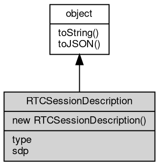

# 对象 RTCSessionDescription
WebRTC 会话描述对象

## 继承关系


## 构造函数
        
### RTCSessionDescription
**构造函数**

```JavaScript
new RTCSessionDescription(Object description = {});
```

调用参数:
* description: Object, 初始化参数

description 初始化参数，支持以下字段：
   - type: 描述类型
   - sdp: 描述字符串

## 成员属性
        
### type
**String, 返回描述类型**

```JavaScript
readonly String RTCSessionDescription.type;
```

--------------------------
### sdp
**String, 返回描述字符串**

```JavaScript
readonly String RTCSessionDescription.sdp;
```

## 成员函数
        
### toString
**返回对象的字符串表示，一般返回 "[Native Object]"，对象可以根据自己的特性重新实现**

```JavaScript
String RTCSessionDescription.toString();
```

返回结果:
* String, 返回对象的字符串表示

--------------------------
### toJSON
**返回对象的 JSON 格式表示，一般返回对象定义的可读属性集合**

```JavaScript
Value RTCSessionDescription.toJSON(String key = "");
```

调用参数:
* key: String, 未使用

返回结果:
* Value, 返回包含可 JSON 序列化的值

