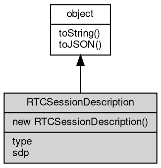

# Object RTCSessionDescription
RTCSessionDescription wraps one session description (SDP) of a WebRTC session

A description is the document a peer offers or answers with. The class holds its `type` and its
`sdp` text and is one of the two [object](object.md) [types](../../module/ifs/types.md) exchanged during signaling (the other one is
[RTCIceCandidate](RTCIceCandidate.md)). The [RTCPeerConnection](RTCPeerConnection.md) methods accept both an instance and a plain [object](object.md) with
the same fields, so the class is mainly useful when the signaling channel must carry a typed
[object](object.md).

Concepts:

- **SDP content**: the text starts with `v=0` and carries the origin, session name and timing
  lines (`o=`, `s=`, `t=`), then one `m=` line per media stream - a data-channel-only session has
  a single `m=application ... UDP/DTLS/SCTP webrtc-datachannel` line - and the attributes that
  matter for connectivity: `a=ice-ufrag`, `a=ice-pwd`, `a=fingerprint`, `a=setup`, `a=mid`,
  `a=candidate` and `a=max-message-size`.
- **Types**: `offer` starts a negotiation, `answer` accepts one, `pranswer` is a provisional
  answer and `rollback` cancels a pending offer; a type the library does not know is reported as
  `unspec`.
- **Normalization**: the constructor parses the text and `sdp` returns the description regenerated
  from the parsed fields, which is not necessarily byte-identical to the input - the origin
  session id is regenerated on every construction, so two round trips of the same text differ.
  Compare parsed content, not strings.
- **Acceptance**: the connection methods take either an instance or a plain [object](object.md) with `type` and
  `sdp`, which is converted through this constructor, so both fields are required either way.

Obtained from:
- `new [rtc.RTCSessionDescription](../../module/ifs/rtc.md#RTCSessionDescription)({ type, sdp })` — wraps one description text, both fields are
  required;
- `createOffer()` and `createAnswer()` — resolve with plain objects of the same shape; wrap them
  when a class instance is needed.

Example 1 — wrap a generated offer and read its media line:

```JavaScript
const rtc = require('rtc');

const pc = new rtc.RTCPeerConnection({
    iceServers: []
});
pc.createDataChannel('chat');

pc.createOffer().then((offer) => {
    const desc = new rtc.RTCSessionDescription(offer);
    console.log(desc.type); // offer
    desc.sdp.split('\r\n').forEach((line) => {
        if (line.startsWith('m=')) console.log(line);
        // m=application 9 UDP/DTLS/SCTP webrtc-datachannel
    });
    console.log('regenerated:', desc.sdp !== offer.sdp); // regenerated: true
    pc.close();
}).catch((err) => {
    console.error(err.message);
    process.exit(1);
});
```

Example 2 — pass an instance to one side of the signaling and a plain [object](object.md) to the other:

```JavaScript
const rtc = require('rtc');
const coroutine = require('coroutine');

const pc1 = new rtc.RTCPeerConnection({
    iceServers: []
});
const pc2 = new rtc.RTCPeerConnection({
    iceServers: []
});
const toPc1 = [];
const toPc2 = [];
pc1.onicecandidate = (ev) => {
    if (ev.candidate) toPc2.push(ev.candidate);
};
pc2.onicecandidate = (ev) => {
    if (ev.candidate) toPc1.push(ev.candidate);
};

const dc1 = pc1.createDataChannel('chat');
let opened = false;
dc1.onopen = () => {
    opened = true;
};
pc2.ondatachannel = () => {};

pc1.createOffer()
    .then((offer) => pc1.setLocalDescription(new rtc.RTCSessionDescription(offer))
        .then(() => pc2.setRemoteDescription(offer)))
    .then(() => pc2.createAnswer())
    .then((answer) => pc2.setLocalDescription(answer)
        .then(() => pc1.setRemoteDescription(new rtc.RTCSessionDescription(answer))))
    .then(() => {
        const deadline = Date.now() + 8000;
        while (!opened && Date.now() < deadline) {
            while (toPc1.length) pc1.addIceCandidate(toPc1.shift());
            while (toPc2.length) pc2.addIceCandidate(toPc2.shift());
            coroutine.sleep(10);
        }
        pc1.close();
        pc2.close();
        if (!opened) {
            console.error('the peers did not connect');
            process.exit(1);
        }
        console.log('connected with typed descriptions');
        // connected with typed descriptions
    })
    .catch((err) => {
        console.error(err.message);
        process.exit(1);
    });
```

Notes:

- fibjs has no string conversion for the class: converting an instance to a string throws 20024.

## Inheritance

```dot
digraph {
    node [fontname="Helvetica,sans-Serif", fontsize=10, shape="record", style="filled", fillcolor="white"];

    object [tooltip="object", URL="object.md", label="{object|toString()\ltoJSON()\l}"];
    RTCSessionDescription [tooltip="RTCSessionDescription", fillcolor="lightgray", id="me", label="{RTCSessionDescription|new RTCSessionDescription()\l|type\lsdp\l}"];

    object -> RTCSessionDescription [dir=back];
}
```

## Constructors
        
### RTCSessionDescription
**constructs a session description [object](object.md) from a description [object](object.md)**

```JavaScript
new RTCSessionDescription(Object description = {});
```

Parameters:
* description: Object, initialization parameter

The description [object](object.md) must contain both `type` (the kind of the description) and `sdp` (the
SDP text, a string; another type throws 20005). A missing field throws TypeError 20002. The
text is parsed at construction, so text the library cannot parse may throw 20024, and an
unknown `type` is accepted and reported as `unspec` by the `type` member.

Example — wrap a short description and read its type:

```JavaScript
const rtc = require('rtc');

const desc = new rtc.RTCSessionDescription({
    type: 'offer',
    sdp: 'v=0\r\n'
});
console.log(desc.type); // offer
```

## Properties
        
### type
**String, gets the type of the description**

```JavaScript
readonly String RTCSessionDescription.type;
```

Returns `offer`, `answer`, `pranswer`, `rollback` or `unspec` for a type the library does not
recognize. The type decides what `RTCPeerConnection.setLocalDescription` does with the
description: fibjs applies an offer only.

--------------------------
### sdp
**String, gets the session description text**

```JavaScript
readonly String RTCSessionDescription.sdp;
```

Returns the SDP regenerated from the parsed fields, not the exact text passed to the
constructor: lines may be normalized or added and the origin session id is regenerated, so
two constructions of the same text can differ. This is the effective description and the
value to send to the peer.

## Methods
        
### toString
**Returns the string form of the [object](object.md)**

```JavaScript
String RTCSessionDescription.toString();
```

Returns:
* String, returns the string form of the [object](object.md)

The base implementation reports an error: a native [object](object.md) has no implicit
text form, and only the classes whose value can be written as a string
override the member. [Buffer](Buffer.md) returns its content decoded with the given
[encoding](../../module/ifs/encoding.md), [HttpCookie](HttpCookie.md) returns "name=value", and so on; an override commonly
accepts optional arguments ([Buffer.toString](Buffer.md#toString) takes [encoding](../../module/ifs/encoding.md), start and
end) that are not part of this declaration.

Calling the member on a class that does not override it throws
"<Class>: the [object](object.md) can not be converted to string.", which is the
behavior to rely on when probing whether a value has a string form. See
toJSON for the serialization hook.

--------------------------
### toJSON
**Returns the JSON representation of the [object](object.md)**

```JavaScript
Value RTCSessionDescription.toJSON(String key = "");
```

Parameters:
* key: String, the property name of the value being serialized

Returns:
* Value, returns the JSON-serializable value

JSON.stringify(value) calls value.toJSON(key) when the member exists and
serializes the returned value in its place; the key argument carries the
property name of the value inside its parent [object](object.md) (an empty string at
the top level) and may be used to build a keyed form. The base
implementation returns a plain [object](object.md) holding the readable properties of
the instance, so a native [object](object.md) serializes without per-class code; a
class with a portable shape such as [Buffer](Buffer.md) overrides it, and a JavaScript
class may override it in the same way.

The member is normally reached through JSON.stringify rather than called
directly; calling it returns the same value JSON.stringify would
serialize.

