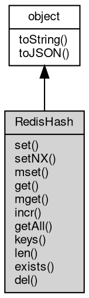

# Object RedisHash
A view of one [Redis](Redis.md) hash key: field and value operations without repeating the key

RedisHash is the [object](object.md) returned by [Redis](Redis.md)#getHash. It captures the key name once and
exposes the hash command family, where every member maps to one H* command: set is HSET,
setNX is HSETNX, mset is HMSET, get is HGET, mget is HMGET, incr is HINCRBY, getAll is
HGETALL, keys is HKEYS, len is HLEN, exists is HEXISTS and del is HDEL. Obtaining the view
sends nothing to the server: the binding is resolved when its members run.

Concepts:

- **A view, not a copy**: the [object](object.md) stores the key only. A hash created after the view
  was obtained is visible through it, and a missing key is not an error - the members
  report the empty result (get returns null, len returns 0, keys returns an empty array)
  until the key exists again.
- **Field and value [types](../../module/ifs/types.md)**: fields and values are declared [Buffer](Buffer.md)|String and a [Buffer](Buffer.md) is
  sent byte-for-byte, so non-UTF-8 data round-trips through set/get. The variadic
  mset/mget/del forms instead convert each argument through its JavaScript string form:
  a number is rejected with error 20005 and a [Buffer](Buffer.md) is decoded as UTF-8 text.
- **Creating and counting**: set, setNX and mset create the key when it is missing, get
  returns null for a missing field, and incr starts from 0 for a missing field. len counts
  the fields and exists tests one of them.
- **Type conflicts**: a member called on a key that holds another type fails with the
  server error (number 20024).

Obtained from:
- `rdb.getHash(key)` — the only factory, where rdb is the [Redis](Redis.md) [object](object.md) returned by
  [db.openRedis](../../module/ifs/db.md#openRedis). The key is captured at call time and may be a [Buffer](Buffer.md).

Example 1 — store, read and count fields:

```JavaScript
// requires: redis
const db = require('db');
const rdb = db.openRedis('redis://127.0.0.1:6379');
const hash = rdb.getHash('user:1');

hash.set('name', 'alice');
hash.set('age', '30');
console.log(hash.get('name').toString()); // alice
console.log(hash.len()); // 2
console.log(hash.exists('age')); // true
console.log(hash.exists('mail')); // false
console.log(hash.get('mail')); // null

rdb.del('user:1');
rdb.close();
```

Example 2 — several fields at once, then an increment:

```JavaScript
// requires: redis
const db = require('db');
const rdb = db.openRedis('redis://127.0.0.1:6379');
const hash = rdb.getHash('scores');

hash.mset({
    math: '90',
    art: '80'
});
hash.mset('physics', '70', 'chemistry', '60');
console.log(hash.len()); // 4
console.log(hash.keys().length); // 4 - HKEYS returns the field names unpaired
console.log(hash.incr('math', 5)); // 95

const values = hash.mget('math', 'missing');
console.log(values[0].toString(), values[1]); // 95 null

rdb.del('scores');
rdb.close();
```

## Inheritance


## Methods
        
### set
**Stores value in field, replacing the previous value**

```JavaScript
RedisHash.set(Buffer | String field,
    Buffer | String value);
```

Parameters:
* field: [Buffer](Buffer.md) | String, the field to write
* value: [Buffer](Buffer.md) | String, the value to store

HSET. The key is created when it is missing and the previous value of the field is
discarded. field and value are sent byte-for-byte as Buffers and as UTF-8 text as
strings. The member reports no result.

--------------------------
### setNX
**Stores value in field only when the field is missing**

```JavaScript
RedisHash.setNX(Buffer | String field,
    Buffer | String value);
```

Parameters:
* field: [Buffer](Buffer.md) | String, the field to write
* value: [Buffer](Buffer.md) | String, the value to store

HSETNX. The command does nothing when the field already exists, and the member reports
no result, so read the field back to know whether the write happened.

--------------------------
### mset
**Stores several field/value pairs at once, replacing the fields**

```JavaScript
RedisHash.mset(Object kvs);
```

Parameters:
* kvs: Object, the field/value pairs to write, as property names and values

HMSET. The property names of kvs are the fields and the property values are the
values, in property order; the command is atomic. Each value is converted through its
JavaScript string form, so a number is rejected with error 20005 and a [Buffer](Buffer.md) is
decoded as UTF-8 text. The member reports no result.

--------------------------
**Stores several field/value pairs at once from a flat argument list**

```JavaScript
RedisHash.mset(...kvs);
```

Parameters:
* kvs: ..., the flat field/value list to write

HMSET. The arguments alternate field and value: mset('a', '1', 'b', '2') is the same
command as mset({ a: '1', b: '2' }); an odd argument count reaches the server, which
rejects the command. Values follow the string conversion of the [object](object.md) form. The
member reports no result.

Example — two fields, then read them back:

```JavaScript
// requires: redis
const db = require('db');
const rdb = db.openRedis('redis://127.0.0.1:6379');
const hash = rdb.getHash('user:1');

hash.mset('name', 'alice', 'mail', 'alice@example.com');
const values = hash.mget('name', 'mail');
console.log(values[0].toString(), values[1].toString()); // alice alice@example.com

rdb.del('user:1');
rdb.close();
```

--------------------------
### get
**Returns the value stored in field**

```JavaScript
Buffer RedisHash.get(Buffer | String field);
```

Parameters:
* field: [Buffer](Buffer.md) | String, the field to read

Returns:
* [Buffer](Buffer.md), the value as a [Buffer](Buffer.md), or null when the field or the key does not exist

HGET. A missing field or a missing key returns null; the value is a [Buffer](Buffer.md).

--------------------------
### mget
**Returns the values of the given fields, one element per field**

```JavaScript
NArray RedisHash.mget(Array fields);
```

Parameters:
* fields: Array, the array of fields to read

Returns:
* NArray, an array with one [Buffer](Buffer.md) or null per field, in the given order

HMGET. A missing field yields null in its position, so the result has the same length
as the field list. The fields go through the JavaScript string conversion of a
variadic argument: a number is rejected with error 20005 and a [Buffer](Buffer.md) is decoded as
UTF-8 text. The values are Buffers.

--------------------------
**Returns the values of the given fields, one element per field**

```JavaScript
NArray RedisHash.mget(...fields);
```

Parameters:
* fields: ..., the fields to read, as a flat argument list

Returns:
* NArray, an array with one [Buffer](Buffer.md) or null per field, in the given order

HMGET. This is the flat form of mget(Array); the two are the same command and both
follow the string conversion described there.

--------------------------
### incr
**Adds num to the integer stored in field**

```JavaScript
Long RedisHash.incr(Buffer | String field,
    Long num = 1);
```

Parameters:
* field: [Buffer](Buffer.md) | String, the field to modify
* num: Long, the amount to add

Returns:
* Long, the value of the field after the addition

HINCRBY. The value is a signed 64-bit integer; a missing field starts at 0 and a
missing key is created, so incr('views') on a new hash returns 1. A value that is not
an integer string or an overflow fails with the server error.

Example — a counter field in an existing hash:

```JavaScript
// requires: redis
const db = require('db');
const rdb = db.openRedis('redis://127.0.0.1:6379');
const hash = rdb.getHash('metrics');

console.log(hash.incr('views')); // 1 - a missing field starts at 0
console.log(hash.incr('views', 9)); // 10

rdb.del('metrics');
rdb.close();
```

--------------------------
### getAll
**Returns every field and value of the hash**

```JavaScript
NArray RedisHash.getAll();
```

Returns:
* NArray, a flat array of alternating field and value Buffers

HGETALL. The result is one flat array that alternates field and value:
[field1, value1, field2, value2, ...], with both as Buffers. The order is chosen by
the server and is not the insertion order; a missing key returns an empty array.

Example — the flat pair layout:

```JavaScript
// requires: redis
const db = require('db');
const rdb = db.openRedis('redis://127.0.0.1:6379');
const hash = rdb.getHash('user:1');

hash.mset({
    name: 'alice',
    age: '30'
});
const pairs = hash.getAll();
console.log(pairs.length); // 4 - two fields, two values
console.log(pairs[0].toString(), pairs[1].toString()); // name alice

rdb.del('user:1');
rdb.close();
```

--------------------------
### keys
**Returns every field name of the hash**

```JavaScript
NArray RedisHash.keys();
```

Returns:
* NArray, an array of the field names as Buffers

HKEYS. Unlike getAll, the field names are returned alone: the result has one element
per field, with no values interleaved. The order is chosen by the server and a missing
key returns an empty array.

--------------------------
### len
**Returns the number of fields in the hash**

```JavaScript
Integer RedisHash.len();
```

Returns:
* Integer, the number of fields

HLEN. A missing key returns 0.

--------------------------
### exists
**Checks whether the hash contains the given field**

```JavaScript
Boolean RedisHash.exists(Buffer | String field);
```

Parameters:
* field: [Buffer](Buffer.md) | String, the field to [test](../../module/ifs/test.md)

Returns:
* Boolean, true when the field exists

HEXISTS. A missing key returns false.

--------------------------
### del
**Removes the given fields from the hash**

```JavaScript
Integer RedisHash.del(Array fields);
```

Parameters:
* fields: Array, the array of fields to remove

Returns:
* Integer, the number of fields that were removed

HDEL. Missing fields are ignored and the number of removed fields is returned. The
fields go through the JavaScript string conversion of a variadic argument: a number is
rejected with error 20005 and a [Buffer](Buffer.md) is decoded as UTF-8 text.

--------------------------
**Removes the given fields from the hash**

```JavaScript
Integer RedisHash.del(...fields);
```

Parameters:
* fields: ..., the fields to remove, as a flat argument list

Returns:
* Integer, the number of fields that were removed

HDEL. This is the flat form of del(Array); the two are the same command and both
follow the string conversion described there.

--------------------------
### toString
**Returns the string form of the [object](object.md)**

```JavaScript
String RedisHash.toString();
```

Returns:
* String, returns the string form of the [object](object.md)

The base implementation reports an error: a native [object](object.md) has no implicit
text form, and only the classes whose value can be written as a string
override the member. [Buffer](Buffer.md) returns its content decoded with the given
[encoding](../../module/ifs/encoding.md), [HttpCookie](HttpCookie.md) returns "name=value", and so on; an override commonly
accepts optional arguments ([Buffer.toString](Buffer.md#toString) takes [encoding](../../module/ifs/encoding.md), start and
end) that are not part of this declaration.

Calling the member on a class that does not override it throws
"<Class>: the [object](object.md) can not be converted to string.", which is the
behavior to rely on when probing whether a value has a string form. See
toJSON for the serialization hook.

--------------------------
### toJSON
**Returns the JSON representation of the [object](object.md)**

```JavaScript
Value RedisHash.toJSON(String key = "");
```

Parameters:
* key: String, the property name of the value being serialized

Returns:
* Value, returns the JSON-serializable value

JSON.stringify(value) calls value.toJSON(key) when the member exists and
serializes the returned value in its place; the key argument carries the
property name of the value inside its parent [object](object.md) (an empty string at
the top level) and may be used to build a keyed form. The base
implementation returns a plain [object](object.md) holding the readable properties of
the instance, so a native [object](object.md) serializes without per-class code; a
class with a portable shape such as [Buffer](Buffer.md) overrides it, and a JavaScript
class may override it in the same way.

The member is normally reached through JSON.stringify rather than called
directly; calling it returns the same value JSON.stringify would
serialize.

