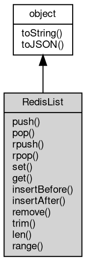

# Object RedisList
A view of one [Redis](Redis.md) list key: element operations without repeating the key in every call

RedisList is the [object](object.md) returned by [Redis](Redis.md)#getList. It captures the key name once and
exposes the list command family, where every member maps to one command: push is LPUSH,
pop is LPOP, rpush is RPUSH, rpop is RPOP, set is LSET, get is LINDEX, insertBefore and
insertAfter are LINSERT, remove is LREM, trim is LTRIM, len is LLEN and range is LRANGE.
Obtaining the view sends nothing to the server: the binding is resolved when its members
run.

Concepts:

- **Two ends**: push inserts at the head and rpush at the tail; pop removes from the head
  and rpop from the tail. A push with several values inserts them one by one at the head,
  so the last argument becomes the first element; an rpush keeps the argument order.
- **Indexes**: get and set count from the head of the list, and a negative index counts
  from the tail (-1 is the last element). get returns null for an index outside the list,
  while set fails with the server error. range(start, stop) and trim(start, stop) take an
  inclusive range at both ends and also accept negative indexes.
- **Removing elements**: remove(count, value) follows the server rule: a positive count
  removes from head to tail, a negative count from tail to head and 0 removes every match.
  insertBefore/insertAfter return the new length, or -1 when the pivot value is not in the
  list.
- **View semantics**: the key is not created by obtaining the view, and a missing key is
  not an error - len returns 0, range returns an empty array, pop returns null. Writing
  members create the list when it is missing, and a key holding another type fails with
  the server error.

Obtained from:
- `rdb.getList(key)` — the only factory, where rdb is the [Redis](Redis.md) [object](object.md) returned by
  [db.openRedis](../../module/ifs/db.md#openRedis). The key is captured at call time and may be a [Buffer](Buffer.md).

Example 1 — the head and tail ends of the list:

```JavaScript
// requires: redis
const db = require('db');
const rdb = db.openRedis('redis://127.0.0.1:6379');
const list = rdb.getList('queue');

list.push('a', 'b', 'c'); // LPUSH: the last argument becomes the head
console.log(list.pop().toString()); // c
list.rpush('d'); // RPUSH appends at the tail
console.log(list.rpop().toString()); // d
console.log(list.len()); // 2

const rest = list.range(0, -1);
console.log(rest[0].toString(), rest[1].toString()); // b a

rdb.del('queue');
rdb.close();
```

Example 2 — random access and editing:

```JavaScript
// requires: redis
const db = require('db');
const rdb = db.openRedis('redis://127.0.0.1:6379');
const list = rdb.getList('log');

list.rpush('start', 'middle', 'end');
list.set(1, 'center');
console.log(list.get(1).toString()); // center
console.log(list.insertBefore('end', 'before-end')); // 4 - the new length
console.log(list.remove(1, 'start')); // 1 - one element removed
list.trim(0, 1);

const rest = list.range(0, -1);
console.log(rest[0].toString(), rest[1].toString()); // center before-end

rdb.del('log');
rdb.close();
```

## Inheritance


## Methods
        
### push
**Inserts values at the head of the list**

```JavaScript
Integer RedisList.push(Array values);
```

Parameters:
* values: Array, the array of values to insert

Returns:
* Integer, the length of the list after the insert

LPUSH. The values are inserted one by one at the head, so the last element of the
array becomes the first element of the list. A missing key is created; the new length
is returned. Each value is converted through its JavaScript string form, so a number
is rejected with error 20005 and a [Buffer](Buffer.md) is decoded as UTF-8 text - insertBefore and
set keep Buffers byte-for-byte.

Example — insert several elements at once:

```JavaScript
// requires: redis
const db = require('db');
const rdb = db.openRedis('redis://127.0.0.1:6379');
const list = rdb.getList('queue');

console.log(list.push('a', 'b', 'c')); // 3
console.log(list.push(['d', 'e'])); // 5
console.log(list.pop().toString()); // e - the last value pushed is at the head

rdb.del('queue');
rdb.close();
```

--------------------------
**Inserts values at the head of the list**

```JavaScript
Integer RedisList.push(...values);
```

Parameters:
* values: ..., the values to insert, as a flat argument list

Returns:
* Integer, the length of the list after the insert

LPUSH. This is the flat form of push(Array); the two are the same command and both
follow the string conversion described there.

--------------------------
### pop
**Removes and returns the head element of the list**

```JavaScript
Buffer RedisList.pop();
```

Returns:
* [Buffer](Buffer.md), the head element as a [Buffer](Buffer.md), or null when the list is empty

LPOP. A missing key returns null; the element is a [Buffer](Buffer.md).

--------------------------
### rpush
**Appends values at the tail of the list**

```JavaScript
Integer RedisList.rpush(Array values);
```

Parameters:
* values: Array, the array of values to append

Returns:
* Integer, the length of the list after the append

RPUSH. The values keep their argument order, so the last element of the array becomes
the last element of the list. A missing key is created; the new length is returned,
and the string conversion of push applies.

--------------------------
**Appends values at the tail of the list**

```JavaScript
Integer RedisList.rpush(...values);
```

Parameters:
* values: ..., the values to append, as a flat argument list

Returns:
* Integer, the length of the list after the append

RPUSH. This is the flat form of rpush(Array); the two are the same command and both
follow the string conversion described there.

--------------------------
### rpop
**Removes and returns the tail element of the list**

```JavaScript
Buffer RedisList.rpop();
```

Returns:
* [Buffer](Buffer.md), the tail element as a [Buffer](Buffer.md), or null when the list is empty

RPOP. A missing key returns null; the element is a [Buffer](Buffer.md).

--------------------------
### set
**Replaces the element at the given index**

```JavaScript
RedisList.set(Integer index,
    Buffer | String value);
```

Parameters:
* index: Integer, the index to write
* value: [Buffer](Buffer.md) | String, the value to store

LSET. A negative index counts from the tail (-1 is the last element). An index outside
the list or a missing key fails with the server error; value is sent byte-for-byte as
a [Buffer](Buffer.md). The member reports no result.

--------------------------
### get
**Returns the element at the given index**

```JavaScript
Buffer RedisList.get(Integer index);
```

Parameters:
* index: Integer, the index to read

Returns:
* [Buffer](Buffer.md), the element as a [Buffer](Buffer.md), or null when the index is outside the list

LINDEX. A negative index counts from the tail (-1 is the last element), and an index
outside the list or a missing key returns null. The element is a [Buffer](Buffer.md).

--------------------------
### insertBefore
**Inserts value just before the first element equal to pivot**

```JavaScript
Integer RedisList.insertBefore(Buffer | String pivot,
    Buffer | String value);
```

Parameters:
* pivot: [Buffer](Buffer.md) | String, the existing value to insert before
* value: [Buffer](Buffer.md) | String, the value to insert

Returns:
* Integer, the length of the list after the insert, -1 when pivot was not found

LINSERT ... BEFORE. When several elements equal pivot, the first one from the head is
used. pivot and value are sent byte-for-byte as Buffers. The new length is returned, or
-1 when pivot is not in the list.

--------------------------
### insertAfter
**Inserts value just after the first element equal to pivot**

```JavaScript
Integer RedisList.insertAfter(Buffer | String pivot,
    Buffer | String value);
```

Parameters:
* pivot: [Buffer](Buffer.md) | String, the existing value to insert after
* value: [Buffer](Buffer.md) | String, the value to insert

Returns:
* Integer, the length of the list after the insert, -1 when pivot was not found

LINSERT ... AFTER. When several elements equal pivot, the first one from the head is
used. pivot and value are sent byte-for-byte as Buffers. The new length is returned, or
-1 when pivot is not in the list.

--------------------------
### remove
**Removes elements equal to value**

```JavaScript
Integer RedisList.remove(Integer count,
    Buffer | String value);
```

Parameters:
* count: Integer, the number of matches to remove, from the head when positive and from the
* value: [Buffer](Buffer.md) | String, the value to remove

Returns:
* Integer, the number of elements that were removed

LREM. count selects which matches are removed: a positive count removes up to that
many elements from the head towards the tail, a negative count from the tail towards
the head and 0 removes every match. The number of removed elements is returned; a
missing key returns 0. value is sent byte-for-byte as a [Buffer](Buffer.md).

--------------------------
### trim
**Keeps only the elements inside the given range**

```JavaScript
RedisList.trim(Integer start,
    Integer stop);
```

Parameters:
* start: Integer, the first index to keep; -1 is the last element
* stop: Integer, the last index to keep; -1 is the last element

LTRIM. Both offsets are inclusive; a negative offset counts from the tail and offsets
outside the list are clamped. A range that selects nothing removes every element, and
the member reports no result.

--------------------------
### len
**Returns the number of elements in the list**

```JavaScript
Integer RedisList.len();
```

Returns:
* Integer, the number of elements

LLEN. A missing key returns 0.

--------------------------
### range
**Returns the elements inside the given range**

```JavaScript
NArray RedisList.range(Integer start,
    Integer stop);
```

Parameters:
* start: Integer, the first index of the range; -1 is the last element
* stop: Integer, the last index of the range; -1 is the last element

Returns:
* NArray, an array of [Buffer](Buffer.md) elements

LRANGE. Both offsets are inclusive and a negative offset counts from the tail (-1 is
the last element), so range(0, -1) returns the whole list. An empty list, a missing key
and a range that selects nothing all return an empty array; the elements are Buffers.

Example — random access with negative indexes:

```JavaScript
// requires: redis
const db = require('db');
const rdb = db.openRedis('redis://127.0.0.1:6379');
const list = rdb.getList('queue');

list.rpush('a', 'b', 'c');
const all = list.range(0, -1);
console.log(all.length); // 3
console.log(all[0].toString(), all[2].toString()); // a c
console.log(list.range(-2, -1).length); // 2 - the last two elements

rdb.del('queue');
rdb.close();
```

--------------------------
### toString
**Returns the string form of the [object](object.md)**

```JavaScript
String RedisList.toString();
```

Returns:
* String, returns the string form of the [object](object.md)

The base implementation reports an error: a native [object](object.md) has no implicit
text form, and only the classes whose value can be written as a string
override the member. [Buffer](Buffer.md) returns its content decoded with the given
[encoding](../../module/ifs/encoding.md), [HttpCookie](HttpCookie.md) returns "name=value", and so on; an override commonly
accepts optional arguments ([Buffer.toString](Buffer.md#toString) takes [encoding](../../module/ifs/encoding.md), start and
end) that are not part of this declaration.

Calling the member on a class that does not override it throws
"<Class>: the [object](object.md) can not be converted to string.", which is the
behavior to rely on when probing whether a value has a string form. See
toJSON for the serialization hook.

--------------------------
### toJSON
**Returns the JSON representation of the [object](object.md)**

```JavaScript
Value RedisList.toJSON(String key = "");
```

Parameters:
* key: String, the property name of the value being serialized

Returns:
* Value, returns the JSON-serializable value

JSON.stringify(value) calls value.toJSON(key) when the member exists and
serializes the returned value in its place; the key argument carries the
property name of the value inside its parent [object](object.md) (an empty string at
the top level) and may be used to build a keyed form. The base
implementation returns a plain [object](object.md) holding the readable properties of
the instance, so a native [object](object.md) serializes without per-class code; a
class with a portable shape such as [Buffer](Buffer.md) overrides it, and a JavaScript
class may override it in the same way.

The member is normally reached through JSON.stringify rather than called
directly; calling it returns the same value JSON.stringify would
serialize.

