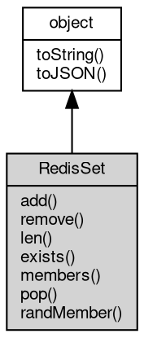

# Object RedisSet
A view of one [Redis](Redis.md) set key: member operations without repeating the key

RedisSet is the [object](object.md) returned by [Redis](Redis.md)#getSet. It captures the key name once and
exposes the set command family, where every member maps to one command: add is SADD,
remove is SREM, len is SCARD, exists is SISMEMBER, members is SMEMBERS, pop is SPOP and
randMember is SRANDMEMBER. Obtaining the view sends nothing to the server: the binding is
resolved when its members run.

Concepts:

- **A view, not a copy**: the [object](object.md) stores the key only and sends no command until one
  of its members runs. A key created after the view was obtained is visible through it,
  and a missing key is not an error - the members report the empty result (len returns 0,
  members returns an empty array, exists returns false, pop returns null) until the key
  exists again.
- **Member bytes**: exists takes a [Buffer](Buffer.md)|String and sends every byte of a [Buffer](Buffer.md) as
  given, while the array and variadic forms of add and remove convert each element
  through its JavaScript string form - a number is rejected with error 20005 and a [Buffer](Buffer.md)
  is rendered as UTF-8 text (bytes that are not valid UTF-8 become U+FFFD). Binary
  members therefore do not round-trip through add and remove.
- **Set semantics**: a set holds unique members in no defined order; add ignores members
  that are already present and returns the number of new ones, remove returns the number
  actually removed and ignores missing members.
- **Random members**: pop removes and returns one random member, while randMember reads
  without removing. The count form caps a positive count at the set size, repeats members
  for a negative count and returns an empty array for a missing key.
- **Type conflicts**: a member called on a key that holds another type fails with the
  server error (number 20024).

Obtained from:
- `rdb.getSet(key)` — the only factory, where rdb is the [Redis](Redis.md) [object](object.md) returned by
  [db.openRedis](../../module/ifs/db.md#openRedis). The key is captured at call time and may be a [Buffer](Buffer.md).

Example 1 — add, count and [test](../../module/ifs/test.md) members:

```JavaScript
// requires: redis
const db = require('db');
const rdb = db.openRedis('redis://127.0.0.1:6379');
const set = rdb.getSet('tags');

console.log(set.add('red', 'green', 'blue')); // 3 - SADD
console.log(set.add('blue')); // 0 - the member is already present
console.log(set.add(['blue', 'black'])); // 1 - the array form is SADD too
console.log(set.len()); // 4
console.log(set.exists('green')); // true
console.log(set.exists('grey')); // false

rdb.del('tags');
rdb.close();
```

Example 2 — read the members and remove some:

```JavaScript
// requires: redis
const db = require('db');
const rdb = db.openRedis('redis://127.0.0.1:6379');
const set = rdb.getSet('tags');

set.add('red', 'green', 'blue');
const all = set.members().map((member) => member.toString()).sort();
console.log(all.join(',')); // blue,green,red - SMEMBERS order is not defined

console.log(set.remove('red', 'grey')); // 1 - grey is not a member
console.log(set.len()); // 2

rdb.del('tags');
rdb.close();
```

Example 3 — random members and a missing key:

```JavaScript
// requires: redis
const db = require('db');
const rdb = db.openRedis('redis://127.0.0.1:6379');
const set = rdb.getSet('tags');

console.log(set.len()); // 0 - the view itself sends nothing, a missing key is empty
console.log(set.members().length); // 0
console.log(set.exists('red')); // false
console.log(set.pop()); // null

const seed = rdb.getSet('seed');
seed.add('a', 'b', 'c');
console.log(seed.randMember(2).length); // 2 - up to two distinct members
console.log(seed.randMember(-5).length); // 5 - repeats are allowed
console.log(seed.pop().toString().length); // 1 - SPOP removes what it returns
console.log(seed.len()); // 2

rdb.del('seed');
rdb.close();
```

## Inheritance


## Methods
        
### add
**Adds one or more members to the set key; members already present are ignored**

```JavaScript
Integer RedisSet.add(Array members);
```

Parameters:
* members: Array, the array of members to add

Returns:
* Integer, the number of new members added, existing members excluded

SADD. This is the array form: every element of members is sent as one member and the
element count is unlimited. A missing key is created. Each element goes through its
JavaScript string form - a number is rejected with error 20005 and a [Buffer](Buffer.md) is
rendered as UTF-8 text - so exists is the way to [test](../../module/ifs/test.md) binary members.

--------------------------
**Adds one or more members to the set key; members already present are ignored**

```JavaScript
Integer RedisSet.add(...members);
```

Parameters:
* members: ..., the members to add, as a flat argument list

Returns:
* Integer, the number of new members added, existing members excluded

SADD. This is the flat form of add(Array): add('a', 'b') is the same command as
add(['a', 'b']), and the arguments follow the same string conversion.

--------------------------
### remove
**Removes one or more members from the set**

```JavaScript
Integer RedisSet.remove(Array members);
```

Parameters:
* members: Array, the array of members to remove

Returns:
* Integer, the number of members removed

SREM. This is the array form; missing members are ignored, and the key is deleted
when its last member goes. Each element goes through the string conversion of add, so
a number is rejected with error 20005 and a [Buffer](Buffer.md) is rendered as UTF-8 text. A
missing key removes nothing and is not an error.

--------------------------
**Removes one or more members from the set**

```JavaScript
Integer RedisSet.remove(...members);
```

Parameters:
* members: ..., the members to remove, as a flat argument list

Returns:
* Integer, the number of members removed

SREM. This is the flat form of remove(Array); the two are the same command and both
follow the string conversion described there.

--------------------------
### len
**Returns the number of members in the set**

```JavaScript
Integer RedisSet.len();
```

Returns:
* Integer, the number of members

SCARD. A missing key counts as an empty set and returns 0.

--------------------------
### exists
**Tests whether member is present in the set**

```JavaScript
Boolean RedisSet.exists(Buffer | String member);
```

Parameters:
* member: [Buffer](Buffer.md) | String, the member to [test](../../module/ifs/test.md)

Returns:
* Boolean, true when the member is present

SISMEMBER. member is a [Buffer](Buffer.md)|String union: a [Buffer](Buffer.md) is sent byte-for-byte, so it can
[test](../../module/ifs/test.md) a binary member that add and remove could not write. A missing key returns false
and is not an error.

Example — byte-exact membership:

```JavaScript
// requires: redis
const db = require('db');
const rdb = db.openRedis('redis://127.0.0.1:6379');
const set = rdb.getSet('tags');

set.add('red');
console.log(set.exists('red')); // true
console.log(set.exists(Buffer.from('red'))); // true - the same member
console.log(set.exists('blue')); // false

rdb.del('tags');
rdb.close();
```

--------------------------
### members
**Returns every member of the set**

```JavaScript
NArray RedisSet.members();
```

Returns:
* NArray, the members as an array of Buffers

SMEMBERS. The result is an array of Buffers in no defined order: the server returns
the members in its internal hash table order, so sort the array when the order
matters. A missing key returns an empty array.

--------------------------
### pop
**Removes and returns one random member**

```JavaScript
Buffer RedisSet.pop();
```

Returns:
* [Buffer](Buffer.md), the removed member as a [Buffer](Buffer.md), or null when the key is missing

SPOP. The member is removed by the command, so a second call never returns it again;
the key is deleted when its last member goes. A missing key returns null, and the
result is a [Buffer](Buffer.md).

--------------------------
### randMember
**Returns one random member without removing it**

```JavaScript
Value RedisSet.randMember();
```

Returns:
* Value, one member as a [Buffer](Buffer.md); guard the empty case, see above

SRANDMEMBER. The member stays in the set, and repeated calls may return any member.
The result is a [Buffer](Buffer.md). When the key is missing the current implementation crashes
the [process](../../module/ifs/process.md) instead of returning null (defect: the nil reply is dereferenced), so
[test](../../module/ifs/test.md) len() first or use the count form, which returns an empty array.

--------------------------
**Returns several random members without removing them**

```JavaScript
Value RedisSet.randMember(Integer count);
```

Parameters:
* count: Integer, the number of members to return; a negative count allows repeats

Returns:
* Value, the members as an array of Buffers, empty when the key is missing

SRANDMEMBER with a count. A positive count returns at most count distinct members
(fewer when the set is smaller); a negative count returns exactly |count| members and
may repeat them; 0 returns an empty array. A missing key returns an empty array, and
the members are not removed. The result is an array of Buffers.

Example — distinct and repeated draws:

```JavaScript
// requires: redis
const db = require('db');
const rdb = db.openRedis('redis://127.0.0.1:6379');
const set = rdb.getSet('tags');

set.add('a', 'b', 'c');
console.log(set.randMember(2).length); // 2 - distinct members
console.log(set.randMember(9).length); // 3 - capped at the set size
console.log(set.randMember(-4).length); // 4 - repeats are allowed
console.log(set.randMember(0).length); // 0

rdb.del('tags');
rdb.close();
```

--------------------------
### toString
**Returns the string form of the [object](object.md)**

```JavaScript
String RedisSet.toString();
```

Returns:
* String, returns the string form of the [object](object.md)

The base implementation reports an error: a native [object](object.md) has no implicit
text form, and only the classes whose value can be written as a string
override the member. [Buffer](Buffer.md) returns its content decoded with the given
[encoding](../../module/ifs/encoding.md), [HttpCookie](HttpCookie.md) returns "name=value", and so on; an override commonly
accepts optional arguments ([Buffer.toString](Buffer.md#toString) takes [encoding](../../module/ifs/encoding.md), start and
end) that are not part of this declaration.

Calling the member on a class that does not override it throws
"<Class>: the [object](object.md) can not be converted to string.", which is the
behavior to rely on when probing whether a value has a string form. See
toJSON for the serialization hook.

--------------------------
### toJSON
**Returns the JSON representation of the [object](object.md)**

```JavaScript
Value RedisSet.toJSON(String key = "");
```

Parameters:
* key: String, the property name of the value being serialized

Returns:
* Value, returns the JSON-serializable value

JSON.stringify(value) calls value.toJSON(key) when the member exists and
serializes the returned value in its place; the key argument carries the
property name of the value inside its parent [object](object.md) (an empty string at
the top level) and may be used to build a keyed form. The base
implementation returns a plain [object](object.md) holding the readable properties of
the instance, so a native [object](object.md) serializes without per-class code; a
class with a portable shape such as [Buffer](Buffer.md) overrides it, and a JavaScript
class may override it in the same way.

The member is normally reached through JSON.stringify rather than called
directly; calling it returns the same value JSON.stringify would
serialize.

