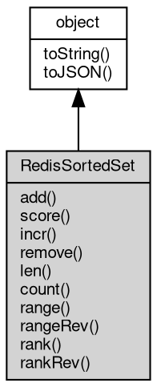

# Object RedisSortedSet
A view of one [Redis](Redis.md) sorted-set key: score-ordered member operations

RedisSortedSet is the [object](object.md) returned by [Redis](Redis.md)#getSortedSet. It captures the key name
once and exposes the sorted-set command family, where every member maps to one command:
add is ZADD, score is ZSCORE, incr is ZINCRBY, remove is ZREM, len is ZCARD, count is
ZCOUNT, range is ZRANGE, rangeRev is ZREVRANGE, rank is ZRANK and rankRev is ZREVRANK.
Obtaining the view sends nothing to the server: the binding is resolved when its members
run.

Concepts:

- **Score model**: every member carries one floating point score, and the set keeps the
  members ordered by score. score and incr return the score as a [Buffer](Buffer.md) holding its
  decimal text, count counts the members inside an inclusive range, and range/rangeRev
  interleave each member with its score when withScores is true.
- **Ranks and ranges**: ascending order gives rank 0 to the lowest score, while rankRev
  counts from the highest. Ties are ordered by the byte order of the member.
  range(start, stop) and rangeRev(start, stop) are inclusive at both ends, and a negative
  index counts from the end (-1 is the last element). A missing member has no score and
  no rank: score returns null, rank and rankRev return null.
- **Score arguments**: the [object](object.md) form maps member property names to score values, while
  the flat form alternates member and score in that order, so add('alice', '3') stores 3
  for alice. Both forms pass every argument through its JavaScript string form: write a
  score as a string, because a number is rejected (error 20005 in the flat form and 20004
  in the [object](object.md) form) and a [Buffer](Buffer.md) is rendered as UTF-8 text. incr takes a number
  increment instead.
- **View semantics**: the key is not created by obtaining the view, and a missing key is
  not an error - len returns 0, range returns an empty array and score returns null.
  Writing members create the key when it is missing, and a key holding another type fails
  with the server error (number 20024).

Obtained from:
- `rdb.getSortedSet(key)` — the only factory, where rdb is the [Redis](Redis.md) [object](object.md) returned by
  [db.openRedis](../../module/ifs/db.md#openRedis). The key is captured at call time and may be a [Buffer](Buffer.md).

Example 1 — build a ranking and read it back:

```JavaScript
// requires: redis
const db = require('db');
const rdb = db.openRedis('redis://127.0.0.1:6379');
const board = rdb.getSortedSet('scores');

console.log(board.add('alice', '3', 'bob', '1', 'carol', '2')); // 3 - ZADD
console.log(board.add('alice', '5')); // 0 - alice is updated, not added
console.log(board.len()); // 3
console.log(board.score('alice').toString()); // 5
console.log(board.range(0, -1).map((m) => m.toString()).join(',')); // bob,carol,alice

rdb.del('scores');
rdb.close();
```

Example 2 — the [object](object.md) form, ranks and increments:

```JavaScript
// requires: redis
const db = require('db');
const rdb = db.openRedis('redis://127.0.0.1:6379');
const board = rdb.getSortedSet('scores');

board.add({
    alice: '3',
    bob: '1',
    carol: '2'
}); // property names, score values
console.log(board.rank('bob')); // 0 - the lowest score
console.log(board.rankRev('bob')); // 2 - the highest score has rankRev 0
console.log(board.incr('bob', 4).toString()); // 5 - ZINCRBY
console.log(board.rank('bob')); // 2 - bob moved to the top
console.log(board.rank('dave')); // null - no such member
console.log(board.score('dave')); // null

rdb.del('scores');
rdb.close();
```

Example 3 — counts, ranges and removals:

```JavaScript
// requires: redis
const db = require('db');
const rdb = db.openRedis('redis://127.0.0.1:6379');
const board = rdb.getSortedSet('scores');

board.add('a', '1', 'b', '2', 'c', '3', 'd', '4');
console.log(board.count(2, 3)); // 2 - ZCOUNT includes both ends
console.log(board.count(5, 9)); // 0
console.log(board.range(1, 2).map((m) => m.toString()).join(',')); // b,c
console.log(board.rangeRev(0, 1).map((m) => m.toString()).join(',')); // d,c
console.log(board.range(0, 1, true).map((m) => m.toString()).join(',')); // a,1,b,2
console.log(board.remove('a', 'd')); // 2 - ZREM
console.log(board.len()); // 2

rdb.del('scores');
rdb.close();
```

## Inheritance


## Methods
        
### add
**Adds members with their scores, or updates the scores of members present**

```JavaScript
Integer RedisSortedSet.add(Object sms);
```

Parameters:
* sms: Object, the member/score pairs to add, as property names and values

Returns:
* Integer, the number of new members added, updated members excluded

ZADD. The property names of sms are the members and the property values are their
scores; the command is atomic. A member that is already present only has its score
updated, and the return value counts the new members alone. The score values pass
through their JavaScript string form, so write each score as a string: a number makes
the call fail with error 20004, and a [Buffer](Buffer.md) is rendered as UTF-8 text.

Example — members as property names:

```JavaScript
// requires: redis
const db = require('db');
const rdb = db.openRedis('redis://127.0.0.1:6379');
const board = rdb.getSortedSet('scores');

console.log(board.add({
    alice: '3',
    bob: '1'
})); // 2 - two new members
console.log(board.score('bob').toString()); // 1

rdb.del('scores');
rdb.close();
```

--------------------------
**Adds members with their scores, or updates the scores of members present**

```JavaScript
Integer RedisSortedSet.add(...sms);
```

Parameters:
* sms: ..., the member and score pairs to add, as a flat argument list

Returns:
* Integer, the number of new members added, updated members excluded

ZADD. This is the flat form of add(Object): the arguments alternate member and score,
so add('alice', '3') stores 3 for alice. An odd argument count fails with error 20004
(the command needs pairs), and the scores follow the string conversion described for
the [object](object.md) form - a number is rejected with error 20005.

--------------------------
### score
**Returns the score of member as text**

```JavaScript
Buffer RedisSortedSet.score(Buffer | String member);
```

Parameters:
* member: [Buffer](Buffer.md) | String, the member to query

Returns:
* [Buffer](Buffer.md), the score as a [Buffer](Buffer.md), or null when the member is missing

ZSCORE. The result is a [Buffer](Buffer.md) holding the decimal text of the score ("3", "2.5"),
and null when the member or the key is missing. member is a [Buffer](Buffer.md)|String union: a
[Buffer](Buffer.md) is sent byte-for-byte.

--------------------------
### incr
**Adds num to the score of member and returns the new score**

```JavaScript
Buffer RedisSortedSet.incr(Buffer | String member,
    Long num = 1);
```

Parameters:
* member: [Buffer](Buffer.md) | String, the member to change
* num: Long, the amount to add; may be negative

Returns:
* [Buffer](Buffer.md), the new score as a [Buffer](Buffer.md)

ZINCRBY. A missing member is created with score 0 before the addition, so the first
incr on it returns num itself, and num may be negative. The result is a [Buffer](Buffer.md)
holding the new score as decimal text. member is a [Buffer](Buffer.md)|String union and is sent as
given.

Example — move a member up the ranking:

```JavaScript
// requires: redis
const db = require('db');
const rdb = db.openRedis('redis://127.0.0.1:6379');
const board = rdb.getSortedSet('scores');

board.add('alice', '3');
console.log(board.incr('alice').toString()); // 4 - num defaults to 1
console.log(board.incr('alice', -6).toString()); // -2
console.log(board.incr('dave', 5).toString()); // 5 - a missing member starts at 0
console.log(board.rank('dave')); // 1

rdb.del('scores');
rdb.close();
```

--------------------------
### remove
**Removes one or more members from the sorted set**

```JavaScript
Integer RedisSortedSet.remove(Array members);
```

Parameters:
* members: Array, the array of members to remove

Returns:
* Integer, the number of members removed

ZREM. This is the array form; missing members are ignored, and the key is deleted
when its last member goes. Each element goes through its JavaScript string form, so a
number is rejected with error 20005 and a [Buffer](Buffer.md) is rendered as UTF-8 text. A missing
key removes nothing and is not an error.

--------------------------
**Removes one or more members from the sorted set**

```JavaScript
Integer RedisSortedSet.remove(...members);
```

Parameters:
* members: ..., the members to remove, as a flat argument list

Returns:
* Integer, the number of members removed

ZREM. This is the flat form of remove(Array); the two are the same command and both
follow the string conversion described there.

--------------------------
### len
**Returns the number of members in the sorted set**

```JavaScript
Integer RedisSortedSet.len();
```

Returns:
* Integer, the number of members

ZCARD. A missing key counts as an empty sorted set and returns 0.

--------------------------
### count
**Counts the members whose score is between min and max**

```JavaScript
Integer RedisSortedSet.count(Integer min,
    Integer max);
```

Parameters:
* min: Integer, the lowest score to count, included
* max: Integer, the highest score to count, included

Returns:
* Integer, the number of members inside the range

ZCOUNT. Both ends are included, and min and max are integers (a fractional argument
is truncated) - the scores themselves may be fractional. A missing key counts 0.

--------------------------
### range
**Returns the members in the given range, from the lowest score up**

```JavaScript
NArray RedisSortedSet.range(Integer start,
    Integer stop,
    Boolean withScores = false);
```

Parameters:
* start: Integer, the first index of the range; a negative index counts from the end
* stop: Integer, the last index of the range; a negative index counts from the end
* withScores: Boolean, whether to interleave each member with its score

Returns:
* NArray, the array of Buffers in ascending score order

ZRANGE. start and stop are inclusive indexes into the ascending order (rank 0 is the
lowest score); a negative index counts from the end, so range(0, -1) returns every
member. withScores interleaves each member with its score: [member1, score1,
member2, score2, ...], both as Buffers. A missing key, or a range outside the set,
returns an empty array.

Example — a page of the ranking, with and without scores:

```JavaScript
// requires: redis
const db = require('db');
const rdb = db.openRedis('redis://127.0.0.1:6379');
const board = rdb.getSortedSet('scores');

board.add('a', '1', 'b', '2', 'c', '3', 'd', '4');
console.log(board.range(1, 2).map((m) => m.toString()).join(',')); // b,c
const pairs = board.range(0, 1, true);
console.log(pairs.map((m) => m.toString()).join(',')); // a,1,b,2
console.log(board.range(9, 10).length); // 0

rdb.del('scores');
rdb.close();
```

--------------------------
### rangeRev
**Returns the members in the given range, from the highest score down**

```JavaScript
NArray RedisSortedSet.rangeRev(Integer start,
    Integer stop,
    Boolean withScores = false);
```

Parameters:
* start: Integer, the first index of the range; a negative index counts from the end
* stop: Integer, the last index of the range; a negative index counts from the end
* withScores: Boolean, whether to interleave each member with its score

Returns:
* NArray, the array of Buffers in descending score order

ZREVRANGE. This is range with the descending score order: start 0 is the member with
the highest score, and withScores interleaves member and score the same way. A
missing key, or a range outside the set, returns an empty array.

--------------------------
### rank
**Returns the ascending rank of member**

```JavaScript
Integer RedisSortedSet.rank(Buffer | String member);
```

Parameters:
* member: [Buffer](Buffer.md) | String, the member to query

Returns:
* Integer, the rank, or null when the member is missing

ZRANK. The rank is the 0-based position in ascending score order (0 is the lowest
score), with ties ordered by the member bytes. A missing member or key returns null
even though the declared type is Integer. member is sent byte-for-byte when it is a
[Buffer](Buffer.md).

--------------------------
### rankRev
**Returns the descending rank of member**

```JavaScript
Integer RedisSortedSet.rankRev(Buffer | String member);
```

Parameters:
* member: [Buffer](Buffer.md) | String, the member to query

Returns:
* Integer, the rank, or null when the member is missing

ZREVRANK. The rank is the 0-based position in descending score order (0 is the
highest score), so rankRev is the mirror image of rank. A missing member or key
returns null even though the declared type is Integer. member is sent byte-for-byte
when it is a [Buffer](Buffer.md).

--------------------------
### toString
**Returns the string form of the [object](object.md)**

```JavaScript
String RedisSortedSet.toString();
```

Returns:
* String, returns the string form of the [object](object.md)

The base implementation reports an error: a native [object](object.md) has no implicit
text form, and only the classes whose value can be written as a string
override the member. [Buffer](Buffer.md) returns its content decoded with the given
[encoding](../../module/ifs/encoding.md), [HttpCookie](HttpCookie.md) returns "name=value", and so on; an override commonly
accepts optional arguments ([Buffer.toString](Buffer.md#toString) takes [encoding](../../module/ifs/encoding.md), start and
end) that are not part of this declaration.

Calling the member on a class that does not override it throws
"<Class>: the [object](object.md) can not be converted to string.", which is the
behavior to rely on when probing whether a value has a string form. See
toJSON for the serialization hook.

--------------------------
### toJSON
**Returns the JSON representation of the [object](object.md)**

```JavaScript
Value RedisSortedSet.toJSON(String key = "");
```

Parameters:
* key: String, the property name of the value being serialized

Returns:
* Value, returns the JSON-serializable value

JSON.stringify(value) calls value.toJSON(key) when the member exists and
serializes the returned value in its place; the key argument carries the
property name of the value inside its parent [object](object.md) (an empty string at
the top level) and may be used to build a keyed form. The base
implementation returns a plain [object](object.md) holding the readable properties of
the instance, so a native [object](object.md) serializes without per-class code; a
class with a portable shape such as [Buffer](Buffer.md) overrides it, and a JavaScript
class may override it in the same way.

The member is normally reached through JSON.stringify rather than called
directly; calling it returns the same value JSON.stringify would
serialize.

