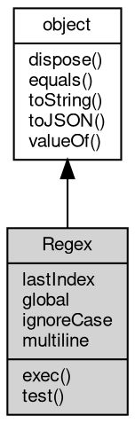

# 对象 Regex
正则表达式对象

## 继承关系


## 成员属性
        
### lastIndex
**Integer, 查询和设置下次匹配的起始位置**

```JavaScript
Integer Regex.lastIndex;
```

--------------------------
### global
**Boolean, 查询正则表达式是否具有标志 "g"。它声明了给定的正则表达式是否执行全局匹配。如果 g 标志被设置，则该属性为 true，否则为 false**

```JavaScript
readonly Boolean Regex.global;
```

--------------------------
### ignoreCase
**Boolean, 查询正则表达式是否设置 "i" 标志。如果设置了 "i" 标志，则返回 true，否则返回 false**

```JavaScript
readonly Boolean Regex.ignoreCase;
```

--------------------------
### multiline
**Boolean, 查询正则表达式正则表达式是否具有标志 m。它声明了给定的正则表达式是否以多行模式执行模式匹配。在这种模式中，如果要检索的字符串中含有换行符，^ 和 $ 锚除了匹配字符串的开头和结尾外还匹配每行的开头和结尾**

```JavaScript
readonly Boolean Regex.multiline;
```

## 成员函数
        
### exec
**检索字符串中的正则表达式的匹配**

```JavaScript
Array Regex.exec(String str);
```

调用参数:
* str: String, 要检索的字符串

返回结果:
* Array, 返回一个数组，其中存放匹配的结果。如果未找到匹配，则返回值为 null

--------------------------
### test
**检测一个字符串是否匹配某个模式**

```JavaScript
Boolean Regex.test(String str);
```

调用参数:
* str: String, 要检索的字符串

返回结果:
* Boolean, 如果字符串 str 中含有匹配的文本，则返回 true，否则返回 false

--------------------------
### dispose
**强制回收对象，调用此方法后，对象资源将立即释放**

```JavaScript
Regex.dispose();
```

--------------------------
### equals
**比较当前对象与给定的对象是否相等**

```JavaScript
Boolean Regex.equals(object expected);
```

调用参数:
* expected: object, 制定比较的目标对象

返回结果:
* Boolean, 返回对象比较的结果

--------------------------
### toString
**返回对象的字符串表示，一般返回 "[Native Object]"，对象可以根据自己的特性重新实现**

```JavaScript
String Regex.toString();
```

返回结果:
* String, 返回对象的字符串表示

--------------------------
### toJSON
**返回对象的 JSON 格式表示，一般返回对象定义的可读属性集合**

```JavaScript
Value Regex.toJSON(String key = "");
```

调用参数:
* key: String, 未使用

返回结果:
* Value, 返回包含可 JSON 序列化的值

--------------------------
### valueOf
**返回对象本身的数值**

```JavaScript
Value Regex.valueOf();
```

返回结果:
* Value, 返回对象本身的数值

