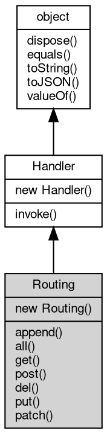

# 对象 Routing
消息处理器路由对象

路由对象根据设定的规则匹配消息，将消息传递给符合规则的第一个处理器。后加入的路由规则优先匹配。创建方法：

```JavaScript
var routing = new mq.Routing({
    "^/func1(/.*)$": func1,
    "^/func2(/.*)$": func2
});
```

正则表达式匹配的项目修改消息的 value 属性，子项目存入消息的 params 属性。例如：

```JavaScript
var routing = new mq.Routing({
    "^/func1(/([0-9]+)/([0-9]+)\.html)$": func1,
});
```

匹配消息 "/func1/123/456.html" 后，value == "/123/456.html"，params == ["123", "456"];

如果匹配的结果没有子项，则 value 为空，params 为空。例如：

```JavaScript
var routing = new mq.Routing({
    "^/func1/[0-9]+/[0-9]+\.html$": func1,
});
```

匹配消息 "/func1/123/456.html" 后，value == ""，params == [];

如果匹配的结果第一级有多个子项，则 value 为空，params 为第一级子项。例如：

```JavaScript
var routing = new mq.Routing({
    "^/func1/([0-9]+)/([0-9]+)\.html$": func1,
});
```

匹配消息 "/func1/123/456.html" 后，value == ""，params == ["123", "456"];

如果匹配的结果只有一个子项，并且无下级子项，则 value 和 params 均为此子项。例如：

```JavaScript
var routing = new mq.Routing({
    "^/func1/([0-9]+)/[0-9]+\.html$": func1,
});
```

匹配消息 "/func1/123/456.html" 后，value == "123"，params == ["123"];

## 继承关系


## 构造函数
        
### Routing
**创建一个消息处理器路由对象**

```JavaScript
new Routing(Object map = {});
```

调用参数:
* map: Object, 初始化路由参数

--------------------------
**创建一个消息处理器路由对象**

```JavaScript
new Routing(String method,
    Object map);
```

调用参数:
* method: String, 指定 [http](../../module/ifs/http.md) 请求方法，"*" 接受所有方法
* map: Object, 初始化路由参数

## 成员函数
        
### append
**从已有路由对象中添加规则，添加后原路由将被清空**

```JavaScript
Routing.append(Routing route);
```

调用参数:
* route: Routing, 已经初始化的路由对象

--------------------------
**添加一组路由规则**

```JavaScript
Routing.append(Object map);
```

调用参数:
* map: Object, 路由参数

--------------------------
**添加一条路由规则**

```JavaScript
Routing.append(String pattern,
    Handler hdlr);
```

调用参数:
* pattern: String, 消息匹配格式
* hdlr: [Handler](Handler.md), 内置消息处理器，处理函数，链式处理数组，路由对象，详见 [mq.Handler](../../module/ifs/mq.md#handler)

--------------------------
**添加一组路由规则**

```JavaScript
Routing.append(String method,
    Object map);
```

调用参数:
* method: String, 指定 [http](../../module/ifs/http.md) 请求方法，"*" 接受所有方法
* map: Object, 路由参数

--------------------------
**添加一条路由规则**

```JavaScript
Routing.append(String method,
    String pattern,
    Handler hdlr);
```

调用参数:
* method: String, 指定 [http](../../module/ifs/http.md) 请求方法，"*" 接受所有方法
* pattern: String, 消息匹配格式
* hdlr: [Handler](Handler.md), 内置消息处理器，处理函数，链式处理数组，路由对象，详见 [mq.Handler](../../module/ifs/mq.md#handler)

--------------------------
### all
**添加一组接受所有 [http](../../module/ifs/http.md) 方法路由规则**

```JavaScript
Routing.all(Object map);
```

调用参数:
* map: Object, 路由参数

--------------------------
**添加一条接受所有 [http](../../module/ifs/http.md) 方法路由规则**

```JavaScript
Routing.all(String pattern,
    Handler hdlr);
```

调用参数:
* pattern: String, 消息匹配格式
* hdlr: [Handler](Handler.md), 内置消息处理器，处理函数，链式处理数组，路由对象，详见 [mq.Handler](../../module/ifs/mq.md#handler)

--------------------------
### get
**添加一组 GET 方法路由规则**

```JavaScript
Routing.get(Object map);
```

调用参数:
* map: Object, 路由参数

--------------------------
**添加一条接受 [http](../../module/ifs/http.md) GET 方法路由规则**

```JavaScript
Routing.get(String pattern,
    Handler hdlr);
```

调用参数:
* pattern: String, 消息匹配格式
* hdlr: [Handler](Handler.md), 内置消息处理器，处理函数，链式处理数组，路由对象，详见 [mq.Handler](../../module/ifs/mq.md#handler)

--------------------------
### post
**添加一组接受 [http](../../module/ifs/http.md) POST 方法路由规则**

```JavaScript
Routing.post(Object map);
```

调用参数:
* map: Object, 路由参数

--------------------------
**添加一条接受 [http](../../module/ifs/http.md) POST 方法路由规则**

```JavaScript
Routing.post(String pattern,
    Handler hdlr);
```

调用参数:
* pattern: String, 消息匹配格式
* hdlr: [Handler](Handler.md), 内置消息处理器，处理函数，链式处理数组，路由对象，详见 [mq.Handler](../../module/ifs/mq.md#handler)

--------------------------
### del
**添加一组接受 [http](../../module/ifs/http.md) DELETE 方法路由规则**

```JavaScript
Routing.del(Object map);
```

调用参数:
* map: Object, 路由参数

--------------------------
**添加一条接受 [http](../../module/ifs/http.md) DELETE 方法路由规则**

```JavaScript
Routing.del(String pattern,
    Handler hdlr);
```

调用参数:
* pattern: String, 消息匹配格式
* hdlr: [Handler](Handler.md), 内置消息处理器，处理函数，链式处理数组，路由对象，详见 [mq.Handler](../../module/ifs/mq.md#handler)

--------------------------
### put
**添加一组 PUT 方法路由规则**

```JavaScript
Routing.put(Object map);
```

调用参数:
* map: Object, 路由参数

--------------------------
**添加一条接受 [http](../../module/ifs/http.md) PUT 方法路由规则**

```JavaScript
Routing.put(String pattern,
    Handler hdlr);
```

调用参数:
* pattern: String, 消息匹配格式
* hdlr: [Handler](Handler.md), 内置消息处理器，处理函数，链式处理数组，路由对象，详见 [mq.Handler](../../module/ifs/mq.md#handler)

--------------------------
### patch
**添加一组 PATCH 方法路由规则**

```JavaScript
Routing.patch(Object map);
```

调用参数:
* map: Object, 路由参数

--------------------------
**添加一条接受 [http](../../module/ifs/http.md) PATCH 方法路由规则**

```JavaScript
Routing.patch(String pattern,
    Handler hdlr);
```

调用参数:
* pattern: String, 消息匹配格式
* hdlr: [Handler](Handler.md), 内置消息处理器，处理函数，链式处理数组，路由对象，详见 [mq.Handler](../../module/ifs/mq.md#handler)

--------------------------
### invoke
**处理一个消息或对象**

```JavaScript
Handler Routing.invoke(object v) async;
```

调用参数:
* v: [object](object.md), 指定处理的消息或对象

返回结果:
* [Handler](Handler.md), 返回下一步的处理器

--------------------------
### dispose
**强制回收对象，调用此方法后，对象资源将立即释放**

```JavaScript
Routing.dispose();
```

--------------------------
### equals
**比较当前对象与给定的对象是否相等**

```JavaScript
Boolean Routing.equals(object expected);
```

调用参数:
* expected: [object](object.md), 制定比较的目标对象

返回结果:
* Boolean, 返回对象比较的结果

--------------------------
### toString
**返回对象的字符串表示，一般返回 "[Native Object]"，对象可以根据自己的特性重新实现**

```JavaScript
String Routing.toString();
```

返回结果:
* String, 返回对象的字符串表示

--------------------------
### toJSON
**返回对象的 JSON 格式表示，一般返回对象定义的可读属性集合**

```JavaScript
Value Routing.toJSON(String key = "");
```

调用参数:
* key: String, 未使用

返回结果:
* Value, 返回包含可 JSON 序列化的值

--------------------------
### valueOf
**返回对象本身的数值**

```JavaScript
Value Routing.valueOf();
```

返回结果:
* Value, 返回对象本身的数值

