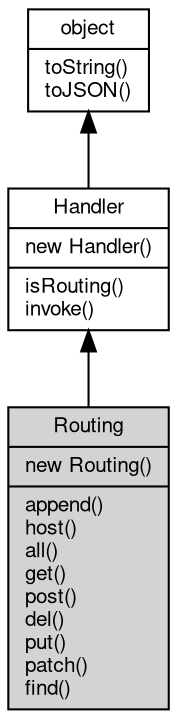

# Object Routing
Matches a message against routing rules and dispatches it to the first match

Routing is the center of [http](../../module/ifs/http.md) message handling: it matches the value of a
message (the request address by default, the host name for host rules) and
forwards the message to the handler of the first matching rule. A plain [object](object.md)
of patterns used as a handler is converted into a Routing, so
`new [mq.Routing](../../module/ifs/mq.md#Routing)(map)` and a routing map [object](object.md) are the same thing.

Concepts:
- **Pattern syntax**: a rule pattern is an express-style [path](../../module/ifs/path.md) when it does not
  start with `^`: literal text matches itself, `:name` captures one [path](../../module/ifs/path.md)
  segment (`[^/]+`), `*` matches the rest of the [path](../../module/ifs/path.md), `(...)` embeds a
  regular expression, and `?`, `+`, `*` make the preceding part optional or
  repeating; a pattern that starts with `^` is used as a raw regular
  expression (case-insensitive, UCP). A trailing slash of the pattern is
  ignored.
- **Captures**: the captured groups are URL-decoded and stored in the params
  array of the message; `:name` groups also appear as keys on params and as
  the extra arguments of the handler (`(req, ...captures)`). The value is
  replaced by the last capture when the rule hands the rest of the [path](../../module/ifs/path.md) to a
  nested routing, by the single capture when the match has exactly one
  top-level group, and cleared otherwise.
- **Ordering**: a rule added later is matched first, so add the general rule
  before the specific one when the specific one must win. append(route)
  copies the rules of another Routing with their relative order and empties
  the source.
- **Method and host**: the get/post/put/del/patch/find helpers (and the method
  argument of append) accept only the given [http](../../module/ifs/http.md) method, `"*"` accepts every
  method and `"host"` matches the Host header instead of the address; a host
  pattern matches the labels of the host name with `*` and ignores the port.
- **[Handler](Handler.md) forms**: the value of a rule may be a [Handler](Handler.md) [object](object.md), an array of
  handlers (a [Chain](Chain.md)), a function `(req, ...captures) => any` (an [http](../../module/ifs/http.md) request
  also receives its response as the last argument), a routing map [object](object.md) or a
  [path](../../module/ifs/path.md)/address string.
- **No match**: [mq.invoke](../../module/ifs/mq.md#invoke) raises `Routing: unknown routing: <value>` when no
  rule matches, so a message never continues silently.

Obtained from:
- `new [mq.Routing](../../module/ifs/mq.md#Routing)(map)` / `new [mq.Routing](../../module/ifs/mq.md#Routing)()` — the constructors below;
- any plain [object](object.md) passed where a handler is expected is converted into a
  Routing through the [Handler](Handler.md) constructor.

Example 1 — method helpers, named captures and the wildcard:

```JavaScript
const mq = require('mq');
const http = require('http');

const app = new mq.Routing();
app.get('/hello/:name', (req, name) => console.log('hello ' + name));
app.post('/users/:id(\\d+)', (req, id) => console.log('user ' + id));
app.get('/files/*', (req, path) => console.log('file ' + path));

const req = new http.Request();
req.value = '/hello/fibjs';
mq.invoke(app, req); // hello fibjs

req.value = '/users/42';
req.method = 'POST';
mq.invoke(app, req); // user 42

req.method = 'GET';
req.value = '/files/a/b.txt';
mq.invoke(app, req); // file a/b.txt
```

Example 2 — an [http](../../module/ifs/http.md) server with routes, using port 0 and stop():

```JavaScript
const mq = require('mq');
const http = require('http');

const app = new mq.Routing();
app.get('/hello/:name', (req, name) => {
    req.response.write('hello ' + name);
});
app.get('/api/:id(\\d+)', (req, id) => {
    req.response.json({
        id: Number(id)
    });
});

const svr = new http.Server(0, app);
svr.start();

const port = svr.socket.localPort;

const hello = http.getSync('http://127.0.0.1:' + port + '/hello/fibjs');
console.log(hello.readAll().toString()); // hello fibjs

const api = http.getSync('http://127.0.0.1:' + port + '/api/42');
console.log(JSON.stringify(api.json())); // {"id":42}

svr.stop();
```

Example 3 — rule priority and a nested routing:

```JavaScript
const mq = require('mq');

// the rules added later are matched first
const app = new mq.Routing();
app.get('/api/:name', (req, name) => console.log('param ' + name));
app.get('/api/status', (req) => console.log('status'));

const msg = new mq.Message();
msg.value = '/api/status';
mq.invoke(app, msg); // status

// a routing used as a handler receives the remaining path
const inner = new mq.Routing();
inner.get('/run', (req) => console.log('run, remaining value ' + req.value));

const outer = new mq.Routing();
outer.get('/actions', inner);

msg.value = '/actions/run';
mq.invoke(outer, msg); // run, remaining value /run
```

Notes:
- The match value is the request address, so a rule pattern normally starts
  with `/`; a value without a leading slash (a bare [Message](Message.md)) is matched as it
  is, which is convenient for non-[http](../../module/ifs/http.md) messages.
- A rule whose handler is a routing prepends nothing: the pattern is matched,
  `(.*)` is appended to it and the remaining [path](../../module/ifs/path.md) becomes the value of the
  inner routing.

## Inheritance

```dot
digraph {
    node [fontname="Helvetica,sans-Serif", fontsize=10, shape="record", style="filled", fillcolor="white"];

    object [tooltip="object", URL="object.md", label="{object|toString()\ltoJSON()\l}"];
    Handler [tooltip="Handler", URL="Handler.md", label="{Handler|new Handler()\l|isRouting()\linvoke()\l}"];
    Routing [tooltip="Routing", fillcolor="lightgray", id="me", label="{Routing|new Routing()\l|append()\lhost()\lall()\lget()\lpost()\ldel()\lput()\lpatch()\lfind()\l}"];

    object -> Handler [dir=back];
    Handler -> Routing [dir=back];
}
```

## Constructors
        
### Routing
**Creates a message handler routing [object](object.md)**

```JavaScript
new Routing(Object map = {});
```

Parameters:
* map: Object, initialization routing parameters

map maps match patterns to handlers; every accepted handler form may be
used as a value. An empty map (the default) builds a router without rules,
to be filled with append and the method helpers. The related
`Routing(method, map)` constructor scopes the same map to one [http](../../module/ifs/http.md) method.
The rules of a map keep their enumeration order and are matched from the
last to the first, like rules added one by one.

Example — a map plus a rule added afterwards:

```JavaScript
const mq = require('mq');

const app = new mq.Routing({
    '/a': (req) => console.log('a')
});
app.get('/b', (req) => console.log('b'));

const msg = new mq.Message();
msg.value = '/a';
mq.invoke(app, msg); // a

msg.value = '/b';
mq.invoke(app, msg); // b
```

--------------------------
**Creates a message handler routing [object](object.md) with a method scope**

```JavaScript
new Routing(String method,
    Object map);
```

Parameters:
* method: String, the [http](../../module/ifs/http.md) request method to accept, "*" accepts all methods
* map: Object, initialization routing parameters

Like `Routing(map)`, but every rule of the map accepts only the given [http](../../module/ifs/http.md)
method: `"*"` accepts all methods and `"host"` matches the Host header of
an [http](../../module/ifs/http.md) request instead of the address. The method is compared
case-insensitively, so "get" and "GET" are the same. Use one [object](object.md) per
method when the rules of one map need different methods, or add the rules
with the method helpers.

Example — a GET-only map:

```JavaScript
const mq = require('mq');
const http = require('http');

const app = new mq.Routing('GET', {
    '/a': (req) => console.log('GET /a')
});

const req = new http.Request();
req.value = '/a';
req.method = 'GET';
mq.invoke(app, req); // GET /a

req.method = 'POST';
try {
    mq.invoke(app, req);
} catch (e) {
    console.log(e.message); // Routing: unknown routing: /a
}
```

## Methods
        
### append
**Adds rules from an existing routing [object](object.md); the source routing is cleared after adding**

```JavaScript
Routing Routing.append(Routing route);
```

Parameters:
* route: Routing, an initialized routing [object](object.md)

Returns:
* Routing, returns the routing [object](object.md) itself

The rules of route are copied into this router with their relative order
preserved and route is left empty, so appending the same [object](object.md) twice only
transfers the rules once. As with every append form, the transferred rules
are matched before the rules already present in this router.

Example — merge a sub-router:

```JavaScript
const mq = require('mq');

const first = new mq.Routing({
    '/a': (req) => console.log('first /a')
});
const second = new mq.Routing({
    '/b': (req) => console.log('second /b')
});

first.append(second);

const msg = new mq.Message();
msg.value = '/b';
mq.invoke(first, msg); // second /b
```

--------------------------
**Adds a group of routing rules**

```JavaScript
Routing Routing.append(Object map);
```

Parameters:
* map: Object, routing parameters

Returns:
* Routing, returns the routing [object](object.md) itself

Every entry of map becomes a rule with the `"*"` method scope, exactly as
if the entries were appended one by one with `append(pattern, hdlr)`; the
entries are matched from the last to the first of the enumeration. The
method-specific group helpers (get, post, del, put, patch, find, all) call
this form with their method instead of `"*"`.

--------------------------
**Adds a routing rule**

```JavaScript
Routing Routing.append(String pattern,
    Function(Message req, ...params) => Value hdlr);
```

Parameters:
* pattern: String, message match pattern
* hdlr: [Handler](Handler.md) | [Handler](Handler.md)[] | Function([Message](Message.md) req, ...params) => Value | Object | String, the route handler

Returns:
* Routing, returns the routing [object](object.md) itself

pattern is matched against the message value with the express-style syntax
described in the class Concepts (`:name` captures, `*`, `(...)`, `^` for a
raw regular expression); the captures are URL-decoded into params and
passed to the handler. hdlr may be given in any of these forms:
- a [Handler](Handler.md) [object](object.md), invoked as it is;
- an array of handlers, wrapped in a [Chain](Chain.md) and invoked in order;
- a handler function `(req, ...captures) => any`, called with the routed
  message and the captured groups (also readable as req.params); an [http](../../module/ifs/http.md)
  request receives its response as the last argument;
- a routing map [object](object.md), whose values are handlers in these same forms;
- a [path](../../module/ifs/path.md)/address string.
A handler that is itself a routing receives the remaining [path](../../module/ifs/path.md) in value.
The new rule is matched before the rules already present.

--------------------------
**Adds a routing rule with a method scope**

```JavaScript
Routing Routing.append(String method,
    String pattern,
    Function(Message req, ...params) => Value hdlr);
```

Parameters:
* method: String, the [http](../../module/ifs/http.md) request method to accept; "*" accepts all methods, "host" matches virtual host names
* pattern: String, message match pattern
* hdlr: [Handler](Handler.md) | [Handler](Handler.md)[] | Function([Message](Message.md) req, ...params) => Value | Object | String, the route handler

Returns:
* Routing, returns the routing [object](object.md) itself

Like `append(pattern, hdlr)`, but the rule additionally matches the [http](../../module/ifs/http.md)
method of the message: `"*"` accepts every method, `"host"` matches the
Host header instead of the address, and any other value is the method name
compared case-insensitively. A message that is not an [http](../../module/ifs/http.md) request matches
a `"*"` rule and never matches a method- or host-scoped one.

Example — one method-scoped rule and one wildcard rule:

```JavaScript
const mq = require('mq');
const http = require('http');

const app = new mq.Routing();
app.append('PUT', '/item/:id(\\d+)', (req, id) => console.log('PUT ' + id));
app.append('*', '/any', (req) => console.log('any method'));

const req = new http.Request();
req.value = '/item/7';
req.method = 'PUT';
mq.invoke(app, req); // PUT 7

req.value = '/any';
req.method = 'PATCH';
mq.invoke(app, req); // any method
```

--------------------------
### host
**Adds a group of routing rules for [http](../../module/ifs/http.md) host names**

```JavaScript
Routing Routing.host(Object map);
```

Parameters:
* map: Object, routing parameters

Returns:
* Routing, returns the routing [object](object.md) itself

Every entry of map becomes a rule with the `"host"` method scope, so the
patterns match the Host header of the request instead of the address; the
port is not part of the matched text. The entries follow the same order
and handler-form rules as `append(Object)`.

--------------------------
**Adds a routing rule that accepts [http](../../module/ifs/http.md) host names**

```JavaScript
Routing Routing.host(String pattern,
    Function(Message req, ...params) => Value hdlr);
```

Parameters:
* pattern: String, message match pattern
* hdlr: [Handler](Handler.md) | [Handler](Handler.md)[] | Function([Message](Message.md) req, ...params) => Value | Object | String, the route handler

Returns:
* Routing, returns the routing [object](object.md) itself

The pattern is matched against the Host header of the request with the
port removed; a `*` in the pattern matches one label of the host name
(for example `*.example.com` matches `api.example.com` but not
`example.com`), and the captured labels are appended to params like the
[path](../../module/ifs/path.md) captures. The remaining [path](../../module/ifs/path.md) stays in value and is passed to the
handler unchanged.

Example — virtual host dispatch:

```JavaScript
const mq = require('mq');
const http = require('http');

const app = new mq.Routing();
app.host('*.example.com', (req, domain) => {
    console.log('vhost: ' + domain + ' path: ' + req.value);
});
app.host('example.com', (req) => console.log('root vhost'));

const req = new http.Request();
req.value = '/index.html';
req.appendHeader('host', 'api.example.com');
mq.invoke(app, req); // vhost: api path: /index.html

req.value = '/';
req.setHeader('host', 'example.com');
mq.invoke(app, req); // root vhost
```

--------------------------
### all
**Adds a group of routing rules that accept all [http](../../module/ifs/http.md) methods**

```JavaScript
Routing Routing.all(Object map);
```

Parameters:
* map: Object, routing parameters

Returns:
* Routing, returns the routing [object](object.md) itself

Every entry of map becomes a rule with the `"*"` method scope, which is
the same as `append(Object)`; the helper exists to make the intent
explicit next to the method-specific group helpers.

--------------------------
**Adds a routing rule that accepts all [http](../../module/ifs/http.md) methods**

```JavaScript
Routing Routing.all(String pattern,
    Function(Message req, ...params) => Value hdlr);
```

Parameters:
* pattern: String, message match pattern
* hdlr: [Handler](Handler.md) | [Handler](Handler.md)[] | Function([Message](Message.md) req, ...params) => Value | Object | String, the route handler

Returns:
* Routing, returns the routing [object](object.md) itself

Like `append(pattern, hdlr)` with the `"*"` method scope: the rule matches
any [http](../../module/ifs/http.md) method (and a message that is not an [http](../../module/ifs/http.md) request), so it is
usually the general rule that the method-specific rules of the same
pattern must be added after.

--------------------------
### get
**Adds a group of GET method routing rules**

```JavaScript
Routing Routing.get(Object map);
```

Parameters:
* map: Object, routing parameters

Returns:
* Routing, returns the routing [object](object.md) itself

Every entry of map becomes a rule that accepts only GET requests, the
group form of `get(pattern, hdlr)`. Requests with another method do not
match these rules and fall through to the other rules of the router.

--------------------------
**Adds a routing rule that accepts the [http](../../module/ifs/http.md) GET method**

```JavaScript
Routing Routing.get(String pattern,
    Function(Message req, ...params) => Value hdlr);
```

Parameters:
* pattern: String, message match pattern
* hdlr: [Handler](Handler.md) | [Handler](Handler.md)[] | Function([Message](Message.md) req, ...params) => Value | Object | String, the route handler

Returns:
* Routing, returns the routing [object](object.md) itself

The rule matches the pattern and then the method: only a GET request (or a
message without a method, which matches every method scope) continues to
the handler. The captures follow `append(pattern, hdlr)`; a HEAD request
is not matched by the rule.

--------------------------
### post
**Adds a group of routing rules that accept the [http](../../module/ifs/http.md) POST method**

```JavaScript
Routing Routing.post(Object map);
```

Parameters:
* map: Object, routing parameters

Returns:
* Routing, returns the routing [object](object.md) itself

Every entry of map becomes a rule that accepts only POST requests, the
group form of `post(pattern, hdlr)`. POST rules are commonly paired with
get rules on the same pattern to separate reading from writing.

--------------------------
**Adds a routing rule that accepts the [http](../../module/ifs/http.md) POST method**

```JavaScript
Routing Routing.post(String pattern,
    Function(Message req, ...params) => Value hdlr);
```

Parameters:
* pattern: String, message match pattern
* hdlr: [Handler](Handler.md) | [Handler](Handler.md)[] | Function([Message](Message.md) req, ...params) => Value | Object | String, the route handler

Returns:
* Routing, returns the routing [object](object.md) itself

The rule matches the pattern and then the method: only a POST request
continues to the handler. The captures follow `append(pattern, hdlr)`, so
the body of the request is available to the handler through the message.

--------------------------
### del
**Adds a group of routing rules that accept the [http](../../module/ifs/http.md) DELETE method**

```JavaScript
Routing Routing.del(Object map);
```

Parameters:
* map: Object, routing parameters

Returns:
* Routing, returns the routing [object](object.md) itself

Every entry of map becomes a rule that accepts only DELETE requests, the
group form of `del(pattern, hdlr)`.

--------------------------
**Adds a routing rule that accepts the [http](../../module/ifs/http.md) DELETE method**

```JavaScript
Routing Routing.del(String pattern,
    Function(Message req, ...params) => Value hdlr);
```

Parameters:
* pattern: String, message match pattern
* hdlr: [Handler](Handler.md) | [Handler](Handler.md)[] | Function([Message](Message.md) req, ...params) => Value | Object | String, the route handler

Returns:
* Routing, returns the routing [object](object.md) itself

The rule matches the pattern and then the method: only a DELETE request
continues to the handler. The captures follow `append(pattern, hdlr)`.

--------------------------
### put
**Adds a group of PUT method routing rules**

```JavaScript
Routing Routing.put(Object map);
```

Parameters:
* map: Object, routing parameters

Returns:
* Routing, returns the routing [object](object.md) itself

Every entry of map becomes a rule that accepts only PUT requests, the
group form of `put(pattern, hdlr)`.

--------------------------
**Adds a routing rule that accepts the [http](../../module/ifs/http.md) PUT method**

```JavaScript
Routing Routing.put(String pattern,
    Function(Message req, ...params) => Value hdlr);
```

Parameters:
* pattern: String, message match pattern
* hdlr: [Handler](Handler.md) | [Handler](Handler.md)[] | Function([Message](Message.md) req, ...params) => Value | Object | String, the route handler

Returns:
* Routing, returns the routing [object](object.md) itself

The rule matches the pattern and then the method: only a PUT request
continues to the handler. The captures follow `append(pattern, hdlr)`, so
the request body can be read as the representation to store.

--------------------------
### patch
**Adds a group of PATCH method routing rules**

```JavaScript
Routing Routing.patch(Object map);
```

Parameters:
* map: Object, routing parameters

Returns:
* Routing, returns the routing [object](object.md) itself

Every entry of map becomes a rule that accepts only PATCH requests, the
group form of `patch(pattern, hdlr)`.

--------------------------
**Adds a routing rule that accepts the [http](../../module/ifs/http.md) PATCH method**

```JavaScript
Routing Routing.patch(String pattern,
    Function(Message req, ...params) => Value hdlr);
```

Parameters:
* pattern: String, message match pattern
* hdlr: [Handler](Handler.md) | [Handler](Handler.md)[] | Function([Message](Message.md) req, ...params) => Value | Object | String, the route handler

Returns:
* Routing, returns the routing [object](object.md) itself

The rule matches the pattern and then the method: only a PATCH request
continues to the handler. The captures follow `append(pattern, hdlr)`.

--------------------------
### find
**Adds a group of FIND method routing rules**

```JavaScript
Routing Routing.find(Object map);
```

Parameters:
* map: Object, routing parameters

Returns:
* Routing, returns the routing [object](object.md) itself

Every entry of map becomes a rule that accepts only FIND requests, the
group form of `find(pattern, hdlr)`. FIND is a fibjs extension used by
directory-style lookups; it is not part of the standard [http](../../module/ifs/http.md) methods.

--------------------------
**Adds a routing rule that accepts the [http](../../module/ifs/http.md) FIND method**

```JavaScript
Routing Routing.find(String pattern,
    Function(Message req, ...params) => Value hdlr);
```

Parameters:
* pattern: String, message match pattern
* hdlr: [Handler](Handler.md) | [Handler](Handler.md)[] | Function([Message](Message.md) req, ...params) => Value | Object | String, the route handler

Returns:
* Routing, returns the routing [object](object.md) itself

The rule matches the pattern and then the method: only a FIND request
continues to the handler. FIND is a fibjs extension; the captures follow
`append(pattern, hdlr)`.

--------------------------
### isRouting
**Queries whether the current handler supports routing**

```JavaScript
Boolean Routing.isRouting();
```

Returns:
* Boolean, returns whether the current handler supports routing

A routing handler matches messages by itself and is used for the message
as it is; a non-routing handler is a terminal stage of a chain or a
function. Routing, [HttpRepeater](HttpRepeater.md) and file handlers return true, while
JavaScript handlers and chains made only of them return false. [Chain](Chain.md)
returns true when at least one of its elements routes; [Routing.append](Routing.md#append)
reads the flag to decide whether the remaining [path](../../module/ifs/path.md) must be handed to the
handler as a sub-route.

Example — the flag of the concrete classes:

```JavaScript
const mq = require('mq');

console.log(new mq.Routing({
    '/a': () => {}
}).isRouting()); // true
console.log(new mq.Chain([() => {}]).isRouting()); // false

const repeater = new mq.Handler('http://127.0.0.1:8080/');
console.log(repeater.isRouting()); // true
```

--------------------------
### invoke
**Processes a message or [object](object.md)**

```JavaScript
Handler Routing.invoke(object v) async;
```

Parameters:
* v: [object](object.md), the message or [object](object.md) to [process](../../module/ifs/process.md)

Returns:
* [Handler](Handler.md), returns the next handler

The call is a single stage of the pipeline: the handler processes v and
the returned value is the next handler to run, or null when the message
processing is finished. For a JavaScript handler this is the value the
function returned (converted to a handler); for a routing it is the
handler of the matched rule; for a chain it is the handler that should run
next. The method is asynchronous and blocks the current fiber until the
stage completes; [mq.invoke](../../module/ifs/mq.md#invoke) is the loop that keeps invoking the returned
handler until null.

Example — run one stage and continue with the returned handler:

```JavaScript
const mq = require('mq');

const step = new mq.Handler((v) => {
    console.log('stage: ' + v.value);
    return new mq.Handler((v) => console.log('returned handler ran'));
});

const msg = new mq.Message();
msg.value = 'x';
const next = step.invoke(msg);
console.log(next instanceof mq.Handler); // true
next.invoke(msg);
```

--------------------------
### toString
**Returns the string form of the [object](object.md)**

```JavaScript
String Routing.toString();
```

Returns:
* String, returns the string form of the [object](object.md)

The base implementation reports an error: a native [object](object.md) has no implicit
text form, and only the classes whose value can be written as a string
override the member. [Buffer](Buffer.md) returns its content decoded with the given
[encoding](../../module/ifs/encoding.md), [HttpCookie](HttpCookie.md) returns "name=value", and so on; an override commonly
accepts optional arguments ([Buffer.toString](Buffer.md#toString) takes [encoding](../../module/ifs/encoding.md), start and
end) that are not part of this declaration.

Calling the member on a class that does not override it throws
"<Class>: the [object](object.md) can not be converted to string.", which is the
behavior to rely on when probing whether a value has a string form. See
toJSON for the serialization hook.

--------------------------
### toJSON
**Returns the JSON representation of the [object](object.md)**

```JavaScript
Value Routing.toJSON(String key = "");
```

Parameters:
* key: String, the property name of the value being serialized

Returns:
* Value, returns the JSON-serializable value

JSON.stringify(value) calls value.toJSON(key) when the member exists and
serializes the returned value in its place; the key argument carries the
property name of the value inside its parent [object](object.md) (an empty string at
the top level) and may be used to build a keyed form. The base
implementation returns a plain [object](object.md) holding the readable properties of
the instance, so a native [object](object.md) serializes without per-class code; a
class with a portable shape such as [Buffer](Buffer.md) overrides it, and a JavaScript
class may override it in the same way.

The member is normally reached through JSON.stringify rather than called
directly; calling it returns the same value JSON.stringify would
serialize.

