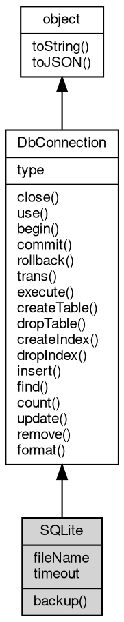

# 对象 SQLite
SQLite 对象是内置模块 [db](../../module/ifs/db.md) 的一个成员，主要负责 SQLite 数据库的连接和操作，可用于 SQLite 数据库的创建、查询、插入、更新等操作。同时，SQLite 对象也提供了一些类似备份、格式化 SQL 等高级操作。SQLite 连接对象还支持事务操作

在实际应用中，我们通常根据业务需求创建 SQLite 类型的数据表，然后进行数据的增删改查等操作，例如：

```JavaScript
var db = require('db')

// open a SQLite database
var sqlite = db.openSQLite('test.db')

// use execute method to create a table
sqlite.execute('CREATE TABLE test (id INT PRIMARY KEY NOT NULL, name TEXT NOT NULL, age INT NOT NULL)')

// use execute method to insert data
sqlite.execute('INSERT INTO test (id, name, age) VALUES (?, ?, ?)', 1, 'Alice', 18)
sqlite.execute('INSERT INTO test (id, name, age) VALUES (?, ?, ?)', 2, 'Bob', 20)
sqlite.execute('INSERT INTO test (id, name, age) VALUES (?, ?, ?)', 3, 'Charlie', 22)

// use execute method to query data
var rs = sqlite.execute('SELECT * FROM test')
console.log(rs)

// use execute method to update data
sqlite.execute('UPDATE test SET name=?, age=? WHERE id=?', 'Marry', 19, 1)

// use execute method to delete data
sqlite.execute('DELETE FROM test WHERE id=?', 2)
```

SQLite 还内置了 vec_index 模块，我们可以在 SQLite 数据库上创建对向量字段的索引，基于向量字段进行检索，得到与目标向量最近似的向量集合。支持使用数值类型的数组表示向量，如：[1, 2, 3]，同时支持向量维度。此外，vec_index 支持在事务内批量操作。

下面是一个简单的示例：
``` JavaScript
var db = require('db');
var path = require('path');

var conn = db.openSQLite(path.join(__dirname, 'vec_test.db'));

conn.execute('create virtual table vindex using vec_index(title(3), description(3))');

conn.execute(`insert into vindex(title, description, rowid) values("[1,2,3]", "[3,4,5]", 3)`);
```

可以使用 vec_search 函数执行向量检索，例如：
``` JavaScript
var key = [1, 2, 5.1234];
var limit = 1;

var res = conn.execute(`select rowid, distance from vindex where vec_search(title, "${JSON.stringify(key)}")`);
```

vec_search 返回一个最接近的向量集合和距离数组，其中距离按照从小到大顺序排列。如果需要返回多个最接近的向量集合，可以使用 :limit 参数，例如：
``` JavaScript
var key = [1, 2, 5.1234];
var limit = 1;

var res = conn.execute(`select rowid, distance from vindex where vec_search(title, "${JSON.stringify(key)}:10")`);
```

## 继承关系


## 成员属性
        
### fileName
**String, 当前数据库文件名**

```JavaScript
readonly String SQLite.fileName;
```

--------------------------
### timeout
**Integer, 查询和设置数据库超时时间，以毫秒为单位**

```JavaScript
Integer SQLite.timeout;
```

--------------------------
### type
**String, 查询当前连接数据库类型**

```JavaScript
readonly String SQLite.type;
```

## 成员函数
        
### backup
**备份当前数据库到新文件**

```JavaScript
SQLite.backup(String fileName) async;
```

调用参数:
* fileName: String, 指定备份的数据库文件名

--------------------------
### close
**关闭当前数据库连接**

```JavaScript
SQLite.close() async;
```

--------------------------
### use
**选择当前数据库连接的缺省数据库**

```JavaScript
SQLite.use(String dbName) async;
```

调用参数:
* dbName: String, 指定数据库名

--------------------------
### begin
**在当前数据库连接上启动一个事务**

```JavaScript
SQLite.begin(String point = "") async;
```

调用参数:
* point: String, 指定事务的名称，缺省不指定

--------------------------
### commit
**提交当前数据库连接上的事务**

```JavaScript
SQLite.commit(String point = "") async;
```

调用参数:
* point: String, 指定事务的名称，缺省不指定

--------------------------
### rollback
**回滚当前数据库连接上的事务**

```JavaScript
SQLite.rollback(String point = "") async;
```

调用参数:
* point: String, 指定事务的名称，缺省不指定

--------------------------
### trans
**进入事务执行一个函数，并根据函数执行情况提交或者回滚**

```JavaScript
Boolean SQLite.trans(Function func);
```

调用参数:
* func: Function, 以事务方式执行的函数

返回结果:
* Boolean, 返回事务是否提交，正常 commit 时返回 true, rollback 时返回 false，如果事务出错则抛出错误

func 执行有三种结果：
* 函数正常返回，包括运行结束和主动 return，此时事务将自动提交
* 函数返回 false，此时事务将回滚
* 函数运行错误，事务自动回滚

--------------------------
**进入事务执行一个函数，并根据函数执行情况提交或者回滚**

```JavaScript
Boolean SQLite.trans(String point,
    Function func);
```

调用参数:
* point: String, 指定事务的名称
* func: Function, 以事务方式执行的函数

返回结果:
* Boolean, 返回事务是否提交，正常 commit 时返回 true, rollback 时返回 false，如果事务出错则抛出错误

func 执行有三种结果：
* 函数正常返回，包括运行结束和主动 return，此时事务将自动提交
* 函数返回 false，此时事务将回滚
* 函数运行错误，事务自动回滚

--------------------------
### execute
**执行一个 sql 命令，并返回执行结果**

```JavaScript
NArray SQLite.execute(String sql) async;
```

调用参数:
* sql: String, 字符串

返回结果:
* NArray, 返回包含结果记录的数组，如果请求是 UPDATE 或者 INSERT，返回结果还会包含 affected 和 insertId，mssql 不支持 insertId。

--------------------------
**执行一个 sql 命令，并返回执行结果，可根据参数格式化字符串**

```JavaScript
NArray SQLite.execute(String sql,
    ...args) async;
```

调用参数:
* sql: String, 格式化字符串，可选参数用 ? 指定。例如：'SELECT FROM TEST WHERE [id]=?'
* args: ..., 可选参数列表

返回结果:
* NArray, 返回包含结果记录的数组，如果请求是 UPDATE 或者 INSERT，返回结果还会包含 affected 和 insertId，mssql 不支持 insertId。

--------------------------
### createTable
**创建数据表**

```JavaScript
SQLite.createTable(Object opts) async;
```

调用参数:
* opts: Object, 参数列表

--------------------------
### dropTable
**删除数据表**

```JavaScript
SQLite.dropTable(Object opts) async;
```

调用参数:
* opts: Object, 参数列表

--------------------------
### createIndex
**创建数据表索引**

```JavaScript
SQLite.createIndex(Object opts) async;
```

调用参数:
* opts: Object, 参数列表

--------------------------
### dropIndex
**删除数据表索引**

```JavaScript
SQLite.dropIndex(Object opts) async;
```

调用参数:
* opts: Object, 参数列表

--------------------------
### insert
**插入新记录**

```JavaScript
Number SQLite.insert(Object opts) async;
```

调用参数:
* opts: Object, 参数列表

返回结果:
* Number, 返回包含插入的 id，如果引擎不支持则返回 0

--------------------------
### find
**根据指定的条件查询数据**

```JavaScript
NArray SQLite.find(Object opts) async;
```

调用参数:
* opts: Object, 参数列表

返回结果:
* NArray, 返回包含结果记录

--------------------------
### count
**根据指定的条件统计数据记录数**

```JavaScript
Integer SQLite.count(Object opts) async;
```

调用参数:
* opts: Object, 参数列表

返回结果:
* Integer, 返回包含结果记录数

--------------------------
### update
**根据指定的条件更新数据**

```JavaScript
Integer SQLite.update(Object opts) async;
```

调用参数:
* opts: Object, 参数列表

返回结果:
* Integer, 返回包含更新的记录数

--------------------------
### remove
**根据指定的条件删除数据**

```JavaScript
Integer SQLite.remove(Object opts) async;
```

调用参数:
* opts: Object, 可选参数列表

返回结果:
* Integer, 返回包含更新的记录数

--------------------------
### format
**格式化一个 sql 命令，并返回格式化结果**

```JavaScript
String SQLite.format(String method,
    Object opts);
```

调用参数:
* method: String, 指定请求的方法
* opts: Object, 可选参数列表

返回结果:
* String, 返回格式化之后的 sql 命令

--------------------------
**格式化一个 sql 命令，并返回格式化结果**

```JavaScript
String SQLite.format(String sql,
    ...args);
```

调用参数:
* sql: String, 格式化字符串，可选参数用 ? 指定。例如：'SELECT FROM TEST WHERE [id]=?'
* args: ..., 可选参数列表

返回结果:
* String, 返回格式化之后的 sql 命令

--------------------------
### toString
**返回对象的字符串表示，一般返回 "[Native Object]"，对象可以根据自己的特性重新实现**

```JavaScript
String SQLite.toString();
```

返回结果:
* String, 返回对象的字符串表示

--------------------------
### toJSON
**返回对象的 JSON 格式表示，一般返回对象定义的可读属性集合**

```JavaScript
Value SQLite.toJSON(String key = "");
```

调用参数:
* key: String, 未使用

返回结果:
* Value, 返回包含可 JSON 序列化的值

