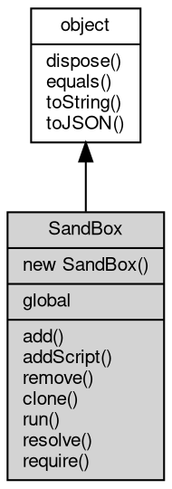

# 对象 SandBox
安全沙箱对象，用于管理一个独立的运行空间

 所有的代码都运行在自己的沙箱中，全局的 require 会调用当前沙箱加载模块，沙箱会通过 require 传递给加载的沙箱。下面的示例创建一个沙箱，限制只允许访问全局基础模块中的 [assert](../../module/ifs/assert.md) 模块，并添加 a 和 b 两个定制模块：

```JavaScript
var vm = require('vm');
var sbox = new vm.SandBox({
    a: 100,
    b: 200,
    assert: require('assert')
});

var mod_in_sbox = sbox.require('./path/to/mod');
```

## 继承关系


## 构造函数
        
### SandBox
**构造一个新的安全沙箱对象，并初始化基础模块**

```JavaScript
new SandBox(Object mods);
```

调用参数:
* mods: Object, 指定要添加的模块对象字典

--------------------------
**构造一个新的安全沙箱对象，并初始化基础模块**

```JavaScript
new SandBox(Object mods,
    Function require);
```

调用参数:
* mods: Object, 指定要添加的模块对象字典
* require: Function, 自定义 require 函数，当模块不存在时，先调用自定义函数，无返回再从文件中加载

--------------------------
**构造一个独立 Global 新的安全沙箱对象，并初始化基础模块**

```JavaScript
new SandBox(Object mods,
    Object global);
```

调用参数:
* mods: Object, 指定要添加的模块对象字典
* global: Object, 指定初始化的 Global 属性

--------------------------
**构造一个独立 Global 新的安全沙箱对象，并初始化基础模块**

```JavaScript
new SandBox(Object mods,
    Function require,
    Object global);
```

调用参数:
* mods: Object, 指定要添加的模块对象字典
* require: Function, 自定义 require 函数，当模块不存在时，先调用自定义函数，无返回再从文件中加载
* global: Object, 指定初始化的 Global 属性

## 成员属性
        
### global
**Object, 查询沙箱的 [global](../../module/ifs/global.md) 对象**

```JavaScript
readonly Object SandBox.global;
```

## 成员函数
        
### add
**向沙箱中添加一个基础模块**

```JavaScript
SandBox.add(String id,
    Value mod);
```

调用参数:
* id: String, 指定要添加的模块名称，此路径与当前运行脚本无关，必须为绝对路径或者模块名
* mod: Value, 指定要添加的模块对象

--------------------------
**向沙箱中添加一组基础模块**

```JavaScript
SandBox.add(Object mods);
```

调用参数:
* mods: Object, 指定要添加的模块对象字典，添加的 javascript 模块将会生成一份复制，以避免沙箱修改对象产生互相干扰

--------------------------
### addScript
**向沙箱中添加一个脚本模块**

```JavaScript
Value SandBox.addScript(String srcname,
    Buffer script);
```

调用参数:
* srcname: String, 指定要添加的脚本名称，srcname 必须包含扩展名，比如 [json](../../module/ifs/json.md) 或者 js, jsc
* script: [Buffer](Buffer.md), 指定要添加的二进制代码

返回结果:
* Value, 返回加载的模块对象

--------------------------
### remove
**从沙箱中删除指定的基础模块**

```JavaScript
SandBox.remove(String id);
```

调用参数:
* id: String, 指定要删除的模块名称，此路径与当前运行脚本无关，必须为绝对路径或者模块名

--------------------------
### clone
**复制当前沙箱，新沙箱包含当前沙箱的模块，以及相同的名称和 require 函数**

```JavaScript
SandBox SandBox.clone();
```

返回结果:
* SandBox, 复制的新沙箱

--------------------------
### run
**运行一个脚本**

```JavaScript
SandBox.run(String fname,
    Array argv = []);
```

调用参数:
* fname: String, 指定要运行的脚本路径，此路径与当前运行脚本无关，必须为绝对路径
* argv: Array, 指定要运行的参数，此参数可在脚本内使用 argv 获取

--------------------------
### resolve
**查询一个模块并返回模块完整文件名**

```JavaScript
String SandBox.resolve(String id,
    String base);
```

调用参数:
* id: String, 指定要加载的模块名称
* base: String, 指定查找路径

返回结果:
* String, 返回加载的模块完整文件名

--------------------------
### require
**加载一个模块并返回模块对象**

```JavaScript
Value SandBox.require(String id,
    String base);
```

调用参数:
* id: String, 指定要加载的模块名称
* base: String, 指定查找路径

返回结果:
* Value, 返回加载的模块对象

--------------------------
### dispose
**强制回收对象，调用此方法后，对象资源将立即释放**

```JavaScript
SandBox.dispose();
```

--------------------------
### equals
**比较当前对象与给定的对象是否相等**

```JavaScript
Boolean SandBox.equals(object expected);
```

调用参数:
* expected: [object](object.md), 制定比较的目标对象

返回结果:
* Boolean, 返回对象比较的结果

--------------------------
### toString
**返回对象的字符串表示，一般返回 "[Native Object]"，对象可以根据自己的特性重新实现**

```JavaScript
String SandBox.toString();
```

返回结果:
* String, 返回对象的字符串表示

--------------------------
### toJSON
**返回对象的 JSON 格式表示，一般返回对象定义的可读属性集合**

```JavaScript
Value SandBox.toJSON(String key = "");
```

调用参数:
* key: String, 未使用

返回结果:
* Value, 返回包含可 JSON 序列化的值

