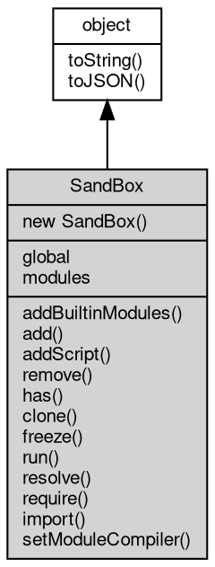

# Object SandBox
An isolated [module](../../module/ifs/module.md) [registry](../../module/ifs/registry.md) that runs code with an optional standalone [global](../../module/ifs/global.md) [object](object.md); use it to load untrusted or host-reloaded code without touching the host [module](../../module/ifs/module.md) table

A SandBox owns an independent [module](../../module/ifs/module.md) [registry](../../module/ifs/registry.md): code loaded through the sandbox sees only the
modules that were added to it (plus the [module](../../module/ifs/module.md) and buffer built-ins), so sandboxes and the host
do not share [module](../../module/ifs/module.md) state. A SandBox is not a security sandbox: untrusted code can still reach
the host through the objects it is given, and a sandbox created without an explicit [global](../../module/ifs/global.md)
[object](object.md) shares the host [global](../../module/ifs/global.md) [object](object.md).

Main capabilities:

- **Module [registry](../../module/ifs/registry.md)**: `add` (single and dictionary), `addScript`, `remove`, `has`, `modules`;
- **Loading**: `require`, `resolve`, `import`, `run`;
- **Environment**: `addBuiltinModules`, `setModuleCompiler`, the constructor [module](../../module/ifs/module.md) dictionary;
- **Global [object](object.md)**: an optional standalone `global` [object](object.md), queried through `global`.

Concepts:

- **Module [registry](../../module/ifs/registry.md)**: a new sandbox contains only the `module` and `buffer` modules.
  addBuiltinModules installs the full built-in [module](../../module/ifs/module.md) set together with the `node:` and `fibjs:`
  aliases, `[assert](../../module/ifs/assert.md)/strict` and the `/promises` submodules. Custom modules are registered with
  add or addScript; [module](../../module/ifs/module.md) names and absolute paths are accepted, relative ids throw Error 20024.
- **Copies on add**: a dictionary added with add(Object mods) is copied entry by entry with
  [util.clone](../../module/ifs/util.md#clone), so a plain [object](object.md) becomes a new [object](object.md) with shared nested references while native
  values such as [Buffer](Buffer.md) keep their identity. Replacing an id replaces the registered [module](../../module/ifs/module.md).
- **require resolution**: `sandbox.require(id, base)` is the sandbox entry point; `base` is
  mandatory (Error 20002 when omitted) and a relative id is resolved against it. Code running
  inside the sandbox gets its own one-argument `require(id)`, which resolves against the [module](../../module/ifs/module.md)'s
  own location. Modules are cached per sandbox, so each file is evaluated once. require loads
  CommonJS and JSON only; import also loads ECMAScript modules.
- **Global [object](object.md)**: a sandbox created without the constructor [global](../../module/ifs/global.md) argument executes code in
  the host [global](../../module/ifs/global.md) context: scripts read and write the same [global](../../module/ifs/global.md) [object](object.md) as the host. Pass an
  explicit [global](../../module/ifs/global.md) [object](object.md) to get a standalone [global](../../module/ifs/global.md); that [object](object.md) becomes `sandbox.global`
  (`sandbox.global === [global](../../module/ifs/global.md)`) and is isolated from the host. The `[global](../../module/ifs/global.md)` property and
  `freeze` are only available in this mode and otherwise throw Error 20009 (Invalid procedure
  call).
- **freeze behavior**: freeze is intended to make the sandbox [global](../../module/ifs/global.md) read-only. In the current
  release it freezes only the internal context [global](../../module/ifs/global.md), so writes made through the standalone
  [global](../../module/ifs/global.md) [object](object.md) are still accepted and scripts observe `Object.isFrozen(globalThis) === false`.
  Do not use freeze as an immutability or security boundary.
- **Comparison with Node.js [vm](../../module/ifs/vm.md)**: Node's [vm](../../module/ifs/vm.md) creates a context and evaluates code with [vm.Script](../../module/ifs/vm.md#Script)
  or [vm.runInContext](../../module/ifs/vm.md#runInContext); it has no [module](../../module/ifs/module.md) [registry](../../module/ifs/registry.md). SandBox is a [module](../../module/ifs/module.md) loader with an optional
  standalone [global](../../module/ifs/global.md) and no compile/eval API. Both are explicit about not being security
  boundaries; unlike a Node [vm](../../module/ifs/vm.md) context, a default SandBox shares the host [global](../../module/ifs/global.md) [object](object.md).

Obtained from:
- `new [vm.SandBox](../../module/ifs/vm.md#SandBox)(mods)`;
- `new [vm.SandBox](../../module/ifs/vm.md#SandBox)(mods, require)`;
- `new [vm.SandBox](../../module/ifs/vm.md#SandBox)(mods, [global](../../module/ifs/global.md))`;
- `new [vm.SandBox](../../module/ifs/vm.md#SandBox)(mods, require, [global](../../module/ifs/global.md))` — see the [vm](../../module/ifs/vm.md) [module](../../module/ifs/module.md).

Example 1 — register modules and load a [module](../../module/ifs/module.md) file with require:

```JavaScript
const vm = require('vm');
const fs = require('fs');
const os = require('os');
const path = require('path');

const dir = fs.mkdtempSync(path.join(os.tmpdir(), 'fibjs-sandbox-'));
fs.writeFile(path.join(dir, 'answer.js'), 'module.exports = require("base") + 2;');

const box = new vm.SandBox({
    base: 40
});
console.log(box.require('./answer.js', dir)); // 42

fs.rmSync(dir, {
    recursive: true,
    force: true
});
```

Example 2 — add the built-in modules and use a standalone [global](../../module/ifs/global.md):

```JavaScript
const vm = require('vm');
const fs = require('fs');
const os = require('os');
const path = require('path');

const dir = fs.mkdtempSync(path.join(os.tmpdir(), 'fibjs-sandbox-'));
const main = 'module.exports = require("path").basename(require("os").tmpdir());';
fs.writeFile(path.join(dir, 'main.js'), main);

const global_obj = {};
const box = new vm.SandBox({}, global_obj);
box.addBuiltinModules();
console.log(typeof box.require('./main.js', dir) === 'string'); // true
console.log(box.global === global_obj); // true

fs.rmSync(dir, {
    recursive: true,
    force: true
});
```

Example 3 — custom require function and addScript:

```JavaScript
const vm = require('vm');

const box = new vm.SandBox({
    greeting: 'hello'
}, (id) => {
    if (id === 'version')
        return '1.0';
});

const mod = box.addScript('meta.js', 'module.exports = require("greeting")' +
    ' + " " + require("version");');
console.log(mod); // hello 1.0
console.log(box.require('meta', __dirname)); // hello 1.0
```

## Inheritance

```dot
digraph {
    node [fontname="Helvetica,sans-Serif", fontsize=10, shape="record", style="filled", fillcolor="white"];

    object [tooltip="object", URL="object.md", label="{object|toString()\ltoJSON()\l}"];
    SandBox [tooltip="SandBox", fillcolor="lightgray", id="me", label="{SandBox|new SandBox()\l|global\lmodules\l|addBuiltinModules()\ladd()\laddScript()\lremove()\lhas()\lclone()\lfreeze()\lrun()\lresolve()\lrequire()\limport()\lsetModuleCompiler()\l}"];

    object -> SandBox [dir=back];
}
```

## Constructors
        
### SandBox
**Constructs a sandbox and registers the modules of the given dictionary**

```JavaScript
new SandBox(Object mods = {});
```

Parameters:
* mods: Object, the [module](../../module/ifs/module.md) [object](object.md) dictionary to add

The dictionary is added with add(Object mods). The new sandbox contains only the [module](../../module/ifs/module.md) and
buffer built-ins and shares the host [global](../../module/ifs/global.md) [object](object.md); call addBuiltinModules to make the other
built-in modules available, and pass a [global](../../module/ifs/global.md) [object](object.md) to isolate the [global](../../module/ifs/global.md) scope.

--------------------------
**Constructs a sandbox with a custom require function**

```JavaScript
new SandBox(Object mods,
    Function(String id) => Value require);
```

Parameters:
* mods: Object, the [module](../../module/ifs/module.md) [object](object.md) dictionary to add
* require: Function(String id) => Value, a custom require function; when a [module](../../module/ifs/module.md) does not exist, the custom function is called first, and if it returns nothing the [module](../../module/ifs/module.md) is loaded from files

The function is called whenever an id is not found in the [module](../../module/ifs/module.md) [registry](../../module/ifs/registry.md). When it returns a
value the value is used as the [module](../../module/ifs/module.md); when it returns undefined the id is resolved from the
file system (and throws MODULE_NOT_FOUND when no file matches). The custom function only
handles the sandbox fallback lookup; [module](../../module/ifs/module.md) code still receives its own one-argument require.

--------------------------
**Constructs a sandbox with an independent [global](../../module/ifs/global.md) [object](object.md)**

```JavaScript
new SandBox(Object mods,
    Object global);
```

Parameters:
* mods: Object, the [module](../../module/ifs/module.md) [object](object.md) dictionary to add
* global: Object, the initial Global properties to set

The given [object](object.md) becomes the standalone [global](../../module/ifs/global.md) of the sandbox: its properties are populated
into the sandbox context, scripts read and write it as `global`, and the host globals are not
visible. It is returned by the [global](../../module/ifs/global.md) property (`sandbox.global === [global](../../module/ifs/global.md)`). This is the
only mode in which [global](../../module/ifs/global.md) and freeze are available.

--------------------------
**Constructs a sandbox with a custom require function and an independent [global](../../module/ifs/global.md) [object](object.md)**

```JavaScript
new SandBox(Object mods,
    Function(String id) => Value require,
    Object global);
```

Parameters:
* mods: Object, the [module](../../module/ifs/module.md) [object](object.md) dictionary to add
* require: Function(String id) => Value, a custom require function; when a [module](../../module/ifs/module.md) does not exist, the custom function is called first, and if it returns nothing the [module](../../module/ifs/module.md) is loaded from files
* global: Object, the initial Global properties to set

Combines the two behaviors: the dictionary is registered, unknown ids are passed to the
custom require function before file resolution, and the given [object](object.md) becomes the standalone
[global](../../module/ifs/global.md) of the sandbox. See the other constructors for the details of each part.

## Properties
        
### global
**Object, Queries the standalone [global](../../module/ifs/global.md) [object](object.md) of the sandbox**

```JavaScript
readonly Object SandBox.global;
```

Returns the [object](object.md) passed as the constructor [global](../../module/ifs/global.md) argument, so `sandbox.global === [global](../../module/ifs/global.md)`.
A sandbox created without that argument shares the host [global](../../module/ifs/global.md) [object](object.md) and has no standalone
[global](../../module/ifs/global.md), so reading this property throws Error 20009 (Invalid procedure call).

--------------------------
### modules
**Object, Queries a dictionary copy of all modules currently in the sandbox**

```JavaScript
readonly Object SandBox.modules;
```

The keys are the registered ids, including the `node:` and `fibjs:` aliases of built-in
modules, and the values are the [module](../../module/ifs/module.md) objects. The returned [object](object.md) is a copy: deleting a key
from it does not remove the [module](../../module/ifs/module.md) from the sandbox. Use has and remove to change the
[registry](../../module/ifs/registry.md).

## Methods
        
### addBuiltinModules
**Adds all built-in modules to the sandbox**

```JavaScript
SandBox.addBuiltinModules();
```

Installs every built-in [module](../../module/ifs/module.md) with its `node:` and `fibjs:` aliases, the `[assert](../../module/ifs/assert.md)/strict`
[module](../../module/ifs/module.md) and the `/promises` submodules; afterwards the sandbox can require [fs](../../module/ifs/fs.md), [path](../../module/ifs/path.md), [crypto](../../module/ifs/crypto.md)
and the other built-ins. A new sandbox contains only the [module](../../module/ifs/module.md) and buffer modules.

Example:

```JavaScript
const vm = require('vm');
const box = new vm.SandBox();

box.addBuiltinModules();
console.log(box.require('path', __dirname).basename('/a/b.txt')); // b.txt
```

--------------------------
### add
**Adds a [module](../../module/ifs/module.md) to the sandbox under the given name**

```JavaScript
SandBox.add(String id,
    Value mod);
```

Parameters:
* id: String, the name of the [module](../../module/ifs/module.md) to add; this [path](../../module/ifs/path.md) is unrelated to the running script and must be an absolute [path](../../module/ifs/path.md) or a [module](../../module/ifs/module.md) name
* mod: Value, the [module](../../module/ifs/module.md) [object](object.md) to add

The id must be a [module](../../module/ifs/module.md) name or an absolute [path](../../module/ifs/path.md); a relative id throws Error 20024 ("does
not accept relative [path](../../module/ifs/path.md)"). The value is copied with [util.clone](../../module/ifs/util.md#clone): a plain [object](object.md) becomes a new
[object](object.md) whose nested references are shared with the original, while native values such as
[Buffer](Buffer.md) keep their identity. Registering an existing id replaces the [module](../../module/ifs/module.md).

--------------------------
**Adds a dictionary of modules to the sandbox**

```JavaScript
SandBox.add(Object mods);
```

Parameters:
* mods: Object, the [module](../../module/ifs/module.md) [object](object.md) dictionary to add; added javascript modules are copied so that modifications made by the sandbox do not interfere with each other

Every entry is added as with add(String id, Value mod): the keys must not be relative and
each value is copied individually, so a modification made by sandbox code to a copied plain
[object](object.md) does not affect the original [object](object.md), while nested references stay shared.

--------------------------
### addScript
**Adds a script [module](../../module/ifs/module.md) to the sandbox and returns its exports**

```JavaScript
Value SandBox.addScript(String srcname,
    Buffer | String script);
```

Parameters:
* srcname: String, the script name to add; srcname must include an extension, such as [json](../../module/ifs/json.md), js or jsc
* script: [Buffer](Buffer.md) | String, the binary code to add

Returns:
* Value, returns the loaded [module](../../module/ifs/module.md) [object](object.md)

The script is compiled and registered under srcname; the extension selects the loader
(`.js`, `.[json](../../module/ifs/json.md)`, `.jsc`), and a string is encoded as UTF-8. The code receives the sandbox
one-argument require, so it can load the other modules registered in the sandbox by name.
This is the way to add code that does not exist as a file.

--------------------------
### remove
**Removes a [module](../../module/ifs/module.md) from the sandbox [registry](../../module/ifs/registry.md)**

```JavaScript
SandBox.remove(String id);
```

Parameters:
* id: String, the name of the [module](../../module/ifs/module.md) to remove; this [path](../../module/ifs/path.md) is unrelated to the running script and must be an absolute [path](../../module/ifs/path.md) or a [module](../../module/ifs/module.md) name

Only the [registry](../../module/ifs/registry.md) entry is removed: [module](../../module/ifs/module.md) objects already returned by require keep working,
and requiring the id again loads it anew (or fails). Removing an unknown id is a no-op.
Built-in aliases are separate entries and must be removed one by one.

--------------------------
### has
**Checks whether a [module](../../module/ifs/module.md) id is registered in the sandbox**

```JavaScript
Boolean SandBox.has(String id);
```

Parameters:
* id: String, the name of the [module](../../module/ifs/module.md) to check; this [path](../../module/ifs/path.md) is unrelated to the running script and must be an absolute [path](../../module/ifs/path.md) or a [module](../../module/ifs/module.md) name

Returns:
* Boolean, whether it exists

Returns true for [module](../../module/ifs/module.md) names and absolute paths registered with add or addScript, and for
the modules installed by addBuiltinModules including their `node:` and `fibjs:` aliases. The
check only inspects the [registry](../../module/ifs/registry.md): it does not touch the file system and does not call the
custom require function.

--------------------------
### clone
**Clones the sandbox [module](../../module/ifs/module.md) [registry](../../module/ifs/registry.md) into a new sandbox**

```JavaScript
SandBox SandBox.clone();
```

Returns:
* SandBox, the new cloned sandbox

The new sandbox gets a copy of the [module](../../module/ifs/module.md) table, so later add or remove calls on either
sandbox do not affect the other. The custom require function and the standalone [global](../../module/ifs/global.md) are
not copied: the clone resolves unknown ids from files and shares the host [global](../../module/ifs/global.md) [object](object.md)
(verified).

--------------------------
### freeze
**Freezes the sandbox context [global](../../module/ifs/global.md)**

```JavaScript
SandBox.freeze();
```

Only available when the sandbox was created with a standalone [global](../../module/ifs/global.md) [object](object.md); otherwise it
throws Error 20009 (Invalid procedure call). Note that in the current release freeze does
not block writes made through the standalone [global](../../module/ifs/global.md) [object](object.md), and scripts still observe
`Object.isFrozen(globalThis) === false`; do not rely on it as an immutability or security
boundary.

--------------------------
### run
**Runs a script file in the sandbox**

```JavaScript
SandBox.run(String fname);
```

Parameters:
* fname: String, the [path](../../module/ifs/path.md) of the script to run; this [path](../../module/ifs/path.md) is unrelated to the running script and must be an absolute [path](../../module/ifs/path.md)

The file is loaded through the sandbox [module](../../module/ifs/module.md) system and executed as the main [module](../../module/ifs/module.md), so it
uses the sandbox require instead of the host require and can only see the sandbox modules.
Errors propagate to the caller. The [path](../../module/ifs/path.md) must be absolute; run returns nothing, use require
when the [module](../../module/ifs/module.md) value is needed.

--------------------------
### resolve
**Resolves a [module](../../module/ifs/module.md) id and returns the resolved name**

```JavaScript
String SandBox.resolve(String id,
    String base);
```

Parameters:
* id: String, the name of the [module](../../module/ifs/module.md) to load
* base: String, the lookup [path](../../module/ifs/path.md)

Returns:
* String, returns the full file name of the loaded [module](../../module/ifs/module.md)

A registered [module](../../module/ifs/module.md) name is returned unchanged; a relative id is resolved against base to an
absolute file name, which must exist on disk. Both arguments are required. This performs the
same resolution as require without loading the [module](../../module/ifs/module.md).

--------------------------
### require
**Loads a CommonJS [module](../../module/ifs/module.md) and returns its exports**

```JavaScript
Value SandBox.require(String id,
    String base);
```

Parameters:
* id: String, the name of the [module](../../module/ifs/module.md) to load
* base: String, the lookup [path](../../module/ifs/path.md)

Returns:
* Value, returns the loaded [module](../../module/ifs/module.md) [object](object.md)

The base argument is mandatory: omitting it throws Error 20002 (Parameter not optional). A
relative id is resolved against base, a [module](../../module/ifs/module.md) name is looked up in the sandbox [registry](../../module/ifs/registry.md),
and unknown ids are passed to the custom require function before file resolution. Results
are cached per sandbox, so a [module](../../module/ifs/module.md) is evaluated once. ECMAScript modules are not supported;
use import instead. A missing [module](../../module/ifs/module.md) throws MODULE_NOT_FOUND.

--------------------------
### import
**Asynchronously loads a [module](../../module/ifs/module.md), supporting ECMAScript modules**

```JavaScript
Promise SandBox.import(String id,
    String base);
```

Parameters:
* id: String, the name of the [module](../../module/ifs/module.md) to load
* base: String, the lookup [path](../../module/ifs/path.md)

Returns:
* Promise, returns the loaded [module](../../module/ifs/module.md) [object](object.md)

Unlike require, import returns a Promise and can load `.mjs`/ESM files as well as CommonJS
modules, for example `import('./mod.mjs', dir).then((mod) => mod.default)`. The base argument
is required like require. The promise resolves with the [module](../../module/ifs/module.md) namespace, so a default
export is read from its `default` property.

--------------------------
### setModuleCompiler
**Registers a compiler for a custom file extension**

```JavaScript
SandBox.setModuleCompiler(String extname,
    Function(Buffer buf, Object requireInfo) => Value compiler);
```

Parameters:
* extname: String, the extname, which must start with '.' and must not be a system built-in extension
* compiler: Function([Buffer](Buffer.md) buf, Object requireInfo) => Value, the compile callback; files with this extname are required only once. The callback format is `compiler(buf, requireInfo)`, where buf is the read file [Buffer](Buffer.md) and requireInfo has the structure `{filename: string}`.

When a file with this extension is required, the compiler is called with the file [Buffer](Buffer.md) and
an [object](object.md) `{ filename }` and must return JavaScript source; the compiled [module](../../module/ifs/module.md) is cached,
so the compiler runs once per file. Re-registering an extension replaces the compiler. The
extname must start with '.' and must not be a built-in extension ('.js', '.[json](../../module/ifs/json.md)', '.jsc',
'.wasm'); a malformed name throws ReferenceError, a reserved name throws Error 20024.

Example:

```JavaScript
const vm = require('vm');
const fs = require('fs');
const os = require('os');
const path = require('path');

const dir = fs.mkdtempSync(path.join(os.tmpdir(), 'fibjs-compiler-'));
fs.writeFile(path.join(dir, 'x.up'), 'value');

const box = new vm.SandBox({});
box.setModuleCompiler('.up', (buf) => 'module.exports = "' + buf.toString().trim() + '";');
console.log(box.require('./x.up', dir)); // value

fs.rmSync(dir, {
    recursive: true,
    force: true
});
```

--------------------------
### toString
**Returns the string form of the [object](object.md)**

```JavaScript
String SandBox.toString();
```

Returns:
* String, returns the string form of the [object](object.md)

The base implementation reports an error: a native [object](object.md) has no implicit
text form, and only the classes whose value can be written as a string
override the member. [Buffer](Buffer.md) returns its content decoded with the given
[encoding](../../module/ifs/encoding.md), [HttpCookie](HttpCookie.md) returns "name=value", and so on; an override commonly
accepts optional arguments ([Buffer.toString](Buffer.md#toString) takes [encoding](../../module/ifs/encoding.md), start and
end) that are not part of this declaration.

Calling the member on a class that does not override it throws
"<Class>: the [object](object.md) can not be converted to string.", which is the
behavior to rely on when probing whether a value has a string form. See
toJSON for the serialization hook.

--------------------------
### toJSON
**Returns the JSON representation of the [object](object.md)**

```JavaScript
Value SandBox.toJSON(String key = "");
```

Parameters:
* key: String, the property name of the value being serialized

Returns:
* Value, returns the JSON-serializable value

JSON.stringify(value) calls value.toJSON(key) when the member exists and
serializes the returned value in its place; the key argument carries the
property name of the value inside its parent [object](object.md) (an empty string at
the top level) and may be used to build a keyed form. The base
implementation returns a plain [object](object.md) holding the readable properties of
the instance, so a native [object](object.md) serializes without per-class code; a
class with a portable shape such as [Buffer](Buffer.md) overrides it, and a JavaScript
class may override it in the same way.

The member is normally reached through JSON.stringify rather than called
directly; calling it returns the same value JSON.stringify would
serialize.

