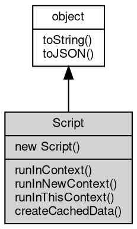

# 对象 Script
Script 脚本编译和运行对象

创建方法

```JavaScript
var Script = new vm.Script('console.log(100)');
```

## 继承关系


## 构造函数
        
### Script
**Script 对象构造函数**

```JavaScript
new Script(String code,
    Object opts = {});
```

调用参数:
* code: String, 指定要编译和运行的脚本代码
* opts: Object, 指定编译和运行选项

## 成员函数
        
### runInContext
**在给定 contextifiedObject 内运行 [vm.Script](../../module/ifs/vm.md#Script) 对象包含的已编译代码并返回结果**

```JavaScript
Value Script.runInContext(Object contextifiedObject,
    Object opts = {});
```

调用参数:
* contextifiedObject: Object, 指定运行时的上下文对象
* opts: Object, 指定运行选项

返回结果:
* Value, 返回运行结果

--------------------------
### runInNewContext
**使用给定的 contextObject 在创建的上下文中, 在其中运行 [vm.Script](../../module/ifs/vm.md#Script) 对象包含的已编译代码并返回结果**

```JavaScript
Value Script.runInNewContext(Object contextObject = {},
    Object opts = {});
```

调用参数:
* contextObject: Object, 指定将被上下文化的对象
* opts: Object, 指定运行选项

返回结果:
* Value, 返回运行结果

--------------------------
### runInThisContext
**在当前上下文内内运行 [vm.Script](../../module/ifs/vm.md#Script) 对象包含的已编译代码并返回结果**

```JavaScript
Value Script.runInThisContext(Object opts = {});
```

调用参数:
* opts: Object, 指定运行选项

返回结果:
* Value, 返回运行结果

--------------------------
### createCachedData
**根据当前 Script 对象创建代码缓存**

```JavaScript
Buffer Script.createCachedData();
```

返回结果:
* [Buffer](Buffer.md), 返回代码缓存数据

--------------------------
### toString
**返回对象的字符串表示，一般返回 "[Native Object]"，对象可以根据自己的特性重新实现**

```JavaScript
String Script.toString();
```

返回结果:
* String, 返回对象的字符串表示

--------------------------
### toJSON
**返回对象的 JSON 格式表示，一般返回对象定义的可读属性集合**

```JavaScript
Value Script.toJSON(String key = "");
```

调用参数:
* key: String, 未使用

返回结果:
* Value, 返回包含可 JSON 序列化的值

