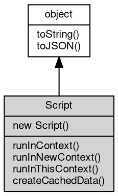

# Object Script
A precompiled script: compiles source text once, then runs it in any context; use it instead of the one-shot vm.runIn* functions when the same code is executed repeatedly or across contexts

The constructor compiles the code immediately, so syntax errors surface at compilation time
rather than at every run, and the compiled [object](object.md) is bound to a context only when a run method
is called: runInThisContext uses the current context, runInContext enters a prepared context,
and runInNewContext prepares a fresh context from the given [object](object.md). Top-level state follows the
context, so running the same script twice in one context continues where the previous run
stopped, while another context starts clean.

Concepts:

- **Compile options**: the constructor accepts filename (default `<anonymous>`), lineOffset and
  columnOffset to relocate reported error positions, cachedData to supply a V8 code cache
  produced by createCachedData, and type.
- **Module scripts**: `type: '[module](../../module/ifs/module.md)'` is a fibjs extension that compiles the code as an
  ECMAScript [module](../../module/ifs/module.md), so import and export are accepted. A [module](../../module/ifs/module.md) script cannot be executed: the
  run methods return undefined (after validating the syntax at compile time), and
  createCachedData throws Error 20009. Node.js compiles modules with vm.SourceTextModule
  instead.
- **Code cache**: createCachedData returns the V8 code cache as a [Buffer](Buffer.md); pass it back through
  the cachedData option to skip recompilation. V8 validates the buffer against the source, and
  an invalid or mismatched cache is ignored silently (the script is recompiled). The cache
  carries no execution state.
- **Run options**: every run method accepts timeout (milliseconds, 0 disables it); the compile
  options are fixed at construction. A run that exceeds the timeout fails with Error 20021
  ("The maximum amount of time for a script to execute was exceeded."). Node.js reports the
  same condition as an ERR_SCRIPT_EXECUTION_TIMEOUT error.
- **Errors**: a syntax error is thrown by the constructor as a SyntaxError with the V8 message
  and no error number. A runtime error is an ordinary JavaScript error whose stack names the
  script file and the offset-adjusted position.
- **Dynamic import**: [vm](../../module/ifs/vm.md) installs no import callback for compiled scripts, so a script that
  calls `import()` aborts the [process](../../module/ifs/process.md) in this release; load modules with require instead.
- **Node.js comparison**: the class matches Node's [vm.Script](../../module/ifs/vm.md#Script) for the constructor options
  filename, lineOffset, columnOffset and cachedData, the three run methods and
  createCachedData. fibjs adds type: '[module](../../module/ifs/module.md)' and omits the Node.js constructor option
  importModuleDynamically, the run options displayErrors and breakOnSigint, the
  cachedDataRejected and sourceMapURL properties, and the vm.createScript alias.

Obtained from:
- `new [vm.Script](../../module/ifs/vm.md#Script)(code, opts)` — compiles the source text and returns the script;
- `vm.Script` — the class [object](object.md), exposed as the static Script member of the [vm](../../module/ifs/vm.md) [module](../../module/ifs/module.md).

Example 1 — compile once and run in several contexts:

```JavaScript
const vm = require('vm');

const source = 'loads = (typeof loads === "undefined" ? 0 : loads) + 1; loads;';
const script = new vm.Script(source);
const first = vm.createContext({});
const second = vm.createContext({});

console.log(script.runInContext(first)); // 1
console.log(script.runInContext(first)); // 2
console.log(script.runInContext(second)); // 1
```

Example 2 — report a runtime error with a file name and an offset:

```JavaScript
const vm = require('vm');

const script = new vm.Script('a++; a;', {
    filename: 'counter.js',
    lineOffset: 10
});

console.log(script.runInNewContext({
    a: 41
})); // 42

try {
    script.runInNewContext({});
} catch (e) {
    console.log(e.stack.indexOf('counter.js:11:1') > 0); // true
}
```

Example 3 — persist the code cache and reuse it in another script [object](object.md):

```JavaScript
const vm = require('vm');

const code = 'var base = 40; base + 2;';
const compiled = new vm.Script(code, {
    filename: 'answer.js'
});
const cachedData = compiled.createCachedData();

console.log(Buffer.isBuffer(cachedData)); // true
console.log(new vm.Script(code, {
    cachedData: cachedData
}).runInThisContext()); // 42
```

## Inheritance

```dot
digraph {
    node [fontname="Helvetica,sans-Serif", fontsize=10, shape="record", style="filled", fillcolor="white"];

    object [tooltip="object", URL="object.md", label="{object|toString()\ltoJSON()\l}"];
    Script [tooltip="Script", fillcolor="lightgray", id="me", label="{Script|new Script()\l|runInContext()\lrunInNewContext()\lrunInThisContext()\lcreateCachedData()\l}"];

    object -> Script [dir=back];
}
```

## Constructors
        
### Script
**Compiles the source text and returns the script [object](object.md)**

```JavaScript
new Script(String code,
    Object opts = {});
```

Parameters:
* code: String, the source text to compile
* opts: Object, the compile options

Compilation happens in the constructor: a syntax error is thrown immediately as a
SyntaxError with the V8 message and no error number, and no script [object](object.md) is created. The
compiled script is context-independent; the run methods select the context later.

opts supports the following compile options:

```JavaScript
// fragment: options
({
    "filename": "<anonymous>", // file name reported in error stacks
    "lineOffset": 0, // number of lines added to reported positions
    "columnOffset": 0, // number of columns added to reported positions
    "cachedData": null, // Buffer code cache produced by createCachedData
    "type": "script" // "script" (default) or "module", a fibjs extension
})
```

`type: "[module](../../module/ifs/module.md)"` compiles the code as an ECMAScript [module](../../module/ifs/module.md) (import and export are
accepted). A [module](../../module/ifs/module.md) script cannot be executed: the run methods return undefined and
createCachedData throws Error 20009. Node.js compiles modules with vm.SourceTextModule
instead of a Script option.

Example:

```JavaScript
const vm = require('vm');

const script = new vm.Script('2 * 21', {
    filename: 'answer.js'
});
console.log(script.runInThisContext()); // 42
```

## Methods
        
### runInContext
**Runs the compiled code in the given prepared context and returns the completion value**

```JavaScript
Value Script.runInContext(Object contextifiedObject,
    Object opts = {});
```

Parameters:
* contextifiedObject: Object, the prepared context to run in; Error 20003 when it is not a context
* opts: Object, the run options, currently timeout

Returns:
* Value, the completion value of the last statement

contextifiedObject must be a context, otherwise Error 20003 is thrown. The code runs in that
context and its globals persist there, so running the same script again in the same context
sees the state left by the previous run, while another context starts clean.

opts supports the run options:

```JavaScript
// fragment: options
({
    "timeout": 0 // run limit in milliseconds; 0 (default) disables the limit
})
```

A run that exceeds the timeout fails with Error 20021.

Example:

```JavaScript
const vm = require('vm');

const script = new vm.Script('value + 1');
const context = vm.createContext({
    value: 41
});
console.log(script.runInContext(context)); // 42
```

--------------------------
### runInNewContext
**Prepares an [object](object.md) as a context and runs the compiled code in it**

```JavaScript
Value Script.runInNewContext(Object contextObject = {},
    Object opts = {});
```

Parameters:
* contextObject: Object, the [object](object.md) to prepare as a context; a new empty [object](object.md) when omitted
* opts: Object, the run options, currently timeout

Returns:
* Value, the completion value of the last statement

The [object](object.md) is prepared as with [vm.createContext](../../module/ifs/vm.md#createContext) and then used as the [global](../../module/ifs/global.md) of the run; it
remains a context afterwards, so the same [object](object.md) can be passed to runInContext later. When
contextObject is omitted, a new empty [object](object.md) is used and discarded.

opts supports the same run options as runInContext, currently timeout.

--------------------------
### runInThisContext
**Runs the compiled code in the current context and returns the completion value**

```JavaScript
Value Script.runInThisContext(Object opts = {});
```

Parameters:
* opts: Object, the run options, currently timeout

Returns:
* Value, the completion value of the last statement

The code shares the caller [global](../../module/ifs/global.md) [object](object.md): it can read and write [global](../../module/ifs/global.md) variables and use
the host require, [process](../../module/ifs/process.md) and [timers](../../module/ifs/timers.md). It is the same context as [vm.runInThisContext](../../module/ifs/vm.md#runInThisContext), with
the compilation done in advance by the constructor.

opts supports the run options:

```JavaScript
// fragment: options
({
    "timeout": 0 // run limit in milliseconds; 0 (default) disables the limit
})
```

A run that exceeds the timeout fails with Error 20021.

Example:

```JavaScript
const vm = require('vm');

const script = new vm.Script('while (true);', {
    filename: 'spin.js'
});
try {
    script.runInThisContext({
        timeout: 100
    });
} catch (e) {
    console.log(e.number, e.message.indexOf('exceeded') > 0); // 20021 true
}
```

--------------------------
### createCachedData
**Returns the V8 code cache of the compiled script as a [Buffer](Buffer.md)**

```JavaScript
Buffer Script.createCachedData();
```

Returns:
* [Buffer](Buffer.md), the code cache of the compiled script

Pass the buffer back through the cachedData compile option of a new Script to skip
recompilation. V8 validates the cache against the source at load time: an invalid or
mismatched buffer is ignored silently and the code is compiled normally. The cache carries
no execution state and is tied to the V8 version, so it may be rejected after an upgrade
without breaking execution. A [module](../../module/ifs/module.md) script (type: "[module](../../module/ifs/module.md)") has no code cache and this
method throws Error 20009.

Example:

```JavaScript
const vm = require('vm');

const script = new vm.Script('6 * 7');
const cache = script.createCachedData();
console.log(Buffer.isBuffer(cache), cache.length > 0); // true true
```

--------------------------
### toString
**Returns the string form of the [object](object.md)**

```JavaScript
String Script.toString();
```

Returns:
* String, returns the string form of the [object](object.md)

The base implementation reports an error: a native [object](object.md) has no implicit
text form, and only the classes whose value can be written as a string
override the member. [Buffer](Buffer.md) returns its content decoded with the given
[encoding](../../module/ifs/encoding.md), [HttpCookie](HttpCookie.md) returns "name=value", and so on; an override commonly
accepts optional arguments ([Buffer.toString](Buffer.md#toString) takes [encoding](../../module/ifs/encoding.md), start and
end) that are not part of this declaration.

Calling the member on a class that does not override it throws
"<Class>: the [object](object.md) can not be converted to string.", which is the
behavior to rely on when probing whether a value has a string form. See
toJSON for the serialization hook.

--------------------------
### toJSON
**Returns the JSON representation of the [object](object.md)**

```JavaScript
Value Script.toJSON(String key = "");
```

Parameters:
* key: String, the property name of the value being serialized

Returns:
* Value, returns the JSON-serializable value

JSON.stringify(value) calls value.toJSON(key) when the member exists and
serializes the returned value in its place; the key argument carries the
property name of the value inside its parent [object](object.md) (an empty string at
the top level) and may be used to build a keyed form. The base
implementation returns a plain [object](object.md) holding the readable properties of
the instance, so a native [object](object.md) serializes without per-class code; a
class with a portable shape such as [Buffer](Buffer.md) overrides it, and a JavaScript
class may override it in the same way.

The member is normally reached through JSON.stringify rather than called
directly; calling it returns the same value JSON.stringify would
serialize.

