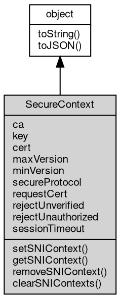

# 对象 SecureContext
[tls](../../module/ifs/tls.md) 安全上下文对象，用于多个 [tls](../../module/ifs/tls.md) 连接共享基础配置

SecureContext 对象是一个安全上下文对象，用于多个 [tls](../../module/ifs/tls.md) 连接共享基础配置。SecureContext 对象可以通过 [tls.createSecureContext](../../module/ifs/tls.md#createSecureContext) 方法创建。

```JavaScript
const tls = require('tls');
const fs = require('fs');

const options = {
    key: fs.readFileSync('server-key.pem'),
    cert: fs.readFileSync('server-cert.pem')
};

const context = tls.createSecureContext(options);
```

## 继承关系


## 成员属性
        
### ca
**[X509Certificate](X509Certificate.md), 查询安全上下文的受信任的 CA 证书**

```JavaScript
readonly X509Certificate SecureContext.ca;
```

--------------------------
### key
**[KeyObject](KeyObject.md), 查询安全上下文连接的私钥**

```JavaScript
readonly KeyObject SecureContext.key;
```

--------------------------
### cert
**[X509Certificate](X509Certificate.md), 查询安全上下文连接的证书**

```JavaScript
readonly X509Certificate SecureContext.cert;
```

--------------------------
### maxVersion
**String, 查询安全上下文允许的最大 TLS 版本**

```JavaScript
readonly String SecureContext.maxVersion;
```

--------------------------
### minVersion
**String, 查询安全上下文允许的最小 TLS 版本**

```JavaScript
readonly String SecureContext.minVersion;
```

--------------------------
### secureProtocol
**String, 查询安全上下文使用的 TLS 协议版本**

```JavaScript
readonly String SecureContext.secureProtocol;
```

--------------------------
### requestCert
**Boolean, 查询安全上下文是否需要客户端证书**

```JavaScript
readonly Boolean SecureContext.requestCert;
```

--------------------------
### rejectUnverified
**Boolean, 查询安全上下文是否拒绝任何未通过 CA 列表验证证书的连接**

```JavaScript
readonly Boolean SecureContext.rejectUnverified;
```

--------------------------
### rejectUnauthorized
**Boolean, 查询安全上下文是否拒绝任何未提供 CA 列表授权证书的连接**

```JavaScript
readonly Boolean SecureContext.rejectUnauthorized;
```

--------------------------
### sessionTimeout
**Integer, 查询安全上下文回话超时**

```JavaScript
readonly Integer SecureContext.sessionTimeout;
```

## 成员函数
        
### setSNIContext
**设置 SNI 上下文**

```JavaScript
SecureContext.setSNIContext(String servername,
    SecureContext context);
```

调用参数:
* servername: String, 指定的服务器名
* context: SecureContext, 指定的安全上下文

--------------------------
**设置 SNI 上下文**

```JavaScript
SecureContext.setSNIContext(String servername,
    Object options);
```

调用参数:
* servername: String, 指定的服务器名
* options: Object, 使用 [tls.createSecureContext](../../module/ifs/tls.md#createSecureContext) 创建安全上下文需要的选项

--------------------------
### getSNIContext
**查询 SNI 上下文**

```JavaScript
SecureContext SecureContext.getSNIContext(String servername,
    Boolean auto_resolve = false) async;
```

调用参数:
* servername: String, 指定的服务器名
* auto_resolve: Boolean, 是否自动创建上下文

返回结果:
* SecureContext, 返回指定的安全上下文

--------------------------
### removeSNIContext
**删除 SNI 上下文**

```JavaScript
SecureContext.removeSNIContext(String servername);
```

调用参数:
* servername: String, 指定的服务器名

--------------------------
### clearSNIContexts
**清除所有 SNI 上下文**

```JavaScript
SecureContext.clearSNIContexts();
```

--------------------------
### toString
**返回对象的字符串表示，一般返回 "[Native Object]"，对象可以根据自己的特性重新实现**

```JavaScript
String SecureContext.toString();
```

返回结果:
* String, 返回对象的字符串表示

--------------------------
### toJSON
**返回对象的 JSON 格式表示，一般返回对象定义的可读属性集合**

```JavaScript
Value SecureContext.toJSON(String key = "");
```

调用参数:
* key: String, 未使用

返回结果:
* Value, 返回包含可 JSON 序列化的值

