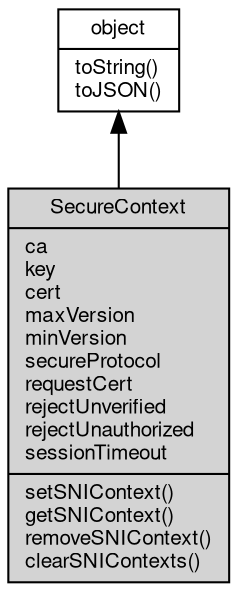

# Object SecureContext
A TLS configuration shared by connections: certificates, trust store, protocol versions, ALPN list and verification flags

A SecureContext is created once and passed to connect, [TLSSocket](TLSSocket.md) and [TLSServer](TLSServer.md). Its options are
parsed and validated at creation time, so the getters below report the effective configuration.
The context itself cannot be modified except for its SNI table: changing a server's certificate
means creating a new context and handing it to setSecureContext().

Concepts:

- **Client and server defaults**: a client context (isServer false) inherits the default Mozilla
  root store and requires a verified server certificate; a server context (isServer true) has no
  CA of its own, does not require a client certificate and installs the SNI callback. See the
  [tls](../../module/ifs/tls.md) [module](../../module/ifs/module.md) concepts for the meaning of ca/cert/key, requestCert, rejectUnverified,
  rejectUnauthorized and the protocol version options.
- **Verification flags**: requestCert, rejectUnverified and rejectUnauthorized report the
  OpenSSL verify mode of the context, not the result of a particular connection; the handshake
  still has to succeed for the connection to be usable.
- **SNI**: a server context resolves the names sent by clients through SNIResolver or the
  entries registered with setSNIContext. getSNIContext(servername, auto_resolve) consults the
  cache and, with auto_resolve true, runs the resolver; the cache is bounded by SNICacheSize
  and expired by SNICacheTimeout/SNICacheIdleTimeout. removeSNIContext drops one entry and
  clearSNIContexts all of them. These methods are server-side only.
- **Sessions**: sessionTimeout is the server-side session lifetime in seconds (default 7200).
  fibjs keeps no session [object](object.md), so no session can be inspected or reused by hand.
- **Node.js differences**: Node.js documents SecureContext only as the value returned by
  [tls.createSecureContext](../../module/ifs/tls.md#createSecureContext) with a `context` property, while fibjs exposes the effective ca, key,
  cert and flag getters plus the SNI table methods; Node.js configures SNI through
  server.addContext()/SNICallback instead, and its sessionTimeout default is 300.

Obtained from:
- `tls.createSecureContext(options[, isServer])` — the normal way;
- `tls.secureContext` — the [process](../../module/ifs/process.md)-wide default context;
- the `secureContext` key inside the options of connect/[TLSServer](TLSServer.md)/[TLSHandler](TLSHandler.md) — reused as it is.

Example 1 — creating a context from PEM material and reading it back:

```JavaScript
const tls = require('tls');
const crypto = require('crypto');

const pk = crypto.generateKeyPair('ec', {
    namedCurve: 'secp256r1'
});
const cert = crypto.createCertificateRequest({
    key: pk.privateKey,
    subject: {
        CN: 'localhost'
    }
}).issue({
    key: pk.privateKey,
    issuer: {
        CN: 'localhost'
    },
    validFrom: new Date(Date.now() - 1000),
    days: 1
});

// PEM strings, Buffers and X509Certificate objects are all accepted
const ctx = tls.createSecureContext({
    key: Buffer.from(pk.privateKey.export({
        format: 'pem'
    })),
    cert: cert.pem,
    minVersion: 'TLSv1.2',
    maxVersion: 'TLSv1.3',
    sessionTimeout: 600
});

console.log(ctx.cert.subject); // CN=localhost
console.log(ctx.minVersion, ctx.maxVersion); // TLSv1.2 TLSv1.3
console.log(ctx.sessionTimeout); // 600
console.log(ctx.requestCert, ctx.rejectUnauthorized); // true true
```

Example 2 — resolving the certificate of a server name through SNI:

```JavaScript
const tls = require('tls');
const net = require('net');
const crypto = require('crypto');

const pk = crypto.generateKeyPair('ec', {
    namedCurve: 'secp256r1'
});

function certFor(cn) {
    return crypto.createCertificateRequest({
        key: pk.privateKey,
        subject: {
            CN: cn
        }
    }).issue({
        key: pk.privateKey,
        issuer: {
            CN: cn
        },
        validFrom: new Date(Date.now() - 1000),
        days: 1
    });
}

// the resolver builds a context for every server name the client asks for;
// the server then presents the matching certificate
const server = tls.createServer({
    key: pk.privateKey,
    cert: certFor('default.local'),
    SNIResolver: (name) => tls.createSecureContext({
        key: pk.privateKey,
        cert: certFor(name)
    }, true)
}, (conn) => {
    conn.write(conn.read());
    conn.close();
});
server.listen(0, '127.0.0.1');

// the server name is sent during the handshake as the SNI extension, so the
// client can choose the certificate without a DNS entry for the name
const raw = net.connect(server.address().port, '127.0.0.1');
const socket = new tls.TLSSocket({
    requestCert: false,
    rejectUnverified: false
});
socket.connect(raw, 'shop.local');
console.log(socket.getPeerX509Certificate().subject); // CN=shop.local
socket.write('sni');
console.log(socket.read().toString()); // sni

socket.close();
server.stop();
```

## Inheritance

```dot
digraph {
    node [fontname="Helvetica,sans-Serif", fontsize=10, shape="record", style="filled", fillcolor="white"];

    object [tooltip="object", URL="object.md", label="{object|toString()\ltoJSON()\l}"];
    SecureContext [tooltip="SecureContext", fillcolor="lightgray", id="me", label="{SecureContext|ca\lkey\lcert\lmaxVersion\lminVersion\lsecureProtocol\lrequestCert\lrejectUnverified\lrejectUnauthorized\lsessionTimeout\l|setSNIContext()\lgetSNIContext()\lremoveSNIContext()\lclearSNIContexts()\l}"];

    object -> SecureContext [dir=back];
}
```

## Properties
        
### ca
**[X509Certificate](X509Certificate.md), The trusted CA certificates of the context**

```JavaScript
readonly X509Certificate SecureContext.ca;
```

An [X509Certificate](X509Certificate.md) chain whose head is the configured ca (a PEM string may hold several
certificates); a client context without an explicit ca reports the bundled Mozilla root
store, while a server context without ca reports undefined. Node.js does not document an
equivalent getter.

--------------------------
### key
**[KeyObject](KeyObject.md), The private key of the context**

```JavaScript
readonly KeyObject SecureContext.key;
```

The [KeyObject](KeyObject.md) built from the key option, checked against the certificate at creation time;
undefined when the context has no key. The matching certificate is exposed by cert.

--------------------------
### cert
**[X509Certificate](X509Certificate.md), The certificate chain of the context**

```JavaScript
readonly X509Certificate SecureContext.cert;
```

The leaf [X509Certificate](X509Certificate.md) built from the cert option; walk the intermediates with next(). It
is undefined when no certificate was configured.

--------------------------
### maxVersion
**String, The maximum TLS version allowed by the context**

```JavaScript
readonly String SecureContext.maxVersion;
```

One of 'TLSv1', 'TLSv1.1', 'TLSv1.2' or 'TLSv1.3', or undefined when maxVersion was not
set. A legacy secureProtocol value that fixes a version may set both bounds, in which case
both getters report that version.

--------------------------
### minVersion
**String, The minimum TLS version allowed by the context**

```JavaScript
readonly String SecureContext.minVersion;
```

One of 'TLSv1', 'TLSv1.1', 'TLSv1.2' or 'TLSv1.3', or undefined when minVersion was not
set. See maxVersion for the interaction with a legacy secureProtocol value.

--------------------------
### secureProtocol
**String, The OpenSSL method name behind the context**

```JavaScript
readonly String SecureContext.secureProtocol;
```

Normally 'TLS_method'; 'TLS_client_method' or 'TLS_server_method' when a legacy
secureProtocol selected one. A legacy method that also fixes a version (for example
'TLSv1_2_method') still reports TLS_method here while minVersion/maxVersion report the fixed
version. Not part of the documented Node.js SecureContext surface.

--------------------------
### requestCert
**Boolean, Whether the context asks the peer for a certificate**

```JavaScript
readonly Boolean SecureContext.requestCert;
```

Reported from the OpenSSL verify mode, true by default for both client and server contexts.
requestCert false disables peer certificate verification entirely (verify mode NONE), so the
handshake succeeds whatever the peer presents.

--------------------------
### rejectUnverified
**Boolean, Whether the context rejects a peer certificate that fails verification**

```JavaScript
readonly Boolean SecureContext.rejectUnverified;
```

Default true. When false, the OpenSSL verify callback accepts every certificate, which is
the fibjs way to disable certificate verification (Node.js uses rejectUnauthorized: false
for that purpose).

--------------------------
### rejectUnauthorized
**Boolean, Whether the context additionally requires that a peer certificate be presented**

```JavaScript
readonly Boolean SecureContext.rejectUnauthorized;
```

Default true on a client context and false on a server context. On a server, false means a
client without a certificate is still accepted; on a client this flag does not disable
verification of the server certificate. Node.js uses rejectUnauthorized to disable
verification, so the semantics differ.

--------------------------
### sessionTimeout
**Integer, The lifetime of a resumable server session, in seconds**

```JavaScript
readonly Integer SecureContext.sessionTimeout;
```

Default 7200. Only meaningful for a server context: it is the OpenSSL session timeout used
when a session is resumed. fibjs exposes no session [object](object.md), so the value can only be read
back. Node.js documents a default of 300 for the same option.

## Methods
        
### setSNIContext
**Registers a SecureContext for a server name**

```JavaScript
SecureContext.setSNIContext(String servername,
    SecureContext context);
```

Parameters:
* servername: String, the server name
* context: SecureContext, the secure context

Server contexts only. The entry is used when a client sends the name as SNI and replaces
any previous entry for the same name; it is not resolved through SNIResolver. The context
is used by handshakes immediately, so provide a fully configured one.

Example — registering, looking up and removing SNI contexts:

```JavaScript
const tls = require('tls');
const crypto = require('crypto');

const pk = crypto.generateKeyPair('ec', {
    namedCurve: 'secp256r1'
});
const certA = crypto.createCertificateRequest({
    key: pk.privateKey,
    subject: {
        CN: 'a.local'
    }
}).issue({
    key: pk.privateKey,
    issuer: {
        CN: 'a.local'
    },
    validFrom: new Date(Date.now() - 1000),
    days: 1
});
const certB = crypto.createCertificateRequest({
    key: pk.privateKey,
    subject: {
        CN: 'b.local'
    }
}).issue({
    key: pk.privateKey,
    issuer: {
        CN: 'b.local'
    },
    validFrom: new Date(Date.now() - 1000),
    days: 1
});

const ctx = tls.createSecureContext({
    key: pk.privateKey,
    cert: certA
}, true);

// register one context per server name; the options form creates the context
// on the fly, the same as an explicit tls.createSecureContext call
ctx.setSNIContext('a.local', {
    key: pk.privateKey,
    cert: certA
});
ctx.setSNIContext('b.local',
    tls.createSecureContext({
        key: pk.privateKey,
        cert: certB
    }, true));
console.log(ctx.getSNIContext('b.local').cert.subject); // CN=b.local

ctx.removeSNIContext('a.local');
console.log(ctx.getSNIContext('a.local')); // undefined

ctx.clearSNIContexts();
console.log(ctx.getSNIContext('b.local')); // undefined
```

--------------------------
**Registers a SecureContext built from options for a server name**

```JavaScript
SecureContext.setSNIContext(String servername,
    Object options);
```

Parameters:
* servername: String, the server name
* options: Object, options needed to create a secure context with [tls.createSecureContext](../../module/ifs/tls.md#createSecureContext)

The options are passed to [tls.createSecureContext](../../module/ifs/tls.md#createSecureContext) with isServer true and validated on the
spot; equivalent to building the context yourself and calling the other overload. Only the
SNI table entry differs: it is replaced when the name was already registered.

--------------------------
### getSNIContext
**Looks up the SecureContext registered for a server name**

```JavaScript
SecureContext SecureContext.getSNIContext(String servername,
    Boolean auto_resolve = false) async;
```

Parameters:
* servername: String, the server name
* auto_resolve: Boolean, whether to create the context automatically

Returns:
* SecureContext, returns the specified secure context

Returns the cached context, or undefined when the name is unknown. With auto_resolve false
only explicitly registered entries are returned; with true the SNIResolver runs when the
name is not cached (and may register the resulting context). That [path](../../module/ifs/path.md) is asynchronous, so
the call yields the fiber while the resolver runs and the returned value is undefined when
the resolver returns nothing or throws. Server-side only.

Example — a resolver consulted through auto_resolve, then the cached entry:

```JavaScript
const tls = require('tls');
const crypto = require('crypto');

const pk = crypto.generateKeyPair('ec', {
    namedCurve: 'secp256r1'
});
const cert = crypto.createCertificateRequest({
    key: pk.privateKey,
    subject: {
        CN: 'localhost'
    }
}).issue({
    key: pk.privateKey,
    issuer: {
        CN: 'localhost'
    },
    validFrom: new Date(Date.now() - 1000),
    days: 1
});

// SNIResolver is called for names that are not in the cache; auto_resolve
// asks getSNIContext() to run it, otherwise only cached entries are returned
const ctx = tls.createSecureContext({
    key: pk.privateKey,
    cert,
    SNIResolver: (name) => name === 'known.local' ?
        tls.createSecureContext({
            key: pk.privateKey,
            cert
        }, true) :
        undefined
}, true);

console.log(ctx.getSNIContext('known.local', true).cert.subject); // CN=localhost
console.log(ctx.getSNIContext('unknown.local', true)); // undefined
console.log(ctx.getSNIContext('known.local').cert.subject); // cached: CN=localhost
```

--------------------------
### removeSNIContext
**Removes the context registered for a server name**

```JavaScript
SecureContext.removeSNIContext(String servername);
```

Parameters:
* servername: String, the server name

Removing a name that is not registered is a no-op; the other entries are left untouched.
Use clearSNIContexts() to drop all of them.

--------------------------
### clearSNIContexts
**Removes all contexts registered for server names**

```JavaScript
SecureContext.clearSNIContexts();
```

Only the SNI table is emptied; the resolver, the cache limits and the default certificate of
the context are unaffected, so the next lookup of an unknown name is resolved again.

--------------------------
### toString
**Returns the string form of the [object](object.md)**

```JavaScript
String SecureContext.toString();
```

Returns:
* String, returns the string form of the [object](object.md)

The base implementation reports an error: a native [object](object.md) has no implicit
text form, and only the classes whose value can be written as a string
override the member. [Buffer](Buffer.md) returns its content decoded with the given
[encoding](../../module/ifs/encoding.md), [HttpCookie](HttpCookie.md) returns "name=value", and so on; an override commonly
accepts optional arguments ([Buffer.toString](Buffer.md#toString) takes [encoding](../../module/ifs/encoding.md), start and
end) that are not part of this declaration.

Calling the member on a class that does not override it throws
"<Class>: the [object](object.md) can not be converted to string.", which is the
behavior to rely on when probing whether a value has a string form. See
toJSON for the serialization hook.

--------------------------
### toJSON
**Returns the JSON representation of the [object](object.md)**

```JavaScript
Value SecureContext.toJSON(String key = "");
```

Parameters:
* key: String, the property name of the value being serialized

Returns:
* Value, returns the JSON-serializable value

JSON.stringify(value) calls value.toJSON(key) when the member exists and
serializes the returned value in its place; the key argument carries the
property name of the value inside its parent [object](object.md) (an empty string at
the top level) and may be used to build a keyed form. The base
implementation returns a plain [object](object.md) holding the readable properties of
the instance, so a native [object](object.md) serializes without per-class code; a
class with a portable shape such as [Buffer](Buffer.md) overrides it, and a JavaScript
class may override it in the same way.

The member is normally reached through JSON.stringify rather than called
directly; calling it returns the same value JSON.stringify would
serialize.

