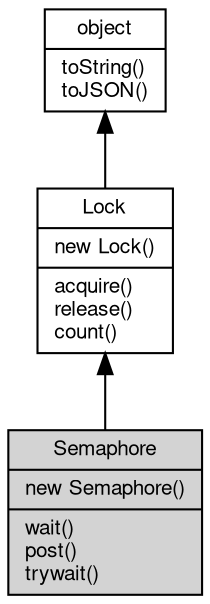

# Object Semaphore
A counting semaphore between fibers: limits concurrency and hands work from

one fiber to another

A Semaphore owns a counter of permits. `post` adds a permit and wakes one waiting
fiber, `wait` takes a permit and suspends the calling fiber when none is left. Unlike
a [Lock](Lock.md), a semaphore has no owner: any fiber may post, the counter may hold more than
one permit, and the fiber that takes a permit need not be the one that returns it.
Because Semaphore derives from [Lock](Lock.md), the lock interface is available too — `release()`
is `post()`, `acquire(false)` is `trywait()` and `acquire()` is `wait(-1)`.

Concepts:

- **Counter semantics**: the counter never goes below zero. `post` increments it or,
when fibers are already parked, wakes the oldest waiter instead; `wait` decrements it
when a permit is available and otherwise parks the calling fiber until one arrives.
Permits posted while nobody waits accumulate, so a semaphore can also be used as a
one-way signal.
- **Timeout**: `wait(ms)` returns true when it took a permit and false when `ms`
milliseconds elapsed first. The default is -1, which waits forever, and 0 checks the
current state without waiting.
- **Diagnostics**: `count()` reports how many fibers are blocked in wait, not how many
permits are free; the current permit count is not exposed. Use it for monitoring only.
- **Common patterns**: create the semaphore with N permits and take one around each
use of a resource to cap concurrency; combine a plain queue with a semaphore
initialized to 0 for producer/consumer handoff; post from a timer or another fiber to
wake a parked waiter.
- **Related primitives**: [Lock](Lock.md) gives mutual exclusion, [Condition](Condition.md) waits for a state,
[Event](Event.md) releases a group of fibers at once, and only Semaphore counts permits.
- **Node.js**: there is no semaphore in Node.js. The closest shapes are
`Atomics.wait`/`Atomics.notify` between workers and the browser Web Locks API, both
unrelated to fibers.

Obtained from:
- `new [coroutine.Semaphore](../../module/ifs/coroutine.md#Semaphore)(value = 1)` — creates a semaphore with `value` permits.

Example 1 — cap the concurrency of a task pool:

```JavaScript
const coroutine = require('coroutine');

const slots = new coroutine.Semaphore(2); // at most two workers at a time
let running = 0;
let peak = 0;

function task() {
    slots.wait();
    running++;
    if (running > peak)
        peak = running;
    coroutine.sleep(10);
    running--;
    slots.post();
}

const fibers = [];
for (let i = 0; i < 6; i++)
    fibers.push(coroutine.start(task));
fibers.forEach((f) => f.join());

console.log('peak workers:', peak);
```

will output:
```sh
peak workers: 2
```

Example 2 — producer/consumer handoff over a queue:

```JavaScript
const coroutine = require('coroutine');

const queue = [];
const ready = new coroutine.Semaphore(0);
const done = new coroutine.Semaphore(0);

function producer() {
    for (let i = 1; i <= 3; i++) {
        queue.push(i);
        ready.post(); // wake one consumer (or store a permit)
    }
}

function consumer() {
    for (let i = 0; i < 3; i++) {
        ready.wait(); // park until an item is available
        console.log('consumed', queue.shift());
    }
    done.post();
}

coroutine.start(producer);
coroutine.start(consumer);
done.wait();
console.log('all items consumed');
```

will output:
```sh
consumed 1
consumed 2
consumed 3
all items consumed
```

## Inheritance


## Constructors
        
### Semaphore
**Creates a semaphore with the given number of permits**

```JavaScript
new Semaphore(Integer value = 1);
```

Parameters:
* value: Integer, initial number of permits, 0 or more

`value` is placed in the counter and defaults to 1, so a plain `new [coroutine.Semaphore](../../module/ifs/coroutine.md#Semaphore)()`
can be used as a one-shot signal or as a mutex-like permit. A negative value throws
`RangeError` (20006) with a message naming the received value.

Example — the initial permits are consumed by trywait:

```JavaScript
const coroutine = require('coroutine');

const sem = new coroutine.Semaphore(3);

console.log(sem.trywait(), sem.trywait(), sem.trywait());
console.log('one more try:', sem.trywait());
```

will output:
```sh
true true true
one more try: false
```

## Methods
        
### wait
**Takes a permit, waiting for one when necessary**

```JavaScript
Boolean Semaphore.wait(Integer timeout = -1) async;
```

Parameters:
* timeout: Integer, maximum time to wait in milliseconds, -1 waits forever

Returns:
* Boolean, true when a permit was taken, false on timeout

A permit is taken immediately when the counter is positive, otherwise the calling
fiber is suspended until some fiber posts and hands over a permit. The call returns
true when it took a permit and false when the timeout elapsed first; the default
timeout is -1, which waits forever, and a timeout of 0 only checks the current state.
The waiting is fiber-local: the rest of the [process](../../module/ifs/process.md) keeps running. `waitAsync(ms)` is
the promise form.

Example — a timeout returns false and a later post makes it succeed:

```JavaScript
const coroutine = require('coroutine');

const sem = new coroutine.Semaphore(0);

console.log('wait(5):', sem.wait(5)); // nobody posts yet
sem.post();
console.log('wait(-1):', sem.wait());
```

will output:
```sh
wait(5): false
wait(-1): true
```

--------------------------
### post
**Adds a permit, equivalent to release()**

```JavaScript
Semaphore.post();
```

Increments the counter, or wakes the oldest fiber waiting in `wait`/`acquire` when
some are parked. Any fiber may post, including fibers that never took a permit, and
posts made with no waiter simply accumulate. The call returns undefined.

--------------------------
### trywait
**Tries to take a permit without waiting, equivalent to acquire(false)**

```JavaScript
Boolean Semaphore.trywait();
```

Returns:
* Boolean, true when a permit was taken

Returns true when the counter was positive and a permit was taken, and false
immediately when it was zero; the calling fiber is never suspended.

--------------------------
### acquire
**Acquires the lock**

```JavaScript
Boolean Semaphore.acquire(Boolean blocking = true) async;
```

Parameters:
* blocking: Boolean, true to wait for the lock, false to return immediately

Returns:
* Boolean, true when the lock was acquired, false only with `blocking` false

When the lock is free the call returns true at once. When another fiber owns it and
`blocking` is true (the default), the calling fiber is suspended until that fiber
releases the lock, and the call then returns true; when `blocking` is false the call
returns false immediately without waiting. The owner may acquire the lock again, so
`acquire(false)` from the owning fiber returns true even if other fibers are waiting.
The argument is coerced to boolean, and `acquireAsync()` is the promise form that does
not block the calling fiber.

Example — the same fiber may re-enter the lock:

```JavaScript
const coroutine = require('coroutine');

const lock = new coroutine.Lock();

console.log('first acquire:', lock.acquire());
console.log('acquire again in the same fiber:', lock.acquire());
lock.release();
console.log('after one release, acquire(false):', lock.acquire(false));
lock.release();
lock.release();

console.log('fibers waiting:', lock.count());
```

will output:
```sh
first acquire: true
acquire again in the same fiber: true
after one release, acquire(false): true
fibers waiting: 0
```

--------------------------
### release
**Releases the lock**

```JavaScript
Semaphore.release();
```

Removes one level of ownership from the calling fiber; the lock becomes free for other
fibers when the last level is released, and one of the waiting fibers is resumed.
Releasing a lock that the calling fiber does not own is a programming error: debug
builds abort on the assertion, while release builds silently corrupt the lock state,
so keep the calls balanced with `try`/`finally`. The call returns undefined.

--------------------------
### count
**Number of fibers blocked in acquire**

```JavaScript
Integer Semaphore.count();
```

Returns:
* Integer, number of fibers waiting for the lock

The value covers the waits on this lock only: the owning fiber and fibers that used
`acquire(false)` are not counted, and the recursion depth of the owner is not
reported. Use it for diagnostics and monitoring, never as a synchronization condition.

--------------------------
### toString
**Returns the string form of the [object](object.md)**

```JavaScript
String Semaphore.toString();
```

Returns:
* String, returns the string form of the [object](object.md)

The base implementation reports an error: a native [object](object.md) has no implicit
text form, and only the classes whose value can be written as a string
override the member. [Buffer](Buffer.md) returns its content decoded with the given
[encoding](../../module/ifs/encoding.md), [HttpCookie](HttpCookie.md) returns "name=value", and so on; an override commonly
accepts optional arguments ([Buffer.toString](Buffer.md#toString) takes [encoding](../../module/ifs/encoding.md), start and
end) that are not part of this declaration.

Calling the member on a class that does not override it throws
"<Class>: the [object](object.md) can not be converted to string.", which is the
behavior to rely on when probing whether a value has a string form. See
toJSON for the serialization hook.

--------------------------
### toJSON
**Returns the JSON representation of the [object](object.md)**

```JavaScript
Value Semaphore.toJSON(String key = "");
```

Parameters:
* key: String, the property name of the value being serialized

Returns:
* Value, returns the JSON-serializable value

JSON.stringify(value) calls value.toJSON(key) when the member exists and
serializes the returned value in its place; the key argument carries the
property name of the value inside its parent [object](object.md) (an empty string at
the top level) and may be used to build a keyed form. The base
implementation returns a plain [object](object.md) holding the readable properties of
the instance, so a native [object](object.md) serializes without per-class code; a
class with a portable shape such as [Buffer](Buffer.md) overrides it, and a JavaScript
class may override it in the same way.

The member is normally reached through JSON.stringify rather than called
directly; calling it returns the same value JSON.stringify would
serialize.

