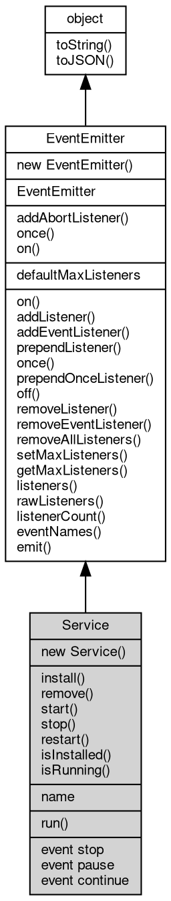

# Object Service
A Windows system service: run a JavaScript function under the Service Control Manager

A Service connects the current [process](../../module/ifs/process.md) to the Windows Service Control Manager (SCM).
The worker function runs when the SCM starts the service, and the SCM commands `stop`,
`pause` and `continue` are delivered as events. Unlike [TcpServer](TcpServer.md) or [HttpServer](HttpServer.md) —
ordinary classes that accept connections — a Service serves no requests and is not
their base class; it only presents the [process](../../module/ifs/process.md) to the operating system as a managed
service.

Concepts:

- **Platform**: the class is published on every platform as `os.Service`, but
construction, `run` and all static methods are Windows-only; elsewhere they throw
`Error` with number 20009 (invalid procedure call). A service script must therefore be
guarded with `[process.platform](../../module/ifs/process.md#platform) === 'win32'`, as in the examples below.
- **Lifecycle**: `install` registers a command line that the SCM launches at boot;
when that [process](../../module/ifs/process.md) calls `run()`, the SCM connects to it and dispatches control events.
`isInstalled` and `isRunning` query the service database, `start`, `stop` and
`restart` control a registered service, and `remove` unregisters it. Managing services
normally requires administrator rights.
- **Running**: `run()` must be called by the [process](../../module/ifs/process.md) the SCM launched; it does not
return until the service stops, and only one Service may run per [process](../../module/ifs/process.md). The worker
function is invoked when the service starts, and the `stop` handler is the place to
close resources. `runAsync()` is the promise form.
- **Events**: `stop`, `pause` and `continue` mirror the SCM controls and are also
exposed as the `onstop`, `onpause` and `oncontinue` properties. The `event` [object](object.md) of
the constructor is the map form of [EventEmitter](EventEmitter.md)#on, a shortcut for registering them.
- **Name**: `name` is the identifier registered with the SCM and may be changed at any
time; the static methods take that name as a string instead of using an instance.
- **Node.js**: there is no Node.js counterpart — system service management is outside
the Node.js standard library.

Obtained from:
- `new [os.Service](../../module/ifs/os.md#Service)(name, worker, event = {})` — creates the service [object](object.md) (Windows only);
- the class is published as `os.Service`; there is no [module](../../module/ifs/module.md) of that name.

Example 1 — the class is reachable everywhere but construction only works on Windows:

```JavaScript
const os = require('os');

console.log('os.Service is a', typeof os.Service);

if (process.platform === 'win32') {
    const service = new os.Service('fibjs-demo', function() {
        console.log('service worker');
    });
    console.log('created:', service.name);
} else {
    try {
        new os.Service('fibjs-demo', function() {});
        console.log('created');
    } catch (err) {
        console.log('not available on this platform, error number:', err.number);
    }
}
```

will output on Linux:
```sh
os.Service is a function
not available on this platform, error number: 20009
```

Example 2 — the entry point of a service [process](../../module/ifs/process.md):

```JavaScript
// requires: windows
const os = require('os');
const fs = require('fs');

const log = 'C:\\temp\\fibjs-service.log';

const service = new os.Service('fibjs-demo', function() {
    // runs when the SCM starts the service, on its own fiber
    fs.appendFile(log, 'worker started\n');
}, {
    stop: function() {
        fs.appendFile(log, 'service stopping\n');
    }
});

service.run(); // returns when the service stops
```

Example 3 — install, control and remove a service:

```JavaScript
// requires: windows
const os = require('os');

const name = 'fibjs-demo';
const cmd = process.execPath + ' C:\\services\\demo.js';

if (!os.Service.isInstalled(name)) {
    os.Service.install(name, cmd, 'fibjs demo service', 'A fibjs sample service');
    console.log('installed');
}

console.log('installed:', os.Service.isInstalled(name));
os.Service.start(name);
console.log('running:', os.Service.isRunning(name));
os.Service.stop(name);
os.Service.remove(name);
console.log('removed:', os.Service.isInstalled(name) === false);
```

## Inheritance

```dot
digraph {
    node [fontname="Helvetica,sans-Serif", fontsize=10, shape="record", style="filled", fillcolor="white"];

    object [tooltip="object", URL="object.md", label="{object|toString()\ltoJSON()\l}"];
    EventEmitter [tooltip="EventEmitter", URL="EventEmitter.md", label="{EventEmitter|new EventEmitter()\l|EventEmitter\l|addAbortListener()\lonce()\lon()\l|defaultMaxListeners\l|on()\laddListener()\laddEventListener()\lprependListener()\lonce()\lprependOnceListener()\loff()\lremoveListener()\lremoveEventListener()\lremoveAllListeners()\lsetMaxListeners()\lgetMaxListeners()\llisteners()\lrawListeners()\llistenerCount()\leventNames()\lemit()\l}"];
    Service [tooltip="Service", fillcolor="lightgray", id="me", label="{Service|new Service()\l|install()\lremove()\lstart()\lstop()\lrestart()\lisInstalled()\lisRunning()\l|name\l|run()\l|event stop\levent pause\levent continue\l}"];

    object -> EventEmitter [dir=back];
    EventEmitter -> Service [dir=back];
}
```

## Constructors
        
### Service
**Creates the service [object](object.md)**

```JavaScript
new Service(String name,
    Function() worker,
    Object event = {});
```

Parameters:
* name: String, service name
* worker: Function(), function executed when the service starts
* event: Object, map of event handlers to register, for example `{ stop: fn }`

`name` is the service name registered with the SCM and is also the initial value of
the `name` property. `worker` is the function executed when the service starts; it is
called without arguments, with the Service [object](object.md) as `this`, and it may block for the
whole life of the service. `event` is an optional map of event names to handlers,
equivalent to calling `on` for each entry. The constructor only creates the [object](object.md): it
does not install or start anything, and on platforms other than Windows it throws
`Error` (20009).

## Static Methods
        
### install
**Installs the service into the system**

```JavaScript
static Service.install(String name,
    String cmd,
    String displayName = "",
    String description = "");
```

Parameters:
* name: String, service name
* cmd: String, command line the SCM will launch
* displayName: String, name shown by the service manager, empty to use `name`
* description: String, description shown by the service manager, empty by default

Registers the service `name` with the SCM so that it can be started manually or at
boot, and stores `displayName` and `description` for the service manager. `cmd` is the
complete command line to launch, including the executable and its arguments (for
example `[process.execPath](../../module/ifs/process.md#execPath) + ' C:\\srv\\app.js'`). A failure is reported with the Windows
error code of the SCM operation, for example `ERROR_SERVICE_EXISTS` when the name is
already registered or an access-denied error when the [process](../../module/ifs/process.md) lacks the rights. The
method is Windows-only.

--------------------------
### remove
**Uninstalls the service from the system**

```JavaScript
static Service.remove(String name);
```

Parameters:
* name: String, service name

Removes the service registration from the SCM; it fails with the SCM error when the
service is running or the [process](../../module/ifs/process.md) has no permission. Windows-only (`Error` 20009
elsewhere).

--------------------------
### start
**Starts the service**

```JavaScript
static Service.start(String name);
```

Parameters:
* name: String, service name

Asks the SCM to launch the registered command line; the new [process](../../module/ifs/process.md) calls `run` and
the service begins to work. Windows-only (`Error` 20009 elsewhere).

--------------------------
### stop
**Stops the service**

```JavaScript
static Service.stop(String name);
```

Parameters:
* name: String, service name

Sends the stop control to the running service and waits until the SCM reports it as
stopped, so the call may block for a while. Windows-only (`Error` 20009 elsewhere).

--------------------------
### restart
**Restarts the service, equivalent to stop followed by start**

```JavaScript
static Service.restart(String name);
```

Parameters:
* name: String, service name

Windows-only (`Error` 20009 elsewhere).

--------------------------
### isInstalled
**Checks whether the service is installed**

```JavaScript
static Boolean Service.isInstalled(String name);
```

Parameters:
* name: String, service name

Returns:
* Boolean, true when the service is registered with the SCM

Opens the service in the SCM database and returns true when the registration exists,
no matter whether the service is running. Windows-only (`Error` 20009 elsewhere).

--------------------------
### isRunning
**Checks whether the service is running**

```JavaScript
static Boolean Service.isRunning(String name);
```

Parameters:
* name: String, service name

Returns:
* Boolean, true when the service is running

Queries the current SCM status of the service and returns true only while it is in the
running state, so a paused service reports false. Windows-only (`Error` 20009
elsewhere).

--------------------------
### addAbortListener
**Registers a one-shot abort handler on an [AbortSignal](AbortSignal.md)**

```JavaScript
static Object Service.addAbortListener(EventEmitter signal,
    Function(Object ev) func);
```

Parameters:
* signal: [EventEmitter](EventEmitter.md), the [AbortSignal](AbortSignal.md) [object](object.md) to listen to
* func: Function(Object ev), the handler for the abort event

Returns:
* Object, returns a Disposable [object](object.md) containing a `[Symbol.dispose]` method

The handler is called at most once when the signal is aborted, and it is removed from the
signal afterwards. If the signal is already aborted the handler is invoked synchronously.
The returned [object](object.md) has a `[Symbol.dispose]()` method that removes the handler, so it can be
released before the abort happens.

Example — abort handling with automatic cleanup:

```JavaScript
const events = require('events');

const controller = new AbortController();
const disposable = events.addAbortListener(controller.signal,
    () => console.log('aborted'));

controller.abort(); // aborted
disposable[Symbol.dispose](); // safe to call after the listener fired
console.log(controller.signal.listenerCount('abort')); // 0
```

--------------------------
### once
**Creates a Promise resolved by the next occurrence of an event**

```JavaScript
static Object Service.once(EventEmitter emitter,
    Value ev,
    Object options = {});
```

Parameters:
* emitter: [EventEmitter](EventEmitter.md), the event emitter [object](object.md) to listen to
* ev: Value, the event name to listen for
* options: Object, optional parameter [object](object.md)

Returns:
* Object, returns a Promise that resolves with the array of event parameters

The Promise resolves with the array of the emit arguments when the event fires; it rejects
when `error` is emitted while waiting, unless the waited event is `error` itself, or when
the signal option aborts. The temporary listeners are removed when the Promise settles.

options supports the following option:

```JavaScript
// fragment: options
({
    "signal": null // AbortSignal; aborting rejects the Promise with an AbortError
});
```

Example — awaiting the next occurrence of an event:

```JavaScript
const EventEmitter = require('events');

(async () => {
    const emitter = new EventEmitter();
    const waiting = EventEmitter.once(emitter, 'ready');

    emitter.emit('ready', 200, 'ok');
    console.log(JSON.stringify(await waiting)); // [200,"ok"]
})();
```

--------------------------
### on
**Creates an async iterator that yields event occurrences**

```JavaScript
static Object Service.on(EventEmitter emitter,
    Value ev,
    Object options = {});
```

Parameters:
* emitter: [EventEmitter](EventEmitter.md), the event emitter [object](object.md) to listen to
* ev: Value, the event name to listen for
* options: Object, optional parameter [object](object.md)

Returns:
* Object, returns an AsyncIterator [object](object.md)

Each next() resolves with `{ value: [args...], done: false }` when the event fires and with
`{ done: true }` after an event named in the `close` option fires or the signal aborts; an
`error` event rejects the pending call. The listeners are registered when the iterator is
created and removed when the iteration ends or the signal aborts.

options supports the following options:

```JavaScript
// fragment: options
({
    "signal": null, // AbortSignal; aborting rejects pending and future next() calls
    "close": [] // event names; the first one to fire ends the iteration
});
```

Example — iterating the occurrences of an event:

```JavaScript
const EventEmitter = require('events');

(async () => {
    const emitter = new EventEmitter();
    const iterator = EventEmitter.on(emitter, 'data', {
        close: ['end']
    });

    emitter.emit('data', 1);
    emitter.emit('data', 2);
    emitter.emit('end');

    for await (const args of iterator)
    console.log(JSON.stringify(args)); // [1] then [2]
})();
```

## Static Properties
        
### defaultMaxListeners
**Integer, The [process](../../module/ifs/process.md)-wide default listener limit reported by getMaxListeners()**

```JavaScript
static Integer Service.defaultMaxListeners;
```

Defaults to 10. Assigning a value changes getMaxListeners() for every emitter that never
called setMaxListeners(); an emitter with an explicit limit keeps it. The limit is
informational: fibjs never warns when the number of listeners exceeds it.

## Properties
        
### name
**String, The service name**

```JavaScript
String Service.name;
```

The name is the identifier used by the SCM and may be read or replaced at any time;
changing it does not rename an already installed service. This property is available
on every platform on a service [object](object.md); the creation of that [object](object.md) is the Windows-only
part.

## Methods
        
### run
**Runs the service control dispatcher and blocks until the service stops**

```JavaScript
Service.run() async;
```

The call must come from the [process](../../module/ifs/process.md) that the SCM launched; it connects to the Service
Control Manager and waits for its control events, invoking the worker function when
the service is started and the event handlers when the service is stopped, paused or
continued. The method returns when the service stops, and only one Service may be
running per [process](../../module/ifs/process.md). `runAsync()` is the promise form; both are Windows-only (`Error`
20009 elsewhere).

--------------------------
### on
**Appends an event handler to the emitter**

```JavaScript
Object Service.on(Value ev,
    Function(...args) func);
```

Parameters:
* ev: Value, the event name to bind
* func: Function(...args), the event handler function, called with the emit arguments

Returns:
* Object, returns the event [object](object.md) itself for chaining

The listener is called with the arguments of emit() and `this` set to the emitter; the
emitter itself is returned so registrations can be chained. The same function may be
registered several times for one event and each copy is called. See the class documentation
for the dispatch order.

--------------------------
**Appends several event handlers to the emitter**

```JavaScript
Object Service.on(Object map);
```

Parameters:
* map: Object, the event mapping; [object](object.md) property names are used as event names

Returns:
* Object, returns the event [object](object.md) itself for chaining

Every enumerable property of the map whose value is a function is registered under its
property name. Properties are processed in order; a value that is not a function makes the
call fail with an invalid-type error while entries processed before it stay registered.

Example — registering several handlers at once:

```JavaScript
const EventEmitter = require('events');

const emitter = new EventEmitter();
emitter.on({
    connect: () => console.log('connect'),
    close: () => console.log('close')
});

emitter.emit('connect'); // connect
emitter.emit('close'); // close
```

--------------------------
### addListener
**Appends an event handler to the emitter**

```JavaScript
Object Service.addListener(Value ev,
    Function(...args) func);
```

Parameters:
* ev: Value, the event name to bind
* func: Function(...args), the event handler function

Returns:
* Object, returns the event [object](object.md) itself for chaining

Alias of on(ev, func), provided for Node.js compatibility.

--------------------------
**Appends several event handlers to the emitter**

```JavaScript
Object Service.addListener(Object map);
```

Parameters:
* map: Object, the event mapping; [object](object.md) property names are used as event names

Returns:
* Object, returns the event [object](object.md) itself for chaining

Alias of on(map), provided for Node.js compatibility.

--------------------------
### addEventListener
**Appends an event handler to the emitter with an options [object](object.md)**

```JavaScript
Object Service.addEventListener(Value ev,
    Function(...args) func,
    Object options = {});
```

Parameters:
* ev: Value, the event name to bind
* func: Function(...args), the event handler function, called with the emit arguments
* options: Object, the options of the event handler

Returns:
* Object, returns the event [object](object.md) itself for chaining

Web-style alias of on(); the only supported option is `once`, which registers a one-shot
handler exactly like once(). The listener receives the plain emit arguments and not an [Event](Event.md)
[object](object.md); see the [DOMEvent](DOMEvent.md) class for the DOM-style event [object](object.md) used by [AbortSignal](AbortSignal.md) and
fetch-style APIs.

options supports the following option:

```JavaScript
// fragment: options
({
    "once": false // when true, the handler is removed before its single invocation
});
```

Example — a one-shot DOM-style registration:

```JavaScript
const EventEmitter = require('events');

const emitter = new EventEmitter();
emitter.addEventListener('ping', () => console.log('ping'), {
    once: true
});

emitter.emit('ping'); // ping
console.log(emitter.emit('ping')); // false
console.log(emitter.listenerCount('ping')); // 0
```

--------------------------
### prependListener
**Inserts an event handler at the front of the queue**

```JavaScript
Object Service.prependListener(Value ev,
    Function(...args) func);
```

Parameters:
* ev: Value, the event name to bind
* func: Function(...args), the event handler function

Returns:
* Object, returns the event [object](object.md) itself for chaining

The listener is called before the listeners registered with on()/addListener() the next time
the event is emitted. When several prependListener() calls are made, the last one registered
is called first, because every call inserts at the same position.

Example — insertion at the front of the queue:

```JavaScript
const EventEmitter = require('events');

const emitter = new EventEmitter();
emitter.on('order', () => console.log('on'));
emitter.prependListener('order', () => console.log('prepend'));

emitter.emit('order'); // prepend, then on
```

--------------------------
**Inserts several event handlers at the front of the queue**

```JavaScript
Object Service.prependListener(Object map);
```

Parameters:
* map: Object, the event mapping; [object](object.md) property names are used as event names

Returns:
* Object, returns the event [object](object.md) itself for chaining

Map form of prependListener(); every function property is inserted at the front, so the
properties of the map are called in reverse order.

--------------------------
### once
**Appends a one-shot event handler to the emitter**

```JavaScript
Object Service.once(Value ev,
    Function(...args) func);
```

Parameters:
* ev: Value, the event name to bind
* func: Function(...args), the event handler function

Returns:
* Object, returns the event [object](object.md) itself for chaining

The handler is wrapped and removes itself from the queue before it is called, so it runs at
most once. off() removes it when passed the original function, listeners() returns the
original function, and rawListeners() returns the internal wrapper whose `_func` property
holds the original. See Example 2 in the class documentation.

--------------------------
**Appends several one-shot event handlers to the emitter**

```JavaScript
Object Service.once(Object map);
```

Parameters:
* map: Object, the event mapping; [object](object.md) property names are used as event names

Returns:
* Object, returns the event [object](object.md) itself for chaining

Map form of once(); every function property is registered as a one-shot listener under its
property name.

--------------------------
### prependOnceListener
**Inserts a one-shot event handler at the front of the queue**

```JavaScript
Object Service.prependOnceListener(Value ev,
    Function(...args) func);
```

Parameters:
* ev: Value, the event name to bind
* func: Function(...args), the event handler function

Returns:
* Object, returns the event [object](object.md) itself for chaining

Combines prependListener() and once(): the handler is called first and only once, and it is
removed before its invocation.

--------------------------
**Inserts several one-shot event handlers at the front of the queue**

```JavaScript
Object Service.prependOnceListener(Object map);
```

Parameters:
* map: Object, the event mapping; [object](object.md) property names are used as event names

Returns:
* Object, returns the event [object](object.md) itself for chaining

Map form of prependOnceListener(); every function property is inserted as a one-shot
listener, and the properties of the map are called in reverse order.

--------------------------
### off
**Removes an event handler from the emitter**

```JavaScript
Object Service.off(Value ev,
    Function(...args) func);
```

Parameters:
* ev: Value, the event name to unbind
* func: Function(...args), the event handler function

Returns:
* Object, returns the event [object](object.md) itself for chaining

The first matching listener is removed; when the same function was registered several times
only one copy is removed per call, so repeat the call to remove the others. A once() wrapper
is matched by its original function as well. Removing a listener emits the `removeListener`
meta event after the removal.

--------------------------
**Removes all event handlers of one event**

```JavaScript
Object Service.off(Value ev);
```

Parameters:
* ev: Value, the event name to unbind

Returns:
* Object, returns the event [object](object.md) itself for chaining

Every listener of the event is removed and `removeListener` is emitted once per removed
listener. The call succeeds when the event has no listener.

Example — removing every listener of one event:

```JavaScript
const EventEmitter = require('events');

const emitter = new EventEmitter();
emitter.on('data', () => console.log('first'));
emitter.on('data', () => console.log('second'));

emitter.off('data');
console.log(emitter.emit('data')); // false
```

--------------------------
**Removes several event handlers from the emitter**

```JavaScript
Object Service.off(Object map);
```

Parameters:
* map: Object, the event mapping; [object](object.md) property names are used as event names

Returns:
* Object, returns the event [object](object.md) itself for chaining

Every enumerable property of the map whose value is a function names an event from which
that function is removed (one copy per event). A value that is not a function makes the call
fail with an invalid-type error.

--------------------------
### removeListener
**Removes an event handler from the emitter**

```JavaScript
Object Service.removeListener(Value ev,
    Function(...args) func);
```

Parameters:
* ev: Value, the event name to unbind
* func: Function(...args), the event handler function

Returns:
* Object, returns the event [object](object.md) itself for chaining

Alias of off(ev, func), provided for Node.js compatibility.

--------------------------
**Removes all event handlers of one event**

```JavaScript
Object Service.removeListener(Value ev);
```

Parameters:
* ev: Value, the event name to unbind

Returns:
* Object, returns the event [object](object.md) itself for chaining

Alias of off(ev), provided for Node.js compatibility.

--------------------------
**Removes several event handlers from the emitter**

```JavaScript
Object Service.removeListener(Object map);
```

Parameters:
* map: Object, the event mapping; [object](object.md) property names are used as event names

Returns:
* Object, returns the event [object](object.md) itself for chaining

Alias of off(map), provided for Node.js compatibility.

--------------------------
### removeEventListener
**Removes an event handler with an options [object](object.md)**

```JavaScript
Object Service.removeEventListener(Value ev,
    Function(...args) func,
    Object options = {});
```

Parameters:
* ev: Value, the event name to unbind
* func: Function(...args), the event handler function
* options: Object, the options of the event handler, ignored

Returns:
* Object, returns the event [object](object.md) itself for chaining

Web-style alias of off(ev, func); the options [object](object.md) is accepted and ignored, and a once()
wrapper is matched by its original function like off().

--------------------------
### removeAllListeners
**Removes all listeners of one event**

```JavaScript
Object Service.removeAllListeners(Value ev);
```

Parameters:
* ev: Value, the event name to remove

Returns:
* Object, returns the event [object](object.md) itself for chaining

Equivalent to off(ev): every listener of the event is removed, including once() wrappers
matched by their original function, and `removeListener` is emitted once per removal.

--------------------------
**Removes all listeners of the given events, or of the whole emitter**

```JavaScript
Object Service.removeAllListeners(Array evs = []);
```

Parameters:
* evs: Array, the event names to remove

Returns:
* Object, returns the event [object](object.md) itself for chaining

An empty array — including the no-argument call, because the parameter defaults to [] —
clears every string-keyed event; symbol-keyed listeners are left in place, unlike Node.js
which removes them too. A non-empty array clears each named event as
removeAllListeners(ev) does.

Example — clearing selected events and the whole emitter:

```JavaScript
const EventEmitter = require('events');

const emitter = new EventEmitter();
emitter.on('a', () => {});
emitter.on('b', () => {});
emitter.on('c', () => {});

emitter.removeAllListeners(['a', 'b']);
console.log(emitter.listenerCount('a'), emitter.listenerCount('c')); // 0 1

emitter.removeAllListeners();
console.log(emitter.eventNames().length); // 0
```

--------------------------
### setMaxListeners
**Stores a per-emitter listener limit**

```JavaScript
Service.setMaxListeners(Integer n);
```

Parameters:
* n: Integer, the number of events

The value is reported by getMaxListeners() and is otherwise informational: fibjs never warns
when the number of listeners exceeds it. This member exists for Node.js compatibility. A
negative value throws; 0 is accepted and stored as-is, while Node.js treats 0 as unlimited.

--------------------------
### getMaxListeners
**Returns the listener limit of the emitter**

```JavaScript
Integer Service.getMaxListeners();
```

Returns:
* Integer, returns the default limit

Returns the value set by setMaxListeners(), or the [process](../../module/ifs/process.md)-wide defaultMaxListeners (10)
when no explicit value was set.

--------------------------
### listeners
**Returns a copy of the listener array of an event**

```JavaScript
Array Service.listeners(Value ev);
```

Parameters:
* ev: Value, the event name to query

Returns:
* Array, returns the listener array of the specified event

One-shot wrappers are unwrapped, so the result contains the functions passed to
on()/once() and can be passed to off(); an unknown event produces an empty array.

Example — once() listeners are returned unwrapped:

```JavaScript
const EventEmitter = require('events');

const emitter = new EventEmitter();

function onTick() {
    console.log('tick');
}

emitter.once('tick', onTick);
console.log(emitter.listeners('tick')[0] === onTick); // true
console.log(emitter.rawListeners('tick')[0] === onTick); // false
```

--------------------------
### rawListeners
**Returns the internal listener array of an event**

```JavaScript
Array Service.rawListeners(Value ev);
```

Parameters:
* ev: Value, the event name to query

Returns:
* Array, returns the listener array of the specified event

The array is not unwrapped: a listener registered with once() appears as the internal
wrapper function whose `_func` property holds the original function. An unknown event
produces an empty array.

--------------------------
### listenerCount
**Returns the number of listeners of an event**

```JavaScript
Integer Service.listenerCount(Value ev);
```

Parameters:
* ev: Value, the event name to query

Returns:
* Integer, returns the number of listeners of the specified event

One-shot listeners count as one and an unknown event returns 0.

--------------------------
**Returns the number of listeners of an event on another [object](object.md)**

```JavaScript
Integer Service.listenerCount(Value o,
    Value ev);
```

Parameters:
* o: Value, the [object](object.md) to query
* ev: Value, the event name to query

Returns:
* Integer, returns the number of listeners of the specified event

Counts without requiring the target to be an [EventEmitter](EventEmitter.md): any [object](object.md) with registered
events can be queried. The call is normally written as
`EventEmitter.listenerCount(target, 'data')`.

Example — counting the listeners of another [object](object.md):

```JavaScript
const EventEmitter = require('events');

const emitter = new EventEmitter();
emitter.on('data', () => {});
emitter.on('data', () => {});

console.log(EventEmitter.listenerCount(emitter, 'data')); // 2
```

--------------------------
### eventNames
**Returns the names of the events with at least one listener**

```JavaScript
Array Service.eventNames();
```

Returns:
* Array, returns the array of event names

Only string-keyed events are reported; symbol-keyed events are omitted and numeric event
names are returned as numbers (Node.js also reports symbol events).

--------------------------
### emit
**Emits an event and returns whether a listener was called**

```JavaScript
Boolean Service.emit(Value ev,
    ...args);
```

Parameters:
* ev: Value, event name
* args: ..., event parameters, which are passed to the event handler

Returns:
* Boolean, returns whether the event had a listener to respond to it

Listeners are called as described by the dispatch model in the class documentation: the
first one runs synchronously on the current fiber, the remaining ones run in parallel
fibers, and the call returns after all of them finish; an exception raised by a listener is
thrown back to the caller. Emitting `error` with no listener throws instead of returning
false: an Error argument is thrown as-is and any other value is wrapped in
`Error("Unhandled error. (...)")`. [Event](Event.md) names are strings or symbols; `emit()` does not
match a listener registered with a numeric name.

--------------------------
### toString
**Returns the string form of the [object](object.md)**

```JavaScript
String Service.toString();
```

Returns:
* String, returns the string form of the [object](object.md)

The base implementation reports an error: a native [object](object.md) has no implicit
text form, and only the classes whose value can be written as a string
override the member. [Buffer](Buffer.md) returns its content decoded with the given
[encoding](../../module/ifs/encoding.md), [HttpCookie](HttpCookie.md) returns "name=value", and so on; an override commonly
accepts optional arguments ([Buffer.toString](Buffer.md#toString) takes [encoding](../../module/ifs/encoding.md), start and
end) that are not part of this declaration.

Calling the member on a class that does not override it throws
"<Class>: the [object](object.md) can not be converted to string.", which is the
behavior to rely on when probing whether a value has a string form. See
toJSON for the serialization hook.

--------------------------
### toJSON
**Returns the JSON representation of the [object](object.md)**

```JavaScript
Value Service.toJSON(String key = "");
```

Parameters:
* key: String, the property name of the value being serialized

Returns:
* Value, returns the JSON-serializable value

JSON.stringify(value) calls value.toJSON(key) when the member exists and
serializes the returned value in its place; the key argument carries the
property name of the value inside its parent [object](object.md) (an empty string at
the top level) and may be used to build a keyed form. The base
implementation returns a plain [object](object.md) holding the readable properties of
the instance, so a native [object](object.md) serializes without per-class code; a
class with a portable shape such as [Buffer](Buffer.md) overrides it, and a JavaScript
class may override it in the same way.

The member is normally reached through JSON.stringify rather than called
directly; calling it returns the same value JSON.stringify would
serialize.

## Events
        
### stop
**Binds the service stop handler, equivalent to on("stop", func)**

```JavaScript
event Service.stop();
```

The handler runs on its own fiber when the SCM stops the service, after which `run`
returns. The property accessor is `onstop`, and the constructor's event map can
register the same handler.

--------------------------
### pause
**Binds the service pause handler, equivalent to on("pause", func)**

```JavaScript
event Service.pause();
```

The handler runs on its own fiber when the SCM pauses the service; use it to suspend
work that should not continue while the service is paused. The property accessor is
`onpause`.

--------------------------
### continue
**Binds the service resume handler, equivalent to on("continue", func)**

```JavaScript
event Service.continue();
```

The handler runs on its own fiber when the SCM resumes a paused service. The property
accessor is `oncontinue`.

