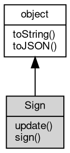

# Object Sign
Streaming signature generator

A Sign computes a digital signature over data fed with update() and produced by
sign(privateKey), which finalizes the [object](object.md). [crypto.createSign](../../module/ifs/crypto.md#createSign)(algorithm) is the
factory; [crypto.sign](../../module/ifs/crypto.md#sign)(algorithm, data, key) is the one-shot equivalent for data that
fits in memory, and the verifier side is [Verify](Verify.md) or [crypto.verify](../../module/ifs/crypto.md#verify).

Concepts:
- **Algorithm selection**: the algorithm is a digest name from [crypto.getHashes](../../module/ifs/crypto.md#getHashes)
  ('sha256', 'SHA-256', 'sha1', ...), matched case-insensitively. The key type
  selects the scheme: RSA uses PKCS#1 v1.5 by default and PSS when the padding
  option says so; ECDSA/DSA sign the digest; the signature is DER-encoded unless
  dsaEncoding is 'ieee-p1363'.
- **Key [types](../../module/ifs/types.md)**: RSA, DSA and EC keys sign through the streaming API.
  Ed25519/Ed448 are one-shot algorithms and are rejected here with "One-shot
  signature algorithms do not support sign"; use [crypto.sign](../../module/ifs/crypto.md#sign)(null, data, key) with
  them. SM2 and Bls12381 are fibjs extensions.
- **Key material**: sign() accepts a [KeyObject](KeyObject.md), a PEM/DER string or [Buffer](Buffer.md), or an
  options [object](object.md) carrying the key plus the scheme options {key, format, type,
  passphrase, dsaEncoding, padding, saltLength}. Anything that is not a [KeyObject](KeyObject.md)
  is passed to [crypto.createPrivateKey](../../module/ifs/crypto.md#createPrivateKey), exactly as in Node.js.
- **One signature per [object](object.md)**: sign() is terminal, because the [object](object.md) already
  finalized its digest. Do not reuse it; create a new Sign for each signature. With
  RSA PKCS#1 the signature is deterministic, so the same key, data and algorithm
  always produce the same bytes.

Obtained from:
- `crypto.createSign(algorithm)` — the streaming factory; its optional options are
  not used by fibjs;
- `crypto.sign(algorithm, data, key[, callback])` — one-shot signing, required for
  Ed25519/Ed448.

Example 1 — RSA signature and verification:

```JavaScript
const crypto = require('crypto');

// 1024 bits keep the example fast; use 2048 or more for real keys.
const {
    privateKey,
    publicKey
} = crypto.generateKeyPairSync('rsa', {
    modulusLength: 1024
});

const sign = crypto.createSign('SHA256');
sign.update('some data to sign');
const signature = sign.sign(privateKey);

const verify = crypto.createVerify('SHA256');
verify.update('some data to sign');
console.log(verify.verify(publicKey, signature)); // true
```

Example 2 — ECDSA with IEEE P1363 signatures:

```JavaScript
const crypto = require('crypto');

const {
    privateKey,
    publicKey
} = crypto.generateKeyPairSync('ec', {
    namedCurve: 'prime256v1'
});

const signature = crypto.createSign('SHA256').update('data')
    .sign({
        key: privateKey,
        dsaEncoding: 'ieee-p1363'
    });
console.log(signature.length); // 64 for P-256 (32-byte r || 32-byte s)

const valid = crypto.createVerify('SHA256').update('data')
    .verify({
        key: publicKey,
        dsaEncoding: 'ieee-p1363'
    }, signature);
console.log(valid); // true
```

Example 3 — signing with a PEM key and a string [encoding](../../module/ifs/encoding.md):

```JavaScript
const crypto = require('crypto');

const {
    privateKey,
    publicKey
} = crypto.generateKeyPairSync('rsa', {
    modulusLength: 1024
});
const privatePem = privateKey.export({
    format: 'pem',
    type: 'pkcs8'
});
const publicPem = publicKey.export({
    format: 'pem',
    type: 'spki'
});

const signature = crypto.createSign('SHA256').update('data to sign')
    .sign(privatePem, 'hex');

const valid = crypto.createVerify('SHA256').update('data to sign')
    .verify(publicPem, signature, 'hex');
console.log(valid); // true
```

## Inheritance

```dot
digraph {
    node [fontname="Helvetica,sans-Serif", fontsize=10, shape="record", style="filled", fillcolor="white"];

    object [tooltip="object", URL="object.md", label="{object|toString()\ltoJSON()\l}"];
    Sign [tooltip="Sign", fillcolor="lightgray", id="me", label="{Sign|update()\lsign()\l}"];

    object -> Sign [dir=back];
}
```

## Methods
        
### update
**Updates the Sign content with the given data**

```JavaScript
Sign Sign.update(Buffer | String data,
    String codec = "utf8");
```

Parameters:
* data: [Buffer](Buffer.md) | String, the data to update with
* codec: String, the [encoding](../../module/ifs/encoding.md) of a string data, default "utf8"

Returns:
* Sign, returns the Sign [object](object.md) itself

data may be a [Buffer](Buffer.md) or a string decoded with codec (default "utf8"); a [Buffer](Buffer.md)
ignores codec. Returns the Sign [object](object.md), so calls can be chained, and it may be
called any number of times before sign(). An unknown codec throws "[encoding](../../module/ifs/encoding.md):
Unknown charset". Calling update() after sign() is not supported; discard the
[object](object.md) and create a new Sign instead, as Node.js requires.

--------------------------
### sign
**Computes the signature of all the data passed in**

```JavaScript
Value Sign.sign(Buffer | KeyObject | Object | String privateKey,
    String encoding = "buffer");
```

Parameters:
* privateKey: [Buffer](Buffer.md) | [KeyObject](KeyObject.md) | Object | String, the private key used for signing
* encoding: String, the [encoding](../../module/ifs/encoding.md) of the return value

Returns:
* Value, returns the signature value

privateKey may be a [KeyObject](KeyObject.md), a PEM/DER string or [Buffer](Buffer.md) (a string is decoded
as utf8), or an options [object](object.md) that is passed to [crypto.createPrivateKey](../../module/ifs/crypto.md#createPrivateKey); the
following signing parameters are also supported in that [object](object.md):
- dsaEncoding for DSA and ECDSA, this option specifies the format of the
  generated signature. It can be one of the following:
 - 'der' (default): DER-encoded ASN.1 signature structure [encoding](../../module/ifs/encoding.md) (r, s)
 - 'ieee-p1363' : the signature format r || s proposed in IEEE-P1363
- padding optional RSA padding value, one of the following:
 - RSA_PKCS1_PADDING (default)
 - RSA_PKCS1_PSS_PADDING; RSA_PKCS1_PSS_PADDING will use MGF1 with the same
   hash function as the one used to sign the message specified in RFC 4055
   section 3.1
- saltLength the salt length when padding is RSA_PKCS1_PSS_PADDING. The special
  value RSA_PSS_SALTLEN_DIGEST sets the salt length to the digest size, and
  RSA_PSS_SALTLEN_MAX_SIGN (default) sets it to the maximum allowed value

The call finalizes the [object](object.md): a second sign() fails with an OpenSSL error
(Node.js throws ERR_CRYPTO_INVALID_STATE). A secret key or a key without private
material throws "Sign: invalid key type, expected a private key"; an
Ed25519/Ed448 key throws "One-shot signature algorithms do not support sign".
With [encoding](../../module/ifs/encoding.md) "buffer" (default) a [Buffer](Buffer.md) is returned, otherwise a string; an
unknown [encoding](../../module/ifs/encoding.md) throws "[encoding](../../module/ifs/encoding.md): Unknown charset".

Example: RSA-PSS signing and verification with matching options:

```JavaScript
const crypto = require('crypto');

const {
    privateKey,
    publicKey
} = crypto.generateKeyPairSync('rsa', {
    modulusLength: 1024
});

const options = {
    key: privateKey,
    padding: crypto.constants.RSA_PKCS1_PSS_PADDING
};
const signature = crypto.createSign('SHA256').update('data').sign(options);

const valid = crypto.createVerify('SHA256').update('data')
    .verify({
        key: publicKey,
        padding: crypto.constants.RSA_PKCS1_PSS_PADDING
    }, signature);
console.log(valid); // true
```

--------------------------
### toString
**Returns the string form of the [object](object.md)**

```JavaScript
String Sign.toString();
```

Returns:
* String, returns the string form of the [object](object.md)

The base implementation reports an error: a native [object](object.md) has no implicit
text form, and only the classes whose value can be written as a string
override the member. [Buffer](Buffer.md) returns its content decoded with the given
[encoding](../../module/ifs/encoding.md), [HttpCookie](HttpCookie.md) returns "name=value", and so on; an override commonly
accepts optional arguments ([Buffer.toString](Buffer.md#toString) takes [encoding](../../module/ifs/encoding.md), start and
end) that are not part of this declaration.

Calling the member on a class that does not override it throws
"<Class>: the [object](object.md) can not be converted to string.", which is the
behavior to rely on when probing whether a value has a string form. See
toJSON for the serialization hook.

--------------------------
### toJSON
**Returns the JSON representation of the [object](object.md)**

```JavaScript
Value Sign.toJSON(String key = "");
```

Parameters:
* key: String, the property name of the value being serialized

Returns:
* Value, returns the JSON-serializable value

JSON.stringify(value) calls value.toJSON(key) when the member exists and
serializes the returned value in its place; the key argument carries the
property name of the value inside its parent [object](object.md) (an empty string at
the top level) and may be used to build a keyed form. The base
implementation returns a plain [object](object.md) holding the readable properties of
the instance, so a native [object](object.md) serializes without per-class code; a
class with a portable shape such as [Buffer](Buffer.md) overrides it, and a JavaScript
class may override it in the same way.

The member is normally reached through JSON.stringify rather than called
directly; calling it returns the same value JSON.stringify would
serialize.

